# Indent Easy — Software Requirements Specification

**Enterprise Procurement, Indent, Inventory, MPP Distribution, Logistics & Finance Reconciliation Platform**

> Modernisation of the ShwetDhara "Easy Indent" Django/MySQL application into the Indent Easy Web + Mobile + API platform.

---

## Table of Contents

- [1. Document Control](#1-document-control)
- [2. Executive Summary](#2-executive-summary)
- [3. Product Vision](#3-product-vision)
- [4. Business Objectives](#4-business-objectives)
- [5. Existing System Analysis](#5-existing-system-analysis)
- [6. Legacy Architecture Assessment](#6-legacy-architecture-assessment)
- [7. Scope](#7-scope)
- [8. Out of Scope](#8-out-of-scope)
- [9. Stakeholders](#9-stakeholders)
- [10. User Roles](#10-user-roles)
- [11. Functional Requirements](#11-functional-requirements)
- [12. User Journeys and User Stories](#12-user-journeys-and-user-stories)
- [13. Business Workflows](#13-business-workflows)
- [14. Workflow State Machines](#14-workflow-state-machines)
- [15. System Architecture](#15-system-architecture)
- [16. Domain Architecture](#16-domain-architecture)
- [17. Frontend Architecture (Web)](#17-frontend-architecture-web)
- [18. Mobile Architecture](#18-mobile-architecture)
- [19. Backend Architecture](#19-backend-architecture)
- [20. GraphQL Architecture](#20-graphql-architecture)
- [21. REST Architecture](#21-rest-architecture)
- [22. Event Architecture](#22-event-architecture)
- [23. Database Architecture](#23-database-architecture)
- [24. Data Model](#24-data-model)
- [25. ERD](#25-erd)
- [26. API Contract](#26-api-contract)
- [27. GraphQL Schema](#27-graphql-schema)
- [28. REST / OpenAPI Contract](#28-rest-openapi-contract)
- [29. Event Contracts](#29-event-contracts)
- [30. Authentication](#30-authentication)
- [31. Authorization](#31-authorization)
- [32. Security](#32-security)
- [33. Audit](#33-audit)
- [34. Notifications](#34-notifications)
- [35. Document Management](#35-document-management)
- [36. Offline Architecture (Mobile)](#36-offline-architecture-mobile)
- [37. Search](#37-search)
- [38. Reporting](#38-reporting)
- [39. Analytics](#39-analytics)
- [40. UX/UI Design System](#40-uxui-design-system)
- [41. Accessibility](#41-accessibility)
- [42. Internationalization](#42-internationalization)
- [43. DevOps](#43-devops)
- [44. Docker](#44-docker)
- [45. Kubernetes](#45-kubernetes)
- [46. CI/CD](#46-cicd)
- [47. Observability](#47-observability)
- [48. Testing Strategy](#48-testing-strategy)
- [49. Performance](#49-performance)
- [50. Scalability](#50-scalability)
- [51. Backup & Disaster Recovery](#51-backup-disaster-recovery)
- [52. Data Migration](#52-data-migration)
- [53. Integration Architecture](#53-integration-architecture)
- [54. Deployment Architecture](#54-deployment-architecture)
- [55. Environment Configuration](#55-environment-configuration)
- [56. Risk Register](#56-risk-register)
- [57. Assumptions](#57-assumptions)
- [58. Dependencies](#58-dependencies)
- [59. Open Questions (Business Decisions Required)](#59-open-questions-business-decisions-required)
- [60. Acceptance Criteria (Release-level)](#60-acceptance-criteria-release-level)
- [61. Definition of Done](#61-definition-of-done)
- [62. Development Roadmap](#62-development-roadmap)
- [63. Suggested Repository Structure](#63-suggested-repository-structure)
- [64. Appendix](#64-appendix)

---

## 1. Document Control

| Field | Value |
|---|---|
| Document | Indent Easy — Software Requirements Specification (SRS) |
| Document ID | IE-SRS-001 |
| Version | 1.0 (Baseline for review) |
| Status | Draft for stakeholder review and sign-off |
| Date | 24 September 2026 |
| Source system analysed | `shwetDhara_Project_v5` (full source: Django 5.1.3, MySQL 8.0, Celery + Redis) and `shwetDhara_Project_v4` — the **live** code base: `views.py`, `urls.py`, `stock_report.html` reviewed; remaining files pending (§5.10) |
| Owner | Indent Easy Architecture Team |
| Audience | Engineering, QA, DevOps, UI/UX, Security, Product, Business stakeholders (Store, HOD, Purchase, Finance, Logistics) |
| Companion artefacts | `api/schema.graphql`, `api/openapi.yaml`, `events/event-contracts.schema.json`, `database/initial-schema.sql` |

### 1.1 Revision History

| Version | Date | Author | Change |
|---|---|---|---|
| 0.1 | 2026-09-24 | Architecture Team | Legacy analysis completed |
| 1.0 | 2026-09-24 | Architecture Team | Full SRS baseline issued for review |
| 1.1 | 2026-09-24 | Architecture Team | **WhatsApp removed from scope entirely (DEC-001)**; Sahayak notifications via SMS only; live v4 code-base delta added (§5.10); related requirements, APIs, events, schema, configuration, risks and open questions updated |
| 1.2 | 2026-09-24 | Architecture Team | Live v4 `views.py`/`urls.py`/`stock_report.html` reviewed: **Sale & Stock Report specified as implemented (§5.10.2, §11.21 SSR-001…024)**; live STN draft/post/receive, stock condition buckets & physical count, sale to other, SAP order generator, POD export/compliance, indent Excel import, HOD bulk actions, Cluster MIS role; defects L-34…L-37 |

### 1.2 Approval / Sign-off

| Role | Name | Signature | Date |
|---|---|---|---|
| Business Owner (Shwetdhara MPCL) | TBD | | |
| Head – Purchase | TBD | | |
| Head – Finance & Accounts | TBD | | |
| Head – IT & MIS | TBD | | |
| Engineering Lead | TBD | | |
| QA Lead | TBD | | |
| Security Lead | TBD | | |

### 1.3 How to Read This Document

Every statement in this SRS is tagged with one of five **provenance labels**. Engineers must not treat a `[PROPOSED]` item as a confirmed business rule, and must not implement a `[TBD]` item without a recorded business decision.

| Label | Meaning |
|---|---|
| **[LEGACY-CONFIRMED]** | Behaviour verified in the legacy source (file / function cited). Must be preserved unless an explicit change is recorded. |
| **[LEGACY-DEFECT]** | Behaviour present in legacy code that is a defect, security issue or data-integrity risk. Must **not** be reproduced. |
| **[PROPOSED]** | Modernisation decision by the architecture team (technical or UX). Reversible with an ADR. |
| **[NEW]** | New business capability requested in the Indent Easy brief that did not exist in the legacy system. Requires business validation of details. |
| **[TBD]** | Business decision required. Listed in §59 Open Questions with an ID `OQ-nnn`. |

Requirement IDs use the prefixes in §11. Priorities use **Must / Should / Could / Future** only.

### 1.4 Business Decisions Log

| ID | Date | Decision | Consequence in this SRS |
|---|---|---|---|
| DEC-001 | 2026-09-24 | **WhatsApp is not required and is removed completely** from Indent Easy (no WhatsApp sending, templates, webhooks, analytics, registration checks, configuration or data migration). | The notification channels are in-app, push, e-mail and SMS. Sahayak (MPP) notifications use SMS (plus the printed/downloadable receipt). All legacy WhatsApp code, logs, scripts, scheduled tasks and credentials are retired and not migrated (§5.3.6, §52.3, Appendix B). The legacy WhatsApp access token must still be revoked (OQ-004). |

### 1.5 Glossary

| Term | Definition | Source |
|---|---|---|
| SMPCL | Shwetdhara Milk Producer Company Limited — the operating organisation. GRN numbers are prefixed `SMPCL`. | `views.submit_grn`, STN template context |
| Indent / Requisition | A request by a location/department for material. Legacy model `PurchaseRequisition`, number format `REQ####`. | `models.PurchaseRequisition` |
| HOD | Head of Department. In legacy, a HOD is assigned **per product** (`Product.hod`) and approves indent lines for the products they own. | `models.Product.hod`, `views.hod_requisitions_view` |
| PO | Purchase Order. Legacy stores the PO number typed by Purchase (often an SAP PO, e.g. `45000xxxxx`). `0000000000` means "P.O. Not Required". | `views.view_purchase_requisitions`, `views.submit_grn` |
| GRN | Goods Receipt Note. Against PO (`DoGRN`, `SMPCL####`) or against STN (`DoGRNAgainstSTN`, `GRN-{STN}`). | `models.DoGRN`, `models.DoGRNAgainstSTN` |
| STN | Stock Transfer Note — inter-location transfer document, number `STN-######`. | `views.logistic_dashboard` |
| Challan (Chaalan) | Delivery challan from vendor; mandatory attachment for PO GRN. | `views.submit_grn` |
| E-way bill | Statutory transport document attached to STN dispatch / STN GRN. | `views.logistic_dashboard` |
| BMC / MCC | Bulk Milk Cooler / Milk Chilling Centre — operational locations that hold stock and serve MPPs. Legacy `BMCOrMCC` with SAP plant code. | `models.BMCOrMCC` |
| MPP | Milk Pooling Point — village-level collection point served by a BMC/MCC. Has a transaction code, a Sahayak mobile number, a cycle band and ACTIVE/DEACTIVE status. *(Expansion of the acronym is inferred from domain; see OQ-001.)* | `models.MPPWithCode` |
| Sahayak | Person responsible for an MPP; receives an SMS for advance sales (legacy also used WhatsApp — retired, DEC-001). | `MPPWithCode.sahayak_mobile_number` |
| Advance Sale | Issue of inputs (e.g., cattle feed) from a BMC/MCC store to an MPP within a payment cycle; deducted from stock at dispatch and later reconciled against SAP entries. | `views.advance_sale` |
| POD | Proof of Delivery for an advance sale, uploaded by the dispatching user with a verification code. | `views.upload_pod` |
| Cycle / Monthly Cycle | Finance-defined periods within a month (default 1–10, 11–20, 21–end) with an SAP cycle number; exactly one cycle is "active" system-wide. | `models.Cycle`, `views.create_default_cycles`, `views.set_active_cycle` |
| SAP Entry Qty | Quantity recorded in SAP for an MPP/product/cycle (the deduction actually booked). | `models.ReconciliationRecord` |
| Reconciliation (MPP) | Comparison of advance-sale quantity vs SAP entry quantity per MPP × product × cycle, with cumulative carry-forward balance. | `views.process_reconciliation_file`, `models.MPPProductLedger` |
| General Sale | Quantity to be sent to an MPP after reconciliation (balance owed to MPP); excludes services. | `models.GeneralSale` |
| Product Mapping Group | Cross-system identity of a product across `INDENT_EASY`, `SAP`, `NDDB` naming/codes. | `models.ProductMapping*` |
| NDDB | National Dairy Development Board (and NDDB Dairy Services as a vendor); product names in NDDB nomenclature are displayed to HOD/Purchase. | `views.hod_requisitions_view` |
| Delivery Schedule | Vendor-specific Excel template (sheet "Delivery Schedule") filled with product codes, quantities and delivery point codes and emailed with the PO. | `views.fill_excel_template_with_selected_items` |
| Delivery Point Code | Per-user code identifying a delivery destination for vendor schedules. | `CustomUser.delivery_point_code` |
| Mohar | Company seal image used on GRN/STN PDFs, stored per user with signature. | `CustomUser.mohar`, `CustomUser.signature` |

---

## 2. Executive Summary

Shwetdhara Milk Producer Company Limited currently runs an internally built Django application (self-identified in code as **"Indent Easy" / "SHWETDHARA EASY INDENT SYSTEM"**) that digitises five interlocking operational processes across ~13 locations (BMC/MCC sites and the Ayodhya Head Office):

1. **Indent → HOD approval → Purchase (PO) → vendor communication → GRN** for procured material.
2. **HOD-approved inter-location transfer → STN dispatch → GRN against STN**.
3. **Location inventory** with a history log, cross-location visibility and finance adjustments.
4. **Advance sales to MPPs** per payment cycle, with PDF receipts, Sahayak notification (legacy SMS/WhatsApp; WhatsApp is retired by DEC-001) and POD capture.
5. **Finance cycle management and SAP reconciliation** (SAP PO import, SAP sale import, post-reconciliation sheets, cumulative MPP-product ledger, general sales).

The legacy application delivers real business value but is structurally fragile: a single 30,816-line `views.py`, role enforcement via boolean flags and URL allow-lists, inventory keyed to *users* instead of *locations*, sequence numbers generated by "read last + 1" (race-prone), hard-coded e-mail recipients, secrets committed to the repository, `DEBUG = True`, an admin page that executes uploaded SQL, and a web editor that rewrites a Python source file. There is no automated test coverage of note (the test module is almost entirely commented out) and deployment is a Windows PowerShell launcher on a single host.

**Indent Easy** replaces it with:

- A **modular monolith** API in **Node.js + TypeScript + Express** exposing **GraphQL** (primary) and **REST** (auth, files, webhooks, health, integrations), organised by bounded contexts.
- A **React + TypeScript + Vite** web application and a **React Native (Expo)** offline-capable mobile application sharing typed GraphQL operations, validation schemas and design tokens.
- **PostgreSQL** as the single system of record (ledger-based inventory, configurable workflow engine, append-only audit), **Redis** for cache, rate limiting, locks, pub/sub and job queues (BullMQ), and **S3-compatible object storage** (MinIO on-prem) for documents.
- A **transactional outbox** for reliable domain events, **GraphQL subscriptions** for real-time UX, and provider-agnostic adapters for e-mail, SMS, push and SAP file exchange. WhatsApp is out of scope (DEC-001).
- **Docker** images, **Kubernetes** (Helm, Argo CD), OpenTelemetry-based observability, OWASP-aligned security and measurable SLOs.

Cassandra/ScyllaDB, CouchDB, Kafka and Elasticsearch/OpenSearch are **evaluated and not adopted** for the initial release because the measured legacy data volumes (26 users, 406 products, 62 vendors, 874 product-vendor links in the March-2025 dump; see §5.9) are several orders of magnitude below the thresholds where they pay for their operational cost. Re-evaluation triggers are documented in the ADRs (Appendix A).

---

## 3. Product Vision

> *"Every item a Shwetdhara location needs — from a bag of cattle feed for an MPP to a spare part for a chilling plant — is requested, approved, procured, moved, received, issued and financially reconciled in one traceable flow, on any device, even where connectivity is poor."*

**Vision pillars**

| Pillar | Outcome |
|---|---|
| Single source of truth | Every stock quantity is derivable from an immutable ledger; every document links to its upstream and downstream documents (Indent ↔ PO ↔ GRN ↔ Invoice ↔ Reconciliation; Transfer ↔ STN ↔ GRN-against-STN; Advance Sale ↔ POD ↔ SAP entry ↔ Ledger). |
| Configurable, not coded | Roles, permissions, approval routes, thresholds, SLAs, number series, notification templates and recipients are data, managed by Admin. |
| Field-ready | Store and logistics users at BMC/MCC sites can create indents, receive goods, dispatch, record advance sales and capture POD from a phone, offline when necessary. |
| Auditable by design | Every state change produces an append-only audit record and a domain event. |
| Bilingual | English and Hindi (Devanagari) across web, mobile, PDFs and notifications. |

---

## 4. Business Objectives

Numeric targets are **baselines to be agreed** (OQ-002); the measurement method is fixed.

| ID | Objective | KPI | Measurement method | Target |
|---|---|---|---|---|
| BO-01 | Reduce indent-to-approval lead time | Median hours from `SUBMITTED` to final approval | Workflow timestamps | TBD (baseline from legacy `HODApproval.approval_date − created_at`) |
| BO-02 | Reduce indent-to-receipt cycle time | Median days from `SUBMITTED` to first GRN | Document links | TBD |
| BO-03 | Eliminate unexplained stock variance | Count of stock balances not equal to ledger sum | Nightly integrity job | 0 |
| BO-04 | Eliminate duplicate document numbers | Duplicate REQ/GRN/STN/PO numbers | Unique constraints + monitoring | 0 |
| BO-05 | Improve reconciliation throughput | Hours from SAP sheet upload to location notification | Job timestamps | TBD |
| BO-06 | Improve notification reliability | % SMS/e-mail/push notifications reaching a terminal state (DELIVERED/FAILED-with-reason) within 24 h | Delivery log | ≥ 99% (proposed) |
| BO-07 | Enable mobile field operations | % of GRNs / advance sales / PODs captured on mobile | Channel attribute on audit | TBD |
| BO-08 | Remove manual e-mail distribution lists | Hard-coded recipients in code | Static analysis | 0 |
| BO-09 | Audit readiness | % of business mutations with audit record | Automated test + audit completeness report | 100% |

---

## 5. Existing System Analysis

### 5.1 Technology Inventory (as found)

| Aspect | Finding | Evidence |
|---|---|---|
| Framework | Django 5.1.3, server-rendered templates + jQuery/AJAX; one Django app `main_app` | `requirements.txt`, `main_app/` |
| Code size | `views.py` 30,816 lines (≈240 functions/classes); `models.py` 2,080 lines (41 models); `admin.py` 3,070 lines; 57 templates (largest `admin_dashboard.html` 7,052 lines); `choices.py` ≈646k lines (mostly repeated tuples) | `wc -l` |
| URL surface | 177 URL patterns in `main_app/urls.py` (several duplicated names) + custom admin site | `urls.py` |
| Database | MySQL 8.0 (`django.db.backends.mysql`), `USE_TZ = False`, time zone Asia/Kolkata | `settings.py` |
| Async | Celery (solo pool, concurrency 1) with Redis broker; Celery Beat; plus a daemon thread started in `AppConfig.ready()` and ad-hoc `threading.Thread` for PDF generation | `settings.py`, `apps.py`, `views.advance_sale` |
| Cache/session | Redis cache, cache-backed sessions, 1-hour session expiry | `settings.py`, `views.loginView` |
| PDF | WeasyPrint + PyPDF2 merge (GRN, STN, advance-sale receipts), images converted to PDF | `views.submit_grn`, `views.logistic_dashboard` |
| Excel | pandas/openpyxl for SAP PO import, SAP sale import, reconciliation sheet, product mapping, vendor mapping, MPP master, exports | multiple |
| E-mail | Gmail SMTP (`indent@shwetdharamilk.com`), HTML bodies built inline in views | `settings.py`, views |
| WhatsApp (**retired, DEC-001**) | Meta WhatsApp Business Cloud API v22.0, template `shwetdhara_remainder_template` (lang `hi`), status webhook, PyWhatKit / desktop automation modules, monitor services and Windows scheduled task. None of this is carried into Indent Easy | `tasks_sequential.py`, `webhooks.py`, `whatsapp_auto.py` |
| SMS | **Simulated** — `send_sms_auto` sleeps 1 s and returns success 95% of the time at random | `tasks_sequential.send_sms_auto` |
| Hosting | Windows host, PowerShell launcher (`start_services.ps1`), Redis for Windows, ngrok / Cloudflare tunnels listed in `ALLOWED_HOSTS` | `start_services.ps1`, `settings.py` |
| Tests | `main_app/tests/test_views.py` — majority of tests commented out; a Locust file for admin dashboard and GRN | `tests/`, `locustfile.py` |
| UI font | Lexend (legacy) | templates |

### 5.2 Legacy Roles (as implemented)

Roles are boolean flags on `CustomUser` (`is_hod`, `is_purchase`, `is_finance`, `is_logistic`, `is_superuser`); a user with none of them is a **location (store) user**. Landing page is chosen in `get_redirect_url()` in this precedence: superuser → HOD → Purchase → Finance → Logistics → store user. `restrict_hod_access` confines HOD/Purchase/Finance/Logistics to allow-listed URL names; store users are unrestricted by that decorator.

| Legacy role | Landing page | Confirmed capabilities |
|---|---|---|
| Store / location user (MCC/BMC/HO store) | `create-an-indent` | Create indent (multi-line), view own-location requests, edit/delete own lines, GRN against PO (with challan/invoice/approval files), cancel GRN, view inventory (location), view other locations' inventory, dispatch notifications (STN) and dispatch, GRN against STN, advance sale to MPP, POD dashboard & upload, view PODs, location reconciliation & balances, dispatch log book, messages |
| HOD | `hod_requisitions` | View pending lines for products they own; approve (to Purchase), approve for transfer (choose source location → creates logistics transfer line), reject (no remark), bulk "approve for transfer", export Excel, view others' inventory |
| Purchase | `view_purchase_requisitions` | View HOD-approved lines; attach PO number (manual or from imported SAP PO list); party/vendor e-mail; vendor mail page grouped by vendor with delivery-schedule Excel fill; search PO; export; import SAP PO Excel; document search |
| Finance | `finance_dashboard` | Document retrieval (GRN/challan/STN files by location & date), indent+GRN Excel report, inventory by location and **absolute adjustment**, monthly cycle management (create/activate/SAP number), SAP sale upload & colour-coded result, post-reconciliation upload, reconciliation sheets, location balances |
| Logistics | `logistic_dashboard` | View pending transfer lines grouped by from/to location; enter transporter/vehicle/driver; attach e-way bill; generate STN PDF & e-mail; create dispatch notifications to the source location |
| Superuser/Admin | `admin_dashboard` + custom Django admin | User role toggles, product/vendor/mapping masters, MPP Excel upload (replace-all), product-mapping & vendor-mapping template upload/download, WhatsApp analytics & tests (retired, DEC-001), advance-sale admin, cycle management, SQL upload & DB backup download, `choices.py` editor |

### 5.3 Confirmed Business Workflows

#### 5.3.1 Indent → Approval → PO → GRN **[LEGACY-CONFIRMED]**

1. Store user submits an indent with header (department, employee name/code, location) and **n lines** (UOM, stock item, quantity, expected delivery date, remark). All lines share one number `REQ{nnnn}` (`createIndent`). Status per line: `INDENT RAISED`.
2. Lines are grouped by **product HOD** (`Product.hod`) and one e-mail per HOD is sent. If no product has a HOD, the request fails with an error.
3. HOD sees all non-final lines for products they own (no location or department filter). Product names are displayed in NDDB nomenclature (fallback SAP, then Indent Easy) via the product mapping group.
4. HOD action per line:
   - **Approve** → line `APPROVED`, `HODApproval(APPROVED)`; e-mail to `purchase@…`.
   - **Approve for transfer** with a chosen `from_location` → line `APPROVED FOR TRANSFER`; a `LogisticDepartment` transfer line is created; e-mail to a named logistics user.
   - **Reject** → line `REJECTED` (no remark captured).
5. Purchase sees `APPROVED` and `PO GENERATED` lines. For an `APPROVED` line Purchase enters PO number, party name and vendor e-mail(s), optionally picking an unused **SAP PO** imported from Excel whose product group must match the line's product group. The PO number is stored as `"{po}:{uuid4}"` to bypass a uniqueness constraint; status → `PO GENERATED`; a `PurchaseDepartment` record is created. A remark containing "please don't mail to vendor" suppresses vendor mail (`mail_sent = True`) and is never shown to vendors.
6. Purchase uses the **vendor mail page** (items grouped by party, unsent only) to e-mail the vendor, optionally filling the vendor's *Delivery Schedule* Excel template (product code parsed from name, quantity, delivery point code).
7. Store user performs **GRN against PO** from "View Requests": challan number, challan date and **challan file mandatory**; invoice and approval files optional; per line ordered/received/rejected qty and remarks. Client-side rules: received > ordered requires an **approval mail** (upload, or "Send Approval Mail" which e-mails excess details); received > 110% of ordered is blocked. GRN number `SMPCL{nnnn}` (global). Inventory of the *submitting user* is incremented by received qty (product resolved through SAP mapping); history `GRN`. The GRN PDF (with signature and seal) is merged with attachments, stored, e-mailed to Purchase, Finance, a named purchase officer and the vendor (CC product HOD) and returned for download. All selected requisition lines are flagged `grn_done = True`.
8. A GRN can be *cancelled* only before completion (`grn_cancelled` flag; no stock effect).

#### 5.3.2 Transfer → STN → GRN against STN **[LEGACY-CONFIRMED]**

1. HOD "approve for transfer" creates `LogisticDepartment(from_location, to_location, stock_item, qty)`.
2. Logistics selects pending lines (same from/to), enters transporter, vehicle, driver and contact, optionally attaches e-way bill, and chooses recipients (users of `IT & MIS` / `AYODHYA H.O STORE` departments at the source location are suggested). The system generates `STN-{nnnnnn}`, renders the STN PDF (+ e-way bill), e-mails each recipient, links the line to the latest matching requisition, and creates `DispatchNotification`s from the source-location user to each recipient.
3. Source-location user sees dispatch notifications and dispatches selected items: stock at the **first user of the source location** is decremented (`TRANSFER_OUT`), `DispatchLog` created, notifications marked dispatched, e-mail sent to destination.
4. Destination user opens `do_grn_against_stn/{stn}`, enters received/rejected per item with STN file, e-way bill and rejection evidence; `DoGRNAgainstSTN` rows get `GRN-{stn}`; destination inventory incremented (`TRANSFER_IN`); e-mail to logistics and finance. Unknown product names are **auto-created** as products with UOM `PCS`.

#### 5.3.3 Inventory **[LEGACY-CONFIRMED]**

- `Inventory(mcc_bmc_user, product, quantity≥0)` — one row per user × product; location stock = sum over users with the same `location` string.
- `InventoryHistory` records action (`GRN, SALE, TRANSFER_IN, TRANSFER_OUT, ADJUSTMENT, RETURN, DAMAGE`), change, previous/new qty, reference and performer.
- Store dashboard: totals, value (qty × `Product.price`), stock bands **High > 100, Medium 21–100, Low ≤ 20**, top-10 products.
- Location-level adjustment by any logged-in user (`update_inventory_stock`: ADD/DEDUCT/SET applied to *each* user row at the location).
- Finance absolute adjustment (`adjust_inventory_quantity`): sets the location total on the first user and zeroes the others.
- Cross-location view excludes `AYODHYA H.O`.
- Multi-sheet location Excel report (summary, inventory, history, requisitions, GRN, STN-GRN). HOD/Finance can download any location; others only their own.

#### 5.3.4 Advance Sale to MPP and POD **[LEGACY-CONFIRMED]**

1. Store user selects BMC/MCC, MPP and one or more items; an **active cycle** is mandatory.
2. Stock is pre-validated against the location total; deduction is spread across location users' inventory rows (largest first) under `SELECT … FOR UPDATE`; history `SALE` with the sale code.
3. A 10-digit **unique code** (permutation of digits 0–9) identifies the sale.
4. `SaleTemplateEntry` for (cycle, location, MPP, SAP product name) is created/incremented with the sold quantity.
5. A PDF receipt is generated in a background thread; an SMS for the Sahayak is queued (`+91` normalisation) — note the legacy SMS sender is simulated (L-23). The legacy code also queued a WhatsApp template message; that channel is **retired (DEC-001)**.
6. POD upload: only by the dispatching user, only while pending, with a verification code equal to the sale's unique code (first 10 chars); PDF/JPG/PNG/DOC/DOCX ≤ 10 MB; stored under `advance_sales/{mpp}/{dd_mm_yyyy}/`.

#### 5.3.5 Cycles, SAP Import and Reconciliation **[LEGACY-CONFIRMED]**

1. Finance creates a **Monthly Cycle** (month, year) which auto-creates three cycles (1–10, 11–20, 21–last day) with sequential SAP cycle numbers continuing from the highest existing numeric SAP number; all inactive. Cycles must not overlap and must lie inside the month. **Exactly one cycle is active system-wide** (`set_active_cycle`).
2. **SAP sale upload** (per cycle): detects header row containing "plant", columns MMP/MPP code, Item Description, Reg Qty, Plant Description; matches MPPs by transaction code (with/without leading zeros) or name; updates `SaleTemplateEntry.filled_quantity`; status per entry `OK | OVER_SOLD | UNDER_SOLD | NOT_SOLD`; produces a colour-coded Excel result; `SaleUploadHistory` kept.
3. **Post-reconciliation upload** (Finance): columns Location, MPP Code, MPP Name, Product, Advance Sale Qty, SAP Entry Qty, Status, Match Quality, To Be Sent To MPP, To Be Deducted. For each row a `ReconciliationRecord` is created; `NOT_RECORDED` rows are skipped; for matched MPP+product the **MPP-Product ledger** computes opening (previous cycle's closing, crossing month boundaries), current advance, current SAP, closing, and rewrites the record's status and to-send/to-deduct; a next-cycle ledger row is seeded; product-level `CycleLedger` accumulates; for positive to-send (non-service) a `GeneralSale(PENDING)` is created. Services are detected by keywords (`service`, `ai service`, `consulting`, `training`). Location users are notified and can view/acknowledge records and balances.

#### 5.3.6 Masters & Integrations **[LEGACY-CONFIRMED]**

- Product master (name+size unique, code, UOM, material type, category, price, active, HOD owner, vendors).
- Product mapping groups across INDENT_EASY/SAP/NDDB via chunked Excel reconciliation engine with validation rules, audit log and error log (`reconciliation_engine.py`, `UploadBatch`, `ProcessingErrorLog`, `ReconciliationAuditLog`).
- Vendor–product mapping via Excel template (with priority/primary flags in template).
- MPP master via Excel with **replace-all** semantics.
- SAP PO import: parses "Purchasing Document nnnn" header rows then item rows (Material, Short Text, Order Quantity, Supplier/Supplying Plant, Plant, Storage Location, Document Date); unique (PO, material); maps to product group.
- WhatsApp registration check, analytics dashboard, exports, test sends and status webhook exist in the legacy code — **all retired (DEC-001)**. The one reusable idea — monotonic delivery-status progression with terminal states — is kept for SMS/e-mail/push delivery tracking.

### 5.4 Legacy Data Model Summary

41 Django models. Key characteristics:

| Characteristic | Impact |
|---|---|
| Business references are **free-text strings** (location, department, stock_item, employee_code, po_number, stn_number) instead of foreign keys | Referential integrity impossible; rename breaks history |
| Indent lines are separate rows sharing `requisition_number` | No header entity; no header-level status |
| Stock keyed by **user**, not location | Staff changes move/strand stock; aggregation needed everywhere |
| Duplicate/parallel models (`MessageQueue`, `EnhancedMessageQueue`, `SMSQueue`; `CycleLedger` vs `MPPProductLedger`; `MCCBMCUser` vs `CustomUser.location`; `Transfer` vs `LogisticDepartment`) | Unclear sources of truth |
| Quantities are integers; money `Decimal(10,2)` only on product price | No UOM conversion, no fractional quantities |
| `choices.py` hard-codes 13 locations, 11 departments, 14 UOMs, 127 employee codes | Master data change requires code change |

### 5.5 Legacy Status Vocabulary

| Entity | Values found | Notes |
|---|---|---|
| PurchaseRequisition.status | `INDENT RAISED`, `REQUEST ACCEPTED`, `APPROVED`, `APPROVED FOR TRANSFER`, `PO GENERATED`, `REJECTED`, `REQUEST REJECTED` | `choices.STATUS_CHOICES` lists `REQUEST REJECTED`/`REQUEST ACCEPTED`, but code writes `REJECTED`/`APPROVED` **[LEGACY-DEFECT]** |
| HODApproval.status | `PENDING`, `APPROVED`, `REJECTED`, `APPROVED FOR TRANSFER` | |
| Transfer.status | `PENDING`, `APPROVED`, `REJECTED` (code writes `ACCEPT`/`REJECT`) | **[LEGACY-DEFECT]** |
| SaleTemplateEntry.status | `OK`, `OVER_SOLD`, `UNDER_SOLD`, `NOT_SOLD` | |
| ReconciliationRecord.status | `OVER_RECORDED`, `UNDER_RECORDED`, `PERFECT_MATCH`, `NOT_RECORDED` | Blank status defaults to `OVER_RECORDED` **[LEGACY-DEFECT]** |
| GeneralSale.status | `PENDING`, `DISPATCHED`, `DELIVERED`, `CANCELLED` | Only `PENDING` is ever written |
| ReconciliationNotification.status | `PENDING`, `SENT`, `VIEWED`, `ACKNOWLEDGED` | |
| WhatsAppLog.status | `PENDING`, `SENT`, `DELIVERED`, `READ`, `FAILED`, `NOT_REGISTERED`, `RECEIVED`, `DELETED` | Retired with WhatsApp (DEC-001); not migrated |
| MessageQueue.status | `PENDING`, `PROCESSING`, `SENT`, `FAILED`, `RETRY` | max 3 retries; stale > 5 min recovered; 30-day retention |
| Upload batch status | `PENDING`, `PROCESSING`, `COMPLETED`, `FAILED`, `PARTIAL`/`PARTIAL_SUCCESS`, `CANCELLED` | |

### 5.6 Legacy Number Series

| Document | Format | Generation | Issue |
|---|---|---|---|
| Indent | `REQ` + 4 digits | last id's number + 1 | Race condition; overflows at 9999 |
| GRN (PO) | `SMPCL` + 4 digits | last row + 1; resets to 1 if last row doesn't match regex | Race; silent reset → duplicates |
| GRN (STN) | `GRN-{STN number}` | derived | One GRN per STN only |
| STN | `STN-` + 6 digits | max string + 1 | Race |
| Advance sale | 10-digit permutation of 0–9 | random, 5 retries | Only 10! ≈ 3.6M codes, no leading-zero guard, predictable-ish |
| SAP cycle number | integer string | max numeric + 1 | Race |

### 5.7 Scheduled / Background Jobs

| Job | Schedule | Purpose |
|---|---|---|
| `process_message_queue` | every 10 s (beat) + self-chaining every 2 s | Send next SMS/WhatsApp in strict sequence (WhatsApp part retired) |
| `recover_stale_messages` | 2–5 min | Reset `PROCESSING` > 5 min to `RETRY` |
| `restart_message_processing` | 1 min | Kick the processor |
| `check_and_process_messages` | 30 s | Kick the processor |
| `clean_old_messages` | daily 03:00 / 24 h | Delete SENT/FAILED queue rows > 30 days |
| AppConfig thread | on start | Process pending messages |
| PDF thread | per advance sale | Generate receipt asynchronously |

### 5.8 Reports and Exports (Confirmed)

| Report | Consumer | Format |
|---|---|---|
| Indent export (store) / HOD export | Store, HOD | XLSX |
| Purchase export & PO search | Purchase | XLSX / JSON |
| Indent & GRN report for finance | Finance | XLSX |
| Finance document search (GRN, challan, STN files by location/date) | Finance, Purchase | File links |
| Location inventory report (6 sheets) | Store, HOD, Finance | XLSX |
| GRN PDF (merged with attachments), STN PDF (with e-way bill), advance-sale receipt PDF | All | PDF |
| SAP sale reconciliation colour-coded result | Finance | XLSX |
| Reconciliation sheet export, balance export, opening/closing Excel | Finance, Store | XLSX |
| WhatsApp registration report, analytics export (retired, DEC-001); MPP list | Admin | XLSX/CSV |
| Dispatch log book | Store/Logistics | Screen |

### 5.9 Observed Data Volumes (for sizing)

From `shwetdhara_db_backup.sql` (MySQL dump, 1 Mar 2025) and fixtures:

| Table | Rows |
|---|---|
| customuser | 26 |
| product | 406 |
| vendor | 62 |
| productvendor | 874 |
| django_session | 172 |
| django_admin_log | 1,060 |
| Locations (choices) | 13 |
| Departments (choices) | 11 |
| Employee codes (choices) | 127 |

Transactional tables (requisitions, GRN, inventory history, advance sales, message logs) were empty in that dump; **production volumes must be measured before cutover** (OQ-003). Sizing in §49–50 assumes a planning envelope of ≤ 2,000 named users, ≤ 500 locations, ≤ 20,000 MPPs and ≤ 5 million stock transactions/year — generous headroom over observed data, and still comfortably within a single PostgreSQL primary.

### 5.10 Live Code Base (v4) — Confirmed Delta

The live code base (`shwetDhara_Project_v4`) is **ahead of v5**. The first v4 ZIP was truncated (only its index was readable). The live `views.py` (33,966 lines), `urls.py` and `templates/stock_report.html` were then supplied separately, so the items below marked **[LIVE-CONFIRMED]** are verified from live code. Items still **[TBD]** depend on files not yet supplied (`models.py`, `stock_report.py`, `sap_order.py`, `pod_compliance_report.py`, `location_inventory.py`) — OQ-051.

#### 5.10.1 Delta Summary

| # | Live capability | Evidence | Destination in this SRS | Status |
|---|---|---|---|---|
| V4-01 | **Stock Transfer Note module created by the location user**: create STN (destination, transporter, item rows, Excel bulk upload) as a *draft* → edit/delete draft → **final post** (only the creator, only once; deducts every item atomically, `TRANSFER_OUT`) → destination sees *incoming STNs*, downloads a locked Excel, **receives** (received qty from uploaded Excel or on-page, proof upload) → receiver stock `TRANSFER_IN`, GRN-against-STN number assigned; STN and STN-GRN PDFs | `create_stn`, `edit_stn`, `delete_stn`, `final_post_stn`, `incoming_stns`, `receive_stn`, `stn_grn_detail`, `download_stn_pdf`, `download_stn_grn_pdf` | §11.8 STN-012…015 (new), §14.6 | [LIVE-CONFIRMED] — replaces the v5 HOD→Logistics STN flow as the primary transfer path (OQ-054) |
| V4-02 | **Inventory is shared per location** (canonical location row); **stock condition buckets** Good / Expired / Damaged with one-way moves (`MARK_EXPIRED`, `MARK_DAMAGED`) and `DISPOSE` (scrap) from any bucket with mandatory photo proof; **physical stock count** saved per product per location (blank clears) | `adjust_inventory`, `save_physical_inventory`, `location_inventory.py` | §11.9 INV-013…015 (new); legacy defect L-11 partly fixed in live code | [LIVE-CONFIRMED] |
| V4-03 | **Sale to Other** (non-MPP buyer): buyer details, items from the location's own stock, atomic deduction (`SALE_OTHER` history keyed on invoice number), invoice number + invoice PDF, POD upload (PDF/JPG/PNG/DOC ≤ 10 MB); **explicitly has no effect on the Sale & Stock Report** | `sale_to_other`, `view_sales_to_other`, `download_sale_to_other_pdf`, `upload_sale_to_other_pod`; URL comment | §11.10 MPP-013 | [LIVE-CONFIRMED]; the report exclusion is questioned in OQ-055 |
| V4-04 | **SAP Order Generator** (admin): builds three SAP files from uploaded zone-demand sheets using SAP category config and material mappings (CRUD); returns ZIP + summary of written/skipped/unmapped rows | `sap_order_generator`, `sap_order_generate`, `sap_order_mappings`, `sap_order_save_mapping`, `sap_order_delete_mapping`, `sap_order_save_category` | §11.6 PUR-019 | [LIVE-CONFIRMED] flow; file layouts [TBD] (`sap_order.py`) |
| V4-05 | **Sale & Stock Report** — cycle-wise opening → closing statement per MCC/BMC for a fixed report product list, with admin, location-user and Cluster-MIS views | 22 views (`stock_report_*`, `location_stock_report_*`, `cluster_stock_report_*`), `stock_report.html` | **§5.10.2, §11.21 SSR-001…SSR-024** | [LIVE-CONFIRMED] |
| V4-06 | Sale product aliases for SAP sale matching | migration 0022, `seed_sale_aliases` | §11.3 MST-003, SSR-005 | Covered |
| V4-07 | Central document counters | migration 0025 | §11.3 MST-010 | Covered |
| V4-08 | Request idempotency middleware | migrations 0012–0013 | §26.5 | Covered |
| V4-09 | **Month lock** (`is_locked`, `locked_at`, `locked_by`, `lock_reason`) — auto-lock when the *final* cycle's SAP sale is uploaded; manual lock/unlock by admin; locked months never regenerate | `stock_report_set_month_lock`, `stock_report_upload_sale` | §11.11 CYC-007 (new), SSR-010 | [LIVE-CONFIRMED]; `cycle_auto.py` [TBD] |
| V4-10 | **POD export** as ZIP per location or all (`<BMC>/<MPP code>/<sale date>/<unique code>_<file>`, admin) and for the user's own location; **Sale & POD compliance workbook** per location × month with dashboard (Admin/Finance/HOD) | `export_pods_zip`, `export_pods_my_zip`, `download_pod_compliance_report` | §11.10 MPP-014 | [LIVE-CONFIRMED] |
| V4-11 | Internal user messages removed | migration 0011 | Appendix B | Covered |
| V4-12 | WhatsApp still wired in live `urls.py` (`webhooks/whatsapp/`, 17 `whatsapp*` routes) | `urls.py` L324–342 | **Retired (DEC-001)** — decommission at cutover (§52.4) | Decided |
| V4-13 | Transactional dumps, reports, `debug.log` ≈ 98 MB and `.env` inside the project folder | archive index | OQ-003, OQ-004, SEC-010 | Action required |
| V4-14 | **Indent Excel template download + import** (rows with positive quantity; exact product-name match; bad rows reported, valid rows loaded into the form for normal submit) | `download_indent_template`, `import_indent_excel` | §11.4 IND-013 (now Should, confirmed) | [LIVE-CONFIRMED] |
| V4-15 | **HOD bulk approve / bulk reject** with one summary e-mail to Purchase | `approve_requisitions_bulk`, `reject_requisitions_bulk` | §11.5 APR-015 | [LIVE-CONFIRMED] |
| V4-16 | **Master inventory workbook** across all locations (detail + per-location summary; HOD/Finance/Logistics/superuser); dispatch Excel; GRN + challan ZIP download for Finance | `download_master_inventory`, `download_dispatch_excel`, `download_grn_chalan_zip` | §38.2 reports `inventory.master`, `finance.grn_challan_zip` | [LIVE-CONFIRMED] |
| V4-17 | **Admin PDF editor** — search any media PDF, edit and **overwrite it in place** (original backed up) | `admin_pdf_search`, `admin_pdf_fetch`, `admin_pdf_save` | **Retired** — see L-34 | [LIVE-CONFIRMED] defect |
| V4-18 | **Admin delete / bulk delete of STNs** and STN movement data view | `admin_delete_stn`, `admin_bulk_delete_stn`, `admin_stn_movement_data` | Replaced by cancel/reverse with audit (STN-016) — see L-35 | [LIVE-CONFIRMED] defect |

Additional legacy defects found in live code:

| ID | Category | Finding | Evidence | Severity | Disposition |
|---|---|---|---|---|---|
| L-34 | Integrity / audit | Admin can overwrite any generated/uploaded PDF (GRN, STN, receipts, PODs) in place; only a file backup is kept, no audit record — evidentiary documents are mutable | `admin_pdf_save` | High | Not carried forward. Generated documents are immutable versions with SHA-256 (DOC-004, DOC-008); corrections = new version + audit |
| L-35 | Integrity | Posted STNs can be hard-deleted by admin | `admin_delete_stn`, `admin_bulk_delete_stn` | High | Only drafts deletable; posted STNs cancelled/reversed with stock movements and audit (STN-016) |
| L-36 | Access control | Location of a user is resolved by `BMCOrMCC.name__iexact` then `name__icontains` on the free-text `user.location` — a partial match can bind a user to the wrong location | `_resolve_user_bmc` | Medium | FK-based user ↔ location assignment (USR-004) |
| L-37 | Integrity | Stock report figures can be overwritten wholesale by an Excel upload or inline edit (manual override) with no per-cell audit trail and no reason | `stock_report_upload_full`, `stock_report_admin_submit` | Medium | Overrides kept, but each changed cell audited with reason (SSR-015) |

#### 5.10.2 Sale & Stock Report — As Implemented **[LIVE-CONFIRMED]**

**Purpose.** A statement per **payment cycle** (`StockStatement`, one per cycle) showing, for every MCC/BMC location and every product on the **report product list**, how stock moved from opening to closing. It is the operational stock report used by Admin, location (store) users and Cluster MIS users.

**Report product list.** A fixed base list of products defined in code (`stock_report_engine.report_products()` / `report_product_index()` — **35 products** per the business; the list itself is in `stock_report.py`, not yet supplied, OQ-053) in a standard order with a *display name*, plus **admin-added products** (`StockReportProduct`: product, display name, position in the order, applies to *all locations* or *one location*). Base products cannot be removed; admin-added ones can (all-zero rows are deleted from non-finalized statements, rows holding data are kept but hidden and return if re-added). Adding a product creates zero rows on every non-finalized statement.

**Columns (per location × product row) and formula**

| Column (UI label) | Field | Source | Who can edit |
|---|---|---|---|
| Opening | `opening_balance` | Previous cycle's closing, carried forward within and across months (`rechain_month`) | Admin |
| Received — NDS / Other Co. | `received` | Live inventory: goods received from suppliers (GRN) in the cycle *(inferred from label; engine not supplied)* | Admin |
| Received — MCC/BMC | `received_mcc` | Live inventory: stock received from other MCC/BMCs (STN receipts) in the cycle *(inferred)* | Admin |
| Transfer | `stock_transfer` | Live inventory: stock sent out by STN; always stored as a non-positive number | Admin |
| MPP Sale | `mpp_sale` | **Uploaded SAP sale export** for the cycle, summed per MCC/BMC × product (not the app's own advance-sale records) | Admin |
| Transporter / Other Ded. | `transporter_deduction` | Manual entry only; preserved by refresh | Admin; location user if the column is opened for their location |
| Damage | `damage` | Manual (or filled Excel) | Admin; location user if opened |
| Expire | `expire` | Manual (or filled Excel) | Admin; location user if opened |
| **Closing** | `closing_balance` | **Closing = Opening + Received (NDS/Other) + Received (MCC/BMC) − \|Transfer\| − MPP Sale − Transporter/Other Ded. − Damage − Expire** (recomputed on every save; negative closing is allowed and shown in red) | Computed |
| Remark | `remark` | Free text ≤ 255 | Admin; location user |

Location totals row sums every column; cluster and month summaries sum locations/cycles.

**Admin workflow (superuser only, Admin Dashboard → Sale & Stock Report)**

1. **Pick month-year → cycle** (cascading picker, newest month first; locked months flagged).
2. **Statement is live**: opening the page auto-generates a missing statement and refreshes an open one from live inventory (Received, Received MCC, Transfer), so every new GRN/STN appears immediately. Refresh preserves Sale / Damage / Expire / Transporter and any admin-edited flow column until genuinely new inventory records arrive (per-column `…_synced` baseline). A **FINALIZED** statement is never auto-refreshed.
3. **Generate / Refresh** (forced recompute) is allowed **only for the currently open cycle** (today within start–end) and never for a **locked month**.
4. **Upload SAP sale** (.xlsx/.xls) → rows matched to MCC/BMC × product (plant, MCC name, MPP code/name, material code/description; aliases) → matched / unmatched counts; up to 500 unmatched rows listed for review; the file is stored and re-downloadable. The file name must not name a **different cycle** than the one selected (e.g., "Sale Report 21-30 June 2026" vs a different cycle → refused). Uploading the sale of the **month's last cycle auto-locks the month**.
5. **Download report** (XLSX, one sheet per MCC/BMC) in three scopes: *cycle* (that cycle only), *month* (all cycles of the month stacked + month summary + SMPCL company summary), *range* (every cycle of every month in a from–to month range with per-month summaries). Month/range downloads refresh open statements first.
6. **Upload filled report** → Damage / Expire read back, Closing recomputed, statement **FINALIZED** (locked from edits; Generate/Refresh unlocks).
7. **Upload corrected report** ("fix anything") → overwrites *all* columns for the selected cycle only (other cycles in the file ignored; optionally one open location only); sets **manual override** so auto-refresh pauses until Generate/Refresh; openings re-chained.
8. **Inline edit per location** → every column editable, Closing recomputes live; editing an inventory-derived column sets manual override; closings re-chained forward.
9. **Open columns to location users** → per location or all locations, choose which of *Transporter / Damage / Expire* the location user may fill (`StockStatementLocationState`); unopened columns are read-only for them.
10. **Lock / unlock month** manually (unlock clears reason and lock metadata).
11. **Manage report products** (add with position, display name, all/one location; remove admin-added).

**Location user (plain MCC/BMC user)** — sees **only their own location**, all cycles (auto-generated on open); edits only the columns the admin opened, only while the statement is not finalized; remark always editable; downloads cycle / month / range workbook for their location; downloads the raw SAP sale file.

**Cluster MIS user** (member of an active `ClusterZone`) — read-only view and download (cycle / month / range, one sheet per zone location) for every location in their zone; company-wide unmatched sale rows are hidden.

**Transactions & safety** — every upload/generate/edit runs in one DB transaction ("a failed upload never half-writes"); finalized statements reject edits.


---

## 6. Legacy Architecture Assessment

### 6.1 Strengths to Preserve

| # | Strength | Where |
|---|---|---|
| S1 | Cross-system product identity (Indent Easy ↔ SAP ↔ NDDB) with validation, audit and error logs | `reconciliation_engine.py` |
| S2 | Upload batches with row-level errors and idempotent batch IDs | `UploadBatch`, `ProcessingErrorLog` |
| S3 | Row locking (`select_for_update`) for advance-sale deduction and message queue claim with `skip_locked` | `process_advance_sale_transaction_atomic`, `MessageQueue.get_next_message` |
| S4 | Monotonic delivery-status progression with terminal states (pattern reused for SMS/e-mail/push; WhatsApp itself retired) | `WhatsAppLog.can_update_to_status` |
| S5 | Cumulative carry-forward ledger across cycles and month boundaries | `MPPProductLedger.create_next_cycle_ledger` |
| S6 | Vendor-facing suppression of internal remarks | `normalize_remark_for_vendor` |
| S7 | Merged evidentiary PDFs (GRN + challan + invoice + approval) | `submit_grn` |
| S8 | GRN tolerance rule (> ordered needs approval, > 110% blocked) | `view_requests.html` |

### 6.2 Weaknesses and Risks

| ID | Category | Finding | Evidence | Severity | Disposition in Indent Easy |
|---|---|---|---|---|---|
| L-01 | Security | Secrets committed: `.env` in archive; Django `SECRET_KEY` literal; Gmail app password literal; WhatsApp token printed to stdout at startup (token must be revoked even though WhatsApp is retired) | `settings.py` L28, L325; `.env` | Critical | Secrets manager; rotate all legacy secrets immediately (OQ-004) |
| L-02 | Security | `DEBUG = True`, wildcard-ish `ALLOWED_HOSTS` (ngrok/cloudflare), `CSRF_TRUSTED_ORIGINS` includes `https://*` | `settings.py` | Critical | Hardened config per environment |
| L-03 | Security | Admin "upload SQL" executes arbitrary SQL; admin `edit_choices` rewrites a Python source file (code execution); DB backup downloadable over HTTP | `admin.py upload_sql`, `views.edit_choices`, `views.download_backup` | Critical | Removed; master data in DB; backups via infra only |
| L-04 | Security | Broken access control: approve/reject/update/delete requisition, cancel GRN, process transfer, adjust inventory, `create_general_sale` (GET) do not verify ownership/role; `get_requisition_details` IDOR | views cited | High | Policy engine + contextual checks (§31) |
| L-05 | Security | `download_excel_template` reads any server path from request body (path traversal) | `views.download_excel_template` | High | Object storage with signed URLs only |
| L-06 | Security | Many `@csrf_exempt` endpoints (login, GRN submit, approve, POD, cancel GRN) | views | High | Token + CSRF model (§30) |
| L-07 | Security | Public WhatsApp webhook POST has no `X-Hub-Signature-256` verification despite `WHATSAPP_WEBHOOK_SECRET` existing | `webhooks.handle_webhook_callback` | High | Endpoint retired with WhatsApp (DEC-001); all remaining webhooks (SMS DLR, e-mail events) require signature verification (SEC-015) |
| L-08 | Security | Error details returned to clients (`str(e)`, `debug_error`) | `upload_pod`, `advance_sale` | Medium | Standard error model |
| L-09 | Security | Database dumps (`shwetdhara_db_backup.sql`, `output.sql`) and generated GRN PDFs committed in the repository | repo root | High | Removed from VCS; PII handling |
| L-10 | Integrity | Sequence numbers generated by read-last+1 (REQ, SMPCL, STN, SAP cycle) | §5.6 | High | DB sequences / series table with row lock |
| L-11 | Integrity | Stock keyed by user; finance adjustment zeroes other users; location adjustment applies qty to *every* user row (multiplying the change) | `update_inventory_stock`, `adjust_inventory_quantity` | High | Location-level ledger |
| L-12 | Integrity | Dispatch deducts stock from `first()` user at source location; `dispatch_item` references non-existent `logistic_department.product` (always fails) | `dispatch_selected_items`, `dispatch_item` | High | Warehouse-level STN posting |
| L-13 | Integrity | STN rejected / short quantities disappear (no in-transit or discrepancy handling) | `do_grn_against_stn` | High | In-transit location + discrepancy workflow |
| L-14 | Integrity | GRN against STN auto-creates unknown products | `do_grn_against_stn` | Medium | Reject unknown products |
| L-15 | Integrity | GRN marks every selected line `grn_done` regardless of received qty — no partial GRN tracking; no duplicate-GRN guard | `submit_grn` | High | Line-level received/accepted balances |
| L-16 | Integrity | GRN tolerance (≤110%) enforced only in browser | `view_requests.html` | High | Server-side configurable tolerance |
| L-17 | Integrity | Advance sale stores only the **first item name** with the **sum of all quantities** | `process_advance_sale_transaction_atomic` | High | Header + lines |
| L-18 | Integrity | Reconciliation sign conventions differ between model `save()` (`opening + SAP − advance`) and view logic (`opening + advance − SAP`); two update functions set opposite statuses for the same sign | `MPPProductLedger.save`, `update_record_with_cumulative_logic`, `update_record_with_cumulative_data` | High | Single documented formula (OQ-020) |
| L-19 | Integrity | Fuzzy product matching in reconciliation (`icontains`, then any word > 3 chars) can bind rows to the wrong product | `process_reconciliation_file` | High | Explicit mapping; unmatched → exception queue |
| L-20 | Integrity | MPP Excel upload deletes **all** MPPs then re-creates (breaks FKs from sales/ledgers/records via cascade or orphaning) | `MPPExcelUploadView` | High | Upsert with deactivation |
| L-21 | Integrity | PO number stored as `po:uuid` to dodge unique constraint | `view_purchase_requisitions` | Medium | Proper PO entity with lines |
| L-22 | Integrity | `USE_TZ = False` — naive datetimes | `settings.py` | Medium | UTC `timestamptz`; IST presentation |
| L-23 | Reliability | SMS sending is simulated with random success | `send_sms_auto` | High | Real provider adapter |
| L-24 | Reliability | Background work in daemon threads in the web process (lost on restart) | `apps.py`, `advance_sale` | Medium | Durable job queue |
| L-25 | Reliability | E-mail sent inside DB transactions; failures swallowed or roll back business data | `approve_requisition`, `submit_grn` | Medium | Outbox; async notifications |
| L-26 | Maintainability | 30k-line `views.py`, duplicated functions (`save_file`, `get_product_mapping_info`, `download_location_report`, `get_available_cycles_for_pod`, `get_sap_mapped_product`) | `views.py` | High | Modular monolith by bounded context |
| L-27 | Maintainability | Hard-coded recipients (`purchase@`, `finance@`, named individuals) | views | Medium | Configurable notification rules |
| L-28 | Maintainability | Master data in `choices.py` (≈646k lines) | `choices.py` | Medium | Admin-managed masters |
| L-29 | UX | Single-session enforcement logs the *new* login out ("You were logged out from another device. Please try again") | `loginView` | Low | Explicit session policy |
| L-30 | UX | Broken routes: `redirect('dashboard')` (no such URL); `location/reconciliation_view.html` template missing | `view_location_reconciliation` | Medium | Covered by E2E tests |
| L-31 | Ops | Single Windows host, no container, no CI/CD, no automated backup policy beyond a script | `start_services.ps1`, `backup_db.py` | High | Kubernetes, IaC, PITR |
| L-32 | Quality | Tests largely commented out | `tests/test_views.py` | High | Test strategy §48 |
| L-33 | Governance | HOD approval scoped by product ownership only — HOD sees every location's lines for their products; no amount rules, no delegation, no SLA/escalation | `hod_requisitions_view` | Medium | Workflow engine (§14) |

---

## 7. Scope

### 7.1 In Scope — Release 1 (functional parity + hardening)

| Area | Scope |
|---|---|
| Identity & access | Local authentication, sessions, password reset, lockout, RBAC + policies, MFA-ready, user/role/location/department admin |
| Masters | Organisation, locations (incl. BMC/MCC with SAP plant), warehouses, departments, designations, employees, products, categories, UOM (+ conversions), external product codes (SAP/NDDB), vendors, vendor-products, MPPs, number series |
| Indent | Multi-line indents, draft, submit, edit/return, cancel, attachments, tracking |
| Workflow | Configurable approval engine (sequential/parallel/conditional/amount/department/location/product-owner), delegation, escalation, SLA |
| Purchase | Purchase requests from approved lines, PO (manual & SAP-imported), vendor communication, delivery schedule, PO document, tracking, partial/full delivery, cancellation |
| Transfer & logistics | Transfer orders, STN, dispatch (transport details, e-way bill), in-transit, receipt/GRN against STN, discrepancies, dispatch log |
| GRN | GRN against PO (partial, tolerance, rejection, batch/serial, documents, inspection), GRN against STN, cancellation/reversal |
| Inventory | Ledger-based stock per warehouse, adjustments with approval, damage/return, physical count, stock views, cross-location view |
| MPP distribution | Advance sales (multi-line), receipts, Sahayak notifications, POD with verification, general sales |
| Finance | Payment cycles, SAP PO import, SAP sale import, post-reconciliation, MPP-product ledger, invoices & three-way match, finance verification, finance adjustments, finance documents |
| Notifications | In-app, e-mail, SMS, push; templates; preferences; delivery tracking; provider delivery webhooks (SMS/e-mail) |
| Documents | Upload, versioning, preview, access control, malware scan, retention |
| Reporting | Role dashboards, operational reports, exports (CSV/XLSX/PDF), async export |
| Audit | Append-only audit, security events, login events |
| Platform | Web app, mobile app (Android/iOS), API, workers, scheduler, observability, CI/CD, Kubernetes, backup/DR, data migration from MySQL |
| Localisation | English + Hindi |

### 7.2 Release Staging

Release boundaries follow the roadmap (§62). Items marked **Future** in requirement tables are outside Release 1.

---

## 8. Out of Scope

| Item | Rationale |
|---|---|
| Replacement of SAP (FI/MM) | SAP remains financial system of record; Indent Easy integrates via files/APIs |
| WhatsApp messaging of any kind (sending, templates, webhooks, analytics, registration checks) | Business decision DEC-001 |
| Payment execution / bank integration | Legacy has none; payment status is recorded only (FIN-020); bank file generation is Future |
| Milk procurement, milk quality and member (farmer) payment processing | Not in legacy scope; MPP ledger covers only material issued vs SAP deduction |
| Vendor self-service portal | Future (RFQ-ready architecture only) |
| Full e-procurement auctions / e-tendering | Future |
| GST e-invoice / e-way bill generation via government APIs | Legacy only attaches e-way bill files; generation is Future (OQ-030) |
| Payroll/HR | Employee master is reference data only |
| Native desktop clients | Web covers desktop |
| Multi-tenant SaaS billing | Schema is organisation-scoped for future multi-org; SaaS commercial features out of scope |

---

## 9. Stakeholders

| Stakeholder | Interest | Involvement |
|---|---|---|
| Store / Location users (BMC, MCC, HO store) | Fast indenting, receiving, advance sales, POD in the field | UAT, mobile pilots |
| HODs (product-owning heads) | Clear approval queue, spend visibility | Approval rule definition |
| Purchase department | PO creation, SAP PO reuse, vendor communication | Purchase workflow sign-off |
| Finance & Accounts | Cycles, SAP reconciliation, three-way match, audit | Reconciliation rules sign-off |
| Logistics | STN, dispatch, transporter info, POD | Transfer workflow sign-off |
| IT & MIS | Operations, user admin, integrations, security | Platform owner |
| MPP Sahayaks (external) | Receive advance-sale notifications | Notification content (Hindi) |
| Vendors (external) | Receive POs, delivery schedules, GRN confirmations | Communication formats |
| Management | Spend, cycle time, variance KPIs | Dashboard requirements |
| Auditors (internal/statutory) | Traceability | Audit report requirements |
| Engineering, QA, DevOps, Security | Build and run | This document |

---

## 10. User Roles

### 10.1 Role Model **[PROPOSED]**

Roles are **data**, not code. A role is a named bundle of permissions; a user holds one or more **role assignments**, each optionally **scoped** to locations, departments and/or product categories. Authorization combines role permissions with contextual policies (§31). The seven roles below are shipped as **system role templates** (editable copies; Super Admin cannot be deleted).

| Role (template) | Legacy equivalent | Default scope | Summary |
|---|---|---|---|
| `STORE_USER` | user with no flags (MCC/BMC/HO store) | Own location(s) | Indents, receipts (GRN), STN dispatch/receipt, inventory, advance sales, POD, location reconciliation view |
| `HOD` | `is_hod` | Product categories / departments / locations assigned | Approve/reject/return indents, approve for transfer, department spend |
| `PURCHASE_USER` | `is_purchase` | Organisation or assigned locations | Purchase requests, vendor selection, PO, vendor communication, SAP PO import |
| `PURCHASE_HEAD` | — **[NEW]** | Organisation | PO approval, comparative statement approval |
| `FINANCE_USER` | `is_finance` | Organisation | Cycles, SAP imports, reconciliation, invoice verification, three-way match, finance documents |
| `FINANCE_ADMIN` | `is_finance` (+ adjustment rights) | Organisation | Stock adjustments approval, reconciliation reopen, payment status |
| `LOGISTICS_USER` | `is_logistic` | Organisation or regions | Transfer planning, STN, transport details, dispatch tracking, POD oversight |
| `ADMIN` | `is_superuser` (functional part) | Organisation | Users, roles, masters, workflows, templates, integrations, settings |
| `SUPER_ADMIN` | `is_superuser` | Platform | Everything incl. role templates, feature flags, break-glass |
| `CLUSTER_MIS` | Cluster MIS user of a `ClusterZone` **[LIVE-CONFIRMED]** | Locations of their cluster zone (region) | Read-only Sale & Stock Report view/download for the zone's locations |
| `AUDITOR` | — **[NEW]** | Organisation | Read-only access incl. audit logs (Could) |
| `MANAGEMENT` | — **[NEW]** | Organisation | Read-only dashboards, approval step for high-value indents if configured |

A legacy user holding multiple flags is migrated to multiple role assignments; the **home dashboard** is selected by the highest-precedence role (configurable, default order Super Admin → Admin → HOD → Purchase → Finance → Logistics → Store, matching `get_redirect_url`) and the user may switch workspace.

### 10.2 Permission Catalogue

Format `resource:action`. Every GraphQL mutation and REST endpoint declares exactly one required permission; contextual policies may further restrict it.

| Resource | Actions |
|---|---|
| `indent` | `create`, `read`, `read_all`, `update`, `submit`, `cancel`, `delete_draft`, `export` |
| `approval` | `act` (approve/reject/return on assigned task), `delegate`, `reassign`, `read_all` |
| `purchase_request` | `create`, `read`, `update`, `assign` |
| `rfq` | `create`, `read`, `award` (Future) |
| `purchase_order` | `create`, `read`, `update`, `approve`, `send`, `cancel`, `close`, `export` |
| `sap_po` | `import`, `read`, `link` |
| `vendor` | `create`, `read`, `update`, `deactivate`, `map_products` |
| `product` | `create`, `read`, `update`, `deactivate`, `map_external` |
| `inventory` | `read`, `read_all`, `adjust_request`, `adjust_approve`, `count`, `export` |
| `transfer` | `create`, `read`, `approve`, `plan`, `dispatch`, `receive`, `cancel`, `resolve_discrepancy` |
| `grn` | `create`, `read`, `approve_excess`, `cancel`, `reverse`, `inspect` |
| `mpp` | `read`, `manage`, `import` |
| `advance_sale` | `create`, `read`, `read_all`, `cancel`, `upload_pod`, `verify_pod` |
| `cycle` | `read`, `manage`, `activate`, `close` |
| `reconciliation` | `import_sap_sales`, `import_post_sheet`, `read`, `read_location`, `acknowledge`, `reopen` |
| `general_sale` | `create`, `read`, `dispatch` |
| `invoice` | `create`, `read`, `verify`, `match`, `approve_exception` |
| `payment` | `record`, `read` |
| `finance_document` | `read` |
| `document` | `upload`, `read`, `delete`, `manage_types` |
| `notification` | `read_own`, `send_manual`, `manage_templates`, `read_delivery_logs` |
| `report` | `read_store`, `read_hod`, `read_purchase`, `read_finance`, `read_logistics`, `read_admin`, `export` |
| `audit` | `read` |
| `admin` | `user_manage`, `role_manage`, `workflow_manage`, `master_manage`, `settings_manage`, `integration_manage`, `feature_flag_manage`, `number_series_manage` |

The default role→permission matrix is shipped as seed data (Appendix C) and is editable by Admin.

---

## 11. Functional Requirements

**Conventions.** Each table row is one atomic, testable requirement. *Priority* ∈ {Must, Should, Could, Future}. Provenance labels (§1.3) are shown in the Requirement column. "Configured approver", "configured recipients" etc. always refer to Admin-managed configuration — never code constants.

### 11.1 Authentication (AUTH)

| ID | Requirement | Priority | Actor | Preconditions | Acceptance Criteria |
|---|---|---|---|---|---|
| AUTH-001 | Users log in with e-mail (or employee code **[PROPOSED]**) and password. **[LEGACY-CONFIRMED]** e-mail login | Must | All | Account `ACTIVE` | Valid credentials → access token + refresh token issued; `LOGIN_SUCCEEDED` security event; invalid → generic `AUTH_INVALID_CREDENTIALS` (no user enumeration) |
| AUTH-002 | Passwords stored with Argon2id (memory ≥ 19 MiB, iterations ≥ 2, parallelism 1) **[PROPOSED]** | Must | System | — | No plaintext/reversible storage; parameters in config; rehash on login when parameters increase |
| AUTH-003 | Password policy: min length 12, max 128, breached-password check (k-anonymity range API or offline list), no composition rules, no forced periodic rotation unless org policy set **[PROPOSED]** (NIST SP 800-63B aligned) | Must | All | — | Policy values configurable; violations return field-level `VALIDATION_FAILED` |
| AUTH-004 | Account lockout / throttling: after N (default 5) failed attempts within 15 min, progressive delay and temporary lock (default 15 min); per-IP and per-account rate limit | Must | System | — | 6th failed attempt returns `AUTH_ACCOUNT_LOCKED` with `retryAfter`; `ACCOUNT_LOCKED` security event; admin can unlock |
| AUTH-005 | Access token: signed JWT (ES256/EdDSA), TTL 10 min (configurable 5–15), claims `sub, org, sid, roles_version, iat, exp, jti` | Must | System | — | Expired token → `AUTH_TOKEN_EXPIRED`; key rotation via JWKS with `kid` |
| AUTH-006 | Refresh token: opaque 256-bit random, stored hashed, **rotated on every use**, family-based reuse detection (reuse → revoke family + security event), absolute lifetime 7 days web / 30 days mobile (configurable), idle timeout 60 min web (legacy 1-hour session **[LEGACY-CONFIRMED]**) | Must | System | — | Reused refresh token revokes all tokens of that session; tested |
| AUTH-007 | Web stores refresh token in `HttpOnly; Secure; SameSite=Strict; Path=/api/auth` cookie; access token held in memory only | Must | Web | — | No token in `localStorage`; CSRF token required on `/auth/refresh` and `/auth/logout` |
| AUTH-008 | Mobile stores refresh token in platform secure storage (Keychain/Keystore via `expo-secure-store`) | Must | Mobile | — | Token not readable from app sandbox files |
| AUTH-009 | Logout revokes current session; "log out all devices" revokes all sessions | Must | All | Authenticated | Revoked session's access token rejected within ≤ access-token TTL (plus deny-list for `sid` in Redis for immediate effect) |
| AUTH-010 | Session/device management: list active sessions (device, platform, IP, last seen) and revoke individually | Should | All | Authenticated | Revoking a session invalidates its refresh token |
| AUTH-011 | Concurrent-session policy configurable: `UNLIMITED` \| `MAX_N` \| `SINGLE_NEWEST_WINS`. Legacy enforced single session but rejected the new login **[LEGACY-DEFECT]**; default TBD (OQ-005) | Should | Admin | — | With `SINGLE_NEWEST_WINS`, new login succeeds and older sessions are revoked with notification |
| AUTH-012 | Password reset via single-use, time-limited (30 min) token sent to registered e-mail; response identical whether or not the account exists **[LEGACY-CONFIRMED]** feature | Must | All | — | Token hashed at rest; use revokes all sessions; `PASSWORD_RESET_COMPLETED` event |
| AUTH-013 | Admin-initiated password reset / forced change at next login | Must | Admin | `admin:user_manage` | User must change password before other operations |
| AUTH-014 | MFA-ready: TOTP (RFC 6238) enrolment and verification; per-role enforcement flag | Should | All | Feature flag `mfa` | When enforced for role, login requires second factor; recovery codes (10, single-use) |
| AUTH-015 | OTP-ready: SMS OTP as second factor or passwordless for mobile field users, via notification adapter | Could | Store | Feature flag `otp_login` | OTP 6 digits, 5 min TTL, 3 attempts, rate-limited |
| AUTH-016 | External IdP (OIDC) federation (e.g., Microsoft Entra ID / Keycloak) with JIT account linking by verified e-mail | Future | All | IdP configured | Local roles still apply |
| AUTH-017 | Inactive / deactivated users cannot authenticate; deactivation revokes sessions **[LEGACY-CONFIRMED]** inactive check | Must | System | — | `AUTH_ACCOUNT_DISABLED` |

### 11.2 Users, Roles & Organisation (USR)

| ID | Requirement | Priority | Actor | Preconditions | Acceptance Criteria |
|---|---|---|---|---|---|
| USR-001 | Admin creates/edits/deactivates users with: name, e-mail, mobile, employee code, designation, department, primary location, additional locations, delivery point code, preferred language, signature image, seal (mohar) image **[LEGACY-CONFIRMED]** fields | Must | Admin | `admin:user_manage` | Unique e-mail, unique employee code, unique delivery point code; audit `USER_CREATED/UPDATED` with before/after |
| USR-002 | Admin assigns roles with optional scope (locations, departments, product categories); changes take effect at next token refresh (≤ 10 min) or immediately via `roles_version` bump | Must | Admin | `admin:role_manage` | `USER_ROLE_CHANGED` audit; affected sessions forced to refresh |
| USR-003 | Admin creates custom roles from permission catalogue; system role templates cannot be deleted | Must | Admin | `admin:role_manage` | Role with zero users can be deleted; others deactivated |
| USR-004 | Organisation hierarchy: Organisation → Region (optional) → Location (type: `HEAD_OFFICE`, `BMC`, `MCC`, `PLANT`, `WAREHOUSE`, `OTHER`) → Warehouse(s); location has SAP plant code, address, GSTIN (optional) | Must | Admin | `admin:master_manage` | Legacy 13 locations migrated; SAP plant code preserved |
| USR-005 | Department master (legacy 11 departments) and designation master | Must | Admin | `admin:master_manage` | Referenced by FK from users, indents |
| USR-006 | Employee reference master (code, name) for employees without login **[LEGACY-CONFIRMED]** `Employee` | Should | Admin | — | Indent "requested by employee" may reference employee or user |
| USR-007 | Reporting hierarchy (`reports_to`) for escalation targets | Should | Admin | — | Escalation step can target "requester's manager" |
| USR-008 | User self-service profile: language, notification preferences, password change, signature upload (if permitted) | Should | All | Authenticated | Signature image ≤ 1 MB PNG/JPG, virus-scanned |

### 11.3 Master Data (MST)

| ID | Requirement | Priority | Actor | Preconditions | Acceptance Criteria |
|---|---|---|---|---|---|
| MST-001 | Product master: code (unique), name, size/pack, base UOM, category (legacy categories: Consumable, Asset, Trading, Service, Raw Material, Finished Good, Spare Part, Other), material type, standard price, HSN (optional), is_stock_item, is_service, batch-tracked, serial-tracked, active **[LEGACY-CONFIRMED]** core fields | Must | Admin | `product:create` | (name, size) unique **[LEGACY-CONFIRMED]**; `is_service` explicit (replaces keyword heuristic **[LEGACY-DEFECT]**) |
| MST-002 | Product ownership: product or category can be assigned an owning HOD/approver group (legacy `Product.hod`) used by approval routing | Must | Admin | — | Routing rule "product owner" resolves via product → category fallback |
| MST-003 | External product identities: per product, codes/names in external systems `SAP`, `NDDB`, others configurable; one primary per system; display system preference per screen (HOD/Purchase see NDDB → SAP → internal name, as legacy) **[LEGACY-CONFIRMED]** | Must | Admin | `product:map_external` | Unique (system, external_code); display fallback order configurable |
| MST-004 | Product mapping bulk import/export via Excel with the legacy validation semantics (normalisation, conflicting mapping detection, code format suggestions), row-level error report and audit per row **[LEGACY-CONFIRMED]** | Must | Admin | — | Import is idempotent by file hash + batch id; errors downloadable |
| MST-005 | UOM master with conversion factors (e.g., BAG_50KG ↔ KG); legacy UOM codes migrated (`50kg, KG, NO, 3kg, 25kg, 20KG, 45KG, 40KG, 1KG, 3KG, ML, LTR, GRAM, NONE`), duplicates `3kg/3KG` merged | Must | Admin | — | Conversions used for display and matching; stock always held in product base UOM |
| MST-006 | Vendor master: name (unique), legal name, GSTIN, PAN, addresses, multiple contacts with e-mail/phone and purpose (PO, accounts, dispatch), SAP vendor code, payment terms, status | Must | Purchase/Admin | `vendor:create` | Legacy comma-separated e-mails split into contacts; duplicate legacy vendor names merged (OQ-006) |
| MST-007 | Vendor–product mapping with priority and primary flag; Excel import/export **[LEGACY-CONFIRMED]** | Must | Purchase/Admin | `vendor:map_products` | Unique (vendor, product) |
| MST-008 | BMC/MCC & MPP master: MPP transaction code (unique), name, BMC/MCC location, Sahayak name & mobile, cycle band (`1-10`,`11-20`,`21-31`), village/location text, status ACTIVE/INACTIVE **[LEGACY-CONFIRMED]** | Must | Admin/Finance | `mpp:manage` | Mobile stored E.164 (`+91…`) |
| MST-009 | MPP bulk import uses **upsert + deactivate-missing** (optional) with preview and confirmation — never delete **[LEGACY-DEFECT]** replace-all | Must | Admin | `mpp:import` | Preview shows create/update/deactivate counts; referenced MPPs never deleted |
| MST-010 | Number series master per document type and optional location/financial year: prefix, padding, next value, reset policy; legacy formats seeded (`REQ`,4; `SMPCL`,4; `STN-`,6) | Must | Admin | `admin:number_series_manage` | Gapless not required; uniqueness guaranteed by DB constraint |
| MST-011 | Budget codes / cost centres (optional on indent) | Could | Admin | — | TBD whether budget checking is required (OQ-007) |
| MST-012 | Master-data change history (effective-dated where price/HOD ownership changes) | Should | System | — | Historic documents keep the values at transaction time (snapshot columns) |

### 11.4 Indent (IND)

| ID | Requirement | Priority | Actor | Preconditions | Acceptance Criteria |
|---|---|---|---|---|---|
| IND-001 | Create indent header: requesting location (default user's), department, requested-by (user or employee), priority (`LOW, NORMAL, HIGH, URGENT`), required-by date, justification, budget code (optional), remarks | Must | Store User | `indent:create`; user scoped to location | Indent created in `DRAFT`; header audit `INDENT_CREATED` |
| IND-002 | Add 1..200 lines: product (active, stock or service), quantity (> 0, ≤ 3 decimals), UOM (product UOM or convertible), expected delivery date (≥ today), line remark, estimated unit price (defaults to product standard price) **[LEGACY-CONFIRMED]** line fields | Must | Store User | Draft | Estimated line value = qty × unit price (INR, 2 dp); header estimated total recalculated |
| IND-003 | Duplicate product in same indent allowed only with different delivery date; otherwise merge prompt | Should | Store User | Draft | Validation `INDENT_DUPLICATE_LINE` |
| IND-004 | Attach documents to header/lines (quotations, specs, photos) | Should | Store User | Draft or Returned | Types/size per §35 |
| IND-005 | Save draft; auto-save on mobile/web every 10 s when changed | Must | Store User | — | Draft persists across sessions/devices |
| IND-006 | Submit indent: validates, assigns number from series (legacy `REQ####` continuing from max migrated value), starts workflow, status → `SUBMITTED` → `PENDING_APPROVAL` | Must | Store User | `indent:submit`; ≥ 1 line | Idempotent by `Idempotency-Key`; `INDENT_SUBMITTED` event; configured approvers notified |
| IND-007 | Show "available stock at my location" and "stock at other locations" per product while creating (legacy HOD/store "see others' inventory") | Should | Store User | `inventory:read` | Values from stock balance at request time |
| IND-008 | Edit indent while `DRAFT` or `RETURNED`; lines in other states immutable | Must | Store User | Owner or `indent:update` in scope | Legacy allowed editing any line after submission and only e-mailed HOD **[LEGACY-DEFECT]** |
| IND-009 | Delete draft (hard delete allowed only for never-submitted drafts); cancel submitted indent (reason mandatory) before any PO/transfer is created; after that, cancel remaining open lines only | Must | Store User/HOD | `indent:cancel` | Cancelled lines release pending approval tasks; `INDENT_CANCELLED` |
| IND-010 | Line-level lifecycle is tracked (approved/rejected/transfer/PO/received quantities) and header status is derived (§14.1) | Must | System | — | Header status recomputed in same transaction as any line change |
| IND-011 | Track indent: timeline of workflow actions, POs, STNs, GRNs with quantities received, remarks, documents **[LEGACY-CONFIRMED]** `viewRequests` enriched with GRN & STN | Must | Store User | `indent:read` | Timeline ordered by event time; each entry links to document |
| IND-012 | List indents with search (number, product, requester, remark), filters (status, location, department, date range, priority), sort, pagination, export **[LEGACY-CONFIRMED]** search by number & export | Must | Store/HOD/Purchase | `indent:read` | Row-level scope enforced server-side |
| IND-013 | Bulk indent via Excel: download template, upload filled file; rows with positive quantity become lines; product matched by exact active name; invalid rows reported, valid rows loaded into the draft for review and normal submit **[LIVE-CONFIRMED]** `import_indent_excel` | Should | Store User | — | Row error report; nothing is submitted without user review |
| IND-014 | Copy / re-order an existing indent | Could | Store User | — | New draft with same lines |
| IND-015 | Notifications: submitter informed of each approval decision, return, PO creation, dispatch and GRN | Must | System | — | Per user preferences (§34) |

### 11.5 Approval & Workflow (APR / WFL)

| ID | Requirement | Priority | Actor | Preconditions | Acceptance Criteria |
|---|---|---|---|---|---|
| APR-001 | Approval queue: pending tasks assigned to me (directly, via group, or via delegation) with filters (location, department, product category, amount band, age, SLA state) and bulk actions | Must | HOD/Approver | `approval:act` | Only tasks the user can act on are listed; count badge realtime |
| APR-002 | Approval detail: indent header, lines (with NDDB/SAP display name), stock at requesting location and other locations, estimated value, requester history, attachments, prior actions | Must | HOD | Task assigned | Data loaded in one query (≤ 1 GraphQL request) |
| APR-003 | Approve (whole task or selected lines), with optional remark; quantity may be reduced (not increased) with mandatory remark **[PROPOSED]** | Must | HOD | Task `PENDING` | Line approved qty ≤ requested; `INDENT_APPROVED` (per line group) event |
| APR-004 | **Approve for transfer**: HOD selects source location per line (optionally split qty across sources); creates transfer order lines instead of purchase **[LEGACY-CONFIRMED]** | Must | HOD | Source location has stock (warning only if insufficient) | Transfer order created in `PENDING_PLANNING`; `INDENT_APPROVED_FOR_TRANSFER` |
| APR-005 | Reject with **mandatory reason** (legacy had none **[LEGACY-DEFECT]**) | Must | HOD | Task `PENDING` | Line(s) `REJECTED`; requester notified |
| APR-006 | Return for correction with mandatory remark; indent → `RETURNED`; requester edits and resubmits; workflow restarts per configured policy (from start or from returning step) | Must | HOD | Task `PENDING` | New workflow instance version linked to previous |
| APR-007 | Delegation: user delegates approval authority for a date range, optionally limited by scope/amount, to another eligible user; delegator retains visibility | Must | HOD | `approval:delegate` | Delegate's actions recorded as "on behalf of"; delegation cannot chain beyond 1 level (configurable) |
| APR-008 | Escalation: if task exceeds SLA, escalate to configured target (manager, role, specific user) and/or auto-action (only `ESCALATE` or `REMIND`; auto-approve disabled by default) | Must | System | SLA configured | Reminder at 50%/100% of SLA configurable; `APPROVAL_ESCALATED` event |
| APR-009 | Approval history per indent: who, action, when, remark, on-behalf-of, IP/device | Must | All with read | — | Immutable |
| APR-010 | Amount-based thresholds configurable (example bands only: 0–50,000 HOD; 50,001–2,00,000 HOD + Purchase Head; > 2,00,000 HOD + Finance + Management). **Actual bands TBD (OQ-008)** | Must | Admin | `admin:workflow_manage` | Changing bands creates a new workflow version; in-flight instances keep their version |
| APR-011 | Routing criteria available to rules: product owner (legacy default), product category, department, location, location type, indent amount, line amount, priority, requester role | Must | Admin | — | Rule simulator shows resolved route for a sample indent |
| APR-012 | Legacy parity mode: default workflow version reproduces legacy behaviour — single step, approver = product HOD, split per HOD **[LEGACY-CONFIRMED]** | Must | Admin | — | Migration test shows same approver set for sample legacy indents |
| APR-013 | Concurrency: an approval task can be acted on once; second actor receives `APPROVAL_ALREADY_ACTED` | Must | System | — | Guaranteed by conditional update on task version |
| APR-014 | Approve from notification (mobile push deep link, e-mail secure link requiring login) | Should | HOD | — | E-mail links never approve without authenticated session |
| APR-015 | Bulk approve selected tasks (legacy bulk "approve for transfer") with per-item result | Should | HOD | — | Partial failures reported per item |

### 11.6 Purchase & Vendor (PUR)

| ID | Requirement | Priority | Actor | Preconditions | Acceptance Criteria |
|---|---|---|---|---|---|
| PUR-001 | Purchase work queue: approved indent lines awaiting procurement, grouped/filterable by product, vendor, location, age; legacy ordering (pending first, then PO generated, newest first) | Must | Purchase | `purchase_request:read` | Only lines with final approval and remaining qty > 0 |
| PUR-002 | Create purchase request (PR) consolidating one or more approved lines (possibly from several indents/locations) | Must | Purchase | `purchase_request:create` | PR line keeps link(s) to indent line(s) and allocated qty |
| PUR-003 | Vendor selection: suggested vendors from vendor–product mapping (primary first), last purchase price, vendor performance score | Must | Purchase | — | Suggestions shown; any active vendor selectable with reason if not mapped |
| PUR-004 | RFQ-ready: RFQ entity, invite vendors, record quotations, comparative statement (price, taxes, delivery, terms) and award with justification | Future (data model Should) | Purchase | — | Comparative statement exportable to PDF |
| PUR-005 | Create PO: vendor, bill-to/ship-to locations, lines (product, qty, UOM, rate, tax %, delivery date, delivery point), terms, currency INR; PO number either from Indent Easy series or **external SAP PO number** | Must | Purchase | `purchase_order:create` | External PO number unique per (vendor, number); legacy `po:uuid` values normalised **[LEGACY-DEFECT]** |
| PUR-006 | Link PO line to imported SAP PO line (unused; product group must match — legacy rule) **[LEGACY-CONFIRMED]** | Must | Purchase | `sap_po:link` | Mismatch → `SAP_PO_PRODUCT_MISMATCH`; SAP PO qty consumption tracked (legacy allowed reuse — confirm OQ-009) |
| PUR-007 | "P.O. Not Required" path (legacy dummy PO `0000000000`) represented as PO type `NO_PO` with mandatory reason | Must | Purchase | — | GRN documents show "P.O. Not Required" |
| PUR-008 | PO approval per workflow (amount/category based) | Should | Purchase Head | Workflow configured | Unapproved PO cannot be sent |
| PUR-009 | Send PO to vendor: e-mail to vendor PO contacts with PO PDF and optional filled **Delivery Schedule** Excel (vendor template stored as document type; fills product code, name, qty, delivery point code) **[LEGACY-CONFIRMED]** | Must | Purchase | PO `APPROVED` or approval not required | Send recorded (`PO_SENT`); resend allowed; delivery log visible |
| PUR-010 | Internal remark suppression: remarks flagged internal are never rendered in vendor-facing documents or e-mails (replaces magic phrase "please don't mail to vendor"; phrase honoured during migration) **[LEGACY-CONFIRMED]** | Must | System | — | Vendor PDF/e-mail snapshot tests verify absence |
| PUR-011 | "Do not send to vendor" flag on PO (legacy suppression effect) | Must | Purchase | — | PO marked sent-not-required |
| PUR-012 | PO tracking: ordered, received, rejected, pending qty per line; expected vs actual delivery; status `DRAFT → PENDING_APPROVAL → APPROVED → SENT → PARTIALLY_RECEIVED → RECEIVED → CLOSED` (+ `CANCELLED`, `SHORT_CLOSED`) | Must | Purchase | — | Derived from GRN postings |
| PUR-013 | Cancel PO (no receipts) or short-close remaining qty (with reason); indent lines re-open for procurement if configured | Must | Purchase | `purchase_order:cancel` | Event `PURCHASE_ORDER_CANCELLED`/`SHORT_CLOSED` |
| PUR-014 | SAP PO Excel import with the legacy parser (header rows "Purchasing Document nnnn", item columns Material, Short Text, Order Quantity, Supplier/Supplying Plant, Plant, Storage Location, Document Date), product-group mapping, downloadable processing log **[LEGACY-CONFIRMED]** | Must | Purchase | `sap_po:import` | Duplicate (PO, material) updated not duplicated; unmapped materials listed |
| PUR-015 | Vendor performance: on-time delivery %, quantity accuracy %, rejection %, average lead time per vendor per period | Should | Purchase | — | Computed nightly from PO/GRN data |
| PUR-016 | Excess receipt approval: when GRN received > ordered within tolerance, approval by configured approver (replaces "approval mail" upload; uploaded approval mail still accepted as evidence) **[LEGACY-CONFIRMED]** | Must | Purchase / configured | — | See GRN-006 |
| PUR-017 | Purchase exports and PO search across number, item, requester, department, location, remark, status **[LEGACY-CONFIRMED]** | Must | Purchase | `purchase_order:export` | Export honours filters |
| PUR-018 | Document search for purchase/finance: GRN, challan, invoice, STN, e-way bill documents by location and date **[LEGACY-CONFIRMED]** | Must | Purchase/Finance | `finance_document:read` | Results from document index (no file-system scanning) |
| PUR-019 | **SAP Order Generator**: from uploaded zone-demand sheets, build three SAP order files using SAP category configuration and SAP material mappings (maintainable in the UI); download as ZIP with a summary of written / skipped / unmapped rows **[LIVE-CONFIRMED]** flow; file layouts TBD (`sap_order.py`) | Should | Admin/Purchase | Mappings configured | Unmapped materials listed; no file row without a mapping |

### 11.7 GRN (GRN)

| ID | Requirement | Priority | Actor | Preconditions | Acceptance Criteria |
|---|---|---|---|---|---|
| GRN-001 | Create GRN against one PO (or NO_PO document) at a receiving warehouse: challan number, challan date, vehicle no. (optional), invoice no./date (optional), receipt date/time | Must | Store User | `grn:create`; PO open for location | GRN in `DRAFT` |
| GRN-002 | Per line: received qty, accepted qty, rejected qty, damaged qty, reason codes, batch no., mfg/expiry (if batch-tracked), serial numbers (if serial-tracked), remarks | Must | Store User | — | `received = accepted + rejected` (damaged ⊆ rejected); serial count = accepted qty |
| GRN-003 | Mandatory challan document; optional invoice, approval evidence, photos, inspection report **[LEGACY-CONFIRMED]** challan mandatory | Must | Store User | — | `GRN_DOCUMENT_REQUIRED` if missing (configurable per document type) |
| GRN-004 | Partial GRN: multiple GRNs per PO until fully received; pending qty shown | Must | Store User | — | Received-to-date never exceeds ordered × (1 + tolerance) |
| GRN-005 | Tolerance: server-enforced over-receipt tolerance configurable per org/category (legacy 10% **[LEGACY-CONFIRMED]**) | Must | System | — | > tolerance → `GRN_OVER_TOLERANCE` |
| GRN-006 | Over-ordered-but-within-tolerance receipt requires excess approval (workflow task) before posting; GRN status `PENDING_EXCESS_APPROVAL` | Must | Store / Approver | — | Posting blocked until approved; approval evidence attached |
| GRN-007 | Inspection step optional per product category (`PENDING_INSPECTION`) to confirm accepted/rejected before stock posting | Should | Inspector | Category requires QC | Only accepted qty posts to stock |
| GRN-008 | Post GRN: number from series (legacy `SMPCL####` continued), stock posting of accepted qty to receiving warehouse (`GRN_RECEIPT` movement), PO line received qty updated, indent lines updated, GRN PDF generated (signature & seal of receiver, "P.O. Not Required" rendering), merged evidence PDF | Must | Store User | Validations pass | Single DB transaction for stock + document; PDF via async job; `GRN_POSTED` event |
| GRN-009 | Rejected qty handling: return-to-vendor document (`RETURN_TO_VENDOR`) optional; rejected qty never posted to usable stock | Should | Store User | — | Rejected tracked for vendor performance |
| GRN-010 | Notify configured recipients (legacy: Purchase, Finance, purchase officer, vendor; CC product HOD) with GRN PDF **[LEGACY-CONFIRMED]** recipients made configurable | Must | System | — | Recipients resolved via notification rules |
| GRN-011 | Cancel draft/pending GRN (legacy `cancel_grn`) with reason | Must | Store User | Not posted | `GRN_CANCELLED` |
| GRN-012 | Reverse posted GRN (full or line) with reason and approval; creates reversing stock movements; blocked if stock already consumed below reversal qty | Must | Store + Finance approval | `grn:reverse` | Reversal cannot make stock negative |
| GRN-013 | Duplicate protection: same vendor + challan number + challan date cannot be posted twice (warn + require override permission) | Must | System | — | `GRN_DUPLICATE_CHALLAN` |
| GRN-014 | GRN download/re-download PDF and merged attachments | Must | Store/Purchase/Finance | `grn:read` | Signed URL expires in 5 min |

### 11.8 Transfer, STN & Logistics (STN / LOG)

| ID | Requirement | Priority | Actor | Preconditions | Acceptance Criteria |
|---|---|---|---|---|---|
| STN-001 | Transfer order created from HOD "approve for transfer" (APR-004) or directly by authorised users (transfer request, with its own approval workflow) | Must | HOD/Store/Logistics | `transfer:create` | Transfer order `PENDING_PLANNING`; links to indent lines |
| STN-002 | Logistics planning board: open transfer lines grouped by (source, destination) **[LEGACY-CONFIRMED]** | Must | Logistics | `transfer:plan` | Grouping and filters |
| STN-003 | Generate STN for selected lines of one source→destination pair: transporter, vehicle number, driver name & contact, e-way bill number/file, expected arrival; STN number from series (legacy `STN-######` continued); STN PDF with signatures/seal | Must | Logistics | Lines same pair | `STN_CREATED`; lines move to `STN_ISSUED` |
| STN-004 | Notify source location users (configured recipients; legacy suggested IT & MIS / HO store users) and destination | Must | System | — | Notification via rules |
| STN-005 | Dispatch at source: source store user confirms dispatch quantities (≤ STN qty); stock moves **source warehouse → in-transit** (`TRANSFER_OUT`); partial dispatch allowed with reason | Must | Store User (source) | `transfer:dispatch`; sufficient stock | No negative stock; `STN_DISPATCHED`; destination notified |
| STN-006 | Receive at destination (GRN against STN): received, accepted, rejected/damaged qty per line, STN copy, e-way bill, rejection evidence; stock moves **in-transit → destination** (`TRANSFER_IN`) for accepted qty | Must | Store User (dest) | `transfer:receive`; STN dispatched | Multiple partial receipts allowed; GRN number `GRN-{STN}-{n}` (legacy `GRN-{STN}` for first) |
| STN-007 | Discrepancy: any dispatched-but-not-accepted qty remains in-transit as an open discrepancy; resolution actions: return to source, write-off (damage/loss with approval), later receipt | Must | Logistics/Finance | `transfer:resolve_discrepancy` | In-transit balance per STN reaches 0 only via resolution; legacy lost these quantities **[LEGACY-DEFECT]** |
| STN-008 | Shipment tracking status: `PLANNED → DISPATCHED → IN_TRANSIT → DELIVERED → RECEIVED (partial/full) → CLOSED` with timestamps; optional driver GPS/ETA | Must (status) / Future (GPS) | Logistics | — | Status visible to source, destination, requester |
| STN-009 | POD for transfer (signed STN copy photo at destination) | Should | Store (dest) | — | Document type `POD_TRANSFER` |
| STN-010 | Dispatch log book: my dispatches with search by item, from/to, dispatcher, date **[LEGACY-CONFIRMED]** | Must | Store/Logistics | — | Paginated, exportable |
| STN-011 | Unknown products in receipt are rejected (no auto-create) **[LEGACY-DEFECT]** | Must | System | — | `PRODUCT_NOT_FOUND` |
| STN-012 | **Location-initiated STN** (live primary flow): the source store user creates an STN draft (destination location, transporter/vehicle/driver, item rows, optional Excel bulk rows), can edit/delete while draft, and downloads the STN PDF **[LIVE-CONFIRMED]** | Must | Store User (source) | `transfer:create` | Draft has no stock effect; STN number from series |
| STN-013 | **Final post** of a draft STN by its creator, once: all items deducted atomically from the source (`TRANSFER_OUT` → in-transit) or none **[LIVE-CONFIRMED]** | Must | Store User (source) | Draft, sufficient stock | Second post attempt returns `INVALID_STATE_TRANSITION`; partial deduction impossible |
| STN-014 | Destination sees **incoming STNs**, downloads a locked receipt Excel, and receives with quantities from the uploaded Excel or on screen plus mandatory proof; GRN-against-STN number assigned; STN-GRN PDF **[LIVE-CONFIRMED]** | Must | Store User (destination) | STN posted | Received qty posted `TRANSFER_IN`; shortfall handled by STN-007 |
| STN-015 | Whether the HOD "approve for transfer" → Logistics STN path (v5) remains alongside STN-012 is a business decision (OQ-054); both create the same STN aggregate | Should | — | OQ-054 | Single STN model for both origins |
| STN-016 | Posted STNs cannot be deleted; admin may **cancel before dispatch** or **reverse after posting** with reason, approval and compensating stock movements (replaces live admin hard delete — L-35) | Must | Admin/Logistics | `transfer:cancel` | Audit `STN_CANCELLED`/`STN_REVERSED`; ledger balanced |

### 11.9 Inventory (INV)

| ID | Requirement | Priority | Actor | Preconditions | Acceptance Criteria |
|---|---|---|---|---|---|
| INV-001 | Stock is held per **warehouse** (each location has ≥ 1 warehouse; virtual warehouses: `IN_TRANSIT`, `QUARANTINE`, `DAMAGED`, `EXPIRED` — the live Good/Expired/Damaged condition buckets, INV-013) and product (and batch where tracked) | Must | System | — | Migration converts legacy per-user rows into location warehouse balances (§52) |
| INV-002 | Every movement is an immutable stock transaction (§16); balances are a projection updated in the same DB transaction | Must | System | — | Nightly job verifies balance = Σ transactions; mismatch raises P1 alert |
| INV-003 | Stock views: my location stock with value (qty × valuation price), stock bands (legacy High > 100, Medium 21–100, Low ≤ 20 — thresholds configurable per product **[PROPOSED]** reorder level), top products, trend | Must | Store User | `inventory:read` | Values match ledger |
| INV-004 | Cross-location stock view (legacy excludes `AYODHYA H.O`; exclusion list configurable) **[LEGACY-CONFIRMED]** | Must | Store/HOD/Finance | `inventory:read_all` or configured cross-view | — |
| INV-005 | Product stock card: movements with running balance, reference document links, performer | Must | Store/Finance | — | Opening + Σ = closing for any date range |
| INV-006 | Adjustment request (increase/decrease, reason code: count variance, damage, expiry, correction, opening balance), approval by configured approver (Finance Admin default), then posting | Must | Store → Finance | `inventory:adjust_request`/`adjust_approve` | Legacy immediate ADD/DEDUCT/SET by any user and finance absolute set **[LEGACY-DEFECT]** replaced; `SET` expressed as computed delta |
| INV-007 | Physical stock count: count sheet generation (per warehouse), mobile count entry with barcode scan, variance report, adjustment posting on approval | Should | Store/Finance | `inventory:count` | Stock frozen for counted products during posting only (not during counting) |
| INV-008 | Return (from MPP/department to store) and damage/loss movements | Should | Store | — | Reason and approval per config |
| INV-009 | Location inventory report (legacy 6-sheet Excel: summary, inventory, product history, requisition history, GRN, STN-GRN) **[LEGACY-CONFIRMED]** | Must | Store/HOD/Finance | Scope rules: HOD/Finance any location, others own **[LEGACY-CONFIRMED]** | Async export if > 10,000 rows |
| INV-010 | Reorder alerts: when available qty < reorder level, notify store & suggest indent | Could | System | Reorder level set | — |
| INV-011 | Opening balances at go-live imported via approved migration batch (`OPENING` movement) | Must | Finance/Admin | Cutover | Balances reconcile with legacy location totals |
| INV-012 | Valuation: moving weighted average per warehouse (default) — TBD if Finance requires standard price or FIFO (OQ-010) | Should | System | — | Value shown with method label |
| INV-013 | **Stock condition buckets** per location: Good, Expired, Damaged. One-way moves Good → Expired (`MARK_EXPIRED`) and Good → Damaged (`MARK_DAMAGED`); **Dispose/scrap** from any bucket requires a photo proof **[LIVE-CONFIRMED]** `adjust_inventory` | Must | Store User | Quantity ≤ bucket qty | Implemented as moves to the location's `EXPIRED`/`DAMAGED` virtual warehouses and `DISPOSE` issue; proof stored as document; audited |
| INV-014 | **Physical stock count** per product per location, editable by the location user; blank clears the count; book vs physical variance shown **[LIVE-CONFIRMED]** `save_physical_inventory` | Must | Store User | — | Variance = book − physical; count does not change stock until an adjustment is approved (INV-006) |
| INV-015 | **Master inventory workbook** across all locations (detail + per-location summary) **[LIVE-CONFIRMED]** | Should | HOD/Finance/Logistics/Admin | `inventory:read_all` | Totals equal Σ locations |

### 11.10 MPP Distribution — Advance Sale, POD, General Sale (MPP)

| ID | Requirement | Priority | Actor | Preconditions | Acceptance Criteria |
|---|---|---|---|---|---|
| MPP-001 | Create advance sale: BMC/MCC location (default own), MPP (active, belonging to that BMC/MCC), sale date (default today), cycle (default active cycle; must be active and date within cycle unless override permission), lines (product, qty, UOM) | Must | Store User | `advance_sale:create`; active cycle exists **[LEGACY-CONFIRMED]** | Header + **multiple lines** persisted (legacy stored first item + summed qty **[LEGACY-DEFECT]**) |
| MPP-002 | Stock validation per line against location available stock; posting deducts stock (`ISSUE_ADVANCE_SALE`) atomically for all lines | Must | System | — | Any insufficient line fails whole sale with per-line `INVENTORY_INSUFFICIENT` details |
| MPP-003 | Sale reference: unique 10-digit numeric code, generated from a CSPRNG with DB uniqueness (legacy format retained for Sahayak familiarity) plus internal document number | Must | System | — | Collision retried; code never reused |
| MPP-004 | Receipt PDF (bilingual EN/HI) with location, MPP name+code, cycle, SAP-mapped product names, quantities, code, QR code of the code | Must | System | — | Generated by worker ≤ 30 s p95; downloadable; status `pdfStatus` |
| MPP-005 | Notify the Sahayak by **SMS** (Hindi default, DLT-registered template) with MPP name + code, product–quantity list (truncated to the SMS template limit with "+n more") and sale code **[LEGACY-CONFIRMED]** intent; the legacy WhatsApp channel is not implemented (DEC-001) | Must | System | MPP mobile present | Delivery tracked (§34); missing mobile → warning, sale still succeeds |
| MPP-006 | POD upload by dispatching user (or users with `advance_sale:upload_pod` at the location): verification code must equal sale code; file PDF/JPG/PNG (DOC/DOCX allowed only if OQ-011 confirms) ≤ 10 MB **[LEGACY-CONFIRMED]** | Must | Store User | Sale `ISSUED`, POD pending | Sale → `DELIVERED`; `POD_UPLOADED` event |
| MPP-007 | POD capture on mobile: camera photo(s) → PDF, optional Sahayak signature pad, GPS + timestamp metadata (with consent), offline queue | Must | Store User (mobile) | — | Uploaded when online; idempotent |
| MPP-008 | POD dashboard: pending PODs grouped by code, filter by cycle/month/MPP; view PODs with filters and download **[LEGACY-CONFIRMED]** | Must | Store User | — | — |
| MPP-009 | Cancel advance sale (before POD, within same cycle, with reason and approval) → reversing stock movement and correction notification to Sahayak | Should | Store + approver | `advance_sale:cancel` | Stock restored; template entry decremented |
| MPP-010 | Advance sales views: by month/cycle/status/search; admin view across locations **[LEGACY-CONFIRMED]** | Must | Store/Finance/Admin | `advance_sale:read(_all)` | — |
| MPP-011 | General sale: created from reconciliation positive balance (to be sent to MPP, non-service) or manually from balance screen (legacy `create_general_sale`), dispatched like an advance sale (stock issue, receipt, notification, POD) | Must | Store User | `general_sale:create` | Status `PENDING → DISPATCHED → DELIVERED` / `CANCELLED` implemented (legacy only PENDING **[LEGACY-DEFECT]**) |
| MPP-013 | **Sale to Other** (non-MPP buyer): buyer name/address/GSTIN, items from the location's own stock with rate, atomic deduction (`ISSUE_OTHER_SALE`), invoice number and invoice PDF, POD upload (PDF/JPG/PNG ≤ 10 MB), list/search/download **[LIVE-CONFIRMED]** `sale_to_other` | Must | Store User | Stock available | Stock deducted once; invoice generated; audit `OTHER_SALE_CREATED`. Live code excludes these sales from the Sale & Stock Report — kept as-is pending OQ-055 |
| MPP-014 | **POD export & compliance**: ZIP of uploaded advance-sale PODs per location or all (folder layout `<MCC/BMC>/<MPP code>/<sale date>/<code>_<file>`; admin) and for the user's own location; **Sale & POD compliance workbook** per location × month (sales cut? PODs uploaded?) with dashboard sheet **[LIVE-CONFIRMED]** | Should | Admin/Finance/HOD; Store (own) | — | Async for large exports; counts match sale/POD data |

### 11.11 Cycles (CYC)

| ID | Requirement | Priority | Actor | Preconditions | Acceptance Criteria |
|---|---|---|---|---|---|
| CYC-001 | Create monthly cycle set (month, year) generating default cycles 1–10, 11–20, 21–end, each with SAP cycle number continuing from last numeric SAP number; created inactive **[LEGACY-CONFIRMED]** | Must | Finance | `cycle:manage` | Unique (org, year, month) |
| CYC-002 | Add/edit/delete cycles: dates within month, start < end, non-overlapping **[LEGACY-CONFIRMED]**; delete only if no transactions | Must | Finance | — | Violations → `CYCLE_OVERLAP`, `CYCLE_OUT_OF_MONTH` |
| CYC-003 | Activate cycle: exactly one active cycle per organisation (legacy global) — per-location active cycle TBD (OQ-012) | Must | Finance | `cycle:activate` | Partial unique index enforces single active |
| CYC-004 | Close cycle: after reconciliation processed; closed cycles reject new advance sales and ledger changes except via reopen with approval | Should | Finance | — | `CYCLE_CLOSED` |
| CYC-005 | Automatic activation on start date (optional scheduler) | Could | System | Flag | — |
| CYC-006 | Edit SAP cycle number with uniqueness | Must | Finance | — | — |
| CYC-007 | **Month lock**: a month (all its cycles) can be locked/unlocked by admin with reason; it is **auto-locked when the SAP sale of the month's last cycle is uploaded**; a locked month's stock statements are never regenerated or refreshed **[LIVE-CONFIRMED]** | Must | Admin | `cycle:close` | Lock/unlock audited with who/when/reason |

### 11.12 SAP Imports & MPP Reconciliation (REC)

| ID | Requirement | Priority | Actor | Preconditions | Acceptance Criteria |
|---|---|---|---|---|---|
| REC-001 | Download sale template for a cycle pre-filled with location, MPP, product and advance-sale qty **[LEGACY-CONFIRMED]** | Must | Finance | — | XLSX with data validation |
| REC-002 | Upload SAP sale report for a cycle: header auto-detect, column detection (MPP code, item description, reg qty, plant description), MPP matching by code (leading-zero tolerant) then exact name, product matching via external SAP identities only (no fuzzy word match **[LEGACY-DEFECT]**) | Must | Finance | `reconciliation:import_sap_sales` | Unmatched rows go to exception list; batch summary with success/error counts |
| REC-003 | Sale entry status per (cycle, location, MPP, product): `OK` (=), `OVER_SOLD` (SAP > advance), `UNDER_SOLD` (0 < SAP < advance), `NOT_SOLD` (SAP = 0) **[LEGACY-CONFIRMED]** | Must | System | — | Colour-coded result workbook downloadable |
| REC-004 | Upload post-reconciliation sheet (columns per §5.3.5) with validation preview before commit | Must | Finance | `reconciliation:import_post_sheet` | Missing columns reported; commit idempotent by file hash + cycle |
| REC-005 | MPP-product ledger per cycle: opening = previous cycle closing (crossing month/year boundary), current advance, current SAP, closing by **one documented formula** (OQ-020 confirms sign; proposal: `balance = opening + advance − SAP`, positive = still to be deducted from MPP, negative = to be sent/credited to MPP) | Must | System | — | Property-based tests: Σ over cycles telescopes; no dual formulas |
| REC-006 | Record outcome: `PERFECT_MATCH` (0), `UNDER_RECORDED` (SAP < advance cumulatively), `OVER_RECORDED` (SAP > advance cumulatively), `NOT_RECORDED` (excluded); to-be-deducted / to-be-sent derived from balance | Must | System | OQ-020 | Blank status never defaults to OVER **[LEGACY-DEFECT]** |
| REC-007 | Services (product `is_service`) excluded from general sale creation **[LEGACY-CONFIRMED]** rule; flag-based | Must | System | — | — |
| REC-008 | Product-level cycle summary (totals advance, SAP, difference, to-send, to-deduct, MPP count, reconciled count) | Must | System | — | Matches Σ of records |
| REC-009 | Location notifications for processed sheets; location users view records for their location and acknowledge with comment **[LEGACY-CONFIRMED]** | Must | Store User | `reconciliation:read_location`, `acknowledge` | Notification status `SENT → VIEWED → ACKNOWLEDGED` |
| REC-010 | Location balance screen (opening/closing per MPP × product × cycle, filters month/year/cycle/search, export, detail drill-down) **[LEGACY-CONFIRMED]** | Must | Store/Finance | — | — |
| REC-011 | Reprocessing: re-upload for the same cycle supersedes the previous sheet (versioned); ledger recomputed deterministically; downstream general sales adjusted (cancel/recreate if not dispatched) | Must | Finance | `reconciliation:reopen` | Previous version retained read-only |
| REC-012 | Reconciliation exceptions queue (unmatched MPP/product, negative quantities, duplicates) with manual mapping and re-run | Must | Finance | — | Exceptions must be zero or waived before cycle close |

### 11.13 Finance — Invoice, Three-Way Match, Payment (FIN)

| ID | Requirement | Priority | Actor | Preconditions | Acceptance Criteria |
|---|---|---|---|---|---|
| FIN-001 | Record vendor invoice (number, date, vendor, GSTIN, lines with qty, rate, tax, totals, attachment); from GRN-attached invoice file or manual entry **[NEW]** (legacy only stored invoice file) | Must | Finance | `invoice:create` | Unique (vendor, invoice number, fiscal year) |
| FIN-002 | Three-way match PO ↔ GRN (accepted qty) ↔ Invoice per line with configurable tolerances (qty %, price %, absolute amount) | Must | Finance | — | Match status `MATCHED`, `QTY_MISMATCH`, `PRICE_MISMATCH`, `MISSING_GRN`, `MISSING_PO`; `NO_PO` documents use two-way (GRN ↔ invoice) |
| FIN-003 | Exception handling: approve exception with reason (Finance Admin), request credit note, hold | Must | Finance Admin | `invoice:approve_exception` | Audit + event `INVOICE_EXCEPTION_RESOLVED` |
| FIN-004 | Finance verification of GRN documents (challan/invoice present, signatures) with status `VERIFIED/REJECTED` and remark | Must | Finance | `invoice:verify` | GRN shows verification state |
| FIN-005 | Payment status recording (`UNPAID, SCHEDULED, PAID, PARTIALLY_PAID`) with reference (SAP document/UTR) — execution in SAP/bank | Should | Finance | `payment:record` | — |
| FIN-006 | Export to SAP: GRN/invoice data in agreed file format (TBD OQ-013) | Should | Finance | — | Export batch with checksum and audit |
| FIN-007 | Indent & GRN report for finance (legacy columns: requisition, dates, requester, department, location, product, qty ordered/delivered, expected date, remark, approval, PO, GRN details incl. STN GRNs) **[LEGACY-CONFIRMED]** | Must | Finance | `report:read_finance` | XLSX identical columns + new IDs |
| FIN-008 | GRN mismatch dashboard (received ≠ ordered, invoice ≠ GRN) | Must | Finance | — | Drill-down to documents |
| FIN-009 | Reconciliation history and audit trail for all finance actions | Must | Finance/Auditor | — | — |
| FIN-010 | Finance inventory by location with adjustment request initiation (legacy finance adjustment) | Must | Finance | — | Via INV-006 |

### 11.14 Notifications (NOT)

| ID | Requirement | Priority | Actor | Preconditions | Acceptance Criteria |
|---|---|---|---|---|---|
| NOT-001 | Channels: in-app, push (FCM/APNs via Expo), e-mail (SMTP/API) and SMS. **No WhatsApp channel** (DEC-001); adding a channel later requires only a new adapter | Must | System | Provider configured | Each via adapter interface (§53) |
| NOT-002 | Event → notification rules: event type, conditions, recipient resolvers (role in scope, document owner, approver, product HOD, location users, vendor contact, MPP Sahayak, static addresses), channels, template, priority | Must | Admin | `notification:manage_templates` | Replaces all hard-coded recipients **[LEGACY-DEFECT]** |
| NOT-003 | Templates per channel and language (EN/HI) with variables, versioning and preview; SMS templates reference DLT-registered template IDs | Must | Admin | — | Missing variable → template validation error at save |
| NOT-004 | User preferences per category and channel (mandatory categories cannot be disabled) and quiet hours for non-urgent push | Should | All | — | — |
| NOT-005 | Delivery tracking per message: queued, sent, delivered, read, failed (reason), not-registered; monotonic status progression and terminal states **[LEGACY-CONFIRMED]** | Must | System | — | Webhook updates idempotent |
| NOT-006 | Retry with exponential backoff and jitter (default 3 attempts: 30 s, 2 min, 10 min); DLQ after exhaustion; manual resend | Must | System | — | Failed messages visible in admin |
| NOT-007 | Deduplication key per (event, recipient, channel) prevents duplicate sends on retries | Must | System | — | Tested with duplicate event delivery |
| NOT-008 | Ordering: per-recipient FIFO where required (e.g., Sahayak messages for successive sales) **[LEGACY-CONFIRMED]** sequential sending intent | Should | System | — | Partitioned queue by recipient |
| NOT-009 | In-app notification centre with unread count (realtime), mark read, deep links | Must | All | — | — |
| NOT-010 | Messaging analytics per channel: sent/delivered/failed, delivery time, failure reasons, per MPP/location, exports (replaces legacy WhatsApp analytics) | Should | Admin | `notification:read_delivery_logs` | — |
| NOT-011 | Provider rate limits respected (token bucket per provider) | Must | System | — | No 429 bursts in load test |

### 11.15 Documents (DOC)

| ID | Requirement | Priority | Actor | Preconditions | Acceptance Criteria |
|---|---|---|---|---|---|
| DOC-001 | Upload via pre-signed URL to object storage; metadata in PostgreSQL; allowed types by document type (PDF, JPG, PNG, WEBP, HEIC→converted, XLSX, XLS, CSV; DOC/DOCX configurable) | Must | All | `document:upload` | Server validates magic bytes, not just extension |
| DOC-002 | Size limits per type (default 10 MB images/PDF **[LEGACY-CONFIRMED]** POD limit; 25 MB spreadsheets) | Must | System | — | `DOCUMENT_TOO_LARGE` |
| DOC-003 | Malware scan (ClamAV) before document becomes available; infected → quarantined | Must | System | — | Document state `PENDING_SCAN → AVAILABLE / QUARANTINED` |
| DOC-004 | Versioning: new upload for same logical document creates version; previous retained | Must | System | — | — |
| DOC-005 | Preview (PDF/images inline; spreadsheets downloaded) and download via short-lived signed URL (5 min) after authorization | Must | All | `document:read` + access to owning entity | No public buckets |
| DOC-006 | Relations: a document can be linked to multiple entities (e.g., invoice file to GRN and invoice) | Must | System | — | — |
| DOC-007 | Retention per document type (§51.5) and legal hold | Should | Admin | — | Deletion job respects hold |
| DOC-008 | Generated documents (GRN, STN, PO, receipts, reports) are stored as documents with checksum (SHA-256) for tamper evidence | Must | System | — | Checksum verified on download |
| DOC-009 | Image compression on mobile before upload (max 2560 px long edge, JPEG q≈0.8) | Should | Mobile | — | — |

### 11.16 Reporting & Analytics (RPT)

| ID | Requirement | Priority | Actor | Preconditions | Acceptance Criteria |
|---|---|---|---|---|---|
| RPT-001 | Role dashboards per §42 | Must | All | Role | KPIs match underlying reports within the dashboard freshness window |
| RPT-002 | All legacy reports (§5.8) reproduced | Must | Various | — | Column parity checklist signed by business |
| RPT-003 | Exports CSV/XLSX/PDF respecting permissions and filters; > 10,000 rows or > 10 s → async job with notification and 7-day download link | Must | All | `*:export` | Export audit `EXPORT_REQUESTED/COMPLETED` |
| RPT-004 | Saved filters and column selection per list | Should | All | — | Stored per user |
| RPT-006 | Sale & Stock Report — see §11.21 (SSR-001…SSR-024) | Must | — | — | — |
| RPT-005 | Scheduled report e-mails (e.g., daily pending approvals to HOD) | Could | Admin | — | — |

### 11.17 Search (SRC)

| ID | Requirement | Priority | Actor | Preconditions | Acceptance Criteria |
|---|---|---|---|---|---|
| SRC-001 | Global search (command palette) across indents, products, vendors, POs, GRNs, STNs, users, documents, MPPs, advance-sale codes, inventory items | Must | All | — | Results filtered by permissions; p95 ≤ 500 ms |
| SRC-002 | Exact match on document numbers and codes ranks first | Must | System | — | — |
| SRC-003 | Hindi/English transliteration-tolerant product search (e.g., "pashu aahar" ↔ cattle feed synonyms) | Could | All | Synonym list | — |

### 11.18 Audit (AUD)

| ID | Requirement | Priority | Actor | Preconditions | Acceptance Criteria |
|---|---|---|---|---|---|
| AUD-001 | Every business mutation writes an audit record (§33) in the same transaction | Must | System | — | Mutation tests assert audit presence |
| AUD-002 | Security events (login success/failure, lockout, token reuse, permission denied, role change, export) recorded | Must | System | — | — |
| AUD-003 | Audit viewer with filters (entity, actor, action, date, request ID) and export | Must | Admin/Auditor | `audit:read` | — |
| AUD-004 | Tamper evidence: hash chain per day partition (each record stores hash of previous) | Should | System | — | Verification job daily |

### 11.19 Administration & Configuration (ADM)

| ID | Requirement | Priority | Actor | Preconditions | Acceptance Criteria |
|---|---|---|---|---|---|
| ADM-001 | Admin console covering users, roles, permissions, departments, locations, warehouses, products, UOM, vendors, MPPs, approval workflows & thresholds, SLAs & escalation, notification templates & rules, number series, system settings, integration settings, feature flags (§55.3) | Must | Admin | `admin:*` | Every change audited with before/after |
| ADM-002 | Workflow designer (form-based in R1; visual in Future) with versioning, validation and simulator | Must | Admin | `admin:workflow_manage` | Published versions immutable |
| ADM-003 | System settings: tolerance %, stock bands, session policy, upload limits, retention periods, business calendar/holidays for SLA | Must | Admin | `admin:settings_manage` | Typed settings with validation |
| ADM-004 | Integration settings (SMTP/API keys referenced from secret store — never displayed after save) | Must | Super Admin | `admin:integration_manage` | Secrets write-only in UI |
| ADM-005 | System health page (service status, queue depth, failed jobs, integration status) | Should | Admin | — | — |
| ADM-006 | No arbitrary SQL, no code editing, no DB download from UI **[LEGACY-DEFECT]** | Must | — | — | Security review checklist item |

### 11.20 Mobile-specific (MOB)

| ID | Requirement | Priority | Actor | Preconditions | Acceptance Criteria |
|---|---|---|---|---|---|
| MOB-001 | Feature set: login (biometric unlock after first login), dashboard, indent create/track, approvals, inventory view & count, GRN (PO & STN), dispatch, advance sale, POD, notifications, document capture | Must | Mobile users | — | Parity matrix §18.2 |
| MOB-002 | Barcode/QR scanning for product codes, STN/PO numbers and advance-sale code QR | Must | Store User | Camera permission | Scan-to-field ≤ 1 s on reference device |
| MOB-003 | Offline operation per §36 | Must | Store User | — | — |
| MOB-004 | Push notifications with deep links | Must | All | Permission granted | — |
| MOB-005 | Background sync when connectivity returns (OS-permitted windows) | Must | System | — | — |
| MOB-006 | Remote wipe of local data on session revocation / user deactivation | Must | System | — | Next app foreground clears local DB |

### 11.21 Sale & Stock Report (SSR) **[LIVE-CONFIRMED unless marked]**

Specified from live v4 code (§5.10.2). The report is a **projection over the inventory ledger plus the SAP sale upload and manual columns**; it never posts stock itself.

| ID | Requirement | Priority | Actor | Preconditions | Acceptance Criteria |
|---|---|---|---|---|---|
| SSR-001 | One **stock statement per payment cycle**, with one row per MCC/BMC location × report product | Must | System | Cycle has start/end dates | Unique (cycle, location, product) |
| SSR-002 | **Report product list** = fixed base list of **35 products** (seeded from live `stock_report.py`, OQ-053) in a standard order with display names, plus admin-added products with position, optional display name and scope *all locations* / *one location* | Must | Admin | — | Base products cannot be removed; product shown only if on the list |
| SSR-003 | Add/edit/remove admin-added report products; adding creates zero rows on all non-finalized statements; removing deletes only all-zero rows on non-finalized statements and hides rows with data (restored on re-add) | Must | Admin | `admin:master_manage` | No data loss on remove/re-add |
| SSR-004 | Columns per row: Opening, Received — NDS/Other Co., Received — MCC/BMC, Transfer (out, stored ≤ 0), MPP Sale, Transporter/Other Deduction, Damage, Expire, **Closing**, Remark | Must | System | — | Column set and order identical to live report |
| SSR-005 | **Closing = Opening + Received(NDS/Other) + Received(MCC/BMC) − \|Transfer\| − MPP Sale − Transporter/Other Ded. − Damage − Expire**; recomputed on every save and shown live while editing; negative closing allowed and highlighted | Must | System | — | Property test on all rows; UI and server agree |
| SSR-006 | **Opening = previous cycle's Closing** for the same location × product, chained within a month and across month boundaries; any change to a cycle re-chains the following cycles of the month (`rechain_month`) | Must | System | — | Changing cycle 1 closing updates cycle 2/3 openings of non-finalized statements |
| SSR-007 | Received (NDS/Other), Received (MCC/BMC) and Transfer are **derived from inventory movements** in the cycle window: supplier GRN receipts, STN receipts from other MCC/BMCs, STN dispatches *(mapping of movement types inferred from labels; confirm from `stock_report.py`, OQ-053)* | Must | System | — | Values equal Σ ledger movements of those types in the cycle for non-overridden rows |
| SSR-008 | **Live statement**: opening the report (admin, location or cluster view) auto-generates a missing statement and refreshes an open one from inventory; refresh preserves MPP Sale, Transporter, Damage, Expire, Remark and admin-edited flow columns until new inventory movements arrive (per-column sync baseline) | Must | System | Statement not FINALIZED | A GRN/STN posted a moment ago appears on next open without clicking Generate |
| SSR-009 | **Generate/Refresh** (forced recompute) allowed only for the **currently open cycle** (today within its dates) and not for a locked month | Must | Admin | — | Back or future cycle → `CYCLE_NOT_OPEN`; locked month → `MONTH_LOCKED` |
| SSR-010 | Month lock per CYC-007; locked month statements are read-only for all refresh paths | Must | Admin | — | — |
| SSR-011 | **SAP sale upload** (.xlsx/.xls) per cycle fills **MPP Sale** summed per MCC/BMC × product; matching by plant / MCC name / MPP code & name / material code & description with sale-product aliases; shows total / matched / unmatched and lists unmatched rows (≤ 500 on screen, full list downloadable); stores the original file for re-download | Must | Admin | Statement exists | Re-upload replaces the previous sale for that cycle atomically |
| SSR-012 | Refuse a sale file (or filled/corrected report) whose **file name names a different cycle** than the selected one | Must | System | — | Clear error naming both cycles |
| SSR-013 | **Download** XLSX (one sheet per location) with scope *cycle*, *month* (all cycles stacked + month summary + company-wide SMPCL summary) or *month range* (per-month summaries + combined summary); open statements refreshed before building | Must | Admin, Store (own location), Cluster MIS (zone) | — | Async export if large (RPT-003) |
| SSR-014 | **Upload filled report** reads Damage/Expire (and Transporter where present), recomputes Closing and **finalizes** the statement (no further edits until Generate/Refresh) | Must | Admin | Statement exists | Status `FINALIZED`; finalized_at recorded |
| SSR-015 | **Corrections**: (a) upload a corrected workbook that overwrites all columns for the selected cycle only (optionally one location only; other cycles/locations in the file ignored and reported); (b) inline edit of any column per location. Either sets **manual override** (auto-refresh paused until Generate/Refresh) and re-chains openings. **Every changed cell is audited with before/after and a mandatory reason [NEW — fixes L-37]** | Must | Admin | Not FINALIZED (inline) | Audit rows per changed cell; override flag and timestamp visible on the report |
| SSR-016 | **Column opening for location users**: admin selects which of Transporter/Other Ded., Damage, Expire each location's user may fill — per location or all locations at once; other columns read-only for them | Must | Admin | Statement exists | Location users cannot change unopened columns (server-enforced) |
| SSR-017 | **Location user view**: own location only, any cycle; edits only opened columns + remark while not finalized; Closing recomputes; downloads cycle/month/range for own location; downloads the raw SAP sale file | Must | Store User | Linked to one location (FK, not name match — L-36) | Server ignores rows of other locations and unopened columns |
| SSR-018 | **Cluster MIS view**: read-only statement and downloads for every location of the user's active cluster zone; company-wide unmatched sale rows hidden | Must | CLUSTER_MIS | Member of active zone | No write operation available |
| SSR-019 | Cluster zones (name, active, member locations, MIS users) managed by Admin (`ClusterZone` → `org.region` + role scope) | Must | Admin | — | — |
| SSR-020 | Totals row per location, per month summary and company summary in UI and workbook | Must | System | — | Totals = Σ rows |
| SSR-021 | Statement status visible: generated at, sale uploaded at (file name, total/matched/unmatched), finalized at, manual override at | Must | All viewers | — | — |
| SSR-022 | Sales to other parties (MPP-013) — live code keeps them **out** of the report; decision on adding an "Other Sale" column pending OQ-055 **[TBD]** | Should | — | OQ-055 | If added, Closing formula gains "− Other Sale" |
| SSR-023 | Physical count (INV-014) optionally shown as "Physical" and "Variance (Closing − Physical)" columns **[NEW — Could]** | Could | — | — | — |
| SSR-024 | All SSR write operations are single transactions and idempotent; notifications: location users informed when columns are opened and when a statement is finalized **[NEW]** | Should | System | — | No partial writes on failed upload |

---

## 12. User Journeys and User Stories

### 12.1 Key Journeys

| Journey | Actor | Channel | Steps (happy path) | Success signal |
|---|---|---|---|---|
| J1 Raise an indent | Store User (MCC) | Mobile/Web | Home → New Indent → add lines (scan/search product, see local & other-location stock) → attach quote → Submit | Indent number shown; HOD notified; status `PENDING_APPROVAL` |
| J2 Approve from phone | HOD | Mobile push | Push → Approval detail → review stock elsewhere → Approve / Approve-for-transfer / Return / Reject | Task closed; requester notified in real time |
| J3 Raise PO | Purchase | Web | Queue → select lines → vendor suggestion → link SAP PO → Create PO → Send (PO PDF + Delivery Schedule) | PO `SENT`; vendor delivery log `DELIVERED` |
| J4 Receive against PO | Store User | Mobile | Scan PO number → enter received/rejected per line → photograph challan → Post | GRN number; stock increased; GRN PDF e-mailed |
| J5 Transfer between locations | HOD → Logistics → Source store → Destination store | Mixed | Approve-for-transfer → STN with vehicle/driver → dispatch at source → receive at destination (partial) → resolve discrepancy | Transit balance 0; STN closed |
| J6 Advance sale to MPP | Store User (BMC) | Mobile (offline-capable) | Select MPP → add items → confirm → receipt PDF/QR → Sahayak SMS → later POD photo | Sale `DELIVERED` with POD |
| J7 Cycle reconciliation | Finance | Web | Activate cycle → download template → upload SAP sale report → review exceptions → upload post-reconciliation → publish to locations | Ledgers updated; general sales created; locations acknowledge |
| J8 Three-way match | Finance | Web | Invoice capture → auto-match → resolve price exception → mark verified | Invoice `MATCHED/APPROVED` |
| J9 Onboard a user | Admin | Web | Create user → assign roles with scopes → send invite | User logs in, sees correct workspace |

### 12.2 User Stories

Each story lists acceptance criteria (Gherkin), validation, permission, error cases and audit event.

#### US-IND-01 Create and submit an indent

*As a Store User, I want to create a multi-line indent and submit it for approval, so that my location receives required material on time.*

```gherkin
Scenario: Submit a valid indent
  Given a Store User with permission "indent:create" and "indent:submit" scoped to location "AKBARPUR"
  And an active product "Cattle Feed Sag 50 KG" with an owning HOD
  When the user submits an indent with 1 line of quantity 100 BAG_50KG required by a future date
  Then the system creates the indent with the next number from series "INDENT" (e.g., "REQ0457")
  And the indent status becomes "PENDING_APPROVAL"
  And an approval task is created for the product owner HOD per the active workflow version
  And an audit record "INDENT_SUBMITTED" is written with the request ID
  And the event "IndentSubmitted" is published once
  And the HOD receives an in-app and push notification

Scenario: Submit is retried with the same Idempotency-Key
  Given the previous submit succeeded
  When the client repeats the submitIndent mutation with the same Idempotency-Key
  Then the same indent and number are returned and no second task, audit or event is created
```

- **Validation:** ≥1 line; quantity > 0; product active; UOM convertible; required-by ≥ today; justification ≤ 2,000 chars.
- **Permission:** `indent:submit` + location scope + ownership (creator or same-location delegate).
- **Errors:** `VALIDATION_FAILED`, `INDENT_ALREADY_SUBMITTED`, `WORKFLOW_NOT_CONFIGURED`, `APPROVER_NOT_RESOLVED` (no HOD for product — legacy failed silently after saving **[LEGACY-DEFECT]**; now blocks submit with actionable message).
- **Audit:** `INDENT_CREATED`, `INDENT_SUBMITTED`.

#### US-APR-01 Approve, approve-for-transfer, return or reject

*As a HOD, I want to act on pending indent lines for my products, so that material is procured or transferred only when justified.*

```gherkin
Scenario: Approve for transfer
  Given a HOD with an open approval task for indent "REQ0457" line 1 (100 units)
  And location "BAHRAICH" holds 140 units available
  When the HOD approves line 1 for transfer from "BAHRAICH"
  Then line 1 status becomes "APPROVED_FOR_TRANSFER"
  And a transfer order line BAHRAICH → AKBARPUR for 100 units is created in "PENDING_PLANNING"
  And logistics users configured for the route are notified
  And audit "INDENT_APPROVED_FOR_TRANSFER" is written

Scenario: Second approver acts on an already-closed task
  Given the task was approved by a delegate 2 seconds earlier
  When the HOD submits "reject"
  Then the system returns error code "APPROVAL_ALREADY_ACTED" and no state changes
```

- **Validation:** reject/return remark mandatory (1–1,000 chars); approved qty ≤ requested; transfer source ≠ destination.
- **Permission:** `approval:act` and task assignee (direct, group or active delegation).
- **Errors:** `APPROVAL_ALREADY_ACTED`, `APPROVAL_NOT_ASSIGNED`, `TRANSFER_SOURCE_INVALID`.
- **Audit:** `INDENT_APPROVED`, `INDENT_APPROVED_FOR_TRANSFER`, `INDENT_REJECTED`, `INDENT_RETURNED`.

#### US-PUR-01 Create and send a PO

*As a Purchase User, I want to convert approved lines into a PO linked to an SAP PO and send it to the vendor, so that supply is triggered with the right documentation.*

```gherkin
Scenario: Create PO linked to an SAP PO
  Given approved lines for product group "CATTLE FEED 50KG" totalling 300 units
  And an unused imported SAP PO 4500001437 line for the same product group
  When the Purchase User creates a PO for vendor "KANAK CATTLE FEED PVT LTD" referencing SAP PO 4500001437
  Then the PO is created with externalNumber "4500001437" and 300 units
  And the indent lines move to "PO_CREATED"
  And audit "PO_CREATED" and event "PurchaseOrderCreated" are recorded

Scenario: Internal remark suppression
  Given an indent line remark flagged internal "Please don't mail to vendor"
  When the PO e-mail and PDF are generated
  Then neither contains the remark text
```

- **Validation:** vendor active; qty ≤ approved remaining; rate ≥ 0; SAP PO product group matches.
- **Permission:** `purchase_order:create`; `sap_po:link`.
- **Errors:** `SAP_PO_PRODUCT_MISMATCH`, `PO_QUANTITY_EXCEEDS_APPROVED`, `PO_DUPLICATE_EXTERNAL_NUMBER`.
- **Audit:** `PO_CREATED`, `PO_SENT`.

#### US-GRN-01 Partial GRN with tolerance

*As a Store User, I want to record partial receipts against a PO, so that stock and pending quantities are always accurate.*

```gherkin
Scenario: Over-receipt within tolerance requires approval
  Given PO line ordered 100, received-to-date 0, tolerance 10%
  When the Store User posts a GRN with received 105, accepted 105
  Then the GRN status becomes "PENDING_EXCESS_APPROVAL"
  And no stock is posted
  And an excess-approval task is created for the configured approver

Scenario: Over-receipt beyond tolerance is blocked
  When the Store User posts a GRN with received 111
  Then the system returns "GRN_OVER_TOLERANCE" and nothing is persisted

Scenario: Partial receipt
  When the Store User posts a GRN with received 60, accepted 58, rejected 2
  Then 58 units are posted to the receiving warehouse
  And the PO line shows received 60, accepted 58, pending 40
  And the PO status becomes "PARTIALLY_RECEIVED"
```

- **Validation:** received = accepted + rejected; challan file mandatory; batch/serial when tracked; duplicate challan check.
- **Permission:** `grn:create`, location scope = receiving warehouse location.
- **Errors:** `GRN_OVER_TOLERANCE`, `GRN_DOCUMENT_REQUIRED`, `GRN_DUPLICATE_CHALLAN`, `PO_NOT_OPEN`.
- **Audit:** `GRN_CREATED`, `GRN_POSTED`, `INVENTORY_RECEIVED`.

#### US-STN-01 Dispatch and receive a transfer with a discrepancy

*As Logistics/Store Users, we want STN dispatch and receipt to keep stock consistent, so that no quantity is lost in transit.*

```gherkin
Scenario: Short receipt creates a discrepancy
  Given STN "STN-000412" dispatched 50 units (source stock reduced by 50, in-transit +50)
  When the destination posts receipt accepted 47, rejected 3 (damaged)
  Then destination stock increases by 47
  And in-transit for STN-000412 is 3
  And a discrepancy "DAMAGED_IN_TRANSIT" of 3 units is opened for resolution
  And the STN status is "PARTIALLY_RECEIVED"
```

- **Permission:** `transfer:dispatch` (source scope), `transfer:receive` (destination scope), `transfer:resolve_discrepancy`.
- **Errors:** `INVENTORY_INSUFFICIENT`, `STN_NOT_DISPATCHED`, `STN_RECEIPT_EXCEEDS_DISPATCH`.
- **Audit:** `STN_CREATED`, `STN_DISPATCHED`, `STN_RECEIVED`, `TRANSIT_DISCREPANCY_RESOLVED`.

#### US-MPP-01 Advance sale offline

*As a BMC Store User with poor connectivity, I want to record an advance sale on my phone and have it sync later, so that MPP supply is not delayed by the network.*

```gherkin
Scenario: Offline advance sale synchronises later
  Given the device is offline and the cached location stock for "Mineral Mixture 1KG" is 40
  When the user records an advance sale of 10 to MPP "M-1023"
  Then the sale is stored locally with status "PENDING_SYNC" and a client idempotency key
  And the cached available stock displays 30 marked "provisional"
  When connectivity is restored
  Then the sale is submitted with the same idempotency key
  And if the server accepts, the local record receives the server code and becomes "ISSUED"
  And if the server rejects with "INVENTORY_INSUFFICIENT", the local record becomes "SYNC_FAILED" with a resolution prompt
```

- **Permission:** `advance_sale:create` at location; active cycle required (server-validated at sync using `saleDate`).
- **Audit:** `ADVANCE_SALE_CREATED` with `channel = MOBILE_OFFLINE`, `clientCreatedAt`.

#### US-REC-01 Post-reconciliation processing

*As a Finance User, I want to upload the post-reconciliation sheet for a cycle and publish balances to locations, so that MPP deductions and pending supplies are settled.*

```gherkin
Scenario: Carry-forward across a month boundary
  Given MPP "M-1023" product P had closing balance +5 in "May 2026 Cycle 3"
  When Finance processes "June 2026 Cycle 1" with advance 20 and SAP 18 for M-1023/P
  Then the ledger for June Cycle 1 shows opening 5, advance 20, SAP 18, closing 7 (per formula OQ-020)
  And the record status is "UNDER_RECORDED" with toBeDeducted 7
```

- **Validation:** required columns; cycle not closed; every row maps to exactly one MPP and product or goes to exceptions.
- **Permission:** `reconciliation:import_post_sheet`.
- **Errors:** `RECONCILIATION_COLUMNS_MISSING`, `CYCLE_CLOSED`, `RECONCILIATION_DUPLICATE_FILE`.
- **Audit:** `RECONCILIATION_IMPORTED`, `RECONCILIATION_COMPLETED`, `RECONCILIATION_PUBLISHED`.

#### US-INV-01 Stock adjustment with approval

*As a Store User, I want to request a stock correction that Finance approves, so that book stock matches physical stock with accountability.*

```gherkin
Scenario: Adjustment approved
  Given book stock 120 and physical count 117
  When the Store User requests a decrease of 3 with reason "COUNT_VARIANCE" and evidence
  And the Finance Admin approves
  Then a stock transaction "ADJUSTMENT_OUT" of 3 is posted
  And audit "INVENTORY_ADJUSTED" contains before 120 and after 117
```

#### US-ADM-01 Configure approval thresholds

*As an Admin, I want to change amount thresholds without a deployment, so that approval policy follows management decisions.*

```gherkin
Scenario: New workflow version
  Given workflow "INDENT_APPROVAL" version 3 is active
  When the Admin publishes version 4 with a new band above 2,00,000 requiring Finance
  Then new submissions use version 4
  And in-flight instances continue on version 3
  And audit "WORKFLOW_PUBLISHED" is recorded
```

#### US-NOT-01 SMS delivery tracking

*As an Admin, I want to see whether Sahayaks received advance-sale SMS messages, so that failed deliveries can be followed up.*

```gherkin
Scenario: Late "sent" delivery report after "delivered"
  Given SMS message X is in terminal state "DELIVERED"
  When a provider delivery report with status "sent" arrives for X
  Then the status remains "DELIVERED"
  And the webhook is acknowledged with HTTP 200

Scenario: Sahayak has no mobile number
  Given MPP "M-1023" has no Sahayak mobile number
  When an advance sale is created for M-1023
  Then the sale succeeds
  And no SMS is queued
  And the user sees the warning "No Sahayak mobile number — share the printed receipt"
```

---

## 13. Business Workflows

### 13.1 End-to-End Indent Workflow

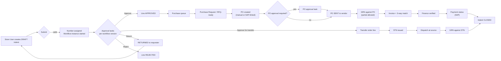
```mermaid
flowchart LR
  A["Store User creates DRAFT indent"] --> B{"Submit"}
  B -->|"valid"| C["Number assigned<br/>Workflow instance started"]
  C --> D{"Approval tasks<br/>per workflow version"}
  D -->|"Approve"| E["Line APPROVED"]
  D -->|"Approve for transfer"| F["Transfer order line"]
  D -->|"Return"| R["RETURNED to requester"] --> A
  D -->|"Reject"| X["Line REJECTED"]
  E --> G["Purchase queue"]
  G --> H["Purchase Request / RFQ-ready"]
  H --> I["PO created<br/>(manual or SAP-linked)"]
  I --> J{"PO approval required?"}
  J -->|"yes"| K["PO approval task"] --> L
  J -->|"no"| L["PO SENT to vendor"]
  L --> M["GRN against PO<br/>(partial allowed)"]
  F --> N["STN issued"] --> O["Dispatch at source"] --> P["GRN against STN"]
  M --> Q["Invoice + 3-way match"]
  Q --> S["Finance verified"] --> T["Payment status<br/>(SAP)"] --> U["Indent CLOSED"]
  P --> U
```

### 13.2 Approval Workflow (Engine View)

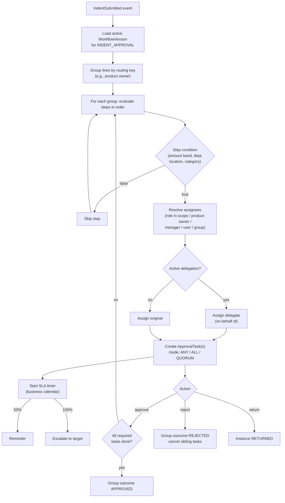
```mermaid
flowchart TD
  S["IndentSubmitted event"] --> V["Load active WorkflowVersion<br/>for INDENT_APPROVAL"]
  V --> G["Group lines by routing key<br/>(e.g., product owner)"]
  G --> ST["For each group: evaluate steps in order"]
  ST --> C{"Step condition<br/>(amount band, dept,<br/>location, category)"}
  C -->|"false"| NX["Skip step"]
  C -->|"true"| RES["Resolve assignees<br/>(role in scope / product owner /<br/>manager / user / group)"]
  RES --> DEL{"Active delegation?"}
  DEL -->|"yes"| AD["Assign delegate<br/>(on behalf of)"]
  DEL -->|"no"| AO["Assign original"]
  AD --> T["Create ApprovalTask(s)<br/>mode: ANY / ALL / QUORUM"]
  AO --> T
  T --> SLA["Start SLA timer<br/>(business calendar)"]
  SLA -->|"50%"| REM["Reminder"]
  SLA -->|"100%"| ESC["Escalate to target"]
  T --> ACT{"Action"}
  ACT -->|"approve"| DONE{"All required<br/>tasks done?"}
  DONE -->|"no"| ST
  DONE -->|"yes"| OUT["Group outcome APPROVED"]
  ACT -->|"reject"| OUTR["Group outcome REJECTED<br/>cancel sibling tasks"]
  ACT -->|"return"| OUTT["Instance RETURNED"]
  NX --> ST
```

### 13.3 Procurement Workflow

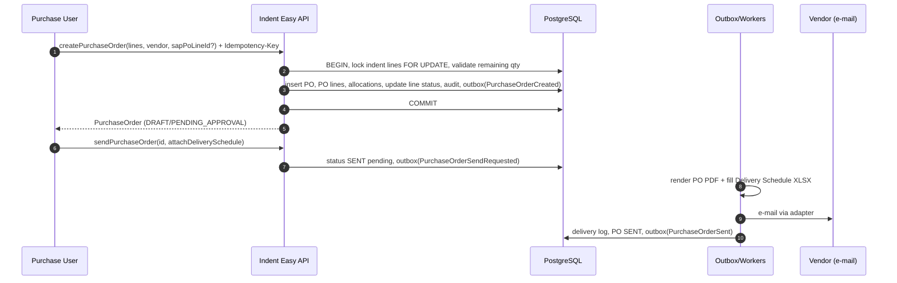
```mermaid
sequenceDiagram
  autonumber
  participant PU as Purchase User
  participant API as Indent Easy API
  participant DB as PostgreSQL
  participant OB as Outbox/Workers
  participant V as Vendor (e-mail)
  PU->>API: createPurchaseOrder(lines, vendor, sapPoLineId?) + Idempotency-Key
  API->>DB: BEGIN, lock indent lines FOR UPDATE, validate remaining qty
  API->>DB: insert PO, PO lines, allocations, update line status, audit, outbox(PurchaseOrderCreated)
  API->>DB: COMMIT
  API-->>PU: PurchaseOrder (DRAFT/PENDING_APPROVAL)
  PU->>API: sendPurchaseOrder(id, attachDeliverySchedule)
  API->>DB: status SENT pending, outbox(PurchaseOrderSendRequested)
  OB->>OB: render PO PDF + fill Delivery Schedule XLSX
  OB->>V: e-mail via adapter
  OB->>DB: delivery log, PO SENT, outbox(PurchaseOrderSent)
```

### 13.4 Inventory Flow

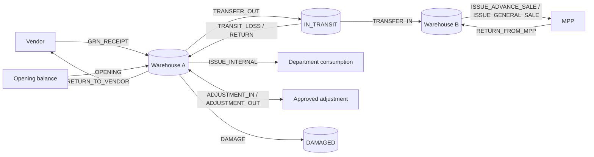
```mermaid
flowchart LR
  V["Vendor"] -->|"GRN_RECEIPT"| W1[("Warehouse A")]
  W1 -->|"TRANSFER_OUT"| T[("IN_TRANSIT")]
  T -->|"TRANSFER_IN"| W2[("Warehouse B")]
  T -->|"TRANSIT_LOSS / RETURN"| W1
  W2 -->|"ISSUE_ADVANCE_SALE / ISSUE_GENERAL_SALE"| M["MPP"]
  M -->|"RETURN_FROM_MPP"| W2
  W1 -->|"ISSUE_INTERNAL"| D["Department consumption"]
  W1 <-->|"ADJUSTMENT_IN / ADJUSTMENT_OUT"| ADJ["Approved adjustment"]
  W1 -->|"DAMAGE"| Q[("DAMAGED")]
  W1 -->|"RETURN_TO_VENDOR"| V
  O["Opening balance"] -->|"OPENING"| W1
```

### 13.5 GRN Flow

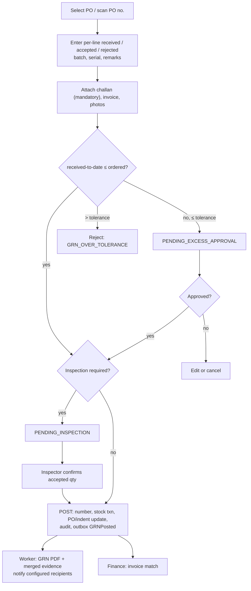
```mermaid
flowchart TD
  A["Select PO / scan PO no."] --> B["Enter per-line received / accepted / rejected<br/>batch, serial, remarks"]
  B --> C["Attach challan (mandatory), invoice, photos"]
  C --> D{"received-to-date ≤ ordered?"}
  D -->|"yes"| E{"Inspection required?"}
  D -->|"no, ≤ tolerance"| F["PENDING_EXCESS_APPROVAL"] --> FA{"Approved?"}
  FA -->|"yes"| E
  FA -->|"no"| FX["Edit or cancel"]
  D -->|"> tolerance"| X["Reject: GRN_OVER_TOLERANCE"]
  E -->|"yes"| I["PENDING_INSPECTION"] --> J["Inspector confirms accepted qty"] --> P
  E -->|"no"| P["POST: number, stock txn, PO/indent update,<br/>audit, outbox GRNPosted"]
  P --> Q["Worker: GRN PDF + merged evidence<br/>notify configured recipients"]
  P --> R["Finance: invoice match"]
```

### 13.6 STN Flow

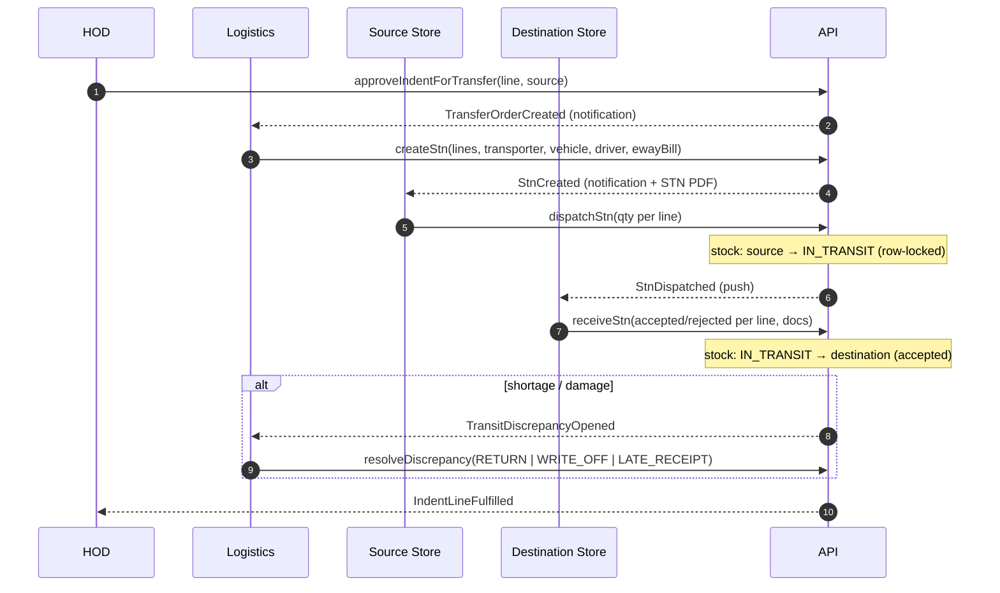
```mermaid
sequenceDiagram
  autonumber
  participant HOD
  participant LOG as Logistics
  participant SRC as Source Store
  participant DST as Destination Store
  participant API
  HOD->>API: approveIndentForTransfer(line, source)
  API-->>LOG: TransferOrderCreated (notification)
  LOG->>API: createStn(lines, transporter, vehicle, driver, ewayBill)
  API-->>SRC: StnCreated (notification + STN PDF)
  SRC->>API: dispatchStn(qty per line) 
  Note over API: stock: source → IN_TRANSIT (row-locked)
  API-->>DST: StnDispatched (push)
  DST->>API: receiveStn(accepted/rejected per line, docs)
  Note over API: stock: IN_TRANSIT → destination (accepted)
  alt shortage / damage
    API-->>LOG: TransitDiscrepancyOpened
    LOG->>API: resolveDiscrepancy(RETURN | WRITE_OFF | LATE_RECEIPT)
  end
  API-->>HOD: IndentLineFulfilled
```

### 13.7 Advance Sale, POD and Reconciliation Flow

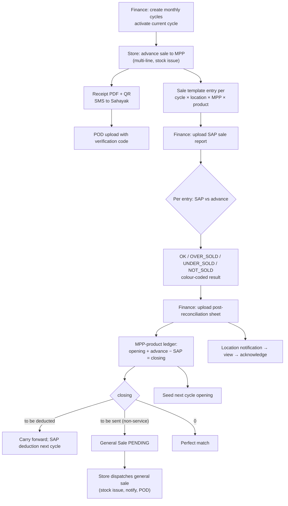
```mermaid
flowchart TD
  A["Finance: create monthly cycles<br/>activate current cycle"] --> B["Store: advance sale to MPP<br/>(multi-line, stock issue)"]
  B --> C["Receipt PDF + QR<br/>SMS to Sahayak"]
  C --> D["POD upload with verification code"]
  B --> E["Sale template entry per<br/>cycle × location × MPP × product"]
  E --> F["Finance: upload SAP sale report"]
  F --> G{"Per entry: SAP vs advance"}
  G --> H["OK / OVER_SOLD / UNDER_SOLD / NOT_SOLD<br/>colour-coded result"]
  H --> I["Finance: upload post-reconciliation sheet"]
  I --> J["MPP-product ledger:<br/>opening + advance − SAP = closing"]
  J --> K{"closing"}
  K -->|"to be deducted"| L["Carry forward; SAP deduction next cycle"]
  K -->|"to be sent (non-service)"| M["General Sale PENDING"]
  K -->|"0"| N["Perfect match"]
  J --> O["Seed next cycle opening"]
  M --> P["Store dispatches general sale<br/>(stock issue, notify, POD)"]
  I --> Q["Location notification → view → acknowledge"]
```

### 13.8 Finance Reconciliation (Procure-to-Pay)

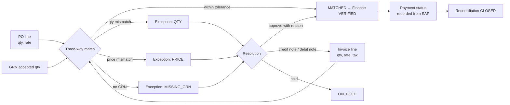
```mermaid
flowchart LR
  PO["PO line<br/>qty, rate"] --> M{"Three-way match"}
  GRN["GRN accepted qty"] --> M
  INV["Invoice line<br/>qty, rate, tax"] --> M
  M -->|"within tolerance"| OK["MATCHED → Finance VERIFIED"]
  M -->|"qty mismatch"| EQ["Exception: QTY"]
  M -->|"price mismatch"| EP["Exception: PRICE"]
  M -->|"no GRN"| EG["Exception: MISSING_GRN"]
  EQ & EP & EG --> R{"Resolution"}
  R -->|"approve with reason"| OK
  R -->|"credit note / debit note"| INV
  R -->|"hold"| H["ON_HOLD"]
  OK --> PAY["Payment status<br/>recorded from SAP"]
  PAY --> CL["Reconciliation CLOSED"]
```

---

## 14. Workflow State Machines

State machines are enforced in the domain layer; transitions not listed are rejected with `INVALID_STATE_TRANSITION` (HTTP 409 / GraphQL error). Every transition writes an audit record and emits the listed event.

### 14.1 Indent (header, derived)

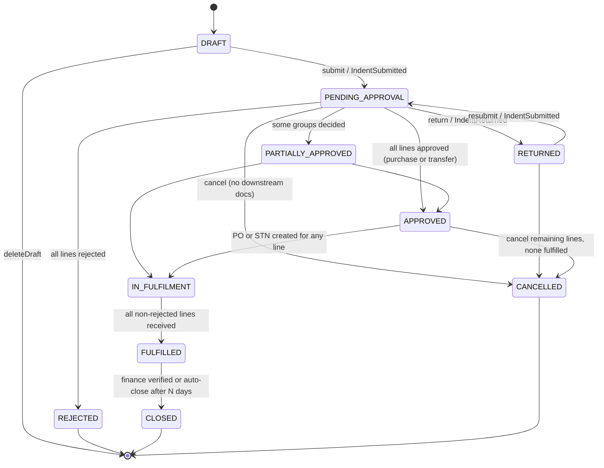
```mermaid
stateDiagram-v2
  [*] --> DRAFT
  DRAFT --> PENDING_APPROVAL: submit / IndentSubmitted
  DRAFT --> [*]: deleteDraft
  PENDING_APPROVAL --> RETURNED: return / IndentReturned
  RETURNED --> PENDING_APPROVAL: resubmit / IndentSubmitted
  PENDING_APPROVAL --> PARTIALLY_APPROVED: some groups decided
  PENDING_APPROVAL --> APPROVED: all lines approved (purchase or transfer)
  PENDING_APPROVAL --> REJECTED: all lines rejected
  PARTIALLY_APPROVED --> APPROVED
  PARTIALLY_APPROVED --> IN_FULFILMENT
  APPROVED --> IN_FULFILMENT: PO or STN created for any line
  IN_FULFILMENT --> FULFILLED: all non-rejected lines received
  FULFILLED --> CLOSED: finance verified or auto-close after N days
  PENDING_APPROVAL --> CANCELLED: cancel (no downstream docs)
  RETURNED --> CANCELLED
  APPROVED --> CANCELLED: cancel remaining lines, none fulfilled
  REJECTED --> [*]
  CLOSED --> [*]
  CANCELLED --> [*]
```

**Derivation rule:** header status is computed from line statuses by precedence — any line `PENDING_APPROVAL` → `PENDING_APPROVAL` (or `PARTIALLY_APPROVED` if ≥1 decided); all lines terminal-rejected/cancelled → `REJECTED`/`CANCELLED`; any line in `PO_CREATED | STN_ISSUED | PARTIALLY_RECEIVED` → `IN_FULFILMENT`; all active lines `RECEIVED` → `FULFILLED`.

### 14.2 Indent Line

| From | Event | To | Legacy equivalent |
|---|---|---|---|
| `DRAFT` | submit | `PENDING_APPROVAL` | `INDENT RAISED` |
| `PENDING_APPROVAL` | approve | `APPROVED` | `APPROVED` |
| `PENDING_APPROVAL` | approve for transfer | `APPROVED_FOR_TRANSFER` | `APPROVED FOR TRANSFER` |
| `PENDING_APPROVAL` | reject | `REJECTED` | `REJECTED` / `REQUEST REJECTED` |
| `PENDING_APPROVAL` | return | `RETURNED` | — |
| `APPROVED` | PO created | `PO_CREATED` | `PO GENERATED` |
| `APPROVED_FOR_TRANSFER` | STN issued | `STN_ISSUED` | `stn_number` set |
| `PO_CREATED` / `STN_ISSUED` | partial receipt | `PARTIALLY_RECEIVED` | — |
| `PO_CREATED` / `STN_ISSUED` / `PARTIALLY_RECEIVED` | full receipt | `RECEIVED` | `grn_done = True` |
| any non-terminal before PO/STN | cancel | `CANCELLED` | delete |
| `PO_CREATED` | PO cancelled/short-closed | `APPROVED` (re-open) or `CLOSED_SHORT` | — |

### 14.3 Approval Task

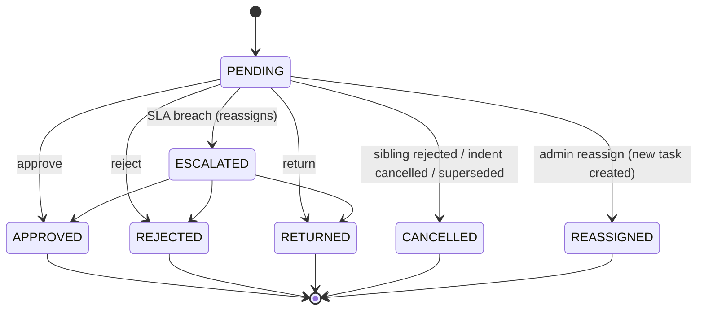
```mermaid
stateDiagram-v2
  [*] --> PENDING
  PENDING --> APPROVED: approve
  PENDING --> REJECTED: reject
  PENDING --> RETURNED: return
  PENDING --> ESCALATED: SLA breach (reassigns)
  ESCALATED --> APPROVED
  ESCALATED --> REJECTED
  ESCALATED --> RETURNED
  PENDING --> CANCELLED: sibling rejected / indent cancelled / superseded
  PENDING --> REASSIGNED: admin reassign (new task created)
  APPROVED --> [*]
  REJECTED --> [*]
  RETURNED --> [*]
  CANCELLED --> [*]
  REASSIGNED --> [*]
```

### 14.4 Purchase Order

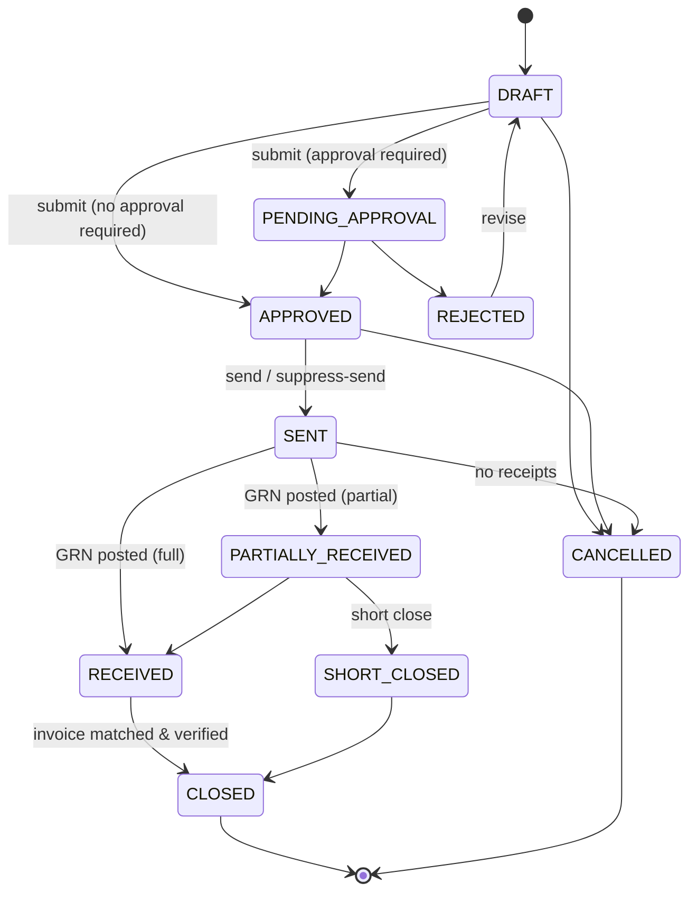
```mermaid
stateDiagram-v2
  [*] --> DRAFT
  DRAFT --> PENDING_APPROVAL: submit (approval required)
  DRAFT --> APPROVED: submit (no approval required)
  PENDING_APPROVAL --> APPROVED
  PENDING_APPROVAL --> REJECTED
  REJECTED --> DRAFT: revise
  APPROVED --> SENT: send / suppress-send
  SENT --> PARTIALLY_RECEIVED: GRN posted (partial)
  SENT --> RECEIVED: GRN posted (full)
  PARTIALLY_RECEIVED --> RECEIVED
  PARTIALLY_RECEIVED --> SHORT_CLOSED: short close
  RECEIVED --> CLOSED: invoice matched & verified
  SHORT_CLOSED --> CLOSED
  DRAFT --> CANCELLED
  APPROVED --> CANCELLED
  SENT --> CANCELLED: no receipts
  CLOSED --> [*]
  CANCELLED --> [*]
```

### 14.5 GRN (against PO)

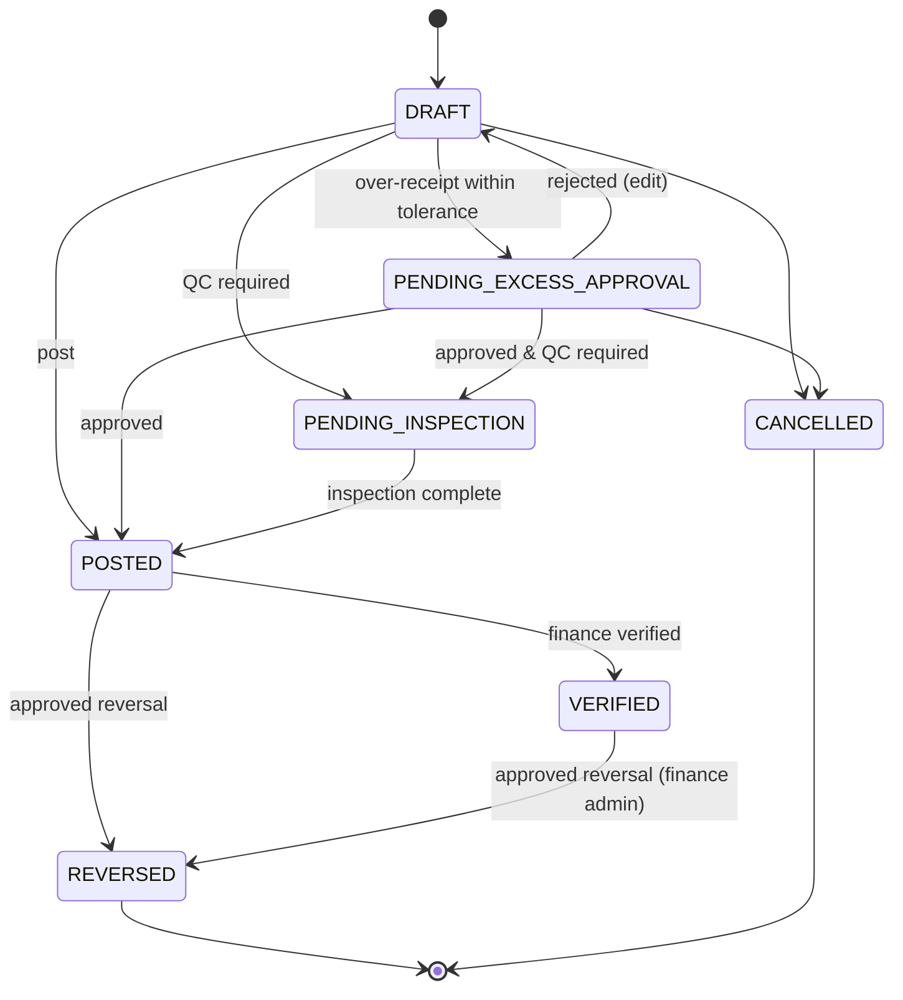
```mermaid
stateDiagram-v2
  [*] --> DRAFT
  DRAFT --> PENDING_EXCESS_APPROVAL: over-receipt within tolerance
  DRAFT --> PENDING_INSPECTION: QC required
  DRAFT --> POSTED: post
  PENDING_EXCESS_APPROVAL --> PENDING_INSPECTION: approved & QC required
  PENDING_EXCESS_APPROVAL --> POSTED: approved
  PENDING_EXCESS_APPROVAL --> DRAFT: rejected (edit)
  PENDING_INSPECTION --> POSTED: inspection complete
  DRAFT --> CANCELLED
  PENDING_EXCESS_APPROVAL --> CANCELLED
  POSTED --> VERIFIED: finance verified
  POSTED --> REVERSED: approved reversal
  VERIFIED --> REVERSED: approved reversal (finance admin)
  REVERSED --> [*]
  CANCELLED --> [*]
```

### 14.6 Transfer / STN

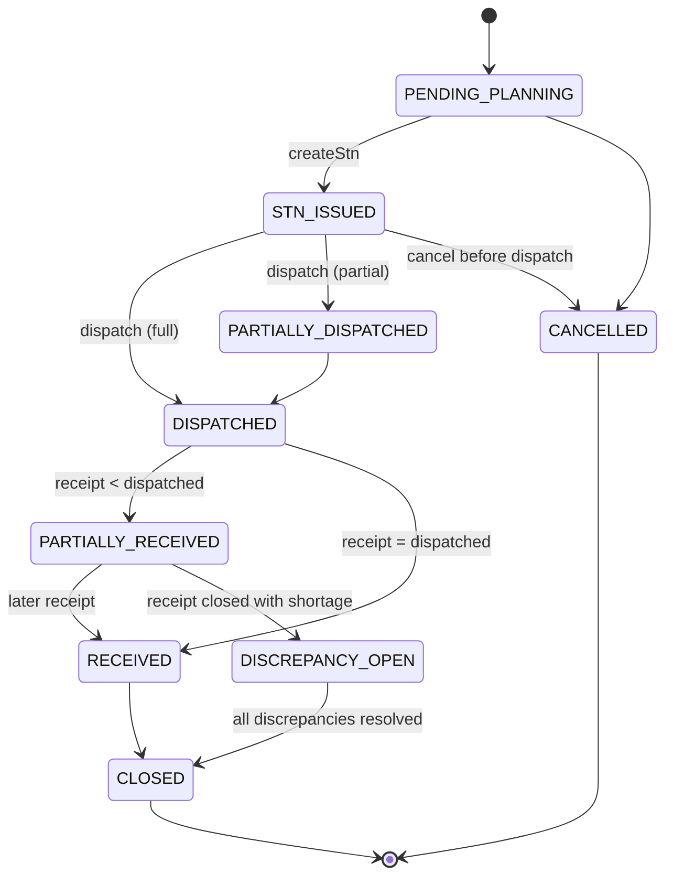
```mermaid
stateDiagram-v2
  [*] --> PENDING_PLANNING
  PENDING_PLANNING --> STN_ISSUED: createStn
  PENDING_PLANNING --> CANCELLED
  STN_ISSUED --> DISPATCHED: dispatch (full)
  STN_ISSUED --> PARTIALLY_DISPATCHED: dispatch (partial)
  PARTIALLY_DISPATCHED --> DISPATCHED
  STN_ISSUED --> CANCELLED: cancel before dispatch
  DISPATCHED --> PARTIALLY_RECEIVED: receipt < dispatched
  DISPATCHED --> RECEIVED: receipt = dispatched
  PARTIALLY_RECEIVED --> RECEIVED: later receipt
  PARTIALLY_RECEIVED --> DISCREPANCY_OPEN: receipt closed with shortage
  DISCREPANCY_OPEN --> CLOSED: all discrepancies resolved
  RECEIVED --> CLOSED
  CLOSED --> [*]
  CANCELLED --> [*]
```

### 14.7 Advance Sale / General Sale

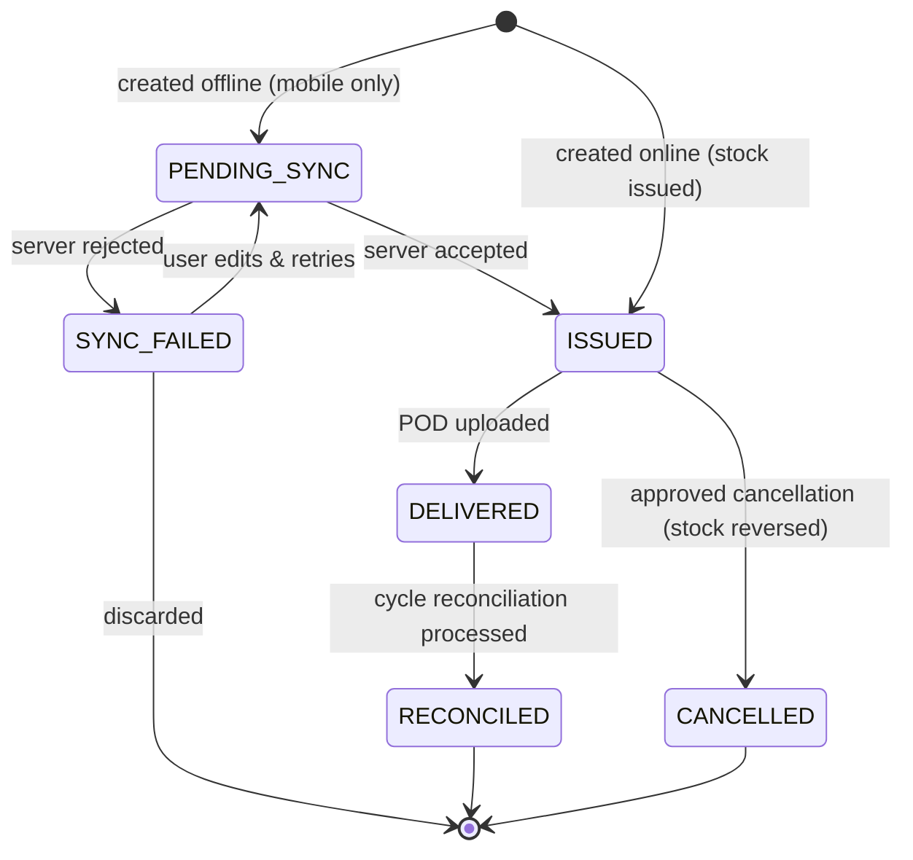
```mermaid
stateDiagram-v2
  [*] --> PENDING_SYNC: created offline (mobile only)
  PENDING_SYNC --> ISSUED: server accepted
  PENDING_SYNC --> SYNC_FAILED: server rejected
  SYNC_FAILED --> PENDING_SYNC: user edits & retries
  SYNC_FAILED --> [*]: discarded
  [*] --> ISSUED: created online (stock issued)
  ISSUED --> DELIVERED: POD uploaded
  ISSUED --> CANCELLED: approved cancellation (stock reversed)
  DELIVERED --> RECONCILED: cycle reconciliation processed
  RECONCILED --> [*]
  CANCELLED --> [*]
```

General sale adds `PENDING` (created from reconciliation) → `ISSUED` (dispatched) before the same path.

### 14.8 Payment Cycle

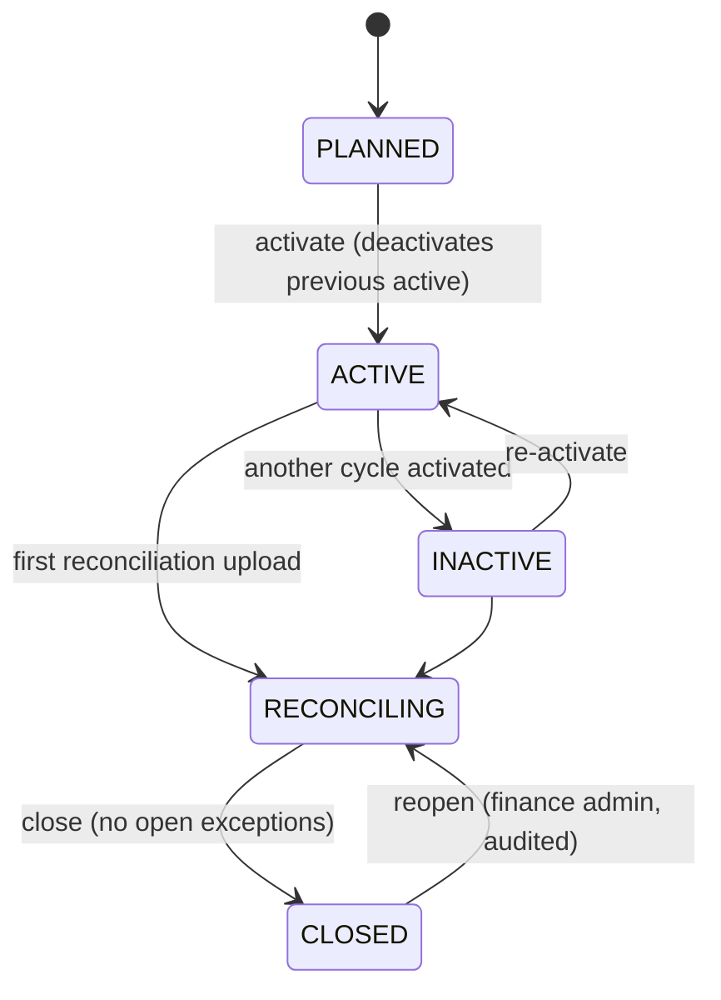
```mermaid
stateDiagram-v2
  [*] --> PLANNED
  PLANNED --> ACTIVE: activate (deactivates previous active)
  ACTIVE --> INACTIVE: another cycle activated
  INACTIVE --> ACTIVE: re-activate
  ACTIVE --> RECONCILING: first reconciliation upload
  INACTIVE --> RECONCILING
  RECONCILING --> CLOSED: close (no open exceptions)
  CLOSED --> RECONCILING: reopen (finance admin, audited)
```

### 14.9 Reconciliation Sheet (Import Batch)

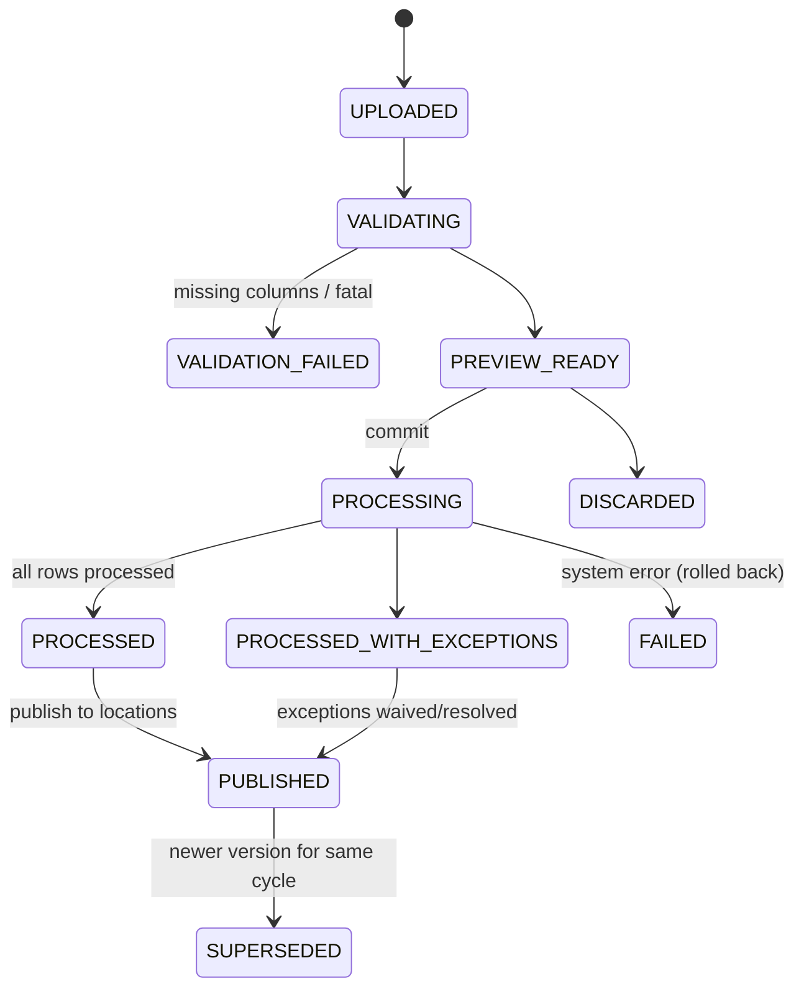
```mermaid
stateDiagram-v2
  [*] --> UPLOADED
  UPLOADED --> VALIDATING
  VALIDATING --> VALIDATION_FAILED: missing columns / fatal
  VALIDATING --> PREVIEW_READY
  PREVIEW_READY --> PROCESSING: commit
  PREVIEW_READY --> DISCARDED
  PROCESSING --> PROCESSED: all rows processed
  PROCESSING --> PROCESSED_WITH_EXCEPTIONS
  PROCESSING --> FAILED: system error (rolled back)
  PROCESSED --> PUBLISHED: publish to locations
  PROCESSED_WITH_EXCEPTIONS --> PUBLISHED: exceptions waived/resolved
  PUBLISHED --> SUPERSEDED: newer version for same cycle
```

### 14.10 Notification Delivery

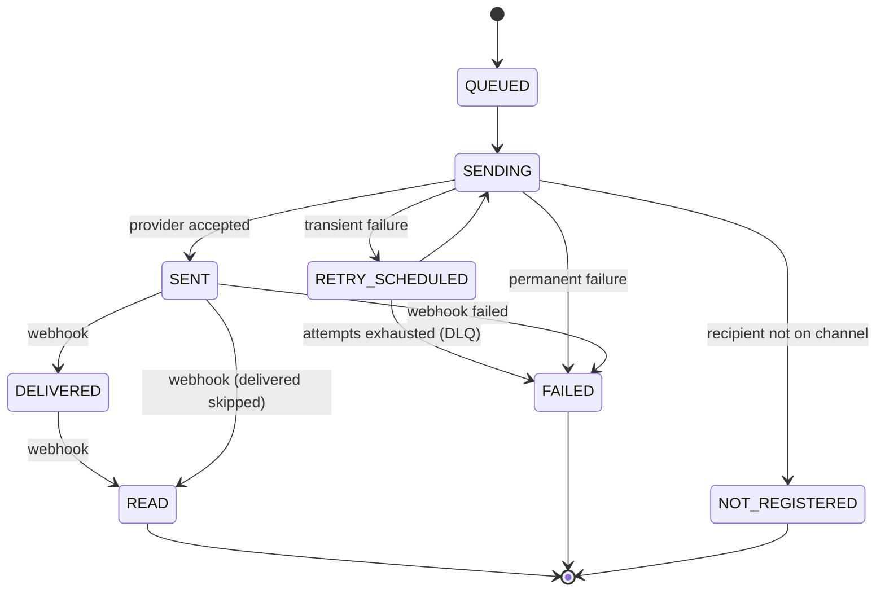
```mermaid
stateDiagram-v2
  [*] --> QUEUED
  QUEUED --> SENDING
  SENDING --> SENT: provider accepted
  SENDING --> RETRY_SCHEDULED: transient failure
  RETRY_SCHEDULED --> SENDING
  RETRY_SCHEDULED --> FAILED: attempts exhausted (DLQ)
  SENDING --> FAILED: permanent failure
  SENT --> DELIVERED: webhook
  DELIVERED --> READ: webhook
  SENT --> READ: webhook (delivered skipped)
  SENT --> FAILED: webhook failed
  SENDING --> NOT_REGISTERED: recipient not on channel
  READ --> [*]
  FAILED --> [*]
  NOT_REGISTERED --> [*]
```

Terminal states `READ`, `FAILED`, `NOT_REGISTERED` never regress **[LEGACY-CONFIRMED]**.

### 14.11 Document

`PENDING_UPLOAD → PENDING_SCAN → AVAILABLE | QUARANTINED`; `AVAILABLE → SUPERSEDED` (new version) `| DELETED` (soft, retention-driven) `| LEGAL_HOLD`.

### 14.12 Stock Statement (Sale & Stock Report) **[LIVE-CONFIRMED]**

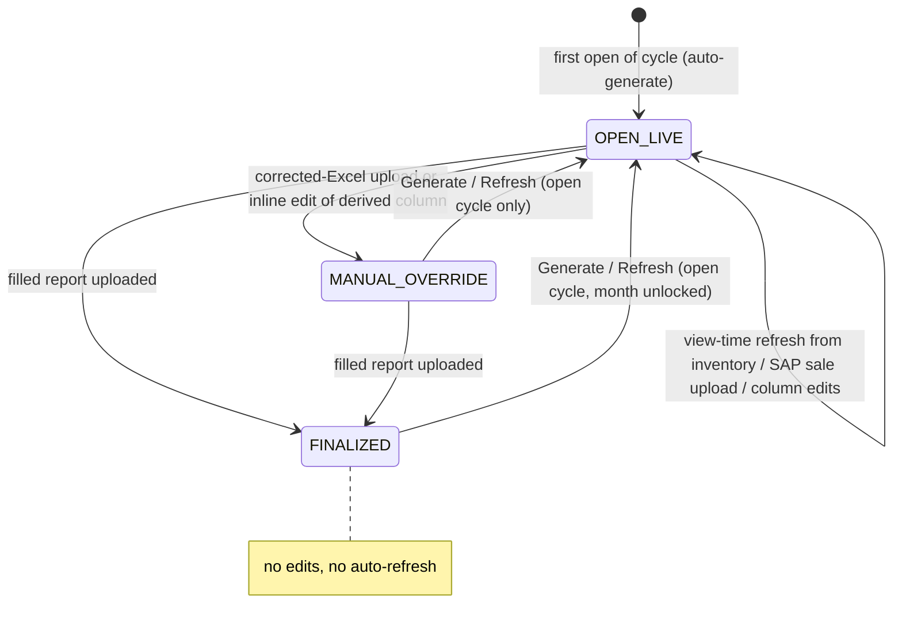
```mermaid
stateDiagram-v2
  [*] --> OPEN_LIVE: first open of cycle (auto-generate)
  OPEN_LIVE --> OPEN_LIVE: view-time refresh from inventory / SAP sale upload / column edits
  OPEN_LIVE --> MANUAL_OVERRIDE: corrected-Excel upload or inline edit of derived column
  MANUAL_OVERRIDE --> OPEN_LIVE: Generate / Refresh (open cycle only)
  OPEN_LIVE --> FINALIZED: filled report uploaded
  MANUAL_OVERRIDE --> FINALIZED: filled report uploaded
  FINALIZED --> OPEN_LIVE: Generate / Refresh (open cycle, month unlocked)
  note right of FINALIZED: no edits, no auto-refresh
```

Month lock (CYC-007) overlays all states: while the month is locked no Generate/Refresh or auto-refresh happens.

---

## 15. System Architecture

### 15.1 Architectural Style **[PROPOSED]** (ADR-013)

Indent Easy is a **modular monolith** with independently scalable **process types** built from one codebase:

| Process | Responsibility | Scales on |
|---|---|---|
| `api` | GraphQL (HTTP + WebSocket subscriptions), REST (auth, files, webhooks, health, integrations) | CPU, request rate, p95 latency |
| `worker` | Outbox relay, event consumers, notifications, PDF/Excel generation, imports, exports, search indexing | Queue depth, job age |
| `scheduler` | Cron-style jobs (SLA timers, reminders, integrity checks, retention, cycle auto-activation) — single active leader | n/a (1 replica, leader-elected) |
| `web` | Static SPA assets served by NGINX (or CDN) | Requests |
| `mobile` | Expo-built Android/iOS apps + OTA updates (EAS Update) | n/a |

Rationale: the domain is tightly coupled transactionally (indent ↔ approval ↔ PO ↔ GRN ↔ stock), the team size and data volume are small, and a modular monolith delivers strong consistency with **one** database while keeping module boundaries enforceable (lint rules + package boundaries). Extraction of a module into a service is possible later because modules communicate via application services and domain events, never via each other's tables.

### 15.2 High-Level Architecture

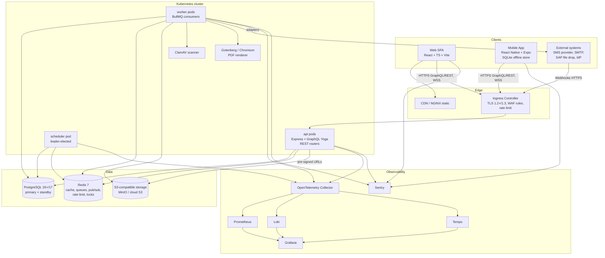
```mermaid
flowchart TB
  subgraph Clients
    WEB["Web SPA<br/>React + TS + Vite"]
    MOB["Mobile App<br/>React Native + Expo<br/>SQLite offline store"]
    EXT["External systems<br/>SMS provider, SMTP,<br/>SAP file drop, IdP"]
  end
  subgraph Edge
    CDN["CDN / NGINX static"]
    ING["Ingress Controller<br/>TLS 1.2+/1.3, WAF rules,<br/>rate limit"]
  end
  subgraph Platform["Kubernetes cluster"]
    API["api pods<br/>Express + GraphQL Yoga<br/>REST routers"]
    WRK["worker pods<br/>BullMQ consumers"]
    SCH["scheduler pod<br/>leader-elected"]
    AV["ClamAV scanner"]
    GOT["Gotenberg / Chromium<br/>PDF renderer"]
  end
  subgraph Data
    PG[("PostgreSQL 16+/17<br/>primary + standby")]
    RD[("Redis 7<br/>cache, queues, pub/sub,<br/>rate limit, locks")]
    S3[("S3-compatible storage<br/>MinIO / cloud S3")]
  end
  subgraph Observability
    OTEL["OpenTelemetry Collector"]
    PROM["Prometheus"]
    LOKI["Loki"]
    TEMPO["Tempo"]
    GRAF["Grafana"]
    SEN["Sentry"]
  end
  WEB --> CDN
  WEB -->|"HTTPS GraphQL/REST, WSS"| ING
  MOB -->|"HTTPS GraphQL/REST, WSS"| ING
  EXT -->|"Webhooks HTTPS"| ING
  ING --> API
  API --> PG
  API --> RD
  API -->|"pre-signed URLs"| S3
  WRK --> PG
  WRK --> RD
  WRK --> S3
  WRK --> AV
  WRK --> GOT
  WRK -->|"adapters"| EXT
  SCH --> PG
  SCH --> RD
  API & WRK & SCH --> OTEL
  OTEL --> PROM & LOKI & TEMPO
  PROM & LOKI & TEMPO --> GRAF
  WEB & MOB & API & WRK --> SEN
```

### 15.3 Key Technology Decisions (summary; full ADRs in Appendix A)

| Concern | Decision | ADR |
|---|---|---|
| Primary database | PostgreSQL (16 or 17, latest supported minor) | ADR-001 |
| Client API | GraphQL primary; REST for auth, files, webhooks, health, integrations | ADR-002 |
| Messaging/jobs | Transactional outbox in PostgreSQL + BullMQ on Redis; no Kafka/RabbitMQ in R1 | ADR-003, ADR-010 |
| Web framework | React + Vite SPA (no Next.js) | ADR-004 |
| Mobile | React Native + Expo (managed workflow with config plugins; dev builds) | ADR-005 |
| Orchestration | Kubernetes + Helm + Argo CD | ADR-006 |
| Documents | S3-compatible object storage (MinIO on-prem) | ADR-007 |
| Search | PostgreSQL FTS + `pg_trgm`; OpenSearch deferred | ADR-008 |
| Authentication | Built-in identity module: Argon2id, short JWT access, rotating opaque refresh; OIDC-ready | ADR-009 |
| Monorepo | pnpm workspaces + Turborepo | ADR-011 |
| Real-time | GraphQL subscriptions over `graphql-ws`; Redis Pub/Sub fan-out; push for mobile background | ADR-012 |
| Backend style | Modular monolith, DDD modules, hexagonal adapters | ADR-013 |
| GraphQL server | GraphQL Yoga on Express, schema-first with GraphQL Code Generator | ADR-014 |
| Data access | Drizzle ORM + SQL for concurrency-critical paths; migrations via drizzle-kit reviewed SQL | ADR-015 |

---

## 16. Domain Architecture

### 16.1 Bounded Contexts

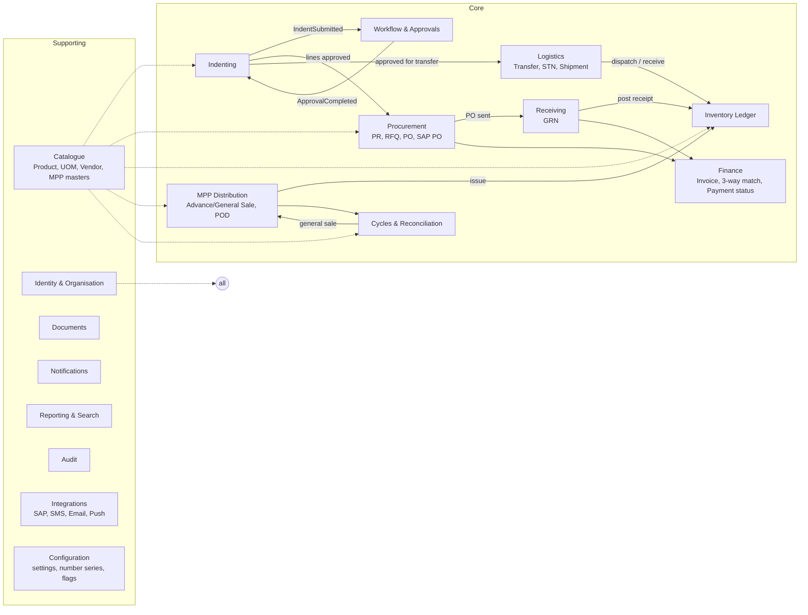
```mermaid
flowchart LR
  subgraph Core
    IND["Indenting"]
    WF["Workflow & Approvals"]
    PROC["Procurement<br/>PR, RFQ, PO, SAP PO"]
    INV["Inventory Ledger"]
    RCV["Receiving<br/>GRN"]
    LOGI["Logistics<br/>Transfer, STN, Shipment"]
    MPPD["MPP Distribution<br/>Advance/General Sale, POD"]
    REC["Cycles & Reconciliation"]
    FIN["Finance<br/>Invoice, 3-way match, Payment status"]
  end
  subgraph Supporting
    CAT["Catalogue<br/>Product, UOM, Vendor, MPP masters"]
    ORG["Identity & Organisation"]
    DOCS["Documents"]
    NOTI["Notifications"]
    RPT["Reporting & Search"]
    AUD["Audit"]
    INTG["Integrations<br/>SAP, SMS, Email, Push"]
    CFG["Configuration<br/>settings, number series, flags"]
  end
  IND -->|"IndentSubmitted"| WF
  WF -->|"ApprovalCompleted"| IND
  IND -->|"lines approved"| PROC
  IND -->|"approved for transfer"| LOGI
  PROC -->|"PO sent"| RCV
  RCV -->|"post receipt"| INV
  LOGI -->|"dispatch / receive"| INV
  MPPD -->|"issue"| INV
  MPPD --> REC
  REC -->|"general sale"| MPPD
  RCV --> FIN
  PROC --> FIN
  CAT -.-> IND & PROC & INV & MPPD & REC
  ORG -.-> all(("all"))
```

### 16.2 Context Responsibilities and Aggregates

| Context | Aggregates (roots) | Owns tables (schema) | Publishes | Consumes |
|---|---|---|---|---|
| Identity & Organisation | User, Role, Session, Location, Department | `identity.*`, `org.*` | `UserCreated`, `UserRoleChanged`, `UserDeactivated` | — |
| Catalogue | Product, Vendor, Mpp, Uom | `catalog.*` | `ProductUpdated`, `VendorUpdated`, `MppUpdated` | — |
| Indenting | Indent (lines) | `indent.*` | `IndentCreated/Submitted/Returned/Cancelled`, `IndentLineStatusChanged` | `ApprovalGroupDecided`, `PurchaseOrderCreated`, `GrnPosted`, `StnReceived` |
| Workflow | WorkflowDefinition(Version), WorkflowInstance, ApprovalTask, Delegation | `workflow.*` | `ApprovalTaskCreated`, `ApprovalTaskActed`, `ApprovalGroupDecided`, `ApprovalEscalated` | `IndentSubmitted`, `PurchaseOrderSubmitted`, `GrnExcessDetected`, `AdjustmentRequested` |
| Procurement | PurchaseRequest, Rfq, PurchaseOrder, SapPoImport | `procurement.*` | `PurchaseOrderCreated/Approved/Sent/Cancelled/Closed` | `IndentLineApproved`, `GrnPosted` |
| Receiving | Grn | `receiving.*` | `GrnCreated`, `GrnExcessDetected`, `GrnPosted`, `GrnReversed` | `ApprovalGroupDecided` |
| Logistics | TransferOrder, Stn, TransitDiscrepancy | `logistics.*` | `TransferOrderCreated`, `StnCreated/Dispatched/Received/Closed`, `TransitDiscrepancyOpened/Resolved` | `IndentLineApprovedForTransfer` |
| Inventory Ledger | StockBalance (per warehouse×product×batch), StockTransaction, Adjustment, StockCount | `inventory.*` | `InventoryUpdated`, `StockBelowReorderLevel`, `InventoryAdjusted` | (called synchronously via application service inside the posting transaction) |
| MPP Distribution | AdvanceSale, GeneralSale, Pod | `mpp.*` | `AdvanceSaleCreated`, `PodUploaded`, `GeneralSaleDispatched` | `ReconciliationCompleted` |
| Cycles & Reconciliation | PaymentCycle, SapSaleImport, ReconciliationSheet, MppProductLedger | `recon.*` | `CycleActivated`, `ReconciliationCompleted/Published` | `AdvanceSaleCreated`, `AdvanceSaleCancelled` |
| Finance | Invoice, MatchResult, PaymentStatus | `finance.*` | `InvoiceVerified`, `InvoiceExceptionRaised` | `GrnPosted` |
| Documents | Document, DocumentVersion | `docs.*` | `DocumentAvailable`, `DocumentQuarantined` | — |
| Notifications | Notification, Delivery, Template, Rule, Preference | `notify.*` | `NotificationCreated`, `NotificationDeliveryUpdated` | All domain events (rule-driven) |
| Audit | AuditLog, SecurityEvent | `audit.*` | — | (written synchronously) |
| Configuration | Setting, NumberSeries, FeatureFlag | `config.*` | `SettingChanged` | — |

**Cross-context rule:** inventory postings are the only synchronous cross-context write, executed through the Inventory application service **within the caller's DB transaction** so a GRN, dispatch or sale and its stock movement commit atomically. All other cross-context reactions are event-driven through the outbox.

---

## 17. Frontend Architecture (Web)

### 17.1 Stack **[PROPOSED]**

| Concern | Choice | Justification |
|---|---|---|
| Build | Vite + React (current stable major) + TypeScript `strict` | Fast builds; SPA suits authenticated internal app (ADR-004) |
| Routing | TanStack Router (file-based, type-safe search params) | Typed URL state for filters/pagination |
| Server state | TanStack Query + `graphql-request` with GraphQL Code Generator typed documents (`TypedDocumentNode`) | Required stack; cache, retries, optimistic updates |
| Subscriptions | `graphql-ws` client; events invalidate/patch TanStack Query cache | Single real-time pipeline |
| Forms | React Hook Form + Zod (`@hookform/resolvers`) using shared `packages/validation` schemas | Same rules as server |
| Styling | Tailwind CSS with CSS-variable design tokens from `packages/design-tokens` | No hard-coded colours |
| Components | Radix UI primitives (headless, accessible) wrapped in `packages/ui` | WCAG-compliant dialogs, menus, popovers |
| Tables | TanStack Table + TanStack Virtual | Column selection, sorting, virtualisation for ≥ 200 rows |
| Charts | Apache ECharts (canvas, accessible aria description) or Recharts for simple charts — one library chosen at Phase 0 (OQ-031) | Dashboards |
| Motion | Motion (formerly Framer Motion) with `prefers-reduced-motion` respect | Subtle transitions |
| i18n | i18next + ICU MessageFormat; `Intl` for numbers/dates | EN/HI |
| Command palette | `cmdk` | Global search & actions |
| Client state | Zustand (UI-only state: sidebar, workspace, drafts) | Minimal |
| Error tracking | Sentry browser SDK with PII scrubbing | |
| Testing | Vitest + React Testing Library + MSW; Playwright E2E | |

### 17.2 Web Architecture

```mermaid
flowchart TB
  subgraph Browser
    R["Router<br/>routes/*"] --> F["Feature modules<br/>features/*"]
    F --> H["Hooks: useIndentList, useApproveIndent...<br/>(TanStack Query wrappers)"]
    H --> GQ["GraphQL client<br/>typed documents"]
    H --> SUB["Subscription client<br/>graphql-ws"]
    F --> UI["packages/ui components<br/>design tokens"]
    F --> VAL["packages/validation (Zod)"]
    GQ --> AUTH["Auth interceptor<br/>in-memory access token,<br/>silent refresh via cookie"]
    SUB --> AUTH
    I18N["i18n provider"] --> F
  end
  AUTH -->|"/graphql"| API[("API")]
  AUTH -->|"/api/v1/auth/refresh"| API
  SUB -->|"wss /graphql"| API
```

### 17.3 Structure

```text
apps/web/src/
  app/                # providers (query, auth, i18n, theme), error boundary, layout shell
  routes/             # TanStack Router route files (thin: load params, render feature page)
  features/
    auth/ dashboard/ indents/ approvals/ procurement/ vendors/ inventory/
    receiving/ logistics/ mpp-sales/ cycles/ reconciliation/ finance/
    documents/ notifications/ reports/ search/ administration/ audit/
      <feature>/
        api/          # *.graphql operations + generated hooks wrappers
        components/   # feature-specific components (≤ 250 lines each)
        pages/
        model/        # view-model mappers, pure functions (unit-tested)
        index.ts      # public surface of the feature
  components/         # app-level composites (AppShell, DataTable, FilterBar, Timeline)
  graphql/            # codegen output (generated, not edited)
  i18n/               # en/, hi/ namespaces JSON
  lib/                # http, auth, telemetry, formatting (Intl wrappers)
  stores/             # zustand stores (UI state only)
```

**Rules (enforced by ESLint boundaries plugin):** routes import features; features import `components`, `lib`, `packages/*`, never another feature's internals; no business rules in components (they live in `model/` or on the server); every server call goes through generated hooks (no ad-hoc `fetch`).

### 17.4 Rendering and Performance Budgets

| Budget | Target | Validation |
|---|---|---|
| Initial JS (gzip) for shell + dashboard route | ≤ 250 KB | CI bundle-size check (size-limit) |
| Route-level code splitting | every feature route lazy | Build report |
| LCP (dashboard, 4G "Fast 3G" throttling, mid-range laptop) | ≤ 2.5 s p75 | Lighthouse CI + RUM (web-vitals) |
| INP | ≤ 200 ms p75 | RUM |
| CLS | ≤ 0.1 | RUM |

---

## 18. Mobile Architecture

### 18.1 Stack **[PROPOSED]** (ADR-005)

| Concern | Choice |
|---|---|
| Framework | React Native (New Architecture) via Expo, latest stable SDK at project start; development builds (not Expo Go) |
| Navigation | Expo Router (file-based) |
| Local DB | `expo-sqlite` with Drizzle ORM (typed schema + migrations) |
| Server state | TanStack Query with persistence to SQLite/MMKV for read caches |
| Sync | Custom sync engine (outbox of mutations + delta pull) — §36 |
| Secure storage | `expo-secure-store` (refresh token, DB encryption key) |
| DB encryption | SQLCipher-enabled SQLite build (config plugin) — Should; TBD device policy (OQ-014) |
| Camera & scanning | `expo-camera` (barcode: QR, Code128, EAN-13, DataMatrix) |
| Documents | `expo-image-manipulator` (resize/compress), `expo-print`/on-device image→PDF or server-side merge |
| Push | `expo-notifications` (FCM/APNs) via Expo Push service adapter (replaceable by direct FCM/APNs) |
| Background | `expo-background-task` / platform background fetch for opportunistic sync |
| Connectivity | `@react-native-community/netinfo` |
| Biometrics | `expo-local-authentication` (unlock, not primary auth) |
| Location | `expo-location` (POD geotag, with consent) |
| i18n | i18next + `expo-localization` |
| OTA | EAS Update (channels per environment) for JS-only fixes; binary releases via stores/MDM |
| Testing | Jest + React Native Testing Library; Maestro E2E flows; device farm smoke |
| Crash/perf | Sentry React Native |

### 18.2 Mobile Feature Parity

| Feature | Mobile | Offline mode |
|---|---|---|
| Login / biometric unlock | ✓ | Unlock only (cached session) |
| Dashboard | ✓ (role cards) | Cached, stale-marked |
| Indent create/edit/submit | ✓ | Full (queued submit) |
| Indent tracking | ✓ | Cached read |
| Approvals | ✓ | Online-only for action (read cached) |
| Inventory view / stock card | ✓ | Cached read |
| Physical count entry | ✓ | Full (queued) |
| GRN against PO / STN | ✓ | Partial (queued; server re-validates tolerance) |
| STN dispatch | ✓ | Partial (queued; may fail on stock) |
| Advance sale | ✓ | Partial (queued with provisional stock) |
| POD capture | ✓ | Full (queued upload) |
| Notifications | ✓ | Cached list |
| Purchase, Finance, Reconciliation, Admin | Read-only summaries (Should) | Online-only |

### 18.3 Mobile Architecture

```mermaid
flowchart TB
  subgraph App["React Native App"]
    SCR["Screens (Expo Router)"] --> FEAT["Feature hooks"]
    FEAT --> REPO["Local repositories<br/>Drizzle + SQLite"]
    FEAT --> Q["TanStack Query<br/>read cache"]
    FEAT --> OUTQ["Mutation outbox<br/>(SQLite table)"]
    SYNC["Sync engine"] --> OUTQ
    SYNC --> REPO
    SYNC --> NET["NetInfo"]
    SYNC --> GQL["GraphQL client"]
    UPL["Upload manager<br/>resumable, pre-signed"] --> OUTQ
    PUSH["Push handler"] --> SYNC
    SEC["SecureStore<br/>tokens, DB key"] --> GQL
  end
  GQL -->|"HTTPS"| API[("Indent Easy API")]
  UPL -->|"PUT pre-signed"| S3[("Object storage")]
  API -->|"Expo Push / FCM / APNs"| PUSH
```

### 18.4 Device & OS Considerations

See Appendix D.3 for supported OS versions. Design baseline: Android mid-range device (4 GB RAM, 720×1600), outdoor readability (contrast ≥ 7:1 option "high-visibility mode"), glove-friendly touch targets ≥ 48 dp, low storage (local DB cap 200 MB with LRU eviction of cached reads; queued mutations never evicted).

---

## 19. Backend Architecture

### 19.1 Stack **[PROPOSED]**

| Concern | Choice |
|---|---|
| Runtime | Node.js Active LTS (22.x or 24.x at Phase 0), TypeScript `strict`, ESM |
| HTTP | Express 5 |
| GraphQL | GraphQL Yoga (Envelop plugins: depth limit, cost limit, persisted operations, error masking) mounted at `/graphql` |
| Subscriptions | `graphql-ws` on the same HTTP server; Redis Pub/Sub for cross-pod fan-out |
| Validation | Zod (shared) at the application-service boundary |
| Data | PostgreSQL via `pg` pool + Drizzle ORM; PgBouncer (transaction pooling) |
| Jobs | BullMQ (Redis) with per-queue concurrency, retries, DLQ |
| AuthN/Z | `jose` (JWT), Argon2id (`@node-rs/argon2`), policy engine (in-house, CASL-style ability + contextual predicates) |
| DataLoader | `dataloader` per request for N+1 prevention |
| Files | AWS SDK v3 S3 client (works with MinIO) |
| PDF | HTML templates (Handlebars/JSX-to-HTML) rendered by Gotenberg (Chromium) sidecar service; PDF merge with `pdf-lib` |
| Excel | ExcelJS (streaming reader/writer) |
| Logging | Pino (JSON) with redaction paths |
| Telemetry | OpenTelemetry SDK (auto-instrumentation for http, express, pg, ioredis, graphql) |
| Config | Typed config loader (Zod-validated env) |
| Testing | Vitest, Supertest, Testcontainers (PostgreSQL, Redis, MinIO) |

### 19.2 Layering

```mermaid
flowchart TB
  subgraph Interface
    GQLR["GraphQL resolvers<br/>(thin: map args → command/query)"]
    REST["REST controllers<br/>auth, files, webhooks, health, integrations"]
    CONS["Event consumers / job handlers"]
  end
  subgraph Application
    CMD["Command handlers<br/>(use cases, transactions, idempotency)"]
    QRY["Query services<br/>(read models, pagination)"]
    POL["Authorization policies"]
  end
  subgraph Domain
    AGG["Aggregates & entities<br/>state machines, invariants"]
    DS["Domain services<br/>(pricing, routing, ledger rules)"]
    EVT["Domain events"]
  end
  subgraph Infrastructure
    REPO["Repositories (Drizzle/SQL)"]
    OUT["Outbox writer"]
    ADP["Adapters: storage, email, sms,<br/>push, sap, pdf, av"]
    CACHE["Cache, locks, rate limiter"]
  end
  GQLR & REST & CONS --> POL --> CMD & QRY
  CMD --> AGG & DS
  AGG --> EVT
  CMD --> REPO & OUT & ADP
  QRY --> REPO & CACHE
```

Rules: resolvers contain no business logic; domain layer has zero framework imports; repositories return domain objects, never raw rows to resolvers; GraphQL types are mapped from DTOs (never expose DB models — ADR-014).

### 19.3 Request Pipeline

1. Ingress → `X-Request-ID` (generated if absent) and W3C `traceparent`.
2. Express middleware: security headers (Helmet), CORS allow-list, body size limit (1 MB JSON; files never through API), rate limit (Redis sliding window), authentication (JWT verify, `sid` deny-list check).
3. GraphQL Yoga: persisted-operation check (production), parse/validate with depth ≤ 10 and cost ≤ 5,000 (configurable), resolver execution with per-request DataLoaders and `RequestContext {user, scopes, requestId, locale, idempotencyKey}`.
4. Command handler: authorization policy → Zod validation → idempotency check → DB transaction (domain + audit + outbox) → commit → response.
5. Error masking to standard error model (§26.4).

### 19.4 Module Template

```text
apps/api/src/modules/<module>/
  domain/            # entities, value objects, state machines, domain events, errors
  application/
    commands/        # createIndent.command.ts (handler + zod schema)
    queries/
    policies/        # indent.policy.ts
    ports/           # interfaces required from infrastructure
  infrastructure/
    persistence/     # drizzle schema + repository implementations
    adapters/
  interface/
    graphql/         # *.resolvers.ts, *.mapper.ts (schema lives in packages/graphql)
    rest/
    consumers/       # event handlers
  index.ts           # module registration (DI container bindings)
```

---

## 20. GraphQL Architecture

### 20.1 Principles

| Principle | Rule |
|---|---|
| Contract-first | `packages/graphql/schema/*.graphql` is the source of truth (published as `api/schema.graphql` in this pack); server resolver types and client hooks are generated |
| Relay-style pagination | `first/after`, `last/before` cursors; `totalCount` optional & capped |
| Mutations | One input object `input: XInput!`, return payload type `XPayload { <entity>, userErrors }` for expected business validation, GraphQL `errors` for exceptional failures |
| Idempotency | `clientMutationId`/`idempotencyKey` field in inputs of critical mutations **and** `Idempotency-Key` HTTP header (header wins) |
| Nullability | Non-null by default for identity fields; nullable where authorization may hide |
| IDs | Opaque global IDs (`base64("Type:uuid")`) with `node(id)` resolver |
| Money & quantity | `Money { amount: Decimal!, currency: CurrencyCode! }`, `Quantity { value: Decimal!, uom: Uom! }`; `Decimal` scalar serialised as string |
| Dates | `DateTime` (RFC 3339 UTC), `Date` (ISO calendar date, business time zone Asia/Kolkata) |
| Deprecation | `@deprecated(reason)`; removal after 2 minor mobile releases (≥ 90 days) |
| Authorization | `@auth(requires: "perm")` directive for documentation + enforcement in resolver wrapper; **real enforcement in application policies** |
| Field-level sensitivity | `@sensitive` fields (mobile numbers, bank details) masked unless `*:read_sensitive` |

### 20.2 GraphQL Architecture Diagram

```mermaid
flowchart LR
  C["Client operation<br/>(persisted hash in prod)"] --> Y["GraphQL Yoga"]
  Y --> P1["Persisted ops plugin"]
  P1 --> P2["Depth & cost limit"]
  P2 --> P3["Auth context builder"]
  P3 --> EX["Executor"]
  EX --> RS["Resolvers"]
  RS --> DL["DataLoaders<br/>(per request)"]
  RS --> AP["Application services"]
  AP --> PG[("PostgreSQL")]
  EX --> MASK["Error masking<br/>→ standard codes"]
  subgraph Subscriptions
    WS["graphql-ws"] --> AUTHWS["connection_init auth<br/>token re-validated every 5 min"]
    AUTHWS --> PS["Redis Pub/Sub<br/>topic per user/location/entity"]
  end
  AP -->|"after commit"| PS
```

### 20.3 Operation Governance

- Production accepts only **persisted operations** registered at build time from web/mobile (hash allow-list); ad-hoc queries allowed for `SUPER_ADMIN` in non-production and for GraphiQL in dev/QA.
- Introspection: enabled in dev/QA; disabled in staging/prod (schema published as artefact instead).
- Query cost model: scalar 0, object 1, list multiplier = `first` (default 20, max 100); max cost 5,000; depth ≤ 10; aliases ≤ 30; batching disabled.
- Complete initial schema: §27 and `api/schema.graphql`.

---

## 21. REST Architecture

REST is used where GraphQL is a poor fit:

| Area | Why REST |
|---|---|
| Authentication | Cookie handling, CSRF, standard OAuth-like flows |
| File upload/download | Pre-signed URL negotiation; binary streams |
| Webhooks | Provider-defined shapes & signatures (SMS delivery reports, e-mail bounce/complaint events) |
| Integrations | SAP / machine clients with API keys, bulk file exchange |
| Health & metrics | Kubernetes probes, Prometheus scrape |
| Exports | Large downloads via signed URL |

Conventions: base path `/api/v1`; JSON (`application/json; charset=utf-8`); errors as RFC 9457 `application/problem+json` extended with `code`, `requestId`, `details`; `Idempotency-Key` on POST where marked; pagination `?limit=&cursor=`; timestamps RFC 3339 UTC. Contract: §28 and `api/openapi.yaml`.

---

## 22. Event Architecture

### 22.1 Pattern **[PROPOSED]** (ADR-003, ADR-010)

```mermaid
flowchart LR
  subgraph TX["Single PostgreSQL transaction"]
    CMD["Command handler"] --> AGG["Aggregate change"]
    CMD --> AUD["audit.audit_log insert"]
    CMD --> OBX["events.outbox insert"]
  end
  OBX -->|"LISTEN/NOTIFY wake-up<br/>+ 1 s poll fallback"| RELAY["Outbox relay (worker)<br/>SELECT … FOR UPDATE SKIP LOCKED"]
  RELAY -->|"enqueue per subscriber"| BQ["BullMQ queues on Redis<br/>one queue per consumer group"]
  RELAY -->|"publish UI hints"| PUB["Redis Pub/Sub<br/>subscriptions fan-out"]
  BQ --> C1["notifications consumer"]
  BQ --> C2["search-indexer consumer"]
  BQ --> C3["workflow consumer"]
  BQ --> C4["reporting projections"]
  BQ --> C5["integration consumers (SAP export)"]
  C1 & C2 & C3 & C4 & C5 --> INBOX["events.processed_event<br/>(consumer, event_id) unique"]
  BQ -->|"attempts exhausted"| DLQ["DLQ queue + events.dead_letter table<br/>admin replay"]
```

### 22.2 Guarantees

| Property | Guarantee | Mechanism |
|---|---|---|
| Atomicity | Event exists iff business change committed | Outbox in same transaction |
| Delivery | At-least-once to each consumer | Relay marks `published_at` only after enqueue ack; BullMQ acks after handler success |
| Idempotency | Effectively-once processing | Consumer inbox table unique (`consumer`, `event_id`) inside consumer transaction |
| Ordering | Per aggregate ordering | `aggregate_version` monotonic; BullMQ group key = `aggregate_id` (one-at-a-time per group); consumers reject/defers out-of-order (`version ≤ last_seen` → skip; gap → retry later) |
| Retry | Exponential backoff with jitter: 5 s, 30 s, 2 min, 10 min, 30 min (5 attempts, configurable per consumer) | BullMQ |
| DLQ | After exhaustion, job moved to `<queue>.dlq`, row in `events.dead_letter`, alert fired; replay via admin API | Admin `replayDeadLetter` |
| Retention | Outbox rows deleted 7 days after publish; processed_event rows 30 days; audit separate | Scheduler |

### 22.3 Why not Kafka / RabbitMQ / Redis Streams (summary)

Peak expected domain event rate is < 20 events/s (planning envelope, §49); Kafka's partitions, replication and schema-registry operations are unjustified. RabbitMQ would add a second broker alongside Redis without adding a needed guarantee. Redis Streams was a close alternative; BullMQ (on Redis) is chosen because it adds retries, delays, rate limiting, DLQ semantics, grouping and dashboards needed by notification/PDF/import jobs anyway, and the **durability source of truth remains the PostgreSQL outbox**, so Redis loss does not lose events (relay re-enqueues unpublished rows; consumers are idempotent). Re-evaluation triggers: sustained > 500 events/s, need for multi-day replay by many independent consumers, or external event consumers → introduce Kafka (or Redpanda) behind the same outbox relay.

---

## 23. Database Architecture

### 23.1 Decision Summary (ADR-001)

| Store | Used for | Not used for |
|---|---|---|
| **PostgreSQL** (16/17) | All transactional data: identity, org, catalogue, indents, workflow, procurement, receiving, logistics, inventory ledger, MPP sales, cycles & reconciliation, finance, documents metadata, notifications & delivery logs, audit, outbox, imports/exports | Binary files |
| **Redis** (7.x, HA via Sentinel or managed) | Cache (read-through, TTL ≤ 5 min), rate limiting, idempotency fast-path, distributed locks (short, advisory only — correctness relies on PostgreSQL locks), BullMQ queues, Pub/Sub for subscriptions, session deny-list | System of record for anything |
| **Object storage** (S3 API; MinIO on-prem) | Documents, generated PDFs/XLSX, exports, import files, backups (separate bucket/account) | Metadata |

### 23.2 Evaluation of Additional Stores

| Candidate | Workload considered | Required evidence (per brief) | Assessment | Decision |
|---|---|---|---|---|
| Apache Cassandra / ScyllaDB | Stock transactions, notification delivery logs, audit | Write volume: planning envelope ≤ 5 M stock txns/yr (≈ 0.16/s avg, < 20/s peak); ≤ 10 M notification deliveries/yr; read pattern: relational joins & ad-hoc finance queries; retention 8 yrs; strong consistency needed for stock | All workloads fit a single PostgreSQL primary with monthly partitioning by ≥ 2 orders of magnitude; Cassandra lacks multi-row ACID transactions required for ledger + document atomicity | **Rejected** for R1. Trigger to revisit: sustained > 5,000 writes/s on a single table or > 5 TB hot append-only data |
| CouchDB | Mobile offline sync | Conflict model, sync protocol | Adds a second system of record and replication topology; custom sync over GraphQL with idempotent mutations is simpler and keeps authorization central | **Rejected** |
| TimescaleDB | Time-series (stock movements, delivery metrics) | Continuous aggregates | Native partitioning + materialized views suffice; avoids extension licensing (TSL) questions | **Not adopted**; possible later for analytics |
| PostgreSQL declarative partitioning | Audit, stock transactions, notification deliveries, outbox archive | Monthly range partitions | Simplifies retention (drop/detach partitions) and keeps indexes small | **Adopted** (§23.6) |
| Redis Streams | Event bus | Durable ordered log | Viable; BullMQ chosen for richer job semantics; outbox remains source of truth | **Not adopted** (ADR-010) |
| Kafka | Event bus / CDC | Throughput, replay | Unjustified at observed/planned volumes | **Rejected** for R1 |
| Read replicas | Reporting | Load separation | Introduce when primary CPU > 60% sustained due to reporting or report p95 > SLO | **Deferred**, designed for (read-only query services accept a replica connection) |

### 23.3 Database Architecture Diagram

```mermaid
flowchart LR
  subgraph App
    API["api pods"]
    WRK["worker pods"]
    SCH["scheduler"]
  end
  API & WRK & SCH --> PGB["PgBouncer<br/>transaction pooling"]
  PGB --> PRI[("PostgreSQL primary")]
  PRI -->|"streaming replication (sync or async per env)"| STB[("Hot standby<br/>HA failover via Patroni / CloudNativePG")]
  PRI -->|"WAL archive"| WAL[("Object storage<br/>WAL + base backups<br/>pgBackRest / Barman")]
  STB -.->|"optional read-only reporting"| RPT["Reporting queries"]
  API & WRK --> RED[("Redis primary + replica<br/>Sentinel")]
  API & WRK --> OBJ[("MinIO / S3<br/>versioned buckets")]
```

### 23.4 Schemas (PostgreSQL namespaces)

`org`, `identity`, `config`, `catalog`, `indent`, `workflow`, `procurement`, `receiving`, `logistics`, `inventory`, `mpp`, `recon`, `finance`, `docs`, `notify`, `audit`, `events`, `io` (imports/exports), `reporting` (report configuration). Each module's DB role has DML rights only on its schema plus `SELECT` on explicitly shared views; migrations run as a separate owner role.

### 23.5 Conventions

| Topic | Convention |
|---|---|
| Primary keys | `id uuid` generated as **UUIDv7** (time-ordered) by the application (`uuidv7` npm) or `uuidv7()` (PostgreSQL 18) — index-friendly |
| Business numbers | Separate `*_number text` columns, unique per organisation, generated from `config.number_series` |
| Tenant column | `organization_id uuid not null` on every business table; all unique constraints include it; Row-Level Security policy `organization_id = current_setting('app.org_id')::uuid` enabled (defence in depth) |
| Timestamps | `created_at timestamptz not null default now()`, `updated_at timestamptz`, `created_by uuid`, `updated_by uuid`; business dates as `date`; UTC storage, `Asia/Kolkata` presentation |
| Money | `numeric(18,2)` INR; rates `numeric(18,4)`; tax % `numeric(5,2)` |
| Quantity | `numeric(18,3)` in product base UOM plus entered UOM/qty snapshot |
| Enums | PostgreSQL `text` + `CHECK (col IN (...))` (easier evolution than `enum` types) |
| Optimistic concurrency | `version integer not null default 1` on aggregate roots; updates `WHERE id=$1 AND version=$2` |
| Soft delete | Master data: `status` (`ACTIVE/INACTIVE`) + `deleted_at` (hidden from pickers, retained for history). Transactional documents: **never deleted**; cancelled/reversed via state. Hard delete only for never-submitted drafts and retention jobs |
| Snapshots | Documents copy display-critical master values (product name/code, vendor name, UOM, price) at creation — history does not change when masters change |
| Naming | snake_case; FK `<entity>_id`; index `ix_<table>_<cols>`; unique `uq_…`; check `ck_…` |
| JSON | `jsonb` only for genuinely schemaless data (workflow definition, template variables, provider payloads, audit before/after) |

### 23.6 Partitioning, Indexing and Growth

| Table | Partitioning | Retention driver | Key indexes |
|---|---|---|---|
| `inventory.stock_transaction` | RANGE monthly on `occurred_at` | 8 years (OQ-015) | (`warehouse_id`,`product_id`,`occurred_at`), (`source_type`,`source_id`), unique (`organization_id`,`idempotency_key`) incl. partition key |
| `audit.audit_log` | RANGE monthly on `occurred_at` | 8 years | (`entity_type`,`entity_id`,`occurred_at`), (`actor_id`,`occurred_at`), (`request_id`) |
| `notify.notification_delivery` | RANGE monthly on `created_at` | 2 years | (`provider_message_id`) unique partial, (`status`,`next_attempt_at`) |
| `events.outbox` | none (short-lived) | 7 days after publish | partial index `WHERE published_at IS NULL` on (`created_at`) |
| `audit.security_event` | RANGE monthly | 3 years | (`user_id`,`occurred_at`) |
| All others | none | per §51.5 | FKs indexed; list-screen composite indexes per query plan review |

Partitions are pre-created 3 months ahead by the scheduler (`pg_partman` optional). Full-text search: generated `tsvector` columns with GIN indexes on indent, product, vendor, PO, GRN, STN, document, MPP (§37); `pg_trgm` GIN on names/codes for fuzzy lookup.

### 23.7 Connection & Transaction Policy

- PgBouncer transaction pooling; application pool per pod ≤ 10; server `max_connections` sized = pods × pool + 20 admin.
- Default isolation `READ COMMITTED`; ledger postings use explicit row locks (`SELECT … FOR UPDATE` in deterministic order `warehouse_id, product_id, batch_id`) to prevent deadlocks; reconciliation recompute uses `SERIALIZABLE` with retry (max 3) or per-cycle advisory lock `pg_advisory_xact_lock(hashtext('recon:'||cycle_id))`.
- Statement timeout 15 s (API), 5 min (workers, per job type); `idle_in_transaction_session_timeout` 30 s.
- No external calls (e-mail, HTTP) inside DB transactions — outbox only.

---

## 24. Data Model

The authoritative DDL is `database/initial-schema.sql`. This section lists entities, purpose, key attributes and constraints.

### 24.1 Identity & Organisation

| Entity | Purpose | Key attributes | Keys & constraints |
|---|---|---|---|
| `org.organization` | Tenant (Shwetdhara) | name, legal_name, gstin, base_currency (INR), time_zone | PK id |
| `org.region` | Optional grouping | name, code | uq(org, code) |
| `org.location` | Physical site (HO, BMC, MCC, plant, warehouse site) | code, name, type, sap_plant_code, address, gstin, is_excluded_from_cross_view, status | uq(org, code); uq(org, sap_plant_code) where not null |
| `org.warehouse` | Stock-holding place within location; virtual types | location_id, code, name, type (`STORE`,`IN_TRANSIT`,`QUARANTINE`,`DAMAGED`,`EXPIRED`) | uq(org, code); one `IN_TRANSIT` per org |
| `org.department` | Department master (legacy 11) | code, name | uq(org, code) |
| `org.designation` | Designation master | code, name | uq |
| `org.employee` | Employee reference (legacy `Employee`) | employee_code, name, department_id, user_id? | uq(org, employee_code) |
| `identity.app_user` | Login identity | email (citext), mobile_e164, employee_code, display_name, department_id, designation_id, primary_location_id, delivery_point_code, preferred_locale, signature_document_id, seal_document_id, reports_to_id, status, password_hash, password_changed_at, failed_attempts, locked_until, mfa_enforced, roles_version | uq(email), uq(org, employee_code), uq(org, delivery_point_code) |
| `identity.role` | Role (template or custom) | code, name, is_system, home_route_priority | uq(org, code) |
| `identity.permission` | Catalogue entry | code (`indent:create`), description | uq(code) |
| `identity.role_permission` | Mapping | role_id, permission_id | PK(role_id, permission_id) |
| `identity.user_role` | Assignment with scope | user_id, role_id, scope_location_ids uuid[], scope_department_ids uuid[], scope_category_ids uuid[], valid_from, valid_to | uq(user, role); GIN on scope arrays |
| `identity.session` | Device session | user_id, device_name, platform, ip, user_agent, created_at, last_seen_at, revoked_at, revoke_reason | ix(user_id) |
| `identity.refresh_token` | Rotating token | session_id, family_id, token_hash, issued_at, expires_at, used_at, replaced_by_id | uq(token_hash) |
| `identity.password_reset_token` | Reset | user_id, token_hash, expires_at, used_at | uq(token_hash) |
| `identity.mfa_factor` | TOTP/OTP | user_id, type, secret_encrypted, confirmed_at | |
| `identity.api_client` | Machine clients (SAP integration) | name, key_hash, scopes, last_used_at, status | uq(key_prefix) |

### 24.2 Configuration

| Entity | Purpose | Key attributes |
|---|---|---|
| `config.setting` | Typed settings | key, value jsonb, value_schema, scope (org/location), updated_by |
| `config.number_series` | Document numbering | doc_type, location_id?, fiscal_year?, prefix, padding, next_value, reset_policy — uq(org, doc_type, location_id, fiscal_year) |
| `config.feature_flag` | Flags | key, enabled, rules jsonb (env/org/role targeting) |
| `config.business_calendar` | SLA calendar | working_days, hours, holidays |

### 24.3 Catalogue

| Entity | Purpose | Key attributes | Constraints |
|---|---|---|---|
| `catalog.uom` | Units | code, name, name_hi, decimals_allowed | uq(org, code) |
| `catalog.uom_conversion` | Conversion | from_uom_id, to_uom_id, factor, product_id? | factor > 0 |
| `catalog.product_category` | Category tree | parent_id, code, name, owner_approver_group?, requires_inspection | uq(org, code) |
| `catalog.product` | Product | code, name, name_hi, size_label, base_uom_id, category_id, material_type, hsn_code, standard_price, is_stock_item, is_service, batch_tracked, serial_tracked, reorder_level, owner_user_id (legacy HOD), status, search_tsv | uq(org, code); uq(org, lower(name), coalesce(size_label,'')); ck price ≥ 0 |
| `catalog.external_system` | SAP, NDDB, … | code, name, display_priority | uq(org, code) |
| `catalog.product_external_code` | Cross-system identity (legacy mapping group) | product_id, external_system_id, external_code, external_name, uom_text, is_primary | uq(org, system, external_code) where code not null; uq(product, system) where is_primary |
| `catalog.vendor` | Vendor | code, name, legal_name, gstin, pan, sap_vendor_code, payment_terms_days, address jsonb, status, search_tsv | uq(org, lower(name)); uq(org, gstin) where not null |
| `catalog.vendor_contact` | Contacts | vendor_id, name, email, phone, purposes text[] | |
| `catalog.vendor_product` | Vendor–product | vendor_id, product_id, priority, is_primary, last_price, lead_time_days | uq(vendor, product) |
| `catalog.mpp` | Milk Pooling Point | code (transaction code), name, bmc_location_id, sahayak_name, sahayak_mobile_e164, cycle_band, village, status | uq(org, code) |

### 24.4 Indenting & Workflow

| Entity | Purpose | Key attributes | Constraints |
|---|---|---|---|
| `indent.indent` | Header | indent_number, location_id, department_id, requested_by_user_id, requested_for_employee_id?, priority, required_by, justification, budget_code?, remarks, status, estimated_total, submitted_at, workflow_instance_id, version, legacy_requisition_number | uq(org, indent_number) where not null |
| `indent.indent_line` | Line | indent_id, line_no, product_id, product_snapshot jsonb, qty_requested, uom_id, qty_base, expected_delivery_date, est_unit_price, est_amount, remark, remark_internal bool, status, qty_approved, qty_rejected, qty_ordered, qty_transferred, qty_received, approval_group_key, legacy_requisition_id | uq(indent, line_no); ck qty_requested > 0; ck qty_approved ≤ qty_requested |
| `workflow.workflow_definition` | Named process | code (`INDENT_APPROVAL`, `PO_APPROVAL`, `GRN_EXCESS_APPROVAL`, `STOCK_ADJUSTMENT_APPROVAL`, `TRANSFER_REQUEST_APPROVAL`, `ADVANCE_SALE_CANCEL_APPROVAL`) | uq(org, code) |
| `workflow.workflow_version` | Immutable published version | definition_id, version_no, definition jsonb (steps, conditions, assignee rules, SLA), status (`DRAFT/PUBLISHED/RETIRED`), published_at, published_by | uq(definition, version_no); one PUBLISHED per definition (partial unique) |
| `workflow.workflow_instance` | Run for a subject | version_id, subject_type, subject_id, status, started_at, completed_at, context jsonb | ix(subject_type, subject_id) |
| `workflow.approval_group` | Lines routed together | instance_id, routing_key, line_ids uuid[], outcome | |
| `workflow.approval_task` | Actionable task | instance_id, group_id, step_key, assignee_user_id?, assignee_role_id?, on_behalf_of_user_id?, mode (`ANY/ALL/QUORUM`), status, due_at, escalated_at, acted_at, acted_by, action, remark, version | ix(assignee_user_id, status); ix(status, due_at) |
| `workflow.approval_action` | Immutable action log | task_id, action, actor_id, on_behalf_of, remark, payload jsonb, ip, user_agent, occurred_at | |
| `workflow.delegation` | Delegation | delegator_id, delegate_id, definition_codes text[], scope jsonb, max_amount?, valid_from, valid_to, status | ck valid_to > valid_from |
| `workflow.sla_policy` / `escalation_rule` | SLA config | referenced from version JSON by key | |

### 24.5 Procurement

| Entity | Key attributes | Constraints |
|---|---|---|
| `procurement.purchase_request` | pr_number, status, created_by, notes | uq(org, pr_number) |
| `procurement.purchase_request_line` | pr_id, indent_line_id, product_id, qty_base | ck qty > 0 |
| `procurement.rfq`, `rfq_vendor`, `quotation`, `quotation_line` | RFQ-ready (Future UI) | |
| `procurement.purchase_order` | po_number (internal), external_po_number (SAP), po_type (`STANDARD`,`NO_PO`,`SAP_REFERENCE`), vendor_id, vendor_snapshot, bill_to_location_id, ship_to_location_id, status, order_date, currency, subtotal, tax_total, grand_total, send_suppressed, sent_at, no_po_reason, version, legacy_po_raw | uq(org, po_number); uq(org, vendor_id, external_po_number) where not null |
| `procurement.purchase_order_line` | po_id, line_no, product_id, product_snapshot, qty_ordered, uom_id, qty_base, unit_price, tax_pct, amount, delivery_date, delivery_point_code, sap_po_line_id?, qty_received, qty_accepted, qty_rejected, status | ck qty_ordered > 0; ck qty_received ≤ qty_ordered × (1 + max_tolerance) (enforced in app + trigger) |
| `procurement.po_line_allocation` | po_line_id, indent_line_id, qty_base | PK(po_line, indent_line) |
| `procurement.sap_po_import` | import_batch_id, file_document_id, status, counts | |
| `procurement.sap_po_line` | sap_po_number, sap_material_code, sap_material_name, product_id?, order_qty, plant, storage_location, document_date, vendor_text, qty_consumed | uq(org, sap_po_number, sap_material_code) |

### 24.6 Receiving & Logistics

| Entity | Key attributes | Constraints |
|---|---|---|
| `receiving.grn` | grn_number, grn_type (`PO`,`NO_PO`), po_id?, warehouse_id, vendor_id, challan_number, challan_date, invoice_number?, invoice_date?, vehicle_number?, received_at, status, posted_at, verified_at, reversal_of_id?, legacy_grn_number | uq(org, grn_number); ix(vendor_id, challan_number, challan_date) |
| `receiving.grn_line` | grn_id, po_line_id?, product_id, qty_received, qty_accepted, qty_rejected, qty_damaged, reject_reason_code, batch_no, mfg_date, expiry_date, remarks | ck received = accepted + rejected; ck damaged ≤ rejected; all ≥ 0 |
| `receiving.grn_line_serial` | grn_line_id, serial_no | uq(org, product_id, serial_no) |
| `receiving.inspection` | grn_id, inspector_id, result, remarks | |
| `logistics.transfer_order` | to_number, source_location_id, dest_location_id, status, origin (`HOD_APPROVAL`,`MANUAL`) | ck source ≠ dest |
| `logistics.transfer_order_line` | to_id, indent_line_id?, product_id, qty_base, qty_stn, status | |
| `logistics.stn` | stn_number, transfer_order_id, source_warehouse_id, dest_warehouse_id, transporter_name, vehicle_number, driver_name, driver_phone, eway_bill_number, expected_arrival, status, dispatched_at, received_at, legacy_stn_number | uq(org, stn_number) |
| `logistics.stn_line` | stn_id, to_line_id, product_id, batch_id?, qty_planned, qty_dispatched, qty_received, qty_rejected, qty_in_transit (generated) | ck qty_dispatched ≤ qty_planned; ck qty_received + qty_rejected ≤ qty_dispatched |
| `logistics.stn_receipt` | stn_id, receipt_number (`GRN-{STN}-{n}`), warehouse_id, received_by, received_at | uq(org, receipt_number) |
| `logistics.stn_receipt_line` | receipt_id, stn_line_id, qty_received, qty_accepted, qty_rejected, reason | |
| `logistics.transit_discrepancy` | stn_line_id, qty, type (`SHORT`,`DAMAGED`,`EXCESS`), status, resolution (`RETURN_TO_SOURCE`,`WRITE_OFF`,`LATE_RECEIPT`), resolved_by | |

### 24.7 Inventory Ledger

| Entity | Key attributes | Constraints |
|---|---|---|
| `inventory.batch` | product_id, batch_no, mfg_date, expiry_date | uq(org, product_id, batch_no) |
| `inventory.stock_balance` | warehouse_id, product_id, batch_id (nullable → sentinel), qty_on_hand, qty_reserved, qty_available (generated = on_hand − reserved), avg_unit_cost, last_txn_id, last_txn_at, version | PK(warehouse_id, product_id, batch_key); **ck qty_on_hand ≥ 0**; ck qty_reserved ≥ 0; ck qty_reserved ≤ qty_on_hand |
| `inventory.stock_transaction` (partitioned) | id, occurred_at, posted_at, warehouse_id, product_id, batch_id, movement_type, direction (+1/−1), quantity (> 0), qty_before, qty_after, unit_cost, value, source_type, source_id, source_line_id, source_number, counterparty_warehouse_id?, reason_code, remarks, performed_by, idempotency_key, reversal_of_id? | ck quantity > 0; ck qty_after = qty_before + direction×quantity; uq(org, idempotency_key, occurred_at) |
| `inventory.stock_adjustment` / `_line` | adj_number, warehouse_id, reason_code, status, requested_by, approved_by; lines: product, batch, qty_delta, counted_qty? | |
| `inventory.stock_count` / `_line` | count_number, warehouse_id, status, snapshot_at; lines: product, book_qty, counted_qty, variance | |

**Movement types** (with direction): `OPENING(+)`, `GRN_RECEIPT(+)`, `GRN_REVERSAL(−)`, `RETURN_TO_VENDOR(−)`, `TRANSFER_OUT(−)`, `TRANSIT_IN(+ at IN_TRANSIT)`, `TRANSIT_OUT(− at IN_TRANSIT)`, `TRANSFER_IN(+)`, `TRANSIT_WRITE_OFF(− at IN_TRANSIT)`, `ISSUE_ADVANCE_SALE(−)`, `ISSUE_GENERAL_SALE(−)`, `ISSUE_OTHER_SALE(−)` (sale to other parties, MPP-013), `SALE_REVERSAL(+)`, `RETURN_FROM_MPP(+)`, `ISSUE_INTERNAL(−)`, `ADJUSTMENT_IN(+)`, `ADJUSTMENT_OUT(−)`, `DAMAGE(− at store, + at DAMAGED)`, `EXPIRY(− at store, + at EXPIRED)`, `DISPOSAL(− from STORE/EXPIRED/DAMAGED, photo proof)`, `CORRECTION(±, finance admin only, paired reversal)`.

### 24.8 MPP Distribution

| Entity | Key attributes | Constraints |
|---|---|---|
| `mpp.advance_sale` | sale_number (internal), sale_code (10-digit), location_id, warehouse_id, mpp_id, mpp_snapshot, cycle_id, sale_date, status, pod_status, receipt_document_id, created_channel (`WEB`,`MOBILE`,`MOBILE_OFFLINE`), client_created_at, client_ref, created_by, cancelled_reason | uq(org, sale_code); uq(org, sale_number); uq(org, created_by, client_ref) |
| `mpp.advance_sale_line` | sale_id, line_no, product_id, product_snapshot (incl. SAP name), qty, uom_id, qty_base | ck qty > 0 |
| `mpp.pod` | subject_type (`ADVANCE_SALE`,`GENERAL_SALE`,`STN`), subject_id, document_id, verified_code_match, captured_at, geo_lat, geo_lng, uploaded_by | one active POD per subject (partial unique) |
| `mpp.general_sale` / `_line` | origin (`RECONCILIATION`,`MANUAL`), reconciliation_record_id?, mpp_id, cycle_id, status, sale_code | |

| `mpp.other_sale` / `_line` | Sale to other parties (MPP-013): sale_number, location, warehouse, party name/GSTIN, invoice document, lines with qty & price, client_ref | uq(org, sale_number); uq(org, created_by, client_ref) |
| `reporting.report_product` | Report product list: product, display name, position, `is_base` (35 seeded base products), scope location ids (empty = all) | PK(org, product) |
| `reporting.stock_statement` | One per cycle: status (`OPEN`, `FINALIZED`), manual_override + at, generated/sale-uploaded/finalized timestamps and users, sale file document, sale rows total/matched/unmatched | uq(cycle) |
| `reporting.stock_statement_entry` | Location × product row: opening, received, received_mcc, stock_transfer (≤ 0), mpp_sale, transporter_deduction, damage, expire, closing (generated), remark, per-column `*_synced` baselines | uq(statement, location, product); ck transfer ≤ 0; ck damage/expire/transporter ≥ 0 |
| `reporting.statement_location_state` | Columns opened for a location's users: transporter_open, damage_open, expire_open | PK(statement, location) |
| `reporting.mpp_sale_row` | Parsed SAP sale rows: plant, MCC name, MPP code/name, material code/description, qty, matched location/product | ix(statement, matched) |
| `reporting.stock_statement_cell_audit` | Before/after/reason per manually changed cell (L-37) | append-only |
| `org.region` (`ClusterZone`) | Cluster zones with member locations and MIS users (role scope) | uq(org, code) |

### 24.9 Cycles & Reconciliation

| Entity | Key attributes | Constraints |
|---|---|---|
| `recon.cycle_month` | year, month, name, description | uq(org, year, month) |
| `recon.payment_cycle` | cycle_month_id, cycle_no, name, sap_cycle_number, start_date, end_date, status (`PLANNED`,`ACTIVE`,`INACTIVE`,`RECONCILING`,`CLOSED`) | uq(cycle_month, cycle_no); uq(org, sap_cycle_number); ck start ≤ end; **EXCLUDE USING gist (organization_id WITH =, daterange(start_date,end_date,'[]') WITH &&)**; partial unique one ACTIVE per org |
| `recon.sale_entry` | (legacy SaleTemplateEntry) cycle_id, location_id, mpp_id, product_id, advance_qty, sap_qty, status | uq(cycle, location, mpp, product) |
| `recon.sap_sale_import` / `_row` | import batch, raw row jsonb, matched mpp/product, status, error | |
| `recon.reconciliation_sheet` | cycle_id, version_no, file_document_id, file_sha256, status, counts, uploaded_by, processed_at, published_at, superseded_by_id | uq(cycle, version_no); uq(cycle, file_sha256) |
| `recon.reconciliation_record` | sheet_id, location_id, mpp_id?, mpp_code_raw, mpp_name_raw, product_id?, product_raw, advance_qty, sap_qty, input_status, input_match_quality, computed_status, to_be_sent, to_be_deducted, is_service, exception_code?, acknowledged_by, acknowledged_at, ack_comment | uq(sheet, location, mpp_code_raw, product_raw) |
| `recon.mpp_product_ledger` | mpp_id, product_id, cycle_id, opening_balance, advance_qty, sap_qty, closing_balance (generated per OQ-020 formula), source_record_id, computed_at | uq(mpp, product, cycle) |
| `recon.cycle_product_summary` | cycle_id, product_id, totals…, mpp_count, reconciled_count | uq(cycle, product) (materialised) |
| `recon.location_notification` | sheet_id, location_id, status, sent_at, viewed_at, acknowledged_at, comment | uq(sheet, location) |

### 24.10 Finance

| Entity | Key attributes | Constraints |
|---|---|---|
| `finance.invoice` | vendor_id, invoice_number, invoice_date, fiscal_year, po_id?, gstin, subtotal, tax_total, grand_total, status (`DRAFT`,`SUBMITTED`,`MATCHED`,`EXCEPTION`,`APPROVED`,`ON_HOLD`,`REJECTED`), payment_status | uq(org, vendor_id, invoice_number, fiscal_year) |
| `finance.invoice_line` | invoice_id, po_line_id?, grn_line_ids uuid[], product_id, qty, unit_price, tax_pct, amount | |
| `finance.match_result` | invoice_line_id, po_line_id, qty_po, qty_grn_accepted, qty_invoiced, price_po, price_invoiced, status, variance_amount, tolerance_applied jsonb, resolved_by, resolution | |
| `finance.grn_verification` | grn_id, status, remarks, verified_by | uq(grn_id) latest |
| `finance.payment_record` | invoice_id, amount, paid_on, reference (SAP doc / UTR), mode | |

### 24.11 Documents, Notifications, Audit, Events, I/O

| Entity | Key attributes |
|---|---|
| `docs.document_type` | code (`CHALLAN`,`INVOICE`,`APPROVAL_EVIDENCE`,`EWAY_BILL`,`STN_COPY`,`POD`,`GRN_PDF`,`STN_PDF`,`PO_PDF`,`SALE_RECEIPT`,`DELIVERY_SCHEDULE_TEMPLATE`,`IMPORT_FILE`,`EXPORT_FILE`,`SIGNATURE`,`SEAL`,`QUOTATION`,`PHOTO`,`OTHER`), allowed_mime text[], max_bytes, retention_days, requires_scan |
| `docs.document` | type_id, title, current_version_id, status, owner_id, legal_hold, sensitivity |
| `docs.document_version` | document_id, version_no, storage_key, mime_type, size_bytes, sha256, scan_status, scanned_at, uploaded_by |
| `docs.document_link` | document_id, entity_type, entity_id, role (e.g., `CHALLAN` of GRN) |
| `notify.notification_template` | code, channel, locale, version, subject, body, provider_template_name, variables_schema jsonb, status |
| `notify.notification_rule` | event_type, condition jsonb, recipient_resolvers jsonb, channels text[], template_code, priority, dedupe_window_sec, enabled |
| `notify.notification` | in-app item: user_id, category, title, body, link, priority, read_at |
| `notify.notification_delivery` (partitioned) | notification_id?, event_id, channel, recipient (masked + hash), template_id, variables jsonb, status, attempts, next_attempt_at, provider, provider_message_id, error_code, error_message, sent_at, delivered_at, read_at, dedupe_key |
| `notify.notification_preference` | user_id, category, channel, enabled, quiet_hours |
| `notify.push_device` | user_id, session_id, platform, token, last_seen_at |
| `audit.audit_log` (partitioned) | occurred_at, organization_id, actor_id, actor_type, on_behalf_of_id, action, entity_type, entity_id, entity_number, before jsonb, after jsonb, diff jsonb, request_id, correlation_id, trace_id, ip, user_agent, channel, prev_hash, hash |
| `audit.security_event` | type, user_id, email_hash, ip, user_agent, outcome, details |
| `audit.login_event` | user_id, outcome, method, ip, device |
| `events.outbox` | id (event id), event_type, event_version, aggregate_type, aggregate_id, aggregate_version, payload jsonb, metadata jsonb, created_at, published_at, publish_attempts |
| `events.processed_event` | consumer, event_id, processed_at — PK(consumer, event_id) |
| `events.dead_letter` | consumer, event_id, payload, error, attempts, failed_at, replayed_at |
| `io.import_batch` | kind (`PRODUCT_MAPPING`,`VENDOR_PRODUCT`,`MPP_MASTER`,`SAP_PO`,`SAP_SALES`,`RECON_SHEET`,`OPENING_STOCK`,`INDENT_BULK`), file_document_id, file_sha256, status, total/processed/succeeded/failed rows, metrics jsonb, started_at, completed_at — uq(org, kind, file_sha256) unless `force_reprocess` |
| `io.import_error` | batch_id, row_index, field, value, rule, message, suggestion, is_critical |
| `io.import_row_audit` | batch_id, row_index, action (`CREATE`,`UPDATE`,`MERGE`,`SKIP`,`REJECT`), entity_type, entity_id, changes jsonb |
| `io.export_job` | kind, filters jsonb, format, status, row_count, document_id, requested_by, expires_at |
| `io.idempotency_record` | key, user_id, operation, request_hash, response jsonb, status_code, created_at, expires_at — PK(org, user_id, key) |

### 24.12 Inventory Ledger Rules and Concurrency

**Ledger invariants (all Must):**

1. Stock is never mutated except by `InventoryService.post(movements[])`, which inserts `stock_transaction` rows and updates `stock_balance` in the caller's transaction.
2. `stock_balance.qty_on_hand = Σ(direction × quantity)` over all transactions for (warehouse, product, batch). Verified nightly and on demand; mismatch → P1 alert, posting to that key blocked until resolved by Finance Admin.
3. `qty_on_hand ≥ 0` enforced by CHECK constraint (last line of defence) and by service pre-check (friendly error `INVENTORY_INSUFFICIENT` with available qty).
4. Transactions are immutable (trigger blocks UPDATE/DELETE); corrections are reversing entries referencing `reversal_of_id`.
5. Each posting carries a deterministic `idempotency_key` = `{source_type}:{source_line_id}:{movement_type}[:{attempt-scope}]`; unique constraint makes duplicate postings impossible (double GRN, double dispatch, double sale).

**Period quantities** (reporting view `inventory.v_stock_period` for any warehouse × product × date range):

| Measure | Definition |
|---|---|
| `opening_quantity` | Σ signed qty with `occurred_at < from` |
| `received_quantity` | Σ `OPENING, GRN_RECEIPT, TRANSFER_IN, RETURN_FROM_MPP, SALE_REVERSAL` in range |
| `issued_quantity` | Σ `ISSUE_ADVANCE_SALE, ISSUE_GENERAL_SALE, ISSUE_OTHER_SALE, ISSUE_INTERNAL, RETURN_TO_VENDOR, GRN_REVERSAL` in range |
| `transferred_quantity` | Σ `TRANSFER_OUT` in range (reported positive) |
| `adjusted_quantity` | Σ signed `ADJUSTMENT_IN, ADJUSTMENT_OUT, DAMAGE, CORRECTION, TRANSIT_WRITE_OFF` in range |
| `closing_quantity` | opening + received − issued − transferred + adjusted (must equal balance at `to`) |

**Posting algorithm (pseudo-code):**

```text
post(movements):                       -- inside caller's BEGIN … COMMIT
  sort movements by (warehouse_id, product_id, batch_key)   -- deadlock avoidance
  for m in movements:
    bal := SELECT … FROM inventory.stock_balance
           WHERE (warehouse_id, product_id, batch_key) = m.key
           FOR UPDATE                                          -- row lock
    if bal missing: INSERT balance(0) ON CONFLICT DO NOTHING; re-select FOR UPDATE
    new := bal.qty_on_hand + m.direction * m.quantity
    if new < 0 and m.warehouse.type <> 'IN_TRANSIT' → raise INVENTORY_INSUFFICIENT(available=bal.qty_available)
    INSERT stock_transaction(…, qty_before=bal.qty_on_hand, qty_after=new, idempotency_key=m.key)
      ON CONFLICT (organization_id, idempotency_key, occurred_at) DO NOTHING RETURNING id
    if no row returned → movement already posted: skip balance update (idempotent replay)
    UPDATE stock_balance SET qty_on_hand=new, version=version+1, last_txn_id=…, avg_unit_cost=… WHERE key
  write audit + outbox(InventoryUpdated per key)
```

| Threat | Prevention |
|---|---|
| Negative stock | Row lock + pre-check + CHECK constraint |
| Double deduction (double-click, retry, offline replay) | GraphQL `Idempotency-Key` → `io.idempotency_record`; ledger `idempotency_key` unique |
| Race between two issues of the same product | `SELECT … FOR UPDATE` serialises per balance row |
| Deadlocks in multi-line postings | Deterministic lock order; retry on `40P01` (max 3, jittered) |
| Lost update on balances | Only the posting service updates balances; version increment |
| Duplicate event processing downstream | Consumer inbox (`events.processed_event`) |
| Reservation leakage | Reservations (for approved transfers/sales in progress) expire via scheduler; `qty_reserved ≤ qty_on_hand` CHECK |

---

## 25. ERD

The ERD is split by context for legibility; cross-context references are shown as FK attributes.

### 25.1 Identity, Organisation, Catalogue

```mermaid
erDiagram
  ORGANIZATION ||--o{ LOCATION : has
  LOCATION ||--o{ WAREHOUSE : contains
  ORGANIZATION ||--o{ DEPARTMENT : has
  APP_USER }o--|| LOCATION : primary_location
  APP_USER }o--o| DEPARTMENT : belongs_to
  APP_USER ||--o{ USER_ROLE : assigned
  ROLE ||--o{ USER_ROLE : grants
  ROLE ||--o{ ROLE_PERMISSION : includes
  PERMISSION ||--o{ ROLE_PERMISSION : in
  APP_USER ||--o{ SESSION : opens
  SESSION ||--o{ REFRESH_TOKEN : rotates
  PRODUCT_CATEGORY ||--o{ PRODUCT : classifies
  UOM ||--o{ PRODUCT : base_uom
  PRODUCT ||--o{ PRODUCT_EXTERNAL_CODE : known_as
  EXTERNAL_SYSTEM ||--o{ PRODUCT_EXTERNAL_CODE : namespace
  APP_USER |o--o{ PRODUCT : owns_approval
  VENDOR ||--o{ VENDOR_CONTACT : has
  VENDOR ||--o{ VENDOR_PRODUCT : supplies
  PRODUCT ||--o{ VENDOR_PRODUCT : supplied_by
  LOCATION ||--o{ MPP : serves
  APP_USER {
    uuid id PK
    citext email UK
    text employee_code UK
    uuid primary_location_id FK
    text status
  }
  PRODUCT {
    uuid id PK
    text code UK
    text name
    uuid base_uom_id FK
    bool is_service
    uuid owner_user_id FK
  }
  MPP {
    uuid id PK
    text code UK
    uuid bmc_location_id FK
    text sahayak_mobile_e164
    text status
  }
```

### 25.2 Indent, Workflow, Procurement, Receiving

```mermaid
erDiagram
  INDENT ||--|{ INDENT_LINE : contains
  INDENT ||--o| WORKFLOW_INSTANCE : governed_by
  WORKFLOW_DEFINITION ||--|{ WORKFLOW_VERSION : versions
  WORKFLOW_VERSION ||--o{ WORKFLOW_INSTANCE : runs
  WORKFLOW_INSTANCE ||--|{ APPROVAL_GROUP : routes
  APPROVAL_GROUP ||--|{ APPROVAL_TASK : creates
  APPROVAL_TASK ||--o{ APPROVAL_ACTION : logs
  APP_USER ||--o{ DELEGATION : delegates
  INDENT_LINE ||--o{ PR_LINE : requested_in
  PURCHASE_REQUEST ||--|{ PR_LINE : contains
  PURCHASE_ORDER ||--|{ PO_LINE : contains
  PO_LINE ||--o{ PO_LINE_ALLOCATION : allocates
  INDENT_LINE ||--o{ PO_LINE_ALLOCATION : fulfilled_by
  SAP_PO_LINE |o--o{ PO_LINE : referenced_by
  VENDOR ||--o{ PURCHASE_ORDER : receives
  PURCHASE_ORDER ||--o{ GRN : received_by
  GRN ||--|{ GRN_LINE : contains
  PO_LINE ||--o{ GRN_LINE : received_as
  GRN_LINE ||--o{ GRN_LINE_SERIAL : serials
  WAREHOUSE ||--o{ GRN : receives_into
  INVOICE ||--|{ INVOICE_LINE : contains
  PO_LINE ||--o{ INVOICE_LINE : billed_as
  INVOICE_LINE ||--o{ MATCH_RESULT : matched
  INDENT {
    uuid id PK
    text indent_number UK
    uuid location_id FK
    text status
    int version
  }
  INDENT_LINE {
    uuid id PK
    uuid indent_id FK
    uuid product_id FK
    numeric qty_requested
    numeric qty_approved
    text status
  }
  PURCHASE_ORDER {
    uuid id PK
    text po_number UK
    text external_po_number
    text po_type
    text status
  }
  GRN {
    uuid id PK
    text grn_number UK
    uuid po_id FK
    text challan_number
    text status
  }
```

### 25.3 Logistics, Inventory, MPP, Reconciliation

```mermaid
erDiagram
  TRANSFER_ORDER ||--|{ TRANSFER_ORDER_LINE : contains
  INDENT_LINE |o--o{ TRANSFER_ORDER_LINE : sourced_from
  TRANSFER_ORDER ||--o{ STN : shipped_as
  STN ||--|{ STN_LINE : contains
  STN ||--o{ STN_RECEIPT : received_by
  STN_RECEIPT ||--|{ STN_RECEIPT_LINE : contains
  STN_LINE ||--o{ TRANSIT_DISCREPANCY : may_have
  WAREHOUSE ||--o{ STOCK_BALANCE : holds
  PRODUCT ||--o{ STOCK_BALANCE : stocked_as
  WAREHOUSE ||--o{ STOCK_TRANSACTION : records
  PRODUCT ||--o{ STOCK_TRANSACTION : moves
  STOCK_ADJUSTMENT ||--|{ STOCK_ADJUSTMENT_LINE : contains
  MPP ||--o{ ADVANCE_SALE : receives
  PAYMENT_CYCLE ||--o{ ADVANCE_SALE : in
  ADVANCE_SALE ||--|{ ADVANCE_SALE_LINE : contains
  ADVANCE_SALE ||--o| POD : proven_by
  CYCLE_MONTH ||--|{ PAYMENT_CYCLE : splits
  PAYMENT_CYCLE ||--o{ SALE_ENTRY : aggregates
  PAYMENT_CYCLE ||--o{ RECONCILIATION_SHEET : reconciled_by
  RECONCILIATION_SHEET ||--|{ RECONCILIATION_RECORD : contains
  RECONCILIATION_RECORD ||--o| MPP_PRODUCT_LEDGER : drives
  MPP ||--o{ MPP_PRODUCT_LEDGER : balance
  PRODUCT ||--o{ MPP_PRODUCT_LEDGER : balance
  RECONCILIATION_RECORD ||--o{ GENERAL_SALE : creates
  STOCK_BALANCE {
    uuid warehouse_id PK
    uuid product_id PK
    uuid batch_key PK
    numeric qty_on_hand
    numeric qty_reserved
    int version
  }
  STOCK_TRANSACTION {
    uuid id PK
    timestamptz occurred_at PK
    text movement_type
    numeric quantity
    numeric qty_before
    numeric qty_after
    text source_type
    uuid source_id
    text idempotency_key UK
  }
  MPP_PRODUCT_LEDGER {
    uuid mpp_id FK
    uuid product_id FK
    uuid cycle_id FK
    numeric opening_balance
    numeric advance_qty
    numeric sap_qty
    numeric closing_balance
  }
```

### 25.4 Relationships Summary (selected FKs and delete rules)

| Child → Parent | On delete | Rationale |
|---|---|---|
| `indent_line.indent_id → indent` | CASCADE (drafts only; submitted indents never deleted) | |
| `indent_line.product_id → product` | RESTRICT | Masters are deactivated, not deleted |
| `po_line_allocation.indent_line_id → indent_line` | RESTRICT | |
| `grn.po_id → purchase_order` | RESTRICT | |
| `stock_transaction.warehouse_id/product_id` | RESTRICT | Ledger immutable |
| `advance_sale.mpp_id → mpp` | RESTRICT | Legacy replace-all upload would have broken this |
| `reconciliation_record.sheet_id → reconciliation_sheet` | RESTRICT | Sheets superseded, not deleted |
| `document_link.document_id → document` | CASCADE | Link rows only |
| `audit_log.*` | no FKs | Audit must survive any master change |

### 25.5 Versioning Strategy

| Object | Strategy |
|---|---|
| Aggregate rows | `version` optimistic lock |
| Workflow definitions, notification templates | Immutable published versions; instances reference version id |
| Documents | `document_version` rows; storage object keys immutable (`org/{docType}/{yyyy}/{mm}/{docId}/{versionNo}`) |
| Reconciliation | `reconciliation_sheet.version_no` per cycle; superseded chain |
| Master data | `updated_at` + audit before/after; effective-dated price in `catalog.product_price_history` (Should) |
| Schema | Forward-only migrations; expand/contract pattern for zero-downtime changes |

### 25.6 Audit Strategy (DB level)

Application-level audit rows are written in the same transaction by the command handler (primary mechanism). A defensive PostgreSQL trigger on critical tables (`stock_balance`, `stock_transaction`, `approval_task`, `purchase_order`, `grn`, `user_role`) blocks `UPDATE/DELETE` on append-only tables (`stock_transaction`, `approval_action`, `audit_log`) and raises if `app.request_id` session variable is not set for writes to critical tables (ensures writes originate from the application path).

---

## 26. API Contract

### 26.1 Cross-cutting API Standards

| Standard | Specification |
|---|---|
| Versioning | GraphQL: single evolving schema, additive changes only; breaking changes via new field + `@deprecated` with ≥ 90-day overlap and mobile minimum-version gate (`X-Client-Version` header; server returns `CLIENT_UPGRADE_REQUIRED` below floor). REST: URI major version `/api/v1`; minor changes additive; `Deprecation` and `Sunset` headers (RFC 8594) for retirements |
| Request ID | `X-Request-ID` accepted (UUID, ≤ 64 chars) or generated at ingress; echoed in response header and every error `requestId` |
| Correlation ID | `X-Correlation-ID` propagates a business flow across async hops (e.g., sale → SMS → delivery report); defaults to request ID; stored in outbox metadata and audit |
| Trace ID | W3C `traceparent`/`tracestate`; trace ID logged and returned as `X-Trace-ID` for support |
| Client identity | `X-Client-Name` (`web`, `mobile-android`, `mobile-ios`, `integration:<name>`), `X-Client-Version` (semver) |
| Locale | `Accept-Language: en-IN | hi-IN`; affects messages, not data |
| Idempotency | `Idempotency-Key` header (UUID v4/v7) mandatory on operations marked `@idempotent` / REST "Idempotency: required"; semantics §26.5 |
| Pagination | GraphQL Relay cursors (`first ≤ 100`, default 20); REST `limit` (≤ 100) + opaque `cursor`; responses include `pageInfo` / `nextCursor` |
| Filtering | Typed filter inputs per list (no free-form query language); ranges via `DateRangeInput` (inclusive `from`, inclusive `to` for `Date`; half-open for `DateTime`) |
| Sorting | Typed `{field, direction}`; stable secondary sort on `id` |
| Search | `search` string in filters (FTS + trigram, min 2 chars); global `search` query for cross-entity |
| Rate limiting | Per user: 600 req/min general, 60 mutations/min, 10 exports/hour; per IP unauthenticated: 30 req/min; login 5/min per account + 20/min per IP; headers `RateLimit-Limit/Remaining/Reset` (IETF draft) and `Retry-After` on 429 |
| Validation | Zod schemas shared by client and server; server authoritative; all validation failures return `VALIDATION_FAILED` with field paths |
| Errors | §26.4: GraphQL `extensions` + `userErrors`; REST RFC 9457 problem+json |
| Time | Server returns UTC; clients render Asia/Kolkata by default |
| Compression | gzip/br for responses > 1 KB |
| Payload limits | 1 MB JSON bodies; GraphQL query document ≤ 20 KB; files only via pre-signed upload |

### 26.2 Operation Specifications (critical operations)

Legend: **AuthN** = authenticated user required unless stated. **Scope** = contextual policy (§31). **Idem** = idempotency requirement. **Audit** = audit action code. **Events** = outbox events.

#### OP-01 `createIndent`

| Aspect | Specification |
|---|---|
| Purpose | Create an indent in `DRAFT` (or submit immediately with `submit: true` — used by offline sync) |
| AuthN / AuthZ | User; `indent:create`; `locationId` ∈ user's location scope |
| Input | `CreateIndentInput` |
| Validation | 1–200 lines; product active & not duplicated per delivery date; quantity > 0 with ≤ UOM decimals; UOM convertible to base; `requiredBy`/`expectedDeliveryDate` ≥ today (IST); strings trimmed, length-limited (justification ≤ 2,000, remark ≤ 500); attachments exist, AVAILABLE, uploaded by caller |
| Output | `IndentPayload { indent, userErrors }` |
| Errors | `VALIDATION_FAILED`, `PRODUCT_INACTIVE`, `FORBIDDEN`, `IDEMPOTENCY_KEY_REUSED` (same key different payload) |
| Business rules | Estimated amount = qty × est. unit price (default product standard price); if `submit: true` → all submit rules (OP-02) apply atomically |
| Idem | Required when `submit: true`; recommended always |
| Audit | `INDENT_CREATED` (+ `INDENT_SUBMITTED`) |
| Events | `IndentCreated` (+ `IndentSubmitted`) |
| Side effects | None beyond events (notifications are event-driven) |

#### OP-02 `submitIndent`

| Aspect | Specification |
|---|---|
| Purpose | Move a draft/returned indent into approval |
| AuthZ | `indent:submit`; creator or same-location user with `indent:update` |
| Input | `{id, expectedVersion, idempotencyKey}` |
| Validation | State ∈ {`DRAFT`,`RETURNED`}; ≥ 1 line; version matches |
| Output | Indent with `PENDING_APPROVAL`, `indentNumber`, `approval` instance |
| Errors | `INDENT_ALREADY_SUBMITTED`, `VERSION_CONFLICT`, `WORKFLOW_NOT_CONFIGURED`, `APPROVER_NOT_RESOLVED` (lists lines whose approver cannot be resolved) |
| Business rules | Number assigned only on first submit (series `INDENT`); workflow instance created synchronously in the same transaction (so approver resolution failures reject the submit); resubmission after return creates new instance version |
| Idem | Required |
| Audit | `INDENT_SUBMITTED` |
| Events | `IndentSubmitted` → Workflow creates tasks → `ApprovalTaskCreated` |
| Side effects | Notifications to assignees (push, in-app, e-mail per rules) |

#### OP-03 `approveIndent` / `approveIndentForTransfer` / `rejectIndent` / `returnIndent`

| Aspect | Specification |
|---|---|
| Purpose | Act on an approval task for indent lines |
| AuthZ | `approval:act`; caller is assignee, member of assignee group, or active delegate; cannot approve own indent (segregation of duties, configurable) |
| Validation | Task `PENDING`/`ESCALATED`; version; approved qty ≤ requested; transfer sources active, ≠ destination, Σ source qty = approved qty; remark mandatory for reject/return (1–1,000 chars) and for quantity reduction |
| Output | `ApprovalPayload` (task, indent, transferOrder if created) |
| Errors | `APPROVAL_ALREADY_ACTED`, `APPROVAL_NOT_ASSIGNED`, `TRANSFER_SOURCE_INVALID`, `VERSION_CONFLICT`, `FORBIDDEN` |
| Business rules | Mode ANY: first action closes sibling tasks; ALL: group completes when all approve; any reject closes group as rejected (configurable per step); approve-for-transfer creates `TransferOrder` per source location; insufficient source stock is a **warning** (returned in the payload as a `UserError` with code `INVENTORY_INSUFFICIENT` and `details.severity = "WARNING"` while the action still succeeds), not a block **[LEGACY-CONFIRMED]** HOD chose freely |
| Idem | Required |
| Audit | `INDENT_APPROVED` / `INDENT_APPROVED_FOR_TRANSFER` / `INDENT_REJECTED` / `INDENT_RETURNED` |
| Events | `ApprovalTaskActed`, `ApprovalGroupDecided`, `IndentApproved` / `IndentRejected` / `IndentReturned`, `TransferOrderCreated` |
| Side effects | Requester notified; purchase/logistics queues updated in real time |

#### OP-04 `createPurchaseOrder`

| Aspect | Specification |
|---|---|
| AuthZ | `purchase_order:create`; `sap_po:link` if `sapPoLineId` given |
| Validation | Vendor ACTIVE; allocations reference lines in `APPROVED` with remaining ≥ allocated (locked `FOR UPDATE`); Σ allocations = line qty (base UOM); unit price ≥ 0; tax % ∈ configured slabs; `externalPoNumber` unique per vendor; `NO_PO` requires `noPoReason`; SAP line product group = product external SAP identity |
| Output | `PurchaseOrderPayload` |
| Errors | `PO_QUANTITY_EXCEEDS_APPROVED`, `PO_DUPLICATE_EXTERNAL_NUMBER`, `SAP_PO_PRODUCT_MISMATCH`, `VALIDATION_FAILED` |
| Business rules | Status `DRAFT` → `submitPurchaseOrder` decides approval need via `PO_APPROVAL` workflow; SAP PO consumption tracked (`qty_consumed`); legacy reuse of the same SAP PO across requisitions allowed until consumed qty ≥ SAP order qty unless OQ-009 decides otherwise |
| Idem | Required |
| Audit | `PO_CREATED` |
| Events | `PurchaseOrderCreated`, `IndentLineStatusChanged` |

#### OP-05 `sendPurchaseOrder`

| Aspect | Specification |
|---|---|
| AuthZ | `purchase_order:send` |
| Validation | PO `APPROVED` (or `SENT` for resend); ≥ 1 recipient unless `sendSuppressed`; template document type `DELIVERY_SCHEDULE_TEMPLATE` with sheet "Delivery Schedule" containing "PO Number" and "Product Code" header cells (legacy parser rule) |
| Output | PO with status `SENT` once dispatch accepted by e-mail provider (async; UI shows `SENDING`) |
| Business rules | Internal remarks excluded; product code = external SAP/NDDB code if mapped, else parsed from name parentheses (legacy `extract_product_code`); delivery point code from the requesting user's/location's delivery point |
| Idem | Required |
| Audit | `PO_SENT` / `PO_SEND_SUPPRESSED` |
| Events | `PurchaseOrderSendRequested` → worker → `PurchaseOrderSent` |

#### OP-06 `createGrn` / `postGrn`

| Aspect | Specification |
|---|---|
| AuthZ | `grn:create`; warehouse ∈ caller's location scope; PO ship-to = warehouse location (override with `grn:create_any_location` Could) |
| Validation | `received = accepted + rejected`; `damaged ≤ rejected`; all ≥ 0 and ≤ UOM decimals; received-to-date ≤ ordered × (1 + tolerance); challan document AVAILABLE; batch/expiry required for batch-tracked; serial count = accepted for serial-tracked; duplicate challan check (vendor, challan no., date) |
| Output | `GrnPayload` (+ `approvalTask` if excess) |
| Errors | `GRN_OVER_TOLERANCE`, `GRN_DOCUMENT_REQUIRED`, `GRN_DUPLICATE_CHALLAN`, `PO_NOT_OPEN`, `VALIDATION_FAILED` |
| Business rules | Excess (received-to-date > ordered) → `PENDING_EXCESS_APPROVAL`; QC categories → `PENDING_INSPECTION`; posting: number (series `GRN`, legacy format `SMPCL####`), stock `GRN_RECEIPT` for accepted qty into warehouse (rejected qty optionally to `QUARANTINE` warehouse — configurable), PO line & indent line quantities updated, PO status derived |
| Idem | Required (both mutations) |
| Audit | `GRN_CREATED`, `GRN_POSTED`, `INVENTORY_RECEIVED` |
| Events | `GrnCreated`, `GrnExcessDetected`, `GrnPosted`, `InventoryUpdated`, `PurchaseOrderReceiptUpdated` |
| Side effects | Worker renders GRN PDF + merged evidence, notifies configured recipients (default: purchase, finance, vendor, product owner) |

#### OP-07 `reverseGrn`

AuthZ `grn:reverse` + approval task (`GRN_REVERSAL` workflow, default Finance Admin). Validation: POSTED/VERIFIED; reversal qty ≤ accepted − already reversed; stock available ≥ reversal qty else `GRN_REVERSAL_EXCEEDS_STOCK`. Posts `GRN_REVERSAL` movements; audit `GRN_REVERSED`; events `GrnReversed`, `InventoryUpdated`. Idempotency required.

#### OP-08 `createStn` / `dispatchStn` / `receiveStn` / `resolveTransitDiscrepancy`

| Aspect | createStn | dispatchStn | receiveStn | resolveTransitDiscrepancy |
|---|---|---|---|---|
| AuthZ | `transfer:plan` | `transfer:dispatch` + source scope | `transfer:receive` + destination scope | `transfer:resolve_discrepancy` (+ approval for WRITE_OFF) |
| Validation | Lines same source/destination, `PENDING_PLANNING`; vehicle number format (configurable regex); e-way bill no. required when value ≥ configured threshold (TBD OQ-030) | qty ≤ planned − dispatched; stock available at source | accepted + rejected ≤ in-transit for line; destination warehouse type STORE | discrepancy OPEN; qty ≤ open qty |
| Stock | none (optional reservation at source) | `TRANSFER_OUT` source, `TRANSIT_IN` in-transit | `TRANSIT_OUT` in-transit, `TRANSFER_IN` destination (accepted) | RETURN: in-transit → source; WRITE_OFF: `TRANSIT_WRITE_OFF`; LATE_RECEIPT: keep open |
| Errors | `VALIDATION_FAILED`, `INVALID_STATE_TRANSITION` | `INVENTORY_INSUFFICIENT` | `STN_NOT_DISPATCHED`, `STN_RECEIPT_EXCEEDS_DISPATCH`, `PRODUCT_NOT_FOUND` | `INVALID_STATE_TRANSITION` |
| Idem | Required | Required | Required | Required |
| Audit | `STN_CREATED` | `STN_DISPATCHED` | `STN_RECEIVED` | `TRANSIT_DISCREPANCY_RESOLVED` |
| Events | `StnCreated` | `StnDispatched`, `InventoryUpdated` | `StnReceived`, `InventoryUpdated`, `TransitDiscrepancyOpened` | `TransitDiscrepancyResolved`, `InventoryUpdated` |

#### OP-09 `requestStockAdjustment` / `decideStockAdjustment`

Request: `inventory:adjust_request` in warehouse scope; reason code from configured list; `countedQuantity` converts legacy SET into delta computed against **book qty at approval time** (re-read under lock; if book changed since request, approver sees updated delta). Decide: `inventory:adjust_approve`; approver ≠ requester. Posting `ADJUSTMENT_IN/OUT`. Audit `INVENTORY_ADJUSTMENT_REQUESTED`, `INVENTORY_ADJUSTED`. Events `StockAdjustmentRequested`, `InventoryAdjusted`, `InventoryUpdated`. Idempotency required.

#### OP-10 `createAdvanceSale`

| Aspect | Specification |
|---|---|
| AuthZ | `advance_sale:create`; location ∈ scope; MPP belongs to location's BMC/MCC |
| Validation | MPP ACTIVE; cycle ACTIVE and `saleDate` within cycle (else `CYCLE_NOT_ACTIVE`; offline sales created when the cycle was active are accepted if `clientCreatedAt` within cycle and cycle not CLOSED — OQ-016); lines 1–50; stock available per line |
| Output | `AdvanceSalePayload` with `saleCode`, `receiptStatus: PENDING` |
| Errors | `INVENTORY_INSUFFICIENT` (per line details `{productId, requested, available}`), `CYCLE_NOT_ACTIVE`, `CYCLE_CLOSED`, `VALIDATION_FAILED` |
| Business rules | Stock deduction `ISSUE_ADVANCE_SALE` all lines atomically; sale entry aggregates (`recon.sale_entry.advance_qty += qty`) per (cycle, location, MPP, product) |
| Idem | **Mandatory** (`idempotencyKey` in input; unique per creator) |
| Audit | `ADVANCE_SALE_CREATED` (channel recorded) |
| Events | `AdvanceSaleCreated`, `InventoryUpdated` → receipt PDF job, Sahayak SMS, `documentReady` subscription |

#### OP-11 `uploadPod`

AuthZ `advance_sale:upload_pod` and (creator of sale **or** location scope with permission — legacy restricted to dispatcher; OQ-017). Validation: sale `ISSUED`, no active POD, `verificationCode` equals sale code (constant-time compare; 5 failed attempts per sale per hour → `RATE_LIMITED`), document AVAILABLE with allowed type ≤ 10 MB. Output `PodPayload`; sale → `DELIVERED`. Audit `POD_UPLOADED`; events `PodUploaded`. Idempotency required.

#### OP-12 `startImport` / `commitImport` (SAP PO, SAP sales, reconciliation sheet, masters)

| Aspect | Specification |
|---|---|
| AuthZ | Per kind: `sap_po:import`, `reconciliation:import_sap_sales`, `reconciliation:import_post_sheet`, `mpp:import`, `product:map_external`, `vendor:map_products`, `admin:master_manage` (opening stock) |
| Validation | File type XLSX/XLS/CSV per kind, ≤ 25 MB, ≤ 100,000 rows; duplicate file hash for same kind+cycle → `RECONCILIATION_DUPLICATE_FILE` (override with `force`) |
| Processing | Async worker; `previewOnly` produces counts (create/update/skip/error) and error file; `commitImport` applies in chunks of 1,000 rows, each chunk transactional; reconciliation commit is **single-transaction per cycle** (advisory lock) to keep ledger consistent |
| Output | `ImportPayload`; progress via `importProgress` subscription |
| Audit | `IMPORT_STARTED`, `IMPORT_COMMITTED`, per-row `io.import_row_audit` |
| Events | `ImportCompleted`, `ReconciliationCompleted`, `SapPoImported` |
| Idem | Required |

#### OP-13 `activateCycle`

AuthZ `cycle:activate`. Deactivates the previously active cycle and activates the target in one transaction (partial unique index guarantees single active). Validation: target not CLOSED. Audit `CYCLE_ACTIVATED`; event `CycleActivated` (mobile clients refresh cached active cycle). Idempotent by nature (activating the active cycle is a no-op).

#### OP-14 `createInvoice` / `rematchInvoice` / `resolveInvoiceException`

AuthZ `invoice:create` / `invoice:match` / `invoice:approve_exception`. Validation: unique (vendor, invoice number, fiscal year); lines reference PO lines of same vendor; GRN lines POSTED. Matching per FIN-002 tolerances (config `finance.match.qtyTolerancePct`, `priceTolerancePct`, `absoluteTolerance`). Audit `INVOICE_CREATED`, `INVOICE_MATCHED`, `INVOICE_EXCEPTION_RESOLVED`. Events `InvoiceCreated`, `InvoiceVerified`, `InvoiceExceptionRaised`. Idempotency required for create.

#### OP-15 `requestExport`

AuthZ `report:export` + read permission of the underlying list; row cap 1,000,000; synchronous if estimated rows ≤ 10,000, else async job with `exportProgress` subscription and in-app notification; file stored as document (`EXPORT_FILE`, retention 7 days). Audit `EXPORT_REQUESTED`, `EXPORT_COMPLETED` (filters recorded). Events `ExportCompleted`.

#### OP-16 Admin mutations (`createUser`, `setUserRoles`, `saveRole`, `publishWorkflowVersion`, `updateSetting`, `updateNumberSeries`, `setFeatureFlag`)

All require the matching `admin:*` permission; all are audited with full before/after (`USER_CREATED`, `USER_ROLE_CHANGED`, `ROLE_UPDATED`, `WORKFLOW_PUBLISHED`, `SETTING_CHANGED`, `NUMBER_SERIES_CHANGED`, `FEATURE_FLAG_CHANGED`); role changes bump `roles_version` and publish `UserRoleChanged` (sessions refresh claims). `updateNumberSeries.nextValue` may only increase. Super-admin-only: role templates, feature flags, integration secrets.

### 26.3 Operation Inventory (remaining)

| Operation | Permission | Idem | Audit action | Events |
|---|---|---|---|---|
| `updateIndent` | `indent:update` | optional | `INDENT_UPDATED` | `IndentUpdated` |
| `cancelIndent` | `indent:cancel` | optional | `INDENT_CANCELLED` | `IndentCancelled` |
| `deleteIndentDraft` | `indent:delete_draft` | — | `INDENT_DRAFT_DELETED` | — |
| `bulkApprovalAction` | `approval:act` | required | per task | per task |
| `createDelegation` / `revokeDelegation` | `approval:delegate` | — | `DELEGATION_CREATED/REVOKED` | `DelegationChanged` |
| `reassignApprovalTask` | `approval:reassign` | — | `APPROVAL_REASSIGNED` | `ApprovalTaskReassigned` |
| `decidePurchaseOrder` | `purchase_order:approve` | required | `PO_APPROVED/REJECTED` | `PurchaseOrderApproved/Rejected` |
| `cancelPurchaseOrder` / `shortClosePurchaseOrder` | `purchase_order:cancel` / `close` | — | `PO_CANCELLED` / `PO_SHORT_CLOSED` | `PurchaseOrderCancelled/ShortClosed` |
| `cancelGrn` | `grn:cancel` | — | `GRN_CANCELLED` | `GrnCancelled` |
| `verifyGrn` | `invoice:verify` | — | `GRN_VERIFIED` | `GrnVerified` |
| `createTransferOrder` | `transfer:create` | required | `TRANSFER_CREATED` | `TransferOrderCreated` |
| `startStockCount` / `recordStockCount` / `submitStockCount` | `inventory:count` | record: required | `STOCK_COUNT_*` | `StockCountSubmitted` |
| `cancelAdvanceSale` | `advance_sale:cancel` | required | `ADVANCE_SALE_CANCELLED` | `AdvanceSaleCancelled`, `InventoryUpdated` |
| `createGeneralSale` / `dispatchGeneralSale` | `general_sale:*` | required | `GENERAL_SALE_*` | `GeneralSaleCreated/Dispatched` |
| `createCycleMonth` / `upsertCycle` / `deleteCycle` / `closeCycle` / `reopenCycle` | `cycle:*`, `reconciliation:reopen` | — | `CYCLE_*` | `CycleChanged` |
| `publishReconciliation` | `reconciliation:import_post_sheet` | — | `RECONCILIATION_PUBLISHED` | `ReconciliationPublished` |
| `acknowledgeReconciliation` | `reconciliation:acknowledge` | — | `RECONCILIATION_ACKNOWLEDGED` | `ReconciliationAcknowledged` |
| `recordPayment` | `payment:record` | required | `PAYMENT_RECORDED` | `PaymentRecorded` |
| `linkDocument` / `deleteDocument` | `document:upload` / `delete` | — | `DOCUMENT_LINKED/DELETED` | `DocumentLinked` |
| `resendNotification` / `replayDeadLetter` | `notification:send_manual` / `admin:integration_manage` | — | `NOTIFICATION_RESENT` / `DLQ_REPLAYED` | — |
| `saveProduct` / `saveVendor` / `setVendorProducts` / `saveMpp` / `saveLocation` | respective | — | `PRODUCT_UPDATED`, `VENDOR_UPDATED`, … | `ProductUpdated`, … |
| `revokeSession` / `revokeAllMySessions` | own | — | `SESSION_REVOKED` | — |

### 26.4 Error Model

**GraphQL.** Expected business outcomes are returned as `userErrors` in payloads (HTTP 200); exceptional failures use the GraphQL `errors` array with a stable `extensions.code`:

```json
{
  "errors": [{
    "message": "The indent has already been submitted.",
    "path": ["submitIndent"],
    "extensions": {
      "code": "INDENT_ALREADY_SUBMITTED",
      "category": "CONFLICT",
      "requestId": "req-01926f6e8a1c",
      "traceId": "4bf92f3577b34da6a3ce929d0e0e4736",
      "details": { "indentId": "SW5kZW50OjAx…", "currentStatus": "PENDING_APPROVAL" },
      "retryable": false
    }
  }],
  "data": { "submitIndent": null }
}
```

| Category | HTTP (REST) | GraphQL placement | Examples | Client behaviour |
|---|---|---|---|---|
| Validation | 400 | `userErrors` (field paths) | `VALIDATION_FAILED`, `PRODUCT_INACTIVE` | Highlight fields |
| Authentication | 401 | `errors` | `AUTH_TOKEN_EXPIRED`, `AUTH_INVALID_CREDENTIALS` | Refresh / re-login |
| Authorization | 403 (404 when existence must be hidden) | `errors` | `FORBIDDEN`, `APPROVAL_NOT_ASSIGNED` | Show message, no retry |
| Not found | 404 | `errors` or null field | `NOT_FOUND` | — |
| Business rule | 422 | `userErrors` | `INVENTORY_INSUFFICIENT`, `GRN_OVER_TOLERANCE`, `CYCLE_NOT_ACTIVE` | Show actionable message |
| Conflict / concurrency | 409 | `userErrors` (expected) or `errors` | `VERSION_CONFLICT`, `APPROVAL_ALREADY_ACTED`, `IDEMPOTENCY_KEY_REUSED`, `INVALID_STATE_TRANSITION` | Reload & retry |
| Rate limit | 429 | `errors` | `RATE_LIMITED` (+ `retryAfter`) | Back off |
| External integration | 502/503 | `errors` or async failure | `EXTERNAL_SERVICE_UNAVAILABLE` | Retry later (async) |
| Infrastructure | 500/503 | `errors` | `INTERNAL_ERROR` | Retry idempotent ops; show request ID |

Rules: messages are localised (EN/HI) and safe for display; stack traces, SQL, file paths and provider responses are never returned (legacy returned `str(e)` and `debug_error` **[LEGACY-DEFECT]**); every error log line carries `requestId` and `traceId`; unexpected errors are reported to Sentry with PII scrubbing.

### 26.5 Idempotency

| Aspect | Specification |
|---|---|
| Key | Client-generated UUID (v4/v7) per logical user intent; sent as `Idempotency-Key` header or `idempotencyKey` input (mobile offline stores it with the queued mutation) |
| Scope | (organization, user, key); keys from different users never collide |
| Storage | `io.idempotency_record` with request hash (SHA-256 of operation name + canonical variables), status, response snapshot, 24 h TTL (7 days for mobile-offline operations: `createAdvanceSale`, `createIndent` with submit, `createGrn`, `uploadPod`, `dispatchStn`, `receiveStn`, `recordStockCount`) |
| Flow | 1) `INSERT … ON CONFLICT DO NOTHING` with status IN_PROGRESS inside the business transaction; 2) if row exists and COMPLETED with same hash → return stored response; 3) same key, different hash → `IDEMPOTENCY_KEY_REUSED` (409); 4) IN_PROGRESS (concurrent duplicate) → wait up to 2 s then `CONFLICT` with `retryable: true` |
| Business-level backstops | Unique constraints independent of the key: ledger `idempotency_key`, `advance_sale (created_by, client_ref)`, `indent (requested_by, client_ref)`, GRN duplicate challan index, SAP PO line unique, reconciliation file hash per cycle, webhook inbox dedupe |
| Mandatory operations | createIndent(submit), submitIndent, approve/reject/return/transfer, bulkApprovalAction, createPurchaseOrder, submit/decide/sendPurchaseOrder, createGrn, postGrn, reverseGrn, createTransferOrder, createStn, dispatchStn, receiveStn, resolveTransitDiscrepancy, request/decideStockAdjustment, recordStockCount, createAdvanceSale, cancelAdvanceSale, uploadPod, create/dispatchGeneralSale, startImport, commitImport, createInvoice, recordPayment, requestExport, REST upload intents/complete, SAP file uploads |
| Events | Consumers idempotent by `eventId` (§22.2) |

### 26.6 Concurrency Control

| Area | Risk | Control |
|---|---|---|
| Inventory | Negative stock, double deduction, lost update | Row lock on `stock_balance` in deterministic order; ledger idempotency key; CHECK ≥ 0 (§24.12) |
| Approval | Double approval, approve after reject | Conditional update `UPDATE approval_task SET status=… WHERE id=$1 AND version=$2 AND status IN ('PENDING','ESCALATED')`; 0 rows → `APPROVAL_ALREADY_ACTED`; group outcome computed under `SELECT … FOR UPDATE` on `approval_group` |
| Indent submit | Double submission, double numbering | Optimistic version + idempotency key; number allocated via `config.next_document_number` (row lock) in same transaction |
| Purchase order | Duplicate PO for same approved qty | Lock indent lines `FOR UPDATE`; `qty_ordered + qty_transferred ≤ qty_approved` CHECK; unique external PO per vendor |
| GRN | Duplicate GRN, over-receipt by parallel GRNs | Lock PO lines `FOR UPDATE` during posting; recompute received-to-date under lock; duplicate challan unique index; idempotency |
| Transfers | Double dispatch/receipt | Lock `stn_line` rows; CHECK constraints on dispatched/received quantities; idempotency |
| Reconciliation | Two uploads for same cycle processed concurrently | `pg_advisory_xact_lock(hash('recon:'+cycle_id))`; sheet version unique per cycle; file hash unique |
| Cycles | Two active cycles | Partial unique index on ACTIVE; activation in one transaction |
| Number series | Duplicate numbers | Row lock on series row; unique indexes on document numbers |
| Event processing | Duplicate processing | Inbox table; per-aggregate ordering via BullMQ group key + `aggregate_version` |
| Master data edits | Lost update between admins | `expectedVersion` optimistic locking on all update mutations |

---

## 27. GraphQL Schema

The complete initial contract (406 named types, 82 queries, 102 mutations, 9 subscriptions — validated with `graphql-js` `buildSchema` + `validateSchema`) is delivered as **`api/schema.graphql`**. The excerpt below shows the root operations structure; the file is authoritative.

```graphql
type Query {
  me: User!
  dashboard(input: DashboardInput): Dashboard!
  search(query: String!, types: [SearchEntityType!], limit: Int = 20): SearchResult!
  indents(filter: IndentFilter, sort: IndentSort, pagination: PaginationInput): IndentConnection!
  indent(id: ID!): Indent
  approvalTasks(filter: ApprovalTaskFilter, pagination: PaginationInput): ApprovalTaskConnection!
  procurementQueue(filter: ProcurementQueueFilter, pagination: PaginationInput): ProcurementQueueConnection!
  purchaseOrders(filter: PurchaseOrderFilter, pagination: PaginationInput): PurchaseOrderConnection!
  grns(filter: GrnFilter, pagination: PaginationInput): GrnConnection!
  stns(filter: StnFilter, pagination: PaginationInput): StnConnection!
  inventory(filter: InventoryFilter, sort: InventorySort, pagination: PaginationInput): InventoryConnection!
  stockTransactions(filter: StockTransactionFilter, pagination: PaginationInput): StockTransactionConnection!
  advanceSales(filter: AdvanceSaleFilter, pagination: PaginationInput): AdvanceSaleConnection!
  activeCycle: PaymentCycle
  reconciliationSheets(filter: ReconciliationSheetFilter, pagination: PaginationInput): ReconciliationSheetConnection!
  mppLedger(filter: MppLedgerFilter, pagination: PaginationInput): MppLedgerConnection!
  invoices(filter: InvoiceFilter, pagination: PaginationInput): InvoiceConnection!
  vendors(filter: VendorFilter, pagination: PaginationInput): VendorConnection!
  syncPull(input: SyncPullInput!): SyncPullResult!
  # … see api/schema.graphql
}

type Mutation {
  createIndent(input: CreateIndentInput!): IndentPayload!
  submitIndent(input: SubmitIndentInput!): IndentPayload!
  approveIndent(input: ApproveIndentInput!): ApprovalPayload!
  approveIndentForTransfer(input: ApproveIndentForTransferInput!): ApprovalPayload!
  rejectIndent(input: RejectIndentInput!): ApprovalPayload!
  returnIndent(input: ReturnIndentInput!): ApprovalPayload!
  createPurchaseOrder(input: CreatePurchaseOrderInput!): PurchaseOrderPayload!
  sendPurchaseOrder(input: SendPurchaseOrderInput!): PurchaseOrderPayload!
  createGrn(input: CreateGrnInput!): GrnPayload!
  createStn(input: CreateStnInput!): StnPayload!
  dispatchStn(input: DispatchStnInput!): StnPayload!
  receiveStn(input: ReceiveStnInput!): StnPayload!
  requestStockAdjustment(input: RequestStockAdjustmentInput!): StockAdjustmentPayload!
  createAdvanceSale(input: CreateAdvanceSaleInput!): AdvanceSalePayload!
  uploadPod(input: UploadPodInput!): PodPayload!
  startImport(input: StartImportInput!): ImportPayload!
  createInvoice(input: CreateInvoiceInput!): InvoicePayload!
  # … see api/schema.graphql
}

type Subscription {
  notificationReceived: Notification!
  indentStatusChanged(indentId: ID): IndentStatusEvent!
  approvalTaskChanged: ApprovalTaskEvent!
  inventoryUpdated(locationIds: [ID!], productIds: [ID!]): InventoryEvent!
  shipmentStatusChanged(stnId: ID): ShipmentEvent!
  documentReady(entityType: String!, entityId: ID!): DocumentEvent!
  importProgress(batchId: ID!): ImportProgressEvent!
  exportProgress(jobId: ID!): ExportProgressEvent!
  deliveryStatusChanged(subjectType: String!, subjectId: ID!): DeliveryStatusEvent!
}
```

**Key enums** (full list in file): `IndentStatus`, `IndentLineStatus`, `ApprovalTaskStatus`, `ApprovalActionType`, `PurchaseOrderStatus`, `PurchaseOrderType`, `GrnStatus`, `StnStatus`, `TransferOrderStatus`, `MovementType`, `SaleStatus`, `PodStatus`, `CycleStatus`, `SaleEntryStatus`, `ReconciliationStatus`, `ImportKind`, `ImportStatus`, `InvoiceStatus`, `MatchStatus`, `DeliveryStatus`, `NotificationChannel`, `ErrorCode`.

**Subscription authorization:** each subscription resolves the topic set from the caller's scopes at connect time (`user:{id}`, `location:{id}`, `entity:{type}:{id}` after a read-permission check) and re-validates the token every 5 minutes; revoked sessions are disconnected within 60 s via the `sid` deny-list broadcast.

---

## 28. REST / OpenAPI Contract

The OpenAPI 3.1 document is **`api/openapi.yaml`** (validated with Redocly CLI). Endpoint summary:

| Method | Path | Auth | Purpose | Idem | Rate limit | Audit event |
|---|---|---|---|---|---|---|
| POST | `/api/v1/auth/login` | none | Password login → access token (+ refresh cookie web / body mobile) | — | 5/min/account, 20/min/IP | `LOGIN_SUCCEEDED/FAILED` |
| POST | `/api/v1/auth/mfa/verify` | MFA challenge token | Complete MFA | — | 5/min | `MFA_VERIFIED/FAILED` |
| POST | `/api/v1/auth/refresh` | refresh cookie/body + CSRF (web) | Rotate refresh, new access token | — | 30/min/session | `TOKEN_REFRESHED` (sampled), `REFRESH_REUSE_DETECTED` |
| POST | `/api/v1/auth/logout` | bearer | Revoke current session | — | — | `LOGOUT` |
| POST | `/api/v1/auth/logout-all` | bearer | Revoke all sessions | — | — | `LOGOUT_ALL` |
| POST | `/api/v1/auth/password/forgot` | none | Send reset e-mail (always 202) | — | 3/hour/email, 10/hour/IP | `PASSWORD_RESET_REQUESTED` |
| POST | `/api/v1/auth/password/reset` | reset token | Set new password | — | 5/hour/token | `PASSWORD_RESET_COMPLETED` |
| POST | `/api/v1/auth/password/change` | bearer | Change own password | — | 5/hour | `PASSWORD_CHANGED` |
| GET | `/api/v1/auth/csrf` | cookie | Issue CSRF token (double-submit) | — | — | — |
| GET | `/.well-known/jwks.json` | none | Public keys for JWT verification | — | cached | — |
| POST | `/api/v1/files/upload-intents` | bearer | Create document + pre-signed PUT URL (or multipart parts) | required | 60/min | `DOCUMENT_UPLOAD_STARTED` |
| POST | `/api/v1/files/{documentId}/complete` | bearer | Confirm upload → scan pipeline | required | 60/min | `DOCUMENT_UPLOADED` |
| GET | `/api/v1/files/{documentId}` | bearer | Metadata + status | — | — | — |
| GET | `/api/v1/files/{documentId}/download` | bearer | 302 to signed GET URL (5 min) | — | 120/min | `DOCUMENT_DOWNLOADED` (sensitive types) |
| GET | `/api/v1/exports/{jobId}/download` | bearer | 302 to signed URL of export | — | — | `EXPORT_DOWNLOADED` |
| POST | `/api/v1/webhooks/sms/{provider}` | provider signature/IP allow-list + shared secret | Delivery receipts | message id dedupe | 1,000/min | — |
| POST | `/api/v1/webhooks/email/{provider}` | provider signature | Bounce/complaint events | event id dedupe | 1,000/min | — |
| POST | `/api/v1/integrations/sap/po-files` | API key (`X-Api-Key`) + mTLS optional | Machine upload of SAP PO extract → import batch | required | 30/hour | `SAP_PO_FILE_RECEIVED` |
| POST | `/api/v1/integrations/sap/sales-files` | API key | Machine upload of SAP sale report for a cycle | required | 30/hour | `SAP_SALES_FILE_RECEIVED` |
| GET | `/api/v1/integrations/sap/exports/grn` | API key | Pull GRN/invoice export (cursor-based) | — | 60/hour | `SAP_EXPORT_PULLED` |
| GET | `/api/v1/integrations/import-batches/{id}` | API key | Import status | — | — | — |
| GET | `/health/live` | none (cluster-internal) | Liveness | — | — | — |
| GET | `/health/ready` | none (cluster-internal) | Readiness (DB, Redis, migrations) | — | — | — |
| GET | `/health/startup` | none | Startup probe | — | — | — |
| GET | `/metrics` | cluster-internal network policy | Prometheus metrics | — | — | — |
| GET | `/api/v1/version` | none | Build info (commit, version, schema hash) | — | — | — |

**Standard REST template (example — `POST /api/v1/files/upload-intents`)**

```text
METHOD         POST
PATH           /api/v1/files/upload-intents
AUTHORIZATION  Bearer access token; permission document:upload; entity access if entityType/entityId given
REQUEST        { "documentType": "CHALLAN", "fileName": "challan-8812.jpg", "mimeType": "image/jpeg",
                 "sizeBytes": 734003, "sha256": "…64 hex…", "entityType": "GRN", "entityId": "R3JuOjAxOTI…" }
RESPONSE 201   { "documentId": "RG9jdW1lbnQ6…", "versionNo": 1, "upload": { "method": "PUT",
                 "url": "https://objects…/…?X-Amz-Signature=…", "headers": { "Content-Type": "image/jpeg",
                 "x-amz-checksum-sha256": "…" }, "expiresAt": "2026-09-24T06:05:00Z" } }
ERRORS         400 VALIDATION_FAILED | 403 FORBIDDEN | 413 DOCUMENT_TOO_LARGE | 415 DOCUMENT_TYPE_NOT_ALLOWED |
               409 IDEMPOTENCY_KEY_REUSED | 429 RATE_LIMITED
STATUS CODES   201, 400, 401, 403, 409, 413, 415, 429, 500, 503
IDEMPOTENCY    Required (Idempotency-Key); same key + same body returns the same documentId and a fresh URL
RATE LIMIT     60/min/user
AUDIT EVENT    DOCUMENT_UPLOAD_STARTED
```

---

## 29. Event Contracts

### 29.1 Envelope

All events share the envelope (JSON Schema in `events/event-contracts.schema.json`):

```json
{
  "eventId": "01926f6e-8a1c-7b4e-9f1d-3c2b1a0e9d77",
  "eventType": "IndentApproved",
  "eventVersion": 1,
  "occurredAt": "2026-09-24T05:42:17.123Z",
  "organizationId": "01926f00-0000-7000-8000-000000000001",
  "aggregateType": "Indent",
  "aggregateId": "01926f6a-2b3c-7d4e-8f90-a1b2c3d4e5f6",
  "aggregateVersion": 7,
  "actor": { "type": "USER", "id": "01926e11-…", "onBehalfOfId": null },
  "correlationId": "c0a8012e-…",
  "causationId": "01926f6e-…",
  "requestId": "req-7f3a…",
  "traceId": "4bf92f3577b34da6a3ce929d0e0e4736",
  "channel": "MOBILE",
  "payload": {}
}
```

Payloads carry **identifiers and business facts, not personal data** (mobile numbers, e-mails are resolved by consumers at send time). Schema evolution: additive fields within a version; breaking change → `eventVersion + 1`, producer dual-publishes for one release.

### 29.2 Event Catalogue

| Event | Producer | Consumers | Key payload fields | Ordering key | Delivery |
|---|---|---|---|---|---|
| `IndentCreated` | Indenting | Search indexer, Reporting | indentId, locationId, lineCount, estimatedTotal | indentId | at-least-once |
| `IndentSubmitted` | Indenting | Workflow (sync in txn), Notifications, Search, Reporting | indentId, indentNumber, locationId, departmentId, lines[{lineId, productId, qtyBase, estAmount}], estimatedTotal, workflowInstanceId | indentId | at-least-once |
| `IndentReturned` | Indenting | Notifications | indentId, taskId, remark, returnedBy | indentId | |
| `IndentApproved` | Indenting | Procurement queue projection, Notifications, Search | indentId, lineIds, approvedQtyByLine, approverId, onBehalfOfId | indentId | |
| `IndentApprovedForTransfer` | Indenting | Logistics, Notifications | indentId, lineIds, transferOrderIds | indentId | |
| `IndentRejected` | Indenting | Notifications, Reporting | indentId, lineIds, reason | indentId | |
| `IndentCancelled` | Indenting | Workflow (cancel tasks), Notifications | indentId, lineIds, reason | indentId | |
| `IndentLineStatusChanged` | Indenting | Subscriptions, Reporting | indentId, lineId, from, to | indentId | |
| `ApprovalTaskCreated` | Workflow | Notifications, Subscriptions | taskId, subjectType, subjectId, assigneeUserId, assigneeRoleId, dueAt | subjectId | |
| `ApprovalTaskActed` | Workflow | Indenting/Procurement/Receiving/Inventory (subject handlers), Audit read model | taskId, action, actorId, remark | subjectId | |
| `ApprovalEscalated` | Workflow (scheduler) | Notifications | taskId, fromAssignee, toAssignee, reason | subjectId | |
| `PurchaseOrderCreated` | Procurement | Indenting (line status), Search, Reporting | poId, poNumber, externalPoNumber, vendorId, lines[{poLineId, productId, qtyBase, unitPrice, allocations[]}], grandTotal | poId | |
| `PurchaseOrderApproved` / `Rejected` | Procurement | Notifications | poId, approverId | poId | |
| `PurchaseOrderSendRequested` | Procurement | Document worker (PDF/XLSX), Notifications (vendor e-mail) | poId, recipientContactIds, templateDocumentId | poId | |
| `PurchaseOrderSent` | Procurement | Reporting, Vendor performance | poId, sentAt, deliveryIds | poId | |
| `PurchaseOrderDispatched` | Procurement (vendor ASN – Future) | Receiving | poId, expectedAt | poId | |
| `PurchaseOrderCancelled` / `ShortClosed` | Procurement | Indenting | poId, lineIds, reason | poId | |
| `GrnCreated` | Receiving | Search | grnId, poId, warehouseId | grnId | |
| `GrnExcessDetected` | Receiving | Workflow | grnId, lines[{grnLineId, excessQty}] | grnId | |
| `GrnPosted` (a.k.a. `GRNCreated`/`GRNApproved` in brief) | Receiving | Procurement (receipt totals), Indenting, Finance (match), Document worker, Notifications, Reporting | grnId, grnNumber, poId, vendorId, warehouseId, lines[{grnLineId, poLineId, productId, accepted, rejected}] | grnId | |
| `GrnReversed` | Receiving | Procurement, Finance, Indenting | grnId, lines, reason | grnId | |
| `GrnVerified` | Finance | Reporting | grnId, status | grnId | |
| `InventoryUpdated` | Inventory | Subscriptions, Reorder monitor, Reporting | warehouseId, locationId, productId, batchId, movementType, qtyDelta, qtyAfter, sourceType, sourceId, txnId | warehouseId:productId | |
| `InventoryAdjusted` | Inventory | Notifications, Reporting | adjustmentId, warehouseId, lines | adjustmentId | |
| `StockBelowReorderLevel` | Inventory | Notifications | warehouseId, productId, available, reorderLevel | warehouseId:productId | dedupe 24 h |
| `TransferOrderCreated` | Logistics | Notifications, Search | transferOrderId, source, destination, lines | transferOrderId | |
| `StnCreated` | Logistics | Document worker (STN PDF), Notifications | stnId, stnNumber, sourceWarehouseId, destWarehouseId, vehicleNumber | stnId | |
| `StnDispatched` (`InventoryTransferred`) | Logistics | Notifications, Subscriptions, Indenting | stnId, lines[{stnLineId, qty}] | stnId | |
| `ShipmentDelivered` / `StnReceived` | Logistics | Indenting, Notifications, Reporting | stnId, receiptId, lines[{stnLineId, accepted, rejected}] | stnId | |
| `TransitDiscrepancyOpened` / `Resolved` | Logistics | Notifications, Finance | discrepancyId, stnId, qty, type/resolution | stnId | |
| `AdvanceSaleCreated` | MPP Distribution | Document worker (receipt), Notifications (Sahayak), Reconciliation (sale entry projection if async), Search | saleId, saleCode, locationId, mppId, cycleId, lines[{productId, qtyBase}], channel | saleId | |
| `AdvanceSaleCancelled` | MPP Distribution | Reconciliation, Notifications | saleId, reason | saleId | |
| `PODUploaded` | MPP Distribution | Reporting, Subscriptions | subjectType, subjectId, podId, documentId | subjectId | |
| `GeneralSaleCreated` / `Dispatched` | MPP Distribution | Notifications | generalSaleId, mppId, lines | generalSaleId | |
| `CycleActivated` | Recon | Mobile sync hint, Notifications | cycleId, previousCycleId | organizationId | |
| `ReconciliationCompleted` | Recon | MPP Distribution (general sales), Notifications, Reporting | sheetId, cycleId, counts, exceptions | cycleId | |
| `ReconciliationPublished` | Recon | Notifications (locations) | sheetId, cycleId, locationIds | cycleId | |
| `InvoiceVerified` | Finance | Reporting, SAP export | invoiceId, poId, status | invoiceId | |
| `InvoiceExceptionRaised` | Finance | Workflow, Notifications | invoiceId, lineIds, matchStatuses | invoiceId | |
| `NotificationCreated` | Notifications | Delivery workers | notificationId, channels, recipientRefs | recipientRef | |
| `NotificationDeliveryUpdated` | Notifications | Subscriptions, Analytics | deliveryId, status, providerMessageId | deliveryId | |
| `DocumentAvailable` / `Quarantined` | Documents | Subject modules, Subscriptions | documentId, versionNo, entityRefs | documentId | |
| `ImportCompleted` | I/O | Notifications, Subscriptions | batchId, kind, counts | batchId | |
| `UserRoleChanged` | Identity | Session service (claims refresh), Audit read model | userId, rolesVersion | userId | |

### 29.3 Payload Examples

**IndentSubmitted**

```json
{
  "eventId": "01926f6e-8a1c-7b4e-9f1d-3c2b1a0e9d77",
  "eventType": "IndentSubmitted",
  "eventVersion": 1,
  "occurredAt": "2026-09-24T05:42:17.123Z",
  "organizationId": "01926f00-0000-7000-8000-000000000001",
  "aggregateType": "Indent",
  "aggregateId": "01926f6a-2b3c-7d4e-8f90-a1b2c3d4e5f6",
  "aggregateVersion": 2,
  "actor": { "type": "USER", "id": "01926e11-3f4a-7c55-9d0e-112233445566", "onBehalfOfId": null },
  "correlationId": "01926f6e-8a1c-7b4e-9f1d-3c2b1a0e9d70",
  "causationId": null,
  "requestId": "req-01926f6e8a1c",
  "traceId": "4bf92f3577b34da6a3ce929d0e0e4736",
  "channel": "MOBILE",
  "payload": {
    "indentNumber": "REQ0457",
    "locationId": "01926f00-1111-7000-8000-000000000013",
    "departmentId": "01926f00-2222-7000-8000-000000000002",
    "priority": "HIGH",
    "estimatedTotal": { "amount": "128500.00", "currency": "INR" },
    "workflowInstanceId": "01926f6e-9b2d-7e5f-8a0b-c1d2e3f4a5b6",
    "lines": [
      { "lineId": "01926f6a-3c4d-7e5f-9a0b-1c2d3e4f5a6b", "productId": "01926f00-3333-7000-8000-000000000101",
        "quantityBase": "100.000", "uomCode": "BAG_50KG", "estimatedAmount": { "amount": "128500.00", "currency": "INR" } }
    ]
  }
}
```

**GrnPosted**

```json
{
  "eventId": "01926f80-1a2b-7c3d-8e4f-5a6b7c8d9e0f",
  "eventType": "GrnPosted",
  "eventVersion": 1,
  "occurredAt": "2026-09-26T09:10:00.000Z",
  "organizationId": "01926f00-0000-7000-8000-000000000001",
  "aggregateType": "Grn",
  "aggregateId": "01926f80-0000-7000-8000-00000000a001",
  "aggregateVersion": 3,
  "actor": { "type": "USER", "id": "01926e11-3f4a-7c55-9d0e-112233445566", "onBehalfOfId": null },
  "correlationId": "01926f7f-…",
  "causationId": "01926f7f-…",
  "requestId": "req-01926f80",
  "traceId": "0af7651916cd43dd8448eb211c80319c",
  "channel": "MOBILE",
  "payload": {
    "grnNumber": "SMPCL0206",
    "purchaseOrderId": "01926f70-…",
    "vendorId": "01926f00-4444-…",
    "warehouseId": "01926f00-5555-…",
    "challanNumber": "KCF/2026/8812",
    "lines": [
      { "grnLineId": "01926f80-…", "poLineId": "01926f70-…", "productId": "01926f00-3333-…",
        "received": "60.000", "accepted": "58.000", "rejected": "2.000" }
    ]
  }
}
```

**InventoryUpdated**

```json
{
  "eventType": "InventoryUpdated",
  "eventVersion": 1,
  "aggregateType": "StockBalance",
  "aggregateId": "01926f00-5555-…:01926f00-3333-…:NONE",
  "payload": {
    "transactionId": "01926f80-7777-…",
    "warehouseId": "01926f00-5555-…",
    "locationId": "01926f00-1111-…",
    "productId": "01926f00-3333-…",
    "movementType": "GRN_RECEIPT",
    "quantityDelta": "58.000",
    "quantityAfter": "198.000",
    "sourceType": "GRN",
    "sourceId": "01926f80-0000-7000-8000-00000000a001",
    "sourceNumber": "SMPCL0206"
  }
}
```

**AdvanceSaleCreated**

```json
{
  "eventType": "AdvanceSaleCreated",
  "eventVersion": 1,
  "aggregateType": "AdvanceSale",
  "aggregateId": "01926f90-…",
  "channel": "MOBILE_OFFLINE",
  "payload": {
    "saleNumber": "AS-2026-000812",
    "saleCode": "4829105736",
    "locationId": "01926f00-1111-…",
    "mppId": "01926f00-6666-…",
    "cycleId": "01926f00-7777-…",
    "saleDate": "2026-09-24",
    "clientCreatedAt": "2026-09-24T04:58:00Z",
    "lines": [ { "productId": "01926f00-3333-…", "quantityBase": "10.000" } ]
  }
}
```

**ReconciliationCompleted**

```json
{
  "eventType": "ReconciliationCompleted",
  "eventVersion": 1,
  "aggregateType": "ReconciliationSheet",
  "aggregateId": "01926fa0-…",
  "payload": {
    "cycleId": "01926f00-7777-…",
    "versionNo": 1,
    "counts": { "total": 1840, "perfectMatch": 1602, "underRecorded": 151, "overRecorded": 71, "notRecorded": 16, "exceptions": 0 },
    "generalSalesCreated": 64
  }
}
```

### 29.4 Consumer Contract Rules

1. Consumers must be idempotent via `events.processed_event (consumer, eventId)`.
2. Consumers must tolerate unknown payload fields and unknown event types (ignore).
3. Consumers must not call back synchronously into the producer's write path except via application commands (which have their own idempotency).
4. Processing SLA: p95 ≤ 5 s from `occurredAt` to consumer completion for notification and subscription consumers under baseline load.

---

## 30. Authentication

### 30.1 Token Lifecycle

| Artefact | Format | Lifetime | Storage (web) | Storage (mobile) | Revocation |
|---|---|---|---|---|---|
| Access token | JWT, ES256, `kid` header; claims `iss, aud, sub, org, sid, rv (roles_version), iat, nbf, exp, jti, amr` | 10 min (config 5–15) | JS memory only | memory | Session deny-list (`sid`) in Redis checked on every request; natural expiry |
| Refresh token | 256-bit random, base64url; stored as SHA-256 hash | Idle 60 min web / 14 days mobile; absolute 7 days web / 30 days mobile (config) | `HttpOnly; Secure; SameSite=Strict; Path=/api/v1/auth` cookie `ie_rt` | Keychain/Keystore | Rotation on every use; reuse → family revoked |
| CSRF token | random 128-bit, double-submit (`ie_csrf` cookie + `X-CSRF-Token` header) | session | cookie (non-HttpOnly) | n/a | with session |
| Password reset token | random 256-bit, hashed | 30 min, single use | e-mail link | e-mail link | on use / new request |
| MFA challenge token | signed, 5 min | 5 min | memory | memory | on use |
| API key (integrations) | `ie_<prefix>_<secret>`; hash stored | until rotated (≤ 1 year policy) | n/a | n/a | admin revoke |

Signing keys rotate every 90 days (two active keys during overlap), private keys in the secret manager (or KMS/HSM when available). JWKS served at `/.well-known/jwks.json` for any internal verifier.

### 30.2 Authentication Flow

```mermaid
sequenceDiagram
  autonumber
  participant U as User (Web)
  participant W as Web SPA
  participant A as API /auth
  participant R as Redis
  participant P as PostgreSQL
  U->>W: email/employee code + password
  W->>A: POST /auth/login
  A->>R: rate-limit check (account, IP)
  A->>P: load user, verify Argon2id, lockout counters
  alt MFA enforced
    A-->>W: 200 {mfaRequired, challengeToken}
    W->>A: POST /auth/mfa/verify {code}
  end
  A->>P: create session + refresh token (hashed), audit LOGIN_SUCCEEDED
  A-->>W: 200 {accessToken, expiresIn} + Set-Cookie ie_rt (HttpOnly)
  W->>A: GraphQL requests with Authorization: Bearer
  Note over W,A: ~60 s before expiry
  W->>A: GET /auth/csrf then POST /auth/refresh (cookie + X-CSRF-Token)
  A->>P: validate hash, not used, not expired, mark used, issue new refresh (same family)
  alt refresh token already used (reuse)
    A->>P: revoke family + session, security event REFRESH_REUSE_DETECTED
    A->>R: add sid to deny-list
    A-->>W: 401 → login screen
  else ok
    A-->>W: new access token + rotated cookie
  end
```

### 30.3 Session Rules

- Idle timeout web 60 min (legacy parity), mobile governed by refresh idle (14 days) + biometric/PIN app lock after 5 min in background (configurable).
- Concurrent sessions per AUTH-011 policy.
- Password change / reset / role removal / deactivation revoke sessions (except current on self password change when requested).
- `roles_version` in token; mismatch with DB (checked via Redis cache, TTL 60 s) forces refresh so permission changes apply within ≤ 60 s.

---

## 31. Authorization

### 31.1 Model: RBAC + Policy + Context

```text
allowed(user, permission, resource, context) =
     hasPermission(user.roles, permission)                       -- RBAC
 AND inScope(user.roleScopes(permission), resource.scopeKeys)    -- location / department / category
 AND policy[permission](user, resource, context)                 -- contextual predicate
```

| Context dimension | Examples of policy predicates |
|---|---|
| Location | `indent:read` → resource.locationId ∈ scope.locations (or permission `indent:read_all`) |
| Department | HOD tasks filtered by department scope when routing rule is department-based |
| Ownership | `indent:update` → creator OR (same location AND `indent:update` scoped) |
| Workflow state | `approval:act` → task.status ∈ {PENDING, ESCALATED} AND caller ∈ assignees ∪ activeDelegates |
| Monetary value | `purchase_order:approve` → po.grandTotal ≤ user.approvalLimit (from role/delegation `maxAmount`) |
| Hierarchy | Escalation to `reports_to`; manager may read subordinates' indents (Should) |
| Segregation of duties | Requester ≠ approver (indent, adjustment, GRN excess, invoice exception); PO creator ≠ PO approver |
| Time | Delegation valid window; role assignment `valid_from/valid_to` |
| Channel | Offline-queued mutations re-authorized at sync time against current permissions |

### 31.2 Enforcement Points

1. **Application command/query handlers** (mandatory, single source of truth) via `authorize(ctx, permission, resource)`.
2. **Query filters**: list queries inject scope predicates into SQL (never filter after fetch) — prevents data leakage via pagination counts.
3. **GraphQL field level**: `@sensitive` fields masked by resolver wrapper; `@auth` wrapper provides early rejection and documentation.
4. **Database RLS**: organisation isolation (defence in depth).
5. **Frontend**: hides actions using `me.permissions` and per-entity `can*` fields (`canEdit`, `canCancel`) — convenience only.

### 31.3 Authorization Flow

```mermaid
flowchart TD
  REQ["GraphQL mutation approveIndent"] --> AUTHN{"Valid access token?<br/>sid not revoked?"}
  AUTHN -->|"no"| E401["AUTH_TOKEN_EXPIRED / 401"]
  AUTHN -->|"yes"| RV{"roles_version current?"}
  RV -->|"no"| E401R["Force refresh"]
  RV -->|"yes"| PERM{"Has permission<br/>approval:act?"}
  PERM -->|"no"| E403["FORBIDDEN + security event"]
  PERM -->|"yes"| LOAD["Load task + subject<br/>(scoped query)"]
  LOAD --> SCOPE{"Subject in role scope?"}
  SCOPE -->|"no"| E404["NOT_FOUND<br/>(avoid existence leak)"]
  SCOPE -->|"yes"| POL{"Policy: assignee or delegate,<br/>state PENDING, SoD, amount limit"}
  POL -->|"no"| E403b["FORBIDDEN / APPROVAL_NOT_ASSIGNED"]
  POL -->|"yes"| EXEC["Execute command"]
```

### 31.4 Default Role → Permission Matrix (summary; full seed in Appendix C)

| Permission group | Store | HOD | Purchase | Purchase Head | Finance | Finance Admin | Logistics | Admin | Auditor |
|---|---|---|---|---|---|---|---|---|---|
| indent create/submit/update/cancel | ✓ (own loc) | ✓ | — | — | — | — | — | — | — |
| indent read | own loc | scope | all | all | all | all | all | all | all |
| approval act/delegate | — | ✓ | — | ✓ | ✓ (if step) | ✓ | — | — | — |
| purchase_order create/send | — | — | ✓ | ✓ | — | — | — | — | read |
| purchase_order approve | — | — | — | ✓ | — | — | — | — | — |
| grn create/cancel | ✓ (own loc) | — | — | — | — | — | — | — | read |
| grn reverse | — | — | — | — | — | ✓ | — | — | — |
| transfer plan | — | — | — | — | — | — | ✓ | — | read |
| transfer dispatch/receive | ✓ (own loc) | — | — | — | — | — | ✓ | — | — |
| inventory read | own loc | scope | all | all | all | all | all | all | all |
| inventory adjust request/approve | request | — | — | — | request | approve | — | — | — |
| advance sale / POD | ✓ (own loc) | — | — | — | read all | read all | read all | read all | read |
| cycles / reconciliation | read loc | — | — | — | ✓ | ✓ + reopen | — | — | read |
| invoice / match / payment | — | — | read | read | ✓ | ✓ + exceptions | — | — | read |
| admin:* | — | — | — | — | — | — | — | ✓ | — |
| audit:read | — | — | — | — | — | ✓ | — | ✓ | ✓ |

---

## 32. Security

### 32.1 Security Requirements (SEC)

| ID | Requirement | Priority | Acceptance Criteria |
|---|---|---|---|
| SEC-001 | TLS 1.2+ (prefer 1.3) for all external traffic; HSTS `max-age=31536000; includeSubDomains`; internal service traffic encrypted where crossing nodes (mTLS via service mesh optional) | Must | SSL Labs grade A; no plaintext listener outside cluster |
| SEC-002 | Security headers: CSP (`default-src 'self'`; script hashes/nonces; no `unsafe-inline` scripts), `X-Content-Type-Options: nosniff`, `Referrer-Policy: strict-origin-when-cross-origin`, `Permissions-Policy` (camera only where needed), `frame-ancestors 'none'` | Must | ZAP baseline scan passes |
| SEC-003 | OWASP API Top 10 (2023) controls: BOLA/BFLA via §31 policies; broken authentication (§30); excessive data exposure prevented by DTO mapping; unrestricted resource consumption (rate/cost limits); SSRF (no user-controlled URLs fetched; egress allow-list); security misconfiguration (hardened images, no debug); inventory of APIs (schema registry, OpenAPI); unsafe consumption of APIs (validate provider responses) | Must | Security test cases per category in QA plan |
| SEC-004 | SQL injection: parameterised queries only (Drizzle/pg); raw SQL only via tagged templates with parameters; lint rule bans string-concatenated SQL | Must | Static analysis rule + DAST |
| SEC-005 | XSS: React escaping; `dangerouslySetInnerHTML` banned (lint); server-rendered PDFs/e-mails use auto-escaping templates; user HTML never accepted | Must | Lint + tests with payload corpus |
| SEC-006 | CSRF: bearer tokens for API; cookie-based endpoints (`/auth/refresh`, `/auth/logout`) require double-submit CSRF + `SameSite=Strict` + Origin check | Must | CSRF test cases |
| SEC-007 | File upload security: type allow-list with magic-byte sniffing, size limits, ClamAV scan, image re-encoding (strips EXIF except when POD geotag consented), PDFs rendered only in sandboxed viewer, served with `Content-Disposition: attachment` unless previewable types, separate download domain/bucket | Must | Malicious sample files rejected/quarantined |
| SEC-008 | Brute force: per-account + per-IP rate limits, progressive delay, lockout, CAPTCHA (hCaptcha/Turnstile) after 3 failures (Should) | Must | Load test of login abuse shows limits |
| SEC-009 | Session hijacking: short access tokens, rotating refresh with reuse detection, cookie flags, IP/device change anomaly flag (Should) | Must | — |
| SEC-010 | Secrets: stored in external secret manager (HashiCorp Vault / cloud secret manager) synced via External Secrets Operator; never in Git, images or logs; rotation runbooks; legacy secrets rotated before go-live **(OQ-004)** | Must | Secret scanning (gitleaks) in CI blocks commits |
| SEC-011 | Encryption at rest: PostgreSQL volume encryption; object storage SSE (SSE-S3/SSE-KMS; MinIO KES); backups encrypted; application-level encryption (AES-256-GCM) for MFA secrets and bank-like identifiers (Future) | Must | Configuration evidence |
| SEC-012 | PII minimisation: mobile numbers/e-mails masked in UI lists and logs; notification delivery stores masked recipient + hash | Must | Log scanning finds no raw phone/e-mail |
| SEC-013 | Logging hygiene: Pino redaction of `authorization`, `cookie`, `password`, `token`, `otp`, `*.mobile`, `*.email`, `*.pan`; GraphQL variables logged only with redaction | Must | Unit tests for redaction |
| SEC-014 | Dependency scanning (Renovate + `pnpm audit`/OSV-Scanner), SAST (Semgrep/CodeQL), container scanning (Trivy/Grype), IaC scanning (Checkov), SBOM (Syft, CycloneDX) per build | Must | CI gates: no Critical; High needs waiver with expiry |
| SEC-015 | Webhook authenticity: HMAC/shared-secret signature verification of SMS delivery reports and e-mail event webhooks, timestamp tolerance where provided, IP allow-lists where provider publishes ranges | Must | Unsigned webhook returns 401 |
| SEC-016 | Admin hardening: MFA mandatory for Admin/Super Admin/Finance Admin; break-glass account sealed and audited | Must | — |
| SEC-017 | GraphQL: depth ≤ 10, cost ≤ 5,000, persisted operations in prod, introspection off in prod, batching off, error masking, aliases ≤ 30, max tokens 5,000 | Must | Negative tests |
| SEC-018 | Mobile: certificate pinning (Should, with pin rotation plan), root/jailbreak detection (warn), no secrets in bundle, obfuscation (Hermes bytecode), screenshot blocking on sensitive screens (Could) | Should | MASVS L1 checklist |
| SEC-019 | Penetration test by independent party before go-live and annually | Must | Report with remediation of Critical/High |
| SEC-020 | Data privacy: consent for geolocation on POD; privacy notice; data subject requests handled per DPDP Act 2023 obligations as applicable (legal review OQ-032) | Should | — |

### 32.2 Threat Model Summary (STRIDE, top items)

| Threat | Asset | Mitigation |
|---|---|---|
| Spoofing via stolen refresh token | Session | Rotation + reuse detection, HttpOnly cookie, device binding (Could) |
| Tampering with stock via replayed mutation | Inventory | Idempotency keys, ledger unique key, server re-validation |
| Repudiation of approvals | Workflow | Append-only `approval_action`, audit hash chain, IP/device capture |
| Information disclosure across locations | Indents, stock | Scoped SQL predicates, BOLA tests |
| DoS via expensive GraphQL queries | API | Cost/depth limits, persisted ops, rate limits |
| Elevation via admin UI | Config | MFA, SoD, audit, no SQL/code execution features |
| Webhook forgery changing delivery status | Notifications | HMAC verification |
| Malicious file upload | Documents | AV scan, type sniffing, isolated serving |

---

## 33. Audit

### 33.1 Audit Record

| Field | Description |
|---|---|
| `occurred_at` | UTC timestamp (who/when) |
| `actor_id`, `actor_type`, `on_behalf_of_id` | who (user/system/integration; delegation) |
| `action` | what (`INDENT_APPROVED`) |
| `entity_type`, `entity_id`, `entity_number` | which record |
| `before`, `after`, `diff` | state change (redacted per field sensitivity) |
| `request_id`, `correlation_id`, `trace_id` | traceability |
| `ip`, `user_agent`, `channel` | where / how |
| `prev_hash`, `hash` | tamper evidence (SHA-256 chain per partition-day) |

### 33.2 Audit Action Catalogue (initial)

`LOGIN_SUCCEEDED, LOGIN_FAILED, ACCOUNT_LOCKED, LOGOUT, PASSWORD_RESET_REQUESTED, PASSWORD_RESET_COMPLETED, PASSWORD_CHANGED, MFA_ENROLLED, SESSION_REVOKED, REFRESH_REUSE_DETECTED, USER_CREATED, USER_UPDATED, USER_DEACTIVATED, USER_ROLE_CHANGED, ROLE_UPDATED, INDENT_CREATED, INDENT_UPDATED, INDENT_SUBMITTED, INDENT_APPROVED, INDENT_APPROVED_FOR_TRANSFER, INDENT_REJECTED, INDENT_RETURNED, INDENT_CANCELLED, INDENT_DRAFT_DELETED, APPROVAL_ESCALATED, APPROVAL_REASSIGNED, DELEGATION_CREATED, DELEGATION_REVOKED, WORKFLOW_PUBLISHED, PO_CREATED, PO_UPDATED, PO_APPROVED, PO_REJECTED, PO_SENT, PO_SEND_SUPPRESSED, PO_CANCELLED, PO_SHORT_CLOSED, SAP_PO_IMPORTED, GRN_CREATED, GRN_POSTED, GRN_EXCESS_APPROVED, GRN_CANCELLED, GRN_REVERSED, GRN_VERIFIED, TRANSFER_CREATED, STN_CREATED, STN_DISPATCHED, STN_RECEIVED, TRANSIT_DISCREPANCY_RESOLVED, INVENTORY_RECEIVED, INVENTORY_ADJUSTMENT_REQUESTED, INVENTORY_ADJUSTED, STOCK_COUNT_SUBMITTED, ADVANCE_SALE_CREATED, ADVANCE_SALE_CANCELLED, POD_UPLOADED, GENERAL_SALE_CREATED, GENERAL_SALE_DISPATCHED, CYCLE_CREATED, CYCLE_UPDATED, CYCLE_ACTIVATED, CYCLE_CLOSED, CYCLE_REOPENED, IMPORT_STARTED, IMPORT_COMMITTED, RECONCILIATION_COMPLETED, RECONCILIATION_PUBLISHED, RECONCILIATION_ACKNOWLEDGED, INVOICE_CREATED, INVOICE_MATCHED, INVOICE_EXCEPTION_RESOLVED, PAYMENT_RECORDED, VENDOR_CREATED, VENDOR_UPDATED, PRODUCT_CREATED, PRODUCT_UPDATED, MPP_UPDATED, DOCUMENT_UPLOADED, DOCUMENT_DOWNLOADED, DOCUMENT_DELETED, EXPORT_REQUESTED, EXPORT_COMPLETED, SETTING_CHANGED, NUMBER_SERIES_CHANGED, FEATURE_FLAG_CHANGED, NOTIFICATION_RESENT, DLQ_REPLAYED, STOCK_STATEMENT_GENERATED, STOCK_SALE_UPLOADED, STOCK_STATEMENT_FINALIZED, STOCK_STATEMENT_CELL_CHANGED, STOCK_STATEMENT_OVERRIDE_UPLOADED, STOCK_REPORT_COLUMNS_OPENED, STOCK_REPORT_PRODUCT_CHANGED, MONTH_LOCKED, MONTH_UNLOCKED, OTHER_SALE_CREATED, STN_POSTED, STN_CANCELLED, STN_REVERSED, INVENTORY_CONDITION_CHANGED, INVENTORY_DISPOSED, PHYSICAL_COUNT_SAVED`.

### 33.3 Rules

- Append-only (DB trigger + DB role without UPDATE/DELETE); retention per §51.5; partitions archived to object storage (Parquet) before drop.
- Audit write failure fails the business transaction (same transaction).
- Reads of sensitive documents and exports are audited.
- Auditor UI shows diffs in human-readable form with field labels (EN/HI).

---

## 34. Notifications

### 34.1 Notification Architecture

```mermaid
flowchart LR
  EV["Domain events<br/>(outbox → BullMQ)"] --> RE["Rule engine<br/>match event_type + condition"]
  RE --> RR["Recipient resolvers<br/>role-in-scope, owner, approver,<br/>product owner, location users,<br/>vendor contacts, MPP Sahayak"]
  RR --> PREF["Preferences & quiet hours<br/>mandatory categories bypass"]
  PREF --> DEDUP["Dedupe key<br/>(event, recipient, channel)"]
  DEDUP --> TPL["Template render<br/>(locale EN/HI, version)"]
  TPL --> INAPP[("notify.notification<br/>+ Pub/Sub → subscription")]
  TPL --> Q1["queue: push"]
  TPL --> Q2["queue: email"]
  TPL --> Q3["queue: sms<br/>group key = recipient<br/>(FIFO per Sahayak)"]
  Q1 --> AP["Push adapter<br/>Expo/FCM/APNs"]
  Q2 --> AE["Email adapter<br/>SMTP / SES / SendGrid"]
  Q3 --> AS["SMS adapter<br/>DLT-registered provider"]
  AP & AE & AS --> DL[("notification_delivery<br/>status, attempts, provider id")]
  WH["Provider webhooks<br/>(HMAC verified)"] --> INB[("webhook_inbox")] --> UPD["Status updater<br/>monotonic"] --> DL
  DL -->|"failed after retries"| DLQ["DLQ + admin resend"]
```

### 34.2 Channel Policies

| Channel | Use | Constraints |
|---|---|---|
| In-app | All workflow events | Stored 180 days |
| Push | Approvals, dispatch/receipt, sale sync failures | Deep link; no sensitive content in payload; badge counts |
| E-mail | Vendor PO/GRN, HOD digests, exports, reset | SPF/DKIM/DMARC aligned sender domain (replaces Gmail SMTP **[LEGACY-DEFECT]**); attachments ≤ 10 MB else link |
| SMS | Sahayak advance-sale/general-sale notifications (Hindi default), OTP | India DLT: registered sender ID and templates (OQ-018); 160-char GSM / 70-char Unicode segments |

### 34.3 Initial Notification Catalogue

| Code | Event | Recipients | Channels | Priority |
|---|---|---|---|---|
| `INDENT_PENDING_APPROVAL` | `ApprovalTaskCreated` (INDENT) | Assignees | in-app, push, e-mail digest | HIGH |
| `INDENT_DECISION` | `IndentApproved/Rejected/Returned` | Requester | in-app, push | NORMAL |
| `APPROVAL_SLA_REMINDER` / `ESCALATED` | scheduler | Assignee / escalation target | in-app, push, e-mail | HIGH |
| `PROCUREMENT_QUEUE_NEW` | `IndentApproved` | Purchase users in scope | in-app | NORMAL |
| `TRANSFER_TO_PLAN` | `TransferOrderCreated` | Logistics users | in-app, push | NORMAL |
| `PO_TO_VENDOR` | `PurchaseOrderSendRequested` | Vendor PO contacts | e-mail (+ PDF, Delivery Schedule) | NORMAL |
| `GRN_POSTED` | `GrnPosted` | Purchase, Finance, vendor, product owner (legacy recipients) | e-mail (+ merged PDF), in-app | NORMAL |
| `GRN_EXCESS_APPROVAL` | `GrnExcessDetected` | Configured approver | in-app, push, e-mail | HIGH |
| `STN_ISSUED` | `StnCreated` | Source location users (configured) | in-app, push, e-mail (+ STN PDF) | HIGH |
| `STN_DISPATCHED` | `StnDispatched` | Destination users | in-app, push | HIGH |
| `TRANSIT_DISCREPANCY` | `TransitDiscrepancyOpened` | Logistics, Finance | in-app, e-mail | HIGH |
| `ADVANCE_SALE_SAHAYAK` | `AdvanceSaleCreated` | MPP Sahayak | SMS | HIGH |
| `SALE_SYNC_FAILED` | offline sync rejection | Creator | push, in-app | HIGH |
| `RECON_PUBLISHED` | `ReconciliationPublished` | Location users | in-app, e-mail | NORMAL |
| `LOW_STOCK` | `StockBelowReorderLevel` | Location store users | in-app | LOW |
| `EXPORT_READY` / `IMPORT_DONE` | I/O events | Requester | in-app | LOW |
| `PASSWORD_RESET` | auth | User | e-mail | CRITICAL |

---

## 35. Document Management

### 35.1 Storage Layout

- Buckets: `ie-documents` (versioned, SSE, object lock in governance mode for `GRN_PDF`, `STN_PDF`, `PO_PDF`, `SALE_RECEIPT` types — Should), `ie-exports` (7-day lifecycle), `ie-imports` (90-day lifecycle after processing), `ie-quarantine` (no read access except security role), `ie-backups` (separate credentials/account).
- Key format: `{org}/{docType}/{yyyy}/{mm}/{documentId}/v{n}/{sanitisedFileName}`.
- No public ACLs; access only via pre-signed URLs (PUT 10 min, GET 5 min) generated after authorization.

### 35.2 Upload Pipeline

```mermaid
sequenceDiagram
  autonumber
  participant C as Client
  participant A as API
  participant S as Object Storage
  participant W as Worker
  participant V as ClamAV
  C->>A: POST /files/upload-intents {type, name, mime, size, sha256}
  A->>A: authorize, validate type/size, create document(PENDING_UPLOAD)
  A-->>C: pre-signed PUT (checksum header enforced)
  C->>S: PUT object (resumable/multipart for > 8 MB)
  C->>A: POST /files/{id}/complete
  A->>S: HEAD object (size, checksum)
  A->>A: status PENDING_SCAN, outbox DocumentUploaded
  W->>S: GET object (stream)
  W->>W: magic-byte check, image re-encode, PDF sanity (qpdf --check)
  W->>V: scan stream
  alt clean
    W->>A: status AVAILABLE, outbox DocumentAvailable
  else infected / invalid
    W->>S: move to quarantine bucket
    W->>A: status QUARANTINED, security event, notify uploader
  end
```

### 35.3 Generated Documents

| Document | Trigger | Content (legacy-confirmed elements) | Language |
|---|---|---|---|
| GRN PDF | `GrnPosted` | Company logo, GRN number, PO (or "P.O. Not Required"), vendor, challan no./date, lines (NDDB/SAP display names), receiver name, signature, seal; merged with challan, invoice, approval evidence (images converted to PDF) | EN (+HI labels, Should) |
| STN PDF | `StnCreated` | From/to addresses, STN number, date, items, transporter, vehicle, driver, contact, prepared/checked signatures, approved-by seal; merged e-way bill | EN/HI |
| PO PDF | `PurchaseOrderSendRequested` | Vendor, lines, taxes, terms, delivery points (internal remarks excluded) | EN |
| Delivery Schedule XLSX | PO send | Vendor template sheet "Delivery Schedule": PO Number; rows Product Code, Product Name, Quantity, Delivery Point Code | EN |
| Advance sale receipt | `AdvanceSaleCreated` | Location, MPP name+code, cycle, SAP product names, quantities, sale code + QR | EN + HI |
| Reconciliation result XLSX | SAP sale import | Colour-coded status per entry | EN |
| Location inventory report XLSX | Export | 6 sheets (§5.3.3) | EN |

PDF rendering: HTML templates → Gotenberg (headless Chromium) with embedded fonts (Inter, Tiro Devanagari Hindi); deterministic output (fixed fonts, no remote assets); SHA-256 stored.

---

## 36. Offline Architecture (Mobile)

### 36.1 Operation Classification

| Class | Operations | Behaviour offline |
|---|---|---|
| **Fully offline** | Create/edit indent draft; submit indent (queued); record stock count entries; capture POD (photos, signature, geotag) and queue upload; capture GRN evidence photos; view cached data (stock, indents, tasks, POs, STNs, MPPs, cycles, products) | Stored locally; queued mutation with idempotency key; synced automatically |
| **Partially offline** | Advance sale (provisional stock check against cached balance; server authoritative); GRN against PO/STN (tolerance re-validated at sync); STN dispatch; general sale dispatch | Allowed with "provisional" badge; conflicts surfaced as `SYNC_FAILED` with resolution options |
| **Online-only** | Approvals/rejections; PO creation/sending; stock adjustments approval; cycle management; reconciliation imports; admin; password change; exports | Button disabled with "Requires connection" message |

### 36.2 Sync Architecture

```mermaid
flowchart TB
  UI["Screen"] -->|"write"| LS[("Local SQLite<br/>entities + status")]
  UI -->|"enqueue"| MQ[("mutation_queue<br/>id, op, payload, idempotencyKey,<br/>dependsOn, attempts, state")]
  LS --> UI
  NET{"Online?"} -->|"yes"| SE["Sync engine"]
  SE -->|"1. push in FIFO per dependency chain"| API[("GraphQL API")]
  API -->|"result / userErrors"| SE
  SE -->|"map server ids, mark SYNCED/FAILED"| LS
  SE -->|"2. pull deltas syncPull(cursor)"| API
  API -->|"changes + new cursor"| SE
  SE --> LS
  UP["Upload manager"] -->|"pre-signed PUT, resumable"| OBJ[("Object storage")]
  MQ --> UP
  PUSH["Push notification<br/>'sync hint'"] --> SE
  BG["Background task<br/>(OS window)"] --> SE
```

**Rules**

1. Every offline-created entity has a client UUID (`clientRef` / `idempotencyKey`); the server enforces uniqueness per (user, clientRef) — replays return the original result.
2. Mutations are pushed in creation order; dependent mutations (e.g., upload POD after sale created) declare `dependsOn` and wait.
3. Retry with exponential backoff (5 s → 5 min cap); after 10 failures for non-business errors the item is marked `STALLED` and surfaced; business errors (`userErrors`) are terminal (`SYNC_FAILED`) and require user action (edit & retry, or discard).
4. Pull uses per-entity cursors (server `updated_at`+`id` watermark); tombstones for deletions/deactivations; initial sync paged (≤ 500 rows/page).
5. **Conflict resolution:**
   - Server-authoritative for stock, statuses, numbers, approvals.
   - Drafts (indent) edited on two devices: last-writer-wins with `expectedVersion`; on `VERSION_CONFLICT`, the app shows both versions and lets the user choose (no silent merge).
   - Stock-dependent operations: server rejects with `INVENTORY_INSUFFICIENT` → user can reduce quantity and resubmit (new idempotency key) or discard.
   - Cycle closed/changed between capture and sync: advance sales captured while the cycle was active are accepted if the cycle is not CLOSED (OQ-016).
6. Sync status UI: global banner (Offline / Syncing n items / All synced · last synced hh:mm), per-record badges (Pending, Synced, Failed), a "Sync queue" screen with retry/discard.
7. Local data retention: cached reads 30 days (LRU when > 200 MB); queued mutations never evicted; logout with pending mutations requires explicit confirmation (data loss warning).
8. Security: local DB encrypted (SQLCipher key in SecureStore) when OQ-014 confirms; wipe on remote session revocation.

### 36.3 Offline Acceptance Criteria (sample)

```gherkin
Scenario: Duplicate submission after flaky network
  Given an advance sale was sent to the server and the response was lost
  When the sync engine retries with the same idempotency key
  Then the server returns the originally created sale
  And stock is deducted exactly once

Scenario: Online-only action while offline
  Given the device is offline
  When the HOD opens an approval task
  Then the Approve and Reject buttons are disabled
  And the message "Approvals need a connection" is shown in the user's language
```

---

## 37. Search

### 37.1 Decision (ADR-008)

PostgreSQL full-text search (`tsvector` generated columns, `simple` configuration to avoid English stemming on codes/Hindi transliterations) + `pg_trgm` similarity for fuzzy names/codes. OpenSearch deferred until: index size > 50 M documents, need for Hindi linguistic analysis beyond synonyms, or p95 search latency > 500 ms under target load after tuning.

### 37.2 Global Search Design

| Aspect | Design |
|---|---|
| Index | `search.search_document` view/materialized projection (Should) or UNION of per-entity queries with `LIMIT` per type (R1) |
| Ranking | Exact number/code match (score 1.0) → prefix match → `ts_rank_cd` → trigram similarity ≥ 0.3 |
| Authorization | Each per-entity sub-query applies the same scope predicates as list queries |
| Hindi | Product/location `name_hi` indexed; synonym table (`search.synonym`) maps common terms (e.g., "पशु आहार" ↔ "cattle feed") |
| Performance | p95 ≤ 500 ms, max 20 hits per type, 300 ms statement timeout per sub-query |
| UX | Command palette (Ctrl/Cmd+K), recent searches (local), keyboard navigation, type filters |

---

## 38. Reporting

### 38.1 Role Dashboards

Dashboards are built from **read-optimised projections** refreshed by event consumers (freshness ≤ 60 s) plus nightly aggregates; every KPI tile is a drill-down link to the filtered list that produced it.

| Workspace | KPI tiles | Charts (with operational purpose) | Tables / queues |
|---|---|---|---|
| **Store** | Sale & Stock Report card (active cycle: closing by product, open columns to fill, finalized state); Open indents (by status); Pending receipts (POs + STNs inbound); Pending PODs; Low-stock items; Advance sales this cycle (count, qty) | Stock by product (bar, top 15); Inbound vs issued last 30 days (line) | My action queue (drafts, returned, receipts due, dispatches due, sync failures); Recent movements |
| **HOD** | Pending approvals (by SLA state); Approved value this month vs last; Avg approval time; Escalations | Department spending by month (stacked bar, 12 months); Request trends by category (line); Approval SLA distribution (bar) | Approval queue (oldest first); Top requested products |
| **Purchase** | Lines awaiting PO; Open POs (value); Overdue POs; Unused SAP PO lines | Procurement cycle time (approval → PO → first GRN, box/percentile line); Vendor on-time % (bar) | Pending orders; Vendor performance table (on-time %, qty accuracy %, rejection %, lead time) |
| **Finance** | GRNs pending verification; Invoices in exception; GRN mismatch count; Reconciliation exceptions (active cycle); Active cycle + days left | Invoice status (donut: matched/exception/on hold/approved); Advance vs SAP by cycle (grouped bar); Payment status ageing (bar) | Reconciliation sheets; Match exceptions; Finance adjustments pending |
| **Logistics** | Transfers to plan; STNs in transit; Overdue deliveries (expected arrival passed); Open discrepancies; PODs pending | Dispatch volume by route (bar); Transit time (line p50/p90) | Planning board; In-transit list; Dispatch log |
| **Admin** | Active users (7-day); Failed logins (24 h); Queue depth / DLQ count; Notification failure rate | Logins per day (line); Delivery status by channel (stacked bar) | System health; Recent audit events; Integration status |
| **Cluster MIS** | Zone closing stock by location & product; cycles pending sale upload / finalization | Closing trend per product across cycles | Zone Sale & Stock Report (read-only) |
| **Management** (Could) | Spend (month/YTD), cycle times, stock value, variance | Trends | — |

### 38.2 Operational Reports (catalogue)

| Report key | Description | Filters | Formats | Legacy parity |
|---|---|---|---|---|
| `indent.register` | Indents with lines, statuses, approvals, POs, GRN qty | date, location, dept, status, product | CSV/XLSX | Store/HOD export |
| `finance.indent_grn` | Finance indent & GRN report (legacy columns + IDs) | date, location | XLSX | `export_excel_finance_data_of_grn_chaalan` |
| `purchase.po_register` | POs with lines and receipt status | vendor, date, status | CSV/XLSX | `export_excel_purchase` |
| `inventory.location_report` | 6-sheet location report | location, date | XLSX | `download_location_report` |
| `inventory.sale_stock_report` | **Sale & Stock Report** (§11.21): per cycle, per MCC/BMC, 35 report products — Opening, Received NDS/Other, Received MCC/BMC, Transfer, MPP Sale (SAP), Transporter/Other Ded., Damage, Expire, Closing, Remark; scopes cycle / month (+ month & SMPCL summaries) / month range | cycle, month, range, location, zone | XLSX | v4 `stock_report_download`, `location_stock_report_download`, `cluster_stock_report_download` |
| `inventory.master` | Master inventory across all locations (detail + per-location summary) | — | XLSX | v4 `download_master_inventory` |
| `finance.grn_challan_zip` | GRN + challan documents ZIP | location, date range | ZIP | v4 `download_grn_chalan_zip` |
| `mpp.pod_compliance` | Sale & POD compliance per location × month with dashboard | month range | XLSX | v4 `download_pod_compliance_report` |
| `inventory.stock_period` | Opening/received/issued/transferred/adjusted/closing | warehouse, period | CSV/XLSX/PDF | new |
| `inventory.stock_card` | Movements with running balance | product, warehouse, period | XLSX/PDF | product history |
| `logistics.dispatch_log` | Dispatches by user/route | date, route | CSV/XLSX | dispatch log book |
| `mpp.advance_sales` | Sales with lines, POD status | cycle, location, MPP | XLSX | view advance sales |
| `recon.sheet_result` | Reconciliation records | sheet | XLSX | reconciliation export |
| `recon.balances` | MPP×product opening/closing | month/year/cycle, location | XLSX | balance export, opening/closing Excel |
| `recon.sap_sales_result` | Colour-coded SAP sale reconciliation | cycle | XLSX | colour-coded result |
| `notify.delivery_analytics` | SMS/e-mail/push delivery analytics | period, channel, status | XLSX/CSV | replaces WhatsApp analytics export |
| `audit.log` | Audit extract | entity, actor, date | CSV | new |

### 38.3 Export Rules (RPT-003)

- Exports run under the requester's permissions and scopes at request time; filters and column set are stored on the job and audited.
- Row limit 1,000,000 (XLSX splits sheets at 1,000,000 rows); PDF only for bounded documents (≤ 2,000 rows).
- CSV UTF-8 with BOM (Excel compatibility for Hindi); formulas neutralised (cells starting with `= + - @` prefixed with `'`) to prevent CSV injection.
- Files expire after 7 days; download audited.

---

## 39. Analytics

| Aspect | Specification |
|---|---|
| Operational analytics | Served from PostgreSQL projections (`reporting` schema: daily fact tables — `f_indent_line_daily`, `f_stock_daily`, `f_po_line`, `f_grn_line`, `f_sale_line`, `f_delivery`), refreshed by consumers and nightly jobs |
| Metric definitions | Single definitions registry (`packages/metrics`) used by API and exports, e.g. *Approval lead time = first `ApprovalTaskActed` terminal − `IndentSubmitted`, business hours per calendar*; *Procurement cycle time = PO created − last approval*; *On-time delivery = GRN posted ≤ PO line delivery date* |
| Product analytics | Privacy-respecting usage telemetry (self-hosted PostHog or OpenTelemetry events — decision OQ-033), no PII, opt-out per org |
| BI export | Nightly Parquet export of fact tables to object storage for external BI (Power BI/Metabase) — Should |
| Data quality | Nightly checks: ledger integrity, orphan documents, unmatched reconciliation rows, stale approval tasks; results on Admin dashboard |

---

## 40. UX/UI Design System

### 40.1 Design Principles

1. **Task-first:** each workspace opens on "what needs my action", not on charts.
2. **Dense but calm:** 13–14 px data tables with 36–40 px rows (compact/comfortable density toggle); generous whitespace around page sections.
3. **One primary action per view;** destructive actions separated and confirmed.
4. **Status is colour + icon + text** (never colour alone).
5. **Keyboard-complete** on web; **thumb-reachable** on mobile.
6. **Predictable motion:** 150–250 ms transitions, ease-out; no motion for data changes except highlight flash (≤ 600 ms).
7. **Bilingual layouts** tolerate +35% text expansion and Devanagari line height.

### 40.2 Colour Foundation → Semantic Tokens

The provided palette is the foundation. Where a palette colour cannot meet WCAG 2.2 AA as text or as a control boundary, a **derived tone** (same hue family, lower lightness) is defined and marked *derived*. Contrast ratios were computed with the WCAG relative-luminance formula.

**Foundation palette**

| Token (raw) | Hex | Role family |
|---|---|---|
| `ink-900` | `#1f1f1f` | Primary text / dark surfaces |
| `ink-800` | `#2f2f2f` | Primary button, dark surface raised |
| `stone-700` | `#5c5e58` | Secondary text |
| `slate-600` | `#677782` | Tertiary text (large only), icons |
| `olive-500` | `#8f917c` | Control borders (3:1), dark-mode borders |
| `grey-400` | `#aeb4b7` | Disabled text, dark-mode secondary text |
| `sage-300` | `#bcc5ad` | Decorative, chart series |
| `sand-300` | `#d0bea3` | Warning surface, chart series |
| `grey-200` | `#dddfdd` | Dividers, disabled surface |
| `blush-200` | `#e0d5cf` | Muted surface (warm) |
| `peach-100` | `#ebdbd3` | Secondary button / selected row |
| `mist-100` | `#f5f4f7` | App background |
| `paper-50` | `#f9f7f6` | Surface (cards, tables) |
| `sky-400` | `#7eaaee` | Accent / brand highlight / info surface on dark |
| `sky-200` | `#bac8e0` | Info surface |
| `leaf-200` | `#cee9bd` | Success surface |
| `coral-400` | `#f69175` | Danger surface / destructive button (dark text) |

**Derived accessible tones** (*derived*): `sky-700 #2f5fa8` (info text, focus ring, links), `coral-700 #b0432a` (danger text), `leaf-700 #3d6b2a` (success text), `sand-700 #7a5a14` (warning text), tints `coral-50 #fde7df`, `leaf-50 #eaf5e3`, `sand-50 #f3ebdf`, `sky-50 #e4ecf8`, and `white #ffffff` for inputs.

**Semantic tokens (light theme)**

| Semantic token | Value | Contrast evidence |
|---|---|---|
| `color.background` | `mist-100 #f5f4f7` | — |
| `color.surface` | `paper-50 #f9f7f6` | — |
| `color.surface-muted` | `blush-200 #e0d5cf` | text-primary 11.45:1 |
| `color.surface-input` | `#ffffff` | — |
| `color.border` (decorative) | `grey-200 #dddfdd` | decorative only |
| `color.border-control` | `olive-500 #8f917c` | 3.02:1 on surface ✓ (non-text 3:1) |
| `color.text-primary` | `ink-900 #1f1f1f` | 15.43:1 on surface |
| `color.text-secondary` | `stone-700 #5c5e58` | 6.15:1 on surface |
| `color.text-tertiary` | `slate-600 #677782` | 4.63:1 on white; ≥ 18.66 px bold/24 px only on `surface` (4.33:1) |
| `color.primary` (button bg) | `ink-800 #2f2f2f` | text `paper-50` 12.54:1 |
| `color.primary-foreground` | `paper-50 #f9f7f6` | |
| `color.secondary` (button bg) | `peach-100 #ebdbd3` | text `ink-800` 9.95:1 |
| `color.accent` | `sky-400 #7eaaee` | text `ink-900` 6.96:1 (badges, highlights, selected nav marker) |
| `color.link` | `sky-700 #2f5fa8` | 5.92:1 on surface |
| `color.focus` | `sky-700 #2f5fa8` 2 px ring + 2 px offset | ≥ 3:1 against adjacent colours |
| `color.success` / `-surface` / `-text` | `leaf-200 #cee9bd` / `leaf-50 #eaf5e3` / `leaf-700 #3d6b2a` | text on tint 5.6:1; ink on leaf-200 12.57:1 |
| `color.warning` / `-surface` / `-text` | `sand-300 #d0bea3` / `sand-50 #f3ebdf` / `sand-700 #7a5a14` | 5.38:1 on tint; ink on sand-300 9.09:1 |
| `color.danger` / `-surface` / `-text` | `coral-400 #f69175` / `coral-50 #fde7df` / `coral-700 #b0432a` | 4.8:1 on tint; ink on coral-400 7.24:1 |
| `color.info` / `-surface` / `-text` | `sky-200 #bac8e0` / `sky-50 #e4ecf8` / `sky-700 #2f5fa8` | 5.31:1 on tint; ink on sky-200 9.75:1 |
| `color.disabled` (bg / text) | `grey-200 #dddfdd` / `grey-400 #aeb4b7` | exempt (inactive), always paired with disabled cursor/ARIA |

**Dark theme (Should)**: background `ink-900`, surface `ink-800`, text-primary `mist-100` (15.04:1), text-secondary `grey-400` (7.86:1 on ink-900), accent `sky-400` (6.96:1), border-control `olive-500` (5.11:1), danger `coral-400` text (7.24:1), success `leaf-200` (12.57:1), info `sky-200` (9.75:1).

**Chart palette (categorical, colour-blind aware order):** `sky-400`, `coral-400`, `sage-300`→ darker series uses `stone-700`, `sand-300`, `slate-600`, `leaf-200`; always supplemented by direct labels/patterns; status charts reuse semantic status colours.

Tokens are authored once in `packages/design-tokens` (JSON, W3C Design Tokens format) and compiled to CSS variables (web/Tailwind theme) and a TypeScript object (React Native). **Lint rule:** hex literals are forbidden outside the token package.

### 40.3 Typography

| Role | Font | Rationale | Licence |
|---|---|---|---|
| **Primary UI font** | **Inter** (variable, `opsz` + `wght`) | Designed for screens; excellent legibility at 12–14 px; tall x-height for dense tables; true tabular numerals (`tnum`), slashed zero (`zero`), case-sensitive forms; broad Latin coverage; widely tested in dashboards | SIL OFL 1.1 |
| **Heading font** | Inter Display cuts (via `opsz`), weights 600–700, tracking −1% to −2% | One family = fewer downloads, consistent rhythm | OFL |
| **Secondary font** | None in R1 (avoid extra payload) | — | — |
| **Numeric/data font** | Inter with `font-feature-settings: "tnum" 1, "zero" 1, "cv11" 1` for quantities, money, codes; right-aligned numeric columns | Aligned digits in tables without a second family | OFL |
| **Hindi font** | **Tiro Devanagari Hindi** (Regular, Italic) with fallback `"Noto Sans Devanagari", system-ui` | Mandated; high-quality Devanagari text face. It ships **only Regular/Italic weights**, so Hindi hierarchy uses size/colour, and `font-synthesis: none` prevents faux bold | OFL |
| Legacy | Lexend (legacy templates) — retired | — | — |

Candidates evaluated: DM Sans, Public Sans, Geist Sans, Figtree, Manrope, IBM-like grotesques, Satoshi/General Sans/Switzer/Supreme (Fontshare licence — acceptable but less ubiquitous tooling), Mona/Hubot Sans (OFL, wide widths less suited to dense tables), Neue Haas/Aktiv Grotesk/Futura PT (commercial licences — rejected on cost), Poppins/Outfit/Lexend (geometric; lower density and ambiguous `l/I/1` in tables). Inter scores highest on readability at small sizes, numerals and ecosystem.

**Type scale (web, rem @16 px):** display 30/36 600; h1 24/32 600; h2 20/28 600; h3 16/24 600; body 14/20 400; body-sm 13/18 400; caption 12/16 500; code 13/18 (tabular). Devanagari line-height multiplier ×1.15 via `:lang(hi)` selectors. Mobile: body 15/22 minimum; dynamic type respected.

**Performance:** self-host WOFF2 subsets (Latin, Latin-Ext, Devanagari), `font-display: swap`, preload Inter variable Latin subset only; Devanagari loaded via `unicode-range` on demand. Budget ≤ 120 KB fonts for English first load.

### 40.4 Layout & Components

| Area | Specification |
|---|---|
| Grid | 12-column, 24 px gutters desktop; 8 px spacing scale (4, 8, 12, 16, 24, 32, 48); max content width 1440 px |
| App shell | Left navigation (collapsible, icons + labels), top bar (workspace switcher, global search ⌘K, notifications bell with live count, language toggle EN/हिं, profile), content area with page header (title, primary action, secondary actions menu) |
| Lists | `DataTable`: server-side pagination/sort/filter, sticky header, column chooser, density toggle, row selection with bulk bar, saved views, export button, empty/error/loading (skeleton rows) states; virtualisation above 200 rows |
| Forms | Single column ≤ 640 px for create flows; line-item editor grid for indent/PO/GRN with keyboard entry (Enter = next row); inline validation on blur, summary at top on submit with links to fields |
| Detail pages | Header with number, status badge, key facts; tabs (Overview, Lines, Documents, Timeline, Audit); right drawer for quick actions |
| Stepper | Used for GRN (Select PO → Quantities → Documents → Review), STN, advance sale, imports (Upload → Validate → Preview → Commit) |
| Timeline | Activity timeline for indents/POs/STNs with actor, time, remark, document links |
| Status badges | Semantic colour + icon + label; consistent mapping table in `packages/ui/status-map.ts` |
| Feedback | Toasts (polite, 5 s, pause on hover, never for errors needing action), inline alerts, confirmation dialogs for destructive/irreversible actions (type-to-confirm for reversals) |
| Drawers & modals | Radix Dialog with focus trap, `Esc` closes, return focus |
| Command palette | Global search + actions ("New indent", "Go to approvals") |
| Charts | ECharts/Recharts wrapper with accessible title, description, data-table toggle |
| Empty states | Explain why empty + primary next action |
| Error states | Human message + request ID + retry; no stack traces |

### 40.5 Motion (Motion library)

| Use | Spec |
|---|---|
| Drawer/modal enter/exit | 200 ms ease-out / 150 ms ease-in, opacity + 8 px translate |
| List row insert (realtime) | background highlight fade 600 ms (no layout jumps) |
| Page transitions | none (instant) except mobile stack navigation defaults |
| Skeletons | shimmer disabled under `prefers-reduced-motion`; replaced by static placeholder |
| Rule | All motion respects `prefers-reduced-motion: reduce` (durations → 0, no parallax) |

### 40.6 Mobile UX Specifics

- Bottom tab bar per role (e.g., Store: Home, Indents, Receive, Sales, More); FAB for primary create.
- Touch targets ≥ 48 dp; forms with large numeric keypad inputs; scan buttons next to code fields.
- Offline banner and per-record sync badges (§36).
- High-visibility mode (contrast ≥ 7:1 tokens) for outdoor use.
- Camera flows: guided frame for challan/POD capture, multi-page capture, crop & enhance.

---

## 41. Accessibility

Target: **WCAG 2.2 Level AA** for web and mobile (and EN 301 549 / GIGW 3.0 alignment where applicable to Indian public-sector-style audits — OQ-034).

| ID | Requirement | Acceptance / test |
|---|---|---|
| A11Y-001 | Full keyboard operation; visible focus (2.4.7) with focus not obscured (2.4.11); logical tab order; skip link | Manual keyboard pass per release; Playwright keyboard tests for critical flows |
| A11Y-002 | Screen reader support: semantic HTML, ARIA only where needed; tested with NVDA+Firefox/Chrome, JAWS (spot), VoiceOver (macOS/iOS), TalkBack | Screen-reader test script for J1–J8 |
| A11Y-003 | Colour contrast: text 4.5:1 (3:1 large), non-text UI 3:1 (§40.2 tokens) | Automated axe-core in CI (0 serious/critical) + token contrast unit test |
| A11Y-004 | Target size minimum 24×24 CSS px (2.5.8), 44×44 recommended; mobile 48 dp | Lint/visual review |
| A11Y-005 | Forms: programmatic labels, required indicated in text, error identification & suggestion (3.3.1/3.3.3), error summary with focus, `aria-describedby` for hints, accessible authentication (3.3.8 — paste allowed, no cognitive tests) | axe + manual |
| A11Y-006 | Dynamic updates announced via polite live regions (new approvals, sync status, toast); errors via assertive | Screen reader test |
| A11Y-007 | Accessible tables: `<th scope>`, captions, sortable headers with `aria-sort`, row selection checkboxes labelled, virtualised tables keep `aria-rowcount/rowindex` | Manual |
| A11Y-008 | Dialogs: focus trap, labelled by title, return focus, `Esc` | Automated + manual |
| A11Y-009 | Reduced motion honoured; no flashing > 3/s | Review |
| A11Y-010 | Language of page/parts set (`lang="hi"` on Hindi content) so screen readers switch voice | Automated check |
| A11Y-011 | Charts have text alternatives and data-table view | Review |
| A11Y-012 | Mobile: accessibilityLabel/Role/Hint on all interactive elements; dynamic type up to 200% without loss; orientation not locked except camera | RN a11y lint + manual |
| A11Y-013 | Redundant entry (3.3.7): previously entered data (e.g., challan number) not re-asked within a flow | Review |
| A11Y-014 | PDFs generated for users (receipts, GRN) are tagged PDFs where feasible (Should) | PAC check sample |

---

## 42. Internationalization

| ID | Requirement | Acceptance |
|---|---|---|
| I18N-001 | All UI strings externalised as keys (i18next namespaces per feature); no hard-coded user-facing strings (ESLint `i18next/no-literal-string`) | CI lint passes |
| I18N-002 | Languages: English (`en-IN`, default) and Hindi (`hi-IN`); user preference stored on profile; switch without reload | E2E toggles language |
| I18N-003 | ICU MessageFormat for plurals/gender/select; no string concatenation | Review |
| I18N-004 | Numbers & currency via `Intl.NumberFormat('en-IN' / 'hi-IN')` with Indian digit grouping (1,00,000); currency `₹`; Devanagari digits **not** used by default (Latin digits in both locales — OQ-021) | Snapshot tests |
| I18N-005 | Dates via `Intl.DateTimeFormat`, default `dd MMM yyyy`, time zone Asia/Kolkata for display; server UTC | Tests across DST-free zone and UTC |
| I18N-006 | Master data bilingual fields where needed (`name_hi` for products, UOM, locations); fall back to English name | UI shows fallback indicator (none) |
| I18N-007 | Notification templates per locale; Sahayak SMS default Hindi (legacy Sahayak messages were Hindi **[LEGACY-CONFIRMED]**) | Template publishing requires both locales for Sahayak-facing codes |
| I18N-008 | PDFs render Devanagari correctly (Tiro Devanagari Hindi embedded; complex shaping via Chromium/HarfBuzz) | Visual regression on sample receipts |
| I18N-009 | Translation workflow: keys extracted in CI; translations managed in repo JSON (or TMS such as Tolgee/Crowdin — Could); missing key → English fallback + telemetry | Missing-key report |
| I18N-010 | Layout tolerates +35% length and Devanagari vertical metrics | Pseudo-localisation run in QA |
| I18N-011 | Sorting/collation uses `Intl.Collator` per locale on client; server sorts by code/number or `COLLATE "und-x-icu"` | Tests |

---

## 43. DevOps

### 43.1 Principles

- Everything as code: application, infrastructure (Terraform/OpenTofu), cluster config (Helm charts + Argo CD Applications), dashboards and alerts (Grafana JSON / PrometheusRule), database migrations.
- Immutable, signed container images promoted across environments (build once, deploy many).
- Environment parity: dev (docker compose) mirrors the Kubernetes topology (same images, same env contract).
- Twelve-factor configuration (env vars + mounted secrets); no config baked in images.
- Hosting target is **TBD (OQ-022)**: on-premises Kubernetes (e.g., RKE2/k3s with MinIO, CloudNativePG) or managed cloud (e.g., AWS EKS/RDS/S3 or Azure AKS/PostgreSQL Flexible/Blob with S3 gateway). The design is portable across both.

### 43.2 Environments

| Environment | Purpose | Data | Deploy trigger | Approvals |
|---|---|---|---|---|
| `local` | Developer machine (docker compose) | Seed/synthetic | manual | — |
| `dev` | Integration of main branch | Synthetic | every merge to `main` | — |
| `qa` | Test execution, E2E, exploratory | Synthetic + anonymised migration samples | nightly + on demand | QA lead for promotion |
| `staging` | Production-like; UAT, performance, migration rehearsals | Anonymised production copy (masking pipeline) | release candidate tag | Product owner |
| `production` | Live | Real | approved release tag | Change advisory (business + IT) |
| `preview` (Could) | Per-PR ephemeral web + API | Synthetic | PR label | — |

---

## 44. Docker

### 44.1 Container Architecture

| Image | Base | Contents | Runs as | Ports |
|---|---|---|---|---|
| `indent-easy/api` | `node:<LTS>-bookworm-slim` (or distroless nodejs) | Compiled API (`dist/`), prod deps only | UID 10001, read-only root FS | 8080 (HTTP/WS), 9464 (metrics) |
| `indent-easy/worker` | same as api (different entrypoint) | Workers, PDF/Excel tooling clients | UID 10001 | 9464 |
| `indent-easy/scheduler` | same as api | Scheduler with leader election (Redis lock / Kubernetes Lease) | UID 10001 | 9464 |
| `indent-easy/web` | `nginxinc/nginx-unprivileged:alpine` | Built SPA, security headers config, gzip/brotli | UID 101 | 8080 |
| `indent-easy/migrator` | api image | Runs `drizzle-kit migrate` / SQL migrations as Kubernetes Job (pre-upgrade hook) | UID 10001 | — |
| `gotenberg/gotenberg` (pinned) | upstream | HTML→PDF | non-root | 3000 |
| `clamav/clamav` (pinned) | upstream | Malware scanning daemon | non-root | 3310 |
| `postgres` / CloudNativePG | upstream | Database (non-managed environments) | postgres | 5432 |
| `bitnami/redis` or `redis:7` + Sentinel | upstream | Redis | non-root | 6379 |
| `minio/minio` | upstream | Object storage (on-prem) | non-root | 9000/9001 |
| Observability | upstream | OTel Collector, Prometheus, Loki, Tempo, Grafana | non-root | — |
| `mobile` | n/a (EAS Build cloud or self-hosted runner) | Signed APK/AAB/IPA | — | — |

### 44.2 Dockerfile Strategy (API example)

```dockerfile
# syntax=docker/dockerfile:1.7
FROM node:22-bookworm-slim AS base
ENV PNPM_HOME=/pnpm PATH=/pnpm:$PATH
RUN corepack enable

FROM base AS deps
WORKDIR /repo
COPY pnpm-lock.yaml pnpm-workspace.yaml package.json turbo.json ./
COPY apps/api/package.json apps/api/
COPY packages/ packages/
RUN --mount=type=cache,id=pnpm,target=/pnpm/store pnpm fetch --frozen-lockfile

FROM deps AS build
COPY . .
RUN pnpm install --offline --frozen-lockfile \
 && pnpm turbo run build --filter=@ie/api... \
 && pnpm --filter=@ie/api deploy --prod /out

FROM gcr.io/distroless/nodejs22-debian12:nonroot AS runtime
WORKDIR /app
COPY --from=build /out /app
ENV NODE_ENV=production NODE_OPTIONS="--enable-source-maps --max-old-space-size=768"
USER 10001
EXPOSE 8080 9464
ENTRYPOINT ["/nodejs/bin/node", "dist/main.js"]
```

Rules: multi-stage; pinned base image digests (Renovate updates); no package manager or shell in runtime image; `.dockerignore` excludes `.env*`, tests, docs; SBOM (Syft) and provenance attestations (SLSA level 2+ via BuildKit/GitHub attestations); images signed with Cosign; vulnerability gate (Trivy: fail on Critical, High requires waiver).

### 44.3 Runtime Contract

| Concern | Specification |
|---|---|
| Health | `/health/live` (process), `/health/ready` (DB ping ≤ 200 ms, Redis ping, migration version = expected, not draining), `/health/startup` |
| Graceful shutdown | On `SIGTERM`: readiness → false; stop accepting new HTTP/WS; close WebSockets with code 1012 (client reconnects to another pod); finish in-flight requests (≤ 25 s); workers stop fetching jobs and finish/abandon with lock release (BullMQ `close()`); flush telemetry; exit; `terminationGracePeriodSeconds: 45` |
| Resources (initial) | api: req 250m CPU/512 Mi, limit 1 CPU/1 Gi; worker: req 250m/512 Mi, limit 1.5 CPU/1.5 Gi; web: 50m/64 Mi |
| Logging | JSON to stdout only |
| Config | Env vars validated at boot (fail fast) — §55 |

---

## 45. Kubernetes

### 45.1 Resources per Workload

| Resource | api | worker | scheduler | web |
|---|---|---|---|---|
| Deployment | ✓ (≥ 3 replicas prod, across zones/nodes with topology spread) | ✓ (≥ 2) | ✓ (2 replicas, leader election) | ✓ (≥ 2) |
| Service | ClusterIP 8080 | ClusterIP 9464 (metrics) | ClusterIP 9464 | ClusterIP 8080 |
| Ingress | `/graphql`, `/api`, `/.well-known`, WS upgrade; sticky sessions **not** required | — | — | `/` |
| ConfigMap | non-secret config | ✓ | ✓ | nginx config |
| Secret | via External Secrets Operator from Vault/cloud secret manager | ✓ | ✓ | — |
| HPA | CPU 65% + custom metric `http_request_duration_p95` / RPS | KEDA ScaledObject on BullMQ queue depth & oldest job age | none | CPU 70% |
| PDB | `minAvailable: 2` | `minAvailable: 1` | `maxUnavailable: 1` | `minAvailable: 1` |
| NetworkPolicy | ingress from ingress-controller only; egress to PgBouncer, Redis, MinIO, OTel, DNS | egress to PgBouncer, Redis, MinIO, Gotenberg, ClamAV, OTel, external provider allow-list via egress gateway | egress PgBouncer, Redis | ingress from controller |
| ServiceAccount | dedicated, `automountServiceAccountToken: false` unless needed | dedicated | dedicated (needs Lease RBAC) | dedicated |
| RBAC | none | none | Role: `coordination.k8s.io/leases` get/create/update | none |
| Jobs | `migrator` (Helm pre-upgrade hook / Argo CD PreSync), one-off data migration jobs | | | |
| CronJobs | `partition-maintenance` (monthly), `ledger-integrity-check` (nightly 01:30 IST), `retention-purge` (nightly), `backup-verify-restore` (weekly), `sla-sweeper` runs in scheduler (not CronJob) | | | |
| SecurityContext | `runAsNonRoot`, `readOnlyRootFilesystem`, drop ALL capabilities, seccomp `RuntimeDefault`; Pod Security Standard **restricted** namespace label | same | same | same |
| Probes | startup (fail after 60 s), readiness (period 5 s), liveness (period 10 s, failure 3) | liveness = worker heartbeat file / HTTP | same | nginx `/healthz` |

### 45.2 Kubernetes Deployment Diagram

```mermaid
flowchart TB
  subgraph Internet
    U["Users web/mobile"]
    P["Providers: SMS, Email"]
  end
  subgraph Cluster["Kubernetes cluster"]
    subgraph ingress-ns["ingress-nginx ns"]
      IC["Ingress controller<br/>TLS via cert-manager<br/>ModSecurity/OWASP CRS"]
    end
    subgraph app-ns["indent-easy ns (PSS restricted)"]
      WEBD["web Deployment ×2"]
      APID["api Deployment ×3..10<br/>HPA"]
      WRKD["worker Deployment ×2..12<br/>KEDA"]
      SCHD["scheduler Deployment ×2<br/>leader via Lease"]
      GOT["gotenberg ×2"]
      CAV["clamav ×2"]
      PGB["pgbouncer ×2"]
      MIG["migrator Job<br/>PreSync hook"]
      CJ["CronJobs:<br/>partitions, integrity,<br/>retention, restore-test"]
    end
    subgraph data-ns["data ns"]
      PG[("CloudNativePG cluster<br/>1 primary + 1-2 replicas")]
      RS[("Redis + Sentinel")]
      MIN[("MinIO distributed<br/>or cloud S3")]
    end
    subgraph obs-ns["observability ns"]
      OT["OTel Collector"]
      PR["Prometheus"]
      LK["Loki"]
      TP["Tempo"]
      GF["Grafana"]
      AM["Alertmanager"]
    end
    ESO["External Secrets Operator"] --> app-ns
    ARGO["Argo CD"] --> app-ns
  end
  U --> IC
  P --> IC
  IC --> WEBD & APID
  APID --> PGB --> PG
  WRKD --> PGB
  SCHD --> PGB
  APID & WRKD & SCHD --> RS
  APID & WRKD --> MIN
  WRKD --> GOT & CAV
  APID & WRKD & SCHD --> OT --> PR & LK & TP
  PR --> AM
```

### 45.3 Helm & GitOps

- One umbrella chart `indent-easy` with sub-charts (`api`, `worker`, `scheduler`, `web`, `gotenberg`, `clamav`, `pgbouncer`); values per environment in a separate `deploy-config` repo (`envs/{qa,staging,prod}/values.yaml`).
- Argo CD Applications per environment; auto-sync for dev/qa, manual sync with approval for staging/prod; sync waves: migrator (wave −1) → api/worker/scheduler (0) → web (1).
- Argo Rollouts (Should) for canary on api: 10% → 50% → 100% with automated analysis (5xx rate, p95 latency).

---

## 46. CI/CD

### 46.1 Pipeline

```mermaid
flowchart LR
  G["Git push / PR"] --> L["Lint<br/>ESLint, Prettier,<br/>i18n literal check,<br/>no-hex-colors"]
  L --> T["Type check<br/>tsc -b (Turbo cached)"]
  T --> U["Unit tests<br/>Vitest / Jest (mobile)<br/>coverage gates"]
  U --> I["Integration tests<br/>Testcontainers:<br/>Postgres, Redis, MinIO"]
  I --> C["Contract checks<br/>GraphQL schema diff (breaking?),<br/>OpenAPI lint, event schema compat"]
  C --> S["Security scan<br/>Semgrep/CodeQL, gitleaks,<br/>OSV/pnpm audit, Checkov"]
  S --> B["Build images<br/>BuildKit, SBOM, provenance"]
  B --> CS["Container scan<br/>Trivy; sign with Cosign"]
  CS --> R["Push to registry<br/>(GHCR/Harbor/ECR)"]
  R --> DS["Deploy to staging<br/>Argo CD sync + migrations"]
  DS --> SM["Smoke & E2E<br/>Playwright critical paths,<br/>k6 smoke, ZAP baseline"]
  SM --> AP{"Manual approval<br/>(CAB)"}
  AP --> PR["Production deploy<br/>rolling / canary"]
  PR --> PV["Post-deploy verification<br/>synthetics, SLO burn alerts"]
  PV -->|"failure"| RB["Automated rollback<br/>Argo Rollouts abort / git revert"]
```

### 46.2 Gates

| Gate | Threshold |
|---|---|
| Lint / type check | 0 errors |
| Unit coverage | Domain & application layers ≥ 85% lines, ≥ 80% branches; overall ≥ 75% (no decrease > 1% per PR) |
| Integration tests | 100% pass |
| GraphQL breaking changes | Blocked unless labelled `breaking-approved` with deprecation plan |
| SAST / secrets | 0 Critical/High unresolved; 0 secrets |
| Dependencies / containers | 0 Critical; High requires time-boxed waiver |
| Bundle size | Web initial JS ≤ 250 KB gzip |
| Accessibility | axe: 0 serious/critical on key pages |
| E2E (staging) | Critical journeys J1–J8 pass |
| Performance smoke | k6 smoke within SLO (§49) |

### 46.3 Tooling

GitHub Actions (default; GitLab CI equivalent documented) with Turborepo remote cache; mobile via EAS Build/Submit (or self-hosted Fastlane runners) with separate signing credentials in the CI secret store; Renovate for dependency updates; conventional commits + changesets for versioning; release notes generated from changesets.

---

## 47. Observability

### 47.1 Stack Decision

| Signal | Tool | Notes |
|---|---|---|
| Instrumentation | OpenTelemetry SDK (Node, browser, React Native) | Vendor-neutral |
| Collection | OTel Collector (agent + gateway) | Tail-sampling, PII attribute scrubbing |
| Metrics | Prometheus (+ Thanos/Mimir for long retention, Could) | RED/USE + business metrics |
| Logs | Loki | JSON logs, labels: `service, env, level` (no high-cardinality labels) |
| Traces | Tempo | 100% errors, 10% success (tail sampling), exemplars linked from metrics |
| Dashboards/alerts | Grafana + Alertmanager (on-call routing: e-mail, SMS, PagerDuty/Opsgenie optional) | |
| Errors | Sentry (self-hosted or SaaS — OQ-023) | Web, mobile (crash + ANR), API |
| Uptime | Blackbox exporter / synthetic Playwright checks every 5 min | Login + dashboard + GraphQL `me` |

### 47.2 Correlation Fields (every log line / span)

`timestamp, level, service, env, version, requestId, correlationId, traceId, spanId, userId (UUID only), organizationId, sessionId (hashed), clientName, clientVersion, operationName (GraphQL), route, statusCode, durationMs, errorCode`.

### 47.3 Key Metrics & Alerts

| Metric | Alert |
|---|---|
| `http_server_duration` p95 by route / GraphQL operation | p95 > SLO for 10 min (warning), SLO burn rate 2%/1h (page) |
| 5xx ratio | > 1% for 5 min |
| GraphQL errors by code | spike detection |
| DB: connections, replication lag, deadlocks, long transactions > 30 s | lag > 30 s; deadlocks > 5/min |
| BullMQ: waiting, active, failed, DLQ count, oldest job age per queue | oldest job > 5 min (notifications), DLQ > 0 (warning) |
| Outbox: unpublished rows, oldest unpublished age | age > 60 s |
| Ledger integrity check result | any mismatch (page) |
| Notification delivery failure rate per channel/provider | > 5% over 30 min |
| Webhook signature failures | > 10/min |
| Login failures / lockouts | anomaly |
| Mobile: crash-free sessions, sync failures per 1,000 mutations | crash-free < 99.5%; sync failure > 1% |
| Certificate expiry | < 21 days |
| Backup success / last successful restore test age | failure; restore test > 8 days |

Business SLIs on dashboards: indents submitted/hour, approval lead time, GRNs posted/day, open discrepancies, reconciliation duration.

---

## 48. Testing Strategy

### 48.1 Test Pyramid & Tools

| Level | Scope | Tools | Owner | Gate |
|---|---|---|---|---|
| Unit | Domain aggregates, state machines, policies, validators, pricing/ledger math, workflow rule evaluation, mappers | Vitest (API, web, packages), Jest (mobile) | Devs | PR |
| Property-based | Ledger invariants (balance = Σ txns; never negative), reconciliation carry-forward telescoping, number series uniqueness | fast-check | Devs | PR |
| Integration | Repositories vs real PostgreSQL (constraints, locks, RLS), Redis/BullMQ, MinIO, outbox relay, idempotency | Vitest + Testcontainers | Devs | PR |
| GraphQL API | Every query/mutation: happy path, validation, authorization matrix (role × scope × state), error codes, pagination, cost limits | Vitest + Supertest against in-process server; generated test matrix from permission seed | Devs/QA | PR |
| Contract | GraphQL schema diff; OpenAPI lint; event schema compatibility (JSON Schema); provider adapters vs recorded fixtures (SMS DLR, e-mail events) | graphql-inspector, Redocly, ajv, Pact (Could) | Devs | PR |
| Component (web) | UI components & feature pages with MSW-mocked GraphQL | React Testing Library, Storybook interaction tests, axe | Devs | PR |
| E2E (web) | J1–J9 journeys, role switching, bilingual, realtime updates (two browsers) | Playwright (Chromium, Firefox, WebKit) | QA | Staging |
| Mobile | Component (RNTL), E2E flows incl. offline toggling, camera mocks, push deep link | Jest + RNTL, Maestro; device farm (Firebase Test Lab / BrowserStack) smoke on 6 devices | QA | Release |
| Offline/sync | Network loss mid-mutation, duplicate replay, conflict paths, app kill during upload | Maestro + network shaping; unit tests of sync engine with fake timers | QA/Dev | Release |
| Security | SAST, DAST (ZAP), dependency, authorization abuse tests (BOLA), webhook signature, upload fuzzing | Semgrep, ZAP, custom | Security | Release |
| Accessibility | axe automated + manual screen-reader scripts | axe-core, NVDA, VoiceOver, TalkBack | QA | Release |
| Performance/load | §48.2 | k6 (+ xk6-websockets for subscriptions) | Perf eng | Release |
| Migration | ETL unit tests, reconciliation reports, full dry runs on staging | pytest/TS scripts, SQL checks | Data eng | Cutover |
| UAT | Business scenarios per role incl. legacy parity checklist | Test management tool | Business | Go-live |

### 48.2 Load Test Plan (k6)

| Scenario | Model | Target load (baseline planning envelope; confirm OQ-003) | Pass criteria |
|---|---|---|---|
| Login | Ramp 0→50 logins/min | 50/min peak (shift start) | p95 < 800 ms (Argon2 cost), error < 0.1% |
| Dashboard | 300 concurrent users, think time 30 s | ~10 req/s | p95 < 400 ms API; page LCP < 2.5 s |
| Indent creation + submit | 40 submissions/min | peak month-end | p95 < 600 ms; no duplicate numbers |
| Approval | 30 approvals/min with 20% contention on same tasks | | p95 < 500 ms; exactly one success per contended task |
| Inventory list/search | 50 req/s | | p95 < 400 ms |
| Advance sale burst | 100 sales/min across 20 locations, 10% same product/location contention | cycle start | p95 < 800 ms; 0 negative stock; ledger integrity OK |
| Global search | 20 req/s | | p95 < 500 ms |
| Notifications | 5,000 SMS messages queued in 5 min | reconciliation publish | Provider rate respected; queue drains < 30 min |
| GraphQL mix | Production-like operation mix at 2× baseline for 1 h (soak 8 h at 1×) | | Error < 0.5%, no memory growth > 10%/h |
| Subscriptions | 1,000 concurrent WS connections, 50 events/s fan-out | | Delivery p95 < 2 s |

---

## 49. Performance

SLO targets apply to production under the baseline load profile (§48.2) and are validated by k6 in staging (same instance sizes) before each release and by RUM/APM in production (30-day windows).

| Metric | Target (p95 unless noted) | Measurement |
|---|---|---|
| Authenticated GraphQL queries (single entity / list page ≤ 50 rows) | ≤ 300 ms (stretch 200 ms) | Server span duration |
| GraphQL mutations (no file processing) | ≤ 500 ms | Server span |
| Stock-posting mutations (GRN post, dispatch, advance sale ≤ 20 lines) | ≤ 800 ms | Server span |
| Dashboard data query | ≤ 400 ms | Server span |
| Web dashboard LCP | ≤ 2.5 s p75 (desktop broadband and 4G mid-range) | RUM web-vitals |
| Web route transition (cached) | ≤ 300 ms | RUM |
| Mobile cold start to interactive | ≤ 3 s p75 on reference mid-range Android | Sentry performance / Firebase Performance |
| Mobile screen transition | ≤ 300 ms | Instrumentation |
| Global search | ≤ 500 ms | Server span |
| File upload (5 MB over 4G, pre-signed direct) | ≤ 10 s p90 | Client metric |
| Document available after upload (scan) | ≤ 30 s p95 | Event timestamps |
| Generated PDF ready (GRN/receipt) | ≤ 30 s p95 | Event timestamps |
| In-app notification delivery after commit | ≤ 3 s p95 | Outbox → WS timestamps |
| Push notification hand-off to provider | ≤ 10 s p95 | Delivery log |
| SMS hand-off to provider (normal load) | ≤ 60 s p95 | Delivery log |
| Import 10,000-row Excel (validate + preview) | ≤ 60 s | Job metrics |
| Reconciliation sheet 20,000 rows commit | ≤ 3 min | Job metrics |
| Async export 100,000 rows XLSX | ≤ 2 min | Job metrics |

These numbers are **targets to be baselined** in Phase 0 performance spike on the chosen infrastructure; if a target is not achievable at reasonable cost, the SLO is renegotiated via change request rather than silently missed.

---

## 50. Scalability

| Aspect | Design |
|---|---|
| Stateless API | No local session state; WS connections are reconnectable; subscriptions fan-out via Redis Pub/Sub so any pod serves any user |
| Horizontal scaling | api: HPA 3→10 pods on CPU > 65% or p95 > 80% of SLO for 5 min; worker: KEDA 2→12 on queue depth (> 100 waiting or oldest job > 60 s) per queue; web: HPA 2→6 |
| Independent worker pools | Separate BullMQ queues/deployments for `notifications`, `documents` (PDF), `imports`, `exports`, `events-core` so heavy imports cannot starve notifications |
| Database | Single primary sized for peak (start 4 vCPU/16 GB, NVMe); PgBouncer; indexes per query plan review; partitioning of append-only tables; read replica introduced when primary CPU > 60% sustained 1 h at peak or reporting p95 > SLO; vertical scaling runbook |
| Redis | Single primary + replica with Sentinel; memory alert at 70%; key TTLs enforced; separate logical DBs or instances for cache vs queues if contention |
| Object storage | Horizontally scalable (MinIO erasure-coded 4+ nodes or cloud S3) |
| Scaling triggers review | Quarterly capacity review using Prometheus trends; growth > 50% of planning envelope triggers architecture review (read replicas, OpenSearch, Kafka evaluation per ADR triggers) |
| Limits | Per-request payload, pagination max 100, export row caps, import row caps protect shared resources |

---

## 51. Backup & Disaster Recovery

### 51.1 Targets (proposed; business confirmation OQ-024)

| Tier | Scope | RPO | RTO |
|---|---|---|---|
| Single pod/node failure | Any stateless component | 0 | ≤ 1 min (automatic) |
| Database primary failure (same site) | PostgreSQL | ≤ 5 s (sync standby) / ≤ 1 min (async) | ≤ 5 min (automatic failover via Patroni/CloudNativePG) |
| Data corruption / operator error | PostgreSQL | ≤ 5 min (PITR from WAL archive) | ≤ 4 h |
| Site/region loss | Whole platform | ≤ 15 min | ≤ 8 h (warm standby in secondary site) or ≤ 24 h (restore from off-site backups) — choice OQ-024 |
| Object storage loss | Documents | ≤ 1 h (replication) | ≤ 8 h |

### 51.2 Backup Policy

| Asset | Method | Frequency | Retention | Location |
|---|---|---|---|---|
| PostgreSQL | Continuous WAL archiving + base backup (pgBackRest/Barman or CloudNativePG Barman Cloud) | WAL continuous; full weekly; differential daily | 35 days PITR; monthly full kept 12 months; yearly full kept 8 years (finance) | Encrypted object storage in separate account/site (immutable/object-lock) |
| Object storage | Bucket versioning + cross-site replication | Continuous | Versions 90 days; replicas per document retention | Secondary site |
| Redis | Not backed up as source of truth (AOF enabled for queue durability; outbox re-drives) | — | — | — |
| Configuration | Git (Helm values, IaC), secret manager backups | On change | Indefinite | VCS + vault snapshots |
| Audit archive | Monthly Parquet export of detached partitions | Monthly | 8 years | WORM bucket |

### 51.3 Restore Testing

- Weekly automated restore of latest base backup + WAL to an isolated namespace, followed by integrity checks (row counts, ledger integrity function, checksum sample of documents) — CronJob `backup-verify-restore`; result exported as metric.
- Quarterly full DR drill (failover to secondary site or full restore) with timed RTO/RPO measurement and report.

### 51.4 Disaster Recovery Flow

```mermaid
flowchart TD
  INC["Incident detected<br/>(alerts / synthetics)"] --> TRI{"Scope?"}
  TRI -->|"pod/node"| AUTO["Kubernetes reschedules<br/>HPA/PDB keep capacity"]
  TRI -->|"DB primary down"| FO["Automatic failover to standby<br/>PgBouncer re-points<br/>apps retry"]
  TRI -->|"data corruption"| PITR["Stop writers (maintenance mode)<br/>PITR to timestamp before event<br/>into new cluster"]
  PITR --> VAL["Validate: ledger integrity,<br/>row counts, spot checks"]
  VAL --> SW["Switch service to restored DB<br/>replay outbox (idempotent)"]
  TRI -->|"site loss"| DRS["Declare disaster<br/>(business + IT)"]
  DRS --> PROM["Promote secondary DB replica /<br/>restore latest backup + WAL"]
  PROM --> DEP["Argo CD sync app to DR cluster<br/>DNS failover"]
  DEP --> CHK["Smoke tests & business sign-off"]
  SW --> CHK
  FO --> CHK
  CHK --> COMM["Communicate to users<br/>incl. mobile offline queue guidance"]
  COMM --> PIR["Post-incident review"]
```

Mobile clients keep queued offline mutations during outages; idempotency guarantees safe replay after recovery.

### 51.5 Data Retention (configurable per organisation; defaults pending legal/finance confirmation OQ-015)

| Data | Default retention | Mechanism |
|---|---|---|
| Transactional documents (indents, POs, GRNs, STNs, invoices, sales, reconciliation) | 8 years after fiscal-year end (aligned with Indian statutory book-keeping norms; confirm) | Never auto-deleted before period; archival to cold storage after 3 years (Could) |
| Stock transactions / inventory history | 8 years | Partition archive (Parquet) after 3 years, drop after 8 |
| Audit logs | 8 years | Partition archive + WORM |
| Security/login events | 3 years | Partition drop |
| In-app notifications | 180 days | Nightly purge |
| Notification delivery logs | 2 years (legacy kept queue 30 days) | Partition drop |
| Webhook inbox | 90 days | Nightly purge |
| Outbox / processed events | 7 / 30 days | Nightly purge |
| Documents | Per document type (`retention_days`), default = owning record retention; POD/receipts 8 years; import files 90 days after processing; exports 7 days | Retention job respecting legal hold |
| Application logs (Loki) | 30 days hot, 1 year cold (Could) | Loki retention |
| Traces | 14 days | Tempo retention |
| Metrics | 15 days raw, 13 months downsampled | Prometheus/Thanos |
| Idempotency records | 24 h (7 days mobile ops) | Nightly purge |
| Deactivated users | Retained (referential integrity); PII minimised on request where legally allowed | Admin procedure |

---

## 52. Data Migration

### 52.1 Strategy

```mermaid
flowchart LR
  L[("Legacy MySQL 8<br/>shwetdhara_db")] --> X["Extraction<br/>read-only replica / mysqldump<br/>+ media file inventory"]
  X --> ST[("Staging schema in PostgreSQL<br/>legacy_* raw tables, 1:1")]
  ST --> T["Transformation<br/>SQL + TypeScript ETL jobs<br/>(idempotent, re-runnable)"]
  T --> V{"Validation<br/>rules & reconciliation<br/>reports"}
  V -->|"errors"| FIX["Data cleansing<br/>business decisions logged"]
  FIX --> T
  V -->|"pass"| PG[("Indent Easy PostgreSQL")]
  PG --> R["Reconciliation<br/>counts, sums, stock totals,<br/>document checksums"]
  R --> C["Cutover<br/>freeze → delta → switch"]
  M["Legacy media/ folders<br/>chalan, invoice, approval, grns,<br/>stn files, POD, receipts"] --> DOCM["Document migration<br/>hash, type, link"]
  DOCM --> OBJ[("Object storage")]
  DOCM --> PG
```

**Approach:** ETL (not dual-write). Legacy remains read-only after cutover for 90 days (then archived dump retained 8 years). Migration jobs are idempotent (natural-key upserts with `legacy_*_id` columns) so full dress rehearsals can be repeated on staging.

### 52.2 Phases

| Phase | Activities | Exit criteria |
|---|---|---|
| M0 Discovery | Profile production MySQL (row counts, null/dup analysis, free-text variants of locations/products/status), inventory media files, rotate leaked secrets | Profiling report; OQ-003 answered |
| M1 Master data | Organisation, locations (from `choices.LOCATION_CHOICES` + `CustomUser.location` distinct + `BMCOrMCC`), warehouses, departments, UOM (merge `3kg`/`3KG`), employees, users & roles, products, categories, external codes (mapping groups), vendors (+ contacts split from comma e-mails), vendor-products, MPPs | Business sign-off on master mapping sheets |
| M2 Open transactions | Open indent lines (not REJECTED/received), open POs, open transfers/STNs not yet received, pending PODs, active cycle and ledger opening balances | Each open item traceable to legacy row |
| M3 Opening stock | Legacy location totals (Σ per location of `Inventory.quantity`) posted as `OPENING` movements at cutover timestamp; verified by physical count sample (≥ 10% of SKUs per location, Should 100% for high-value) | Location totals match legacy ±0; variances resolved via approved adjustments |
| M4 History | Closed indents, GRNs, STN GRNs, inventory history (as read-only history, *not* re-posted to ledger), advance sales, reconciliation sheets/records/ledgers, audit-relevant HODApproval (WhatsApp data is **not** migrated — DEC-001) | Counts & sums reconcile |
| M5 Documents | Media files → object storage with SHA-256, type classification by folder/filename pattern (`{timestamp}_CHALAN_…`, `…_INVOICE_…`, `…_APPROVAL_…`, `GRN_SMPCL….pdf`, `advance_sales/{mpp}/{date}/pod_…`), linked to migrated records | ≥ 99% files linked; unlinked listed for manual triage |
| M6 Dress rehearsals | ≥ 2 full rehearsals on staging with timing | Cutover runbook timed within window |
| M7 Cutover | Freeze legacy (read-only), final delta, validation, go/no-go, DNS switch, hypercare | Go-live sign-off |

### 52.3 Legacy → New Data Mapping Matrix

| Legacy model | New domain | New table / entity | Transformation | Required cleanup | Risk | Validation |
|---|---|---|---|---|---|---|
| `CustomUser` | Identity | `identity.app_user`, `identity.user_role`, `identity.user_location`; signature/mohar → `docs.document` | Email lower-cased; role flags → role assignments (is_hod→HOD, is_purchase→PURCHASE_USER, is_finance→FINANCE_USER, is_logistic→LOGISTICS_USER, is_superuser→ADMIN+SUPER_ADMIN, none→STORE_USER); `location` string → location FK; `plant` → location SAP plant; passwords **not** migrated (Django PBKDF2 hashes could be verified on first login via legacy-hash adapter then re-hashed to Argon2id — **Proposed**; alternative forced reset, OQ-025) | Normalise location strings; duplicate employee codes; missing departments | Users locked out if hash strategy fails | 26 users (Mar-2025) → count match; each role flag mapped |
| `Employee` | Org | `org.employee` | 1:1 | De-dup codes vs `EMPLOYEE_CODE_CHOICES` (127) | Low | Count |
| `choices.*` (LOCATION, DEPARTMENT, UOM, STATUS, EMPLOYEE_CODE, STOCK_ITEM) | Org/Catalog | `org.location`, `org.department`, `catalog.uom`, status mapping tables | Extract to seed; status mapping per §14.2 | `3kg` vs `3KG`; `Badlapur` casing; `REQUEST REJECTED` vs `REJECTED` | Medium | Seed review sign-off |
| `BMCOrMCC` | Org | `org.location` (type BMC/MCC) | Match by name to location; carry SAP plant | Names vs `LOCATION_CHOICES` mismatch | Medium | Every BMCOrMCC mapped |
| `MCCBMCUser` | Identity | `identity.user_location` | user + location string → FK | Redundant with `CustomUser.location` | Low | — |
| `Product` | Catalog | `catalog.product` (+ `owner_user_id` from `hod`, category, material type, price) | Code: legacy `product_code` or generated `P{id:05}`; `uom` → base UOM; `is_service` from category `SERVICE` + keyword review | 406 products; name+size duplicates; missing codes | Medium | Count 406; unique (name,size) |
| `ProductMapping`, `ProductMappingGroup`, `ProductMappingRelation` | Catalog | `catalog.product_external_code` (+ `external_system` SAP/NDDB) | For each group: INDENT_EASY mapping → product; SAP/NDDB mappings → external codes (primary = `is_primary`) | Groups without INDENT_EASY member; conflicting codes | Medium | Every active group resolved or listed |
| `Vendor` | Catalog | `catalog.vendor`, `catalog.vendor_contact` | Comma-separated `email` split; literal `'NULL'` → null; code generated | Duplicate names (fixture shows duplicate `GENFLOW AI PVT LTD`) → merge (OQ-006) | Medium | 62 vendors → merged count documented |
| `ProductVendor` | Catalog | `catalog.vendor_product` | 1:1 after vendor merge | Duplicates after merge | Low | 874 rows → count after dedupe |
| `EmailSettings` | Notifications | `notify.notification_rule` / settings | CC list → rule recipients | Hard-coded addresses in code (purchase@, finance@, named users) captured as rule seeds | Low | Rule review |
| `PurchaseRequisition` | Indenting | `indent.indent` (group by `requisition_number`) + `indent.indent_line` (one per row) | Header fields from first row; status map; `created_by`; `po_number` split at `:` → PO link; `grn_done`, `grn_cancelled` → line/GRN status | Rows sharing number but different location/department; status vocabulary drift | High | Σ lines = legacy rows; statuses mapped 100% |
| `HODApproval` | Workflow | `workflow.workflow_instance` (legacy version), `approval_task`, `approval_action` | One completed task per legacy approval; actor, date; no remark | Missing approval_date | Low | Every approved/rejected line has an action |
| `PurchaseDepartment` | Procurement | `procurement.purchase_order` + `purchase_order_line` + `po_line_allocation` | Group by clean PO number (before `:`) + party; vendor matched by `party_name`; `mail_sent` → `sent_at`/`send_suppressed` | PO rows without vendor match; `0000000000` → `NO_PO` | High | Each requisition with PO GENERATED has PO link |
| `SAPPOExcelUpload`, `SAPMaterialPOMapping` | Procurement / IO | `io.import_batch` (kind SAP_PO), `procurement.sap_po_line` | product_group → product via mapping; `is_used/used_in_requisition` → `qty_consumed` + link | Unmapped materials | Low | Counts |
| `DoGRN` | Receiving | `receiving.grn` (group by `grn_number`) + `grn_line` | Location → warehouse; vendor via PO; received/rejected → accepted = received − rejected (legacy semantics: `quantity_received` excludes rejected? **verify**, OQ-026); files → documents | Legacy `SMPCL` reset duplicates; missing PO | High | Σ received per PO line; numbers unique |
| `DoGRNAgainstSTN` | Logistics | `logistics.stn_receipt` + `stn_receipt_line` | `GRN-{STN}` → receipt number; files → documents | Receipts without matching STN | Medium | Σ received per STN |
| `LogisticDepartment` | Logistics | `logistics.transfer_order` + `transfer_order_line` + `stn` + `stn_line` | Group by `stn_number`; unsent rows → open transfer lines; from/to strings → locations → warehouses | Rows with null STN | Medium | Every row mapped |
| `DispatchNotification`, `DispatchLog` | Logistics / Notifications | `stn.dispatched_at`, `stn_line.qty_dispatched`; notifications not migrated (history kept in archive) | Sum dispatch qty per STN line | `dispatch_item` defect meant partial data | Medium | Dispatch qty ≤ STN qty |
| `Transfer` | Logistics | `logistics.transfer_order` (origin MANUAL) — if any rows exist | Status `ACCEPT/REJECT` normalised | Possibly unused | Low | Count |
| `Inventory` | Inventory | `inventory.stock_balance` via `OPENING` transactions | Σ quantity per (location, product) across users → location store warehouse | Stock split across users; products mapped via SAP name in GRN | **High** | Location totals match; physical count sample |
| `InventoryHistory` | Inventory (history) | `inventory.legacy_movement_history` (read-only table, not ledger) | Copy with location, product, action, qty, reference | Previous/new quantities inconsistent after finance adjustments | Medium | Count |
| `AdvanceSale` | MPP Distribution | `mpp.advance_sale` + `advance_sale_line` | Legacy stored first item + summed qty; reconstruct lines from `InventoryHistory` (action SALE, reference = unique_code) where possible; else single line with flag `legacy_reconstructed=false` | Multi-item sales lost detail | **High** | Σ qty per code equals Σ SALE history per code |
| POD files / `pod_*` fields | MPP / Docs | `mpp.pod` + documents | Link by `unique_code` folder path | Missing files | Medium | POD count |
| `MPPWithCode` | Catalog | `catalog.mpp` | Mobile → E.164 `+91`; cycle band; status | Duplicate codes/names; missing codes | Medium | Unique codes |
| `MonthlyCycle`, `Cycle` | Recon | `recon.cycle_month`, `recon.payment_cycle` | Month name → number; `is_active` → status (exactly one ACTIVE) | Overlaps / multiple active | Low | Exclusion constraint passes |
| `SaleTemplateConfig`, `SaleTemplateEntry`, `SaleUploadHistory` | Recon | `recon.sale_entry`, `io.import_batch` | Location/MPP/product strings → FKs | Name mismatches | Medium | Σ quantities per cycle |
| `ReconciliationSheet`, `ReconciliationRecord` | Recon | `recon.reconciliation_sheet`, `reconciliation_record` | Keep raw values; map FKs | Fuzzy-matched products in legacy may be wrong → flag for review | Medium | Counts per sheet |
| `MPPProductLedger`, `CycleLedger`, `CycleProductSummary` | Recon | `recon.mpp_product_ledger` (recomputed), `cycle_product_summary` (recomputed) | **Recompute** closing balances with the single agreed formula (OQ-020) from records; compare with legacy stored values; differences reported | Legacy sign inconsistency | **High** | Diff report signed off by Finance |
| `GeneralSale` | MPP Distribution | `mpp.general_sale` + line | Status PENDING retained | — | Low | Count |
| `ReconciliationNotification` | Recon | `recon.location_notification` | 1:1 | — | Low | Count |
| `WhatsAppLog`, `EnhancedMessageQueue`, WhatsApp columns (`GeneralSale.whatsapp_sent*`) | — | **Not migrated** (DEC-001) | Excluded from ETL; kept only in the frozen legacy archive dump | Remove mobile numbers from any extracts | Low | ETL exclusion list reviewed |
| `MessageQueue` (SMS rows), `MessageDeliveryLog`, `SMSQueue`, `Message` | Notifications | Archive only | Legacy SMS was simulated (L-23) — no real delivery history to migrate | — | Low | — |
| `UploadBatch`, `ProcessingErrorLog`, `ProductMappingUpload`, `ReconciliationAuditLog` | IO | `io.import_batch`, `io.import_error`, `io.import_row_audit` | 1:1 | — | Low | Count |
| `django_admin_log`, sessions | Audit | Archive only (not migrated to audit_log) | Export to archive | — | Low | — |
| Media files | Documents | `docs.*` + object storage | Classify by folder/prefix; SHA-256; link | Orphans | Medium | ≥ 99% linked |

### 52.4 Cutover Plan (outline)

1. T-14 days: final rehearsal sign-off; user training complete; mobile apps published (internal track/MDM).
2. T-2 days: open transactions freeze policy communicated (no new STNs 24 h before; complete pending GRNs).
3. T-0 (non-working window, e.g., Saturday 18:00 IST – Sunday 18:00 IST, confirm OQ-027): legacy read-only → final extract → ETL → validation reports → Finance/Store sign-off on stock totals → go/no-go → switch DNS → smoke tests.
4. Hypercare 2 weeks: daily reconciliation of stock, approvals backlog, notification delivery; war-room channel.
5. Decommission WhatsApp (DEC-001) at cutover: stop and remove the legacy WhatsApp monitor/desktop services and Windows scheduled task (`whatsapp_task.xml`, `start_whatsapp_service.ps1`), delete the Meta webhook subscription, revoke the access token and app secret, and purge WhatsApp log files (`whatsapp_debug.log` ≈ 38 MB, monitor logs) from servers after the archive dump is taken — they contain Sahayak phone numbers.
6. Rollback criteria: failed stock reconciliation or critical defect with no workaround within 4 h of go-live → revert DNS to legacy (read-write re-enabled), transactions captured in new system in the interim exported for re-entry (window kept short to limit this).

---

## 53. Integration Architecture

### 53.1 Adapter Pattern

Every external dependency is accessed through a port (TypeScript interface) in the domain/application layer with one or more adapters in infrastructure, selected by configuration.

| Port | Operations | Adapters (R1) | Future adapters |
|---|---|---|---|
| `EmailSender` | `send(message, attachments)` | SMTP (company domain via SES/SendGrid/Microsoft 365 relay) | Provider APIs |
| `SmsSender` | `send(to, templateId, vars)`, `parseDeliveryReport()` (Sahayak notifications, OTP) | India DLT-compliant provider (e.g., MSG91/Gupshup/Kaleyra — selection OQ-018) | Others |
| `PushSender` | `send(tokens, payload)` | Expo Push Service | Direct FCM/APNs |
| `ObjectStorage` | `presignPut/Get`, `head`, `copy`, `delete` | S3 SDK (MinIO/AWS/compatible) | — |
| `MalwareScanner` | `scan(stream)` | ClamAV (clamd) | Cloud AV |
| `PdfRenderer` | `render(html, options)` | Gotenberg | — |
| `SapGateway` | `importPurchaseOrders(file)`, `importSales(file, cycle)`, `exportGrns(cursor)` | File-based (Excel upload via UI/REST, legacy-compatible parsers) | SAP OData/BAPI/IDoc via SAP PI/PO or Integration Suite (OQ-013) |
| `IdentityProvider` | `authenticate`, `federate` | Local | OIDC (Entra ID/Keycloak) |
| `OtpProvider` | `send`, `verify` | via SmsSender | — |
| `EwayBillProvider` | — | none (attachment only) | NIC e-way bill API (Future, OQ-030) |

Adapter requirements: timeouts (connect 3 s, total 10 s), retries only for idempotent/at-least-once safe calls with provider idempotency keys where supported, circuit breaker (opossum) with half-open probing, per-provider rate limiter (token bucket in Redis), structured error mapping to `EXTERNAL_SERVICE_UNAVAILABLE` / permanent failure codes, contract tests with recorded fixtures, health indicator on Admin page.

### 53.2 Integration Architecture Diagram

```mermaid
flowchart LR
  subgraph IE["Indent Easy"]
    APP["Application services"]
    PORTS[["Ports"]]
    APP --> PORTS
  end
  PORTS --> SMTP["Email adapter"] --> MAIL[("SMTP relay / ESP")]
  PORTS --> SMS["SMS adapter"] --> SMSP[("DLT SMS provider")]
  PORTS --> PUSH["Push adapter"] --> EXPO[("Expo Push → FCM/APNs")]
  PORTS --> S3A["Storage adapter"] --> S3[("MinIO / S3")]
  PORTS --> SAPA["SAP gateway adapter"] --> SAPF[("SAP Excel extracts<br/>via UI / REST API key")]
  SAPA -. Future .-> SAPO[("SAP OData / IDoc")]
  PORTS --> IDP["IdP adapter"] -.-> OIDC[("OIDC IdP")]
  SMSP -->|"DLR, signed"| WH["Webhook endpoints"] --> INBOX[("webhook_inbox")] --> APP
  MAIL -->|"bounces"| WH
```

### 53.3 SAP Integration Details (R1 file-based, legacy-compatible)

| Flow | Direction | Format (legacy-confirmed) | Trigger | Validation |
|---|---|---|---|---|
| SAP PO extract | SAP → IE | XLSX with "Purchasing Document nnnn" header rows; columns Item, Material, Short Text, Order Quantity, Supplier/Supplying Plant, Plant, Storage Location, Document Date | Purchase upload / REST | Header detection, date formats (`%Y-%m-%d %H:%M:%S`, `%d-%m-%Y`, `%Y-%m-%d`, `%d/%m/%Y`), duplicate (PO, material) |
| SAP sale report per cycle | SAP → IE | XLSX with header row containing "Plant"; columns MPP/MMP code, Item Description, Reg Qty, Plant Description | Finance upload | Column detection, MPP code matching with/without leading zeros |
| Post-reconciliation sheet | Finance → IE | XLSX columns Location, MPP Code, MPP Name, Product, Advance Sale Qty, SAP Entry Qty, Status, Match Quality, To Be Sent To MPP, To Be Deducted | Finance upload | Required columns, numeric coercion |
| GRN/invoice export | IE → SAP | TBD (OQ-013); proposed CSV/XLSX per plant with GRN no., PO no., vendor code, material code, accepted qty, UOM, invoice ref | Scheduled / pull API | Checksum, batch id |

---

## 54. Deployment Architecture

### 54.1 Topology (production, single region with DR site)

| Layer | Production | DR |
|---|---|---|
| Edge | DNS (low TTL 60 s), TLS certificates via cert-manager/ACME or corporate CA, WAF rules at ingress | Same config pre-provisioned |
| Kubernetes | 3 worker nodes minimum (8 vCPU/32 GB), spread across failure domains; separate node pool for data services if self-hosted | Warm cluster (scaled to minimum) with Argo CD in sync, or IaC to rebuild (per OQ-024) |
| PostgreSQL | Primary + synchronous standby (same site) + async replica (DR site) | Promotable replica |
| Redis | Primary + replica + 3 Sentinels | Fresh (rebuildable) |
| Object storage | MinIO 4+ nodes erasure-coded or cloud S3 | Bucket replication |
| Mobile | Google Play (managed/private track) & Apple Business/ABM custom app or MDM distribution (OQ-028) | n/a |

### 54.2 Release Strategy

| Aspect | Specification |
|---|---|
| Branching | Trunk-based: short-lived feature branches → PR → `main`; release branches `release/x.y` cut for stabilisation; hotfix branches from release tag |
| Code review | ≥ 1 approval (≥ 2 for `modules/inventory`, `modules/identity`, migrations, security-sensitive files via CODEOWNERS); CI green required |
| Versioning | SemVer per app; API schema hash in `/api/v1/version`; mobile `minSupportedVersion` gate |
| Environments flow | dev (auto) → qa (nightly) → staging (RC tag) → production (approved tag) |
| Deployment | Rolling update (maxSurge 25%, maxUnavailable 0) default; canary via Argo Rollouts for api (Should); blue/green for web static assets (new bucket prefix + atomic switch) |
| DB migrations | Expand/contract: additive migrations deploy before code; destructive steps only after all pods on new version and one release later; migrations must be backward compatible with N−1 app version |
| Rollback | Application: Argo Rollouts abort / redeploy previous image digest (≤ 10 min); DB: forward-fix preferred, PITR only for catastrophic cases; feature flags to disable features instantly |
| Mobile | Store staged rollout (10% → 50% → 100% over 72 h); EAS Update channels for JS fixes with rollback; forced update screen below `minSupportedVersion` |
| Change management | Release notes, CAB approval for production, maintenance windows for migrations > 5 min (OQ-027) |

---

## 55. Environment Configuration

### 55.1 Configuration Principles

Configuration is validated at startup with a Zod schema; missing/invalid required values fail the boot with a clear message. Secrets are provided as files/env via External Secrets; non-secrets via ConfigMap. No `.env` files in images or Git (a committed `.env.example` documents keys without values).

### 55.2 Environment Variables (API / worker / scheduler)

| Variable | Secret | Example / default | Purpose |
|---|---|---|---|
| `NODE_ENV` | no | `production` | Runtime mode |
| `APP_ENV` | no | `prod` \| `staging` \| `qa` \| `dev` | Feature flag targeting, logging |
| `PORT` / `METRICS_PORT` | no | `8080` / `9464` | Listeners |
| `PUBLIC_BASE_URL` | no | `https://indent-easy.<domain>` | Links in e-mails, CORS |
| `CORS_ALLOWED_ORIGINS` | no | comma list | CORS allow-list (no wildcards) |
| `DATABASE_URL` | **yes** | `postgres://…@pgbouncer:6432/ie` | Primary DB (via PgBouncer) |
| `DATABASE_READ_URL` | **yes** | optional | Read replica for reporting |
| `DATABASE_POOL_MAX` | no | `10` | Pool per pod |
| `REDIS_URL` / `REDIS_SENTINELS` | **yes** | `redis://…` | Cache, queues, pub/sub |
| `S3_ENDPOINT`, `S3_REGION`, `S3_BUCKET_DOCUMENTS`, `S3_BUCKET_EXPORTS`, `S3_BUCKET_IMPORTS`, `S3_BUCKET_QUARANTINE` | no | | Object storage |
| `S3_ACCESS_KEY_ID`, `S3_SECRET_ACCESS_KEY` | **yes** | | Storage credentials (or IRSA/workload identity) |
| `JWT_SIGNING_KEYS` | **yes** | JWK set (private) | Access token signing |
| `JWT_ACCESS_TTL_SECONDS` | no | `600` | Access TTL |
| `REFRESH_IDLE_TTL_WEB`, `REFRESH_ABSOLUTE_TTL_WEB`, `…_MOBILE` | no | `3600`, `604800`, … | Refresh lifetimes |
| `ARGON2_MEMORY_KIB`, `ARGON2_ITERATIONS` | no | `19456`, `2` | Hash cost |
| `CSRF_SECRET` | **yes** | | CSRF token HMAC |
| `SMTP_HOST`, `SMTP_PORT`, `SMTP_USER`, `SMTP_PASSWORD`, `MAIL_FROM` | password **yes** | | E-mail adapter |
| `SMS_PROVIDER`, `SMS_API_KEY`, `SMS_SENDER_ID`, `SMS_DLT_ENTITY_ID` | key **yes** | | SMS adapter |
| `EXPO_PUSH_ACCESS_TOKEN` | **yes** | | Push |
| `CLAMAV_HOST`, `GOTENBERG_URL` | no | | Scanning, PDF |
| `OTEL_EXPORTER_OTLP_ENDPOINT`, `OTEL_SERVICE_NAME`, `OTEL_TRACES_SAMPLER_ARG` | no | | Telemetry |
| `SENTRY_DSN` | **yes** (treat as secret) | | Error tracking |
| `GRAPHQL_MAX_DEPTH`, `GRAPHQL_MAX_COST`, `GRAPHQL_PERSISTED_ONLY`, `GRAPHQL_INTROSPECTION` | no | `10`, `5000`, `true`, `false` | API security |
| `RATE_LIMIT_*` | no | | Rate limits |
| `DEFAULT_TIMEZONE` | no | `Asia/Kolkata` | Presentation |
| `WORKER_QUEUES` | no | `notifications,documents` | Which queues a worker deployment consumes |
| `MIN_MOBILE_VERSION` | no | `1.4.0` | Forced upgrade floor |

Web build-time variables (non-secret only): `VITE_API_URL`, `VITE_WS_URL`, `VITE_SENTRY_DSN`, `VITE_APP_ENV`, `VITE_RELEASE`. Mobile: `EXPO_PUBLIC_API_URL`, `EXPO_PUBLIC_ENV`, EAS project config; signing keys in EAS/CI secret store only.

### 55.3 Feature Flags

| Aspect | Specification |
|---|---|
| Store | `config.feature_flag` (DB) cached in Redis 30 s; evaluated server-side; exposed to clients via `featureFlags` query (only flags marked client-visible) |
| Targeting | Global on/off; environment (`APP_ENV`); organisation; role codes; location ids; percentage rollout (stable hash of user id) |
| Governance | Each flag has owner, description, expiry date; flags older than 90 days after full rollout raise a lint warning for removal |
| Audit | `FEATURE_FLAG_CHANGED` with before/after |
| Initial flags | `mfa`, `otp_login`, `rfq`, `inspection_step`, `po_approval_workflow`, `invoice_matching`, `mobile_offline_advance_sale`, `sahayak_sms`, `dark_mode`, `hindi_ui`, `canary_api`, `legacy_hash_login` |

Tools: in-house flag service (simple, no external dependency). OpenFeature SDK interface is used in code so a vendor (Unleash/Flagsmith) can replace it later.

---

## 56. Risk Register

Probability and impact are rated only where evidence exists; otherwise **TBD** (to be scored in the Phase 0 risk workshop).

| # | Risk | Probability | Impact | Mitigation | Owner |
|---|---|---|---|---|---|
| R-01 | Leaked credentials in the legacy archive (`.env`, Gmail app password, Django key, WhatsApp access token) are abused before rotation | TBD (archive has been shared outside production) | High — account takeover of mail/WhatsApp Business account, data exposure | Rotate all secrets immediately; revoke Gmail app password; revoke the WhatsApp access token and decommission the WhatsApp Business number/app (DEC-001); remove dumps from repos; audit access logs | IT & MIS Head |
| R-02 | Legacy stock is inaccurate (per-user split, finance "set" adjustments, lost transit qty) so opening balances are wrong | High (defects L-11–L-13 confirmed in code) | High — ledger starts wrong | Physical count at cutover for high-value SKUs; approved opening adjustments; Finance sign-off | Finance Head |
| R-03 | Reconciliation formula ambiguity (L-18) leads to wrong MPP deductions | High (two opposing formulas in code) | High — financial loss / MPP disputes | OQ-020 decision before Phase 6; recompute & diff report; parallel run for one cycle | Finance Head |
| R-04 | Multi-item advance-sale history cannot be reconstructed (L-17) | Medium | Medium — incomplete history for audits | Reconstruct from inventory history; flag unreconstructable sales; retain legacy archive | Data Eng Lead |
| R-05 | Unreliable connectivity at BMC/MCC sites causes sync conflicts | TBD | Medium | Offline-first design, idempotency, conflict UX, field pilot | Mobile Lead |
| R-06 | Sahayaks previously received WhatsApp messages; switching to SMS-only changes their experience and SMS may be less visible | TBD | Medium | Communicate change to MPPs; Hindi SMS template; printed receipt with QR; delivery analytics (NOT-010) | Product Owner |
| R-07 | SMS never actually worked in legacy (simulated) — users assume SMS delivery exists | High (code evidence) | Medium | Communicate; select DLT provider early (OQ-018) | Product Owner |
| R-08 | Business rules undocumented beyond code (e.g., approval routing, tolerance) diverge from actual practice | Medium | High | Legacy parity workshops per role; UAT with parity checklist; configurable rules | Business Analyst |
| R-09 | Scope creep (RFQ, three-way match, QC) delays parity release | TBD | High | Phase gating; features behind flags; Must/Should discipline | Programme Manager |
| R-10 | Team unfamiliarity with Kubernetes/observability stack on-prem | TBD | Medium | Managed services where allowed; runbooks; training; start with minimal HA topology | DevOps Lead |
| R-11 | Hindi translation quality / terminology inconsistency | TBD | Medium | Glossary with business; native reviewer; pseudo-localisation tests | UX Lead |
| R-12 | Data volumes in production unknown (dump had empty transactional tables) | High (information gap) | Medium — sizing errors | OQ-003 profiling in M0; capacity review after pilot | Architect |
| R-13 | Legacy password hashes not portable → mass reset friction | Medium | Low/Medium | Legacy-hash adapter (PBKDF2 verify then rehash) or assisted reset (OQ-025) | Identity Lead |
| R-14 | Parallel run burden on users (double entry) | TBD | Medium | Short parallel window; read-only legacy after cutover | Programme Manager |
| R-15 | Over-engineering (K8s, observability) for a small user base increases cost | Medium | Medium | Start with managed/minimal footprints; ADR re-evaluation triggers; right-size cluster | Architect |
| R-16 | Vendor e-mail deliverability after moving off Gmail SMTP | TBD | Medium | SPF/DKIM/DMARC; warm-up; bounce monitoring | IT & MIS |
| R-17 | Regulatory changes (GST e-invoice, e-way bill APIs) require integration | TBD | Medium | Adapter ports reserved; roadmap slot | Finance Head |

---

## 57. Assumptions

| # | Assumption | Impact if false |
|---|---|---|
| A-01 | Single organisation (Shwetdhara MPCL) at launch; multi-org is future-proofing only | Tenant admin features needed |
| A-02 | SAP remains the financial system of record; Indent Easy does not post accounting entries | Accounting module required |
| A-03 | Planning envelope ≤ 2,000 named users, ≤ 500 concurrent, ≤ 500 locations, ≤ 20,000 MPPs, ≤ 5 M stock transactions/year | Re-size DB/search/events |
| A-04 | Users have smartphones (Android majority) with camera; data connectivity intermittent at field sites | Offline scope/UX changes |
| A-05 | Company e-mail domain can be configured with SPF/DKIM/DMARC | Deliverability risk |
| A-06 | Kubernetes skills available in-house or via partner, or managed Kubernetes is permitted | Simpler deployment (Docker Compose on VMs) fallback ADR |
| A-07 | Legacy business rules found in code reflect current practice unless flagged as defects | Rework after UAT |
| A-08 | English and Hindi are the only languages in scope | i18n expansion |
| A-09 | Quantities may need decimals (kg, litre) although legacy stored integers | — |
| A-10 | Currency is INR only | Multi-currency support |
| A-11 | Payment execution happens outside Indent Easy | Payment module |
| A-12 | WhatsApp is not required by the business (DEC-001); Sahayaks accept SMS + printed receipt | WhatsApp adapter would need to be added |

---

## 58. Dependencies

| # | Dependency | Type | Needed by | Owner |
|---|---|---|---|---|
| D-01 | Production MySQL read access + media file share for profiling/migration | Data | Phase 0 / M0 | IT & MIS |
| D-02 | Hosting decision and infrastructure (K8s cluster, PostgreSQL, object storage, DNS, TLS) | Infra | Phase 0 | IT & MIS / Architect |
| D-03 | Secret manager (Vault or cloud) | Infra | Phase 0 | DevOps |
| D-04 | SMTP relay / ESP on company domain | Service | Phase 1 | IT & MIS |
| D-05 | SMS provider with DLT registration (entity, sender ID, templates) | Service/Regulatory | Phase 7 | Business |
| D-07 | Apple Developer / Google Play accounts or MDM | Service | Phase 8 | IT & MIS |
| D-08 | SAP extract formats and sample files per flow; SAP team availability for export spec | Integration | Phase 3/6 | SAP team |
| D-09 | Business SMEs per role for workshops and UAT | People | All phases | Business Owner |
| D-10 | Hindi translator/reviewer and terminology glossary | People | Phase 0–9 | Business |
| D-11 | Penetration test vendor | Service | Phase 10 | Security |
| D-12 | Font files (Inter, Tiro Devanagari Hindi) — OFL, self-hosted | Asset | Phase 0 | UX |

---

## 59. Open Questions (Business Decisions Required)

| ID | Question | Context / evidence | Proposed default | Needed by |
|---|---|---|---|---|
| OQ-001 | Confirm domain terms: MPP (Milk Pooling Point?), Sahayak role, BMC/MCC definitions, advance-sale business meaning (issue on credit, deducted via SAP milk payment?) | Inferred from models/UI | As glossary §1.4 | Phase 0 |
| OQ-002 | Baseline and targets for KPIs BO-01…BO-09 | No metrics in legacy | Measure 3 months post go-live | Phase 9 |
| OQ-003 | Production data volumes and peak load (users, indents/day, sales/cycle, messages/cycle) | March-2025 dump has empty transactional tables | Planning envelope §5.9 | Phase 0 |
| OQ-004 | Confirm rotation of all secrets present in the archive (incl. revoking the WhatsApp access token/app secret, DEC-001) and whether dumps were shared externally | `.env`, settings literals, SQL dumps in archive | Rotate immediately | **Immediately** |
| OQ-005 | Concurrent session policy (legacy single-session) | `loginView` | `MAX_N = 3` web+mobile | Phase 1 |
| OQ-006 | Vendor duplicate merge rules (duplicate names, `'NULL'` e-mails) | Fixture data | Merge by normalised name + GSTIN | Phase 1 |
| OQ-007 | Are budget codes / budget availability checks required? | Not in legacy | Optional budget code, no check | Phase 2 |
| OQ-008 | Approval amount bands and approver roles per band | Brief example only | Legacy parity (product HOD, single step) + bands disabled until defined | Phase 2 |
| OQ-009 | May one SAP PO line be linked to multiple requisitions (legacy allows reuse)? Consumption by quantity? | `view_purchase_requisitions` comment "SAP PO can be reused" | Allow until consumed qty ≥ SAP qty | Phase 3 |
| OQ-010 | Inventory valuation method (moving average / standard / FIFO) | Legacy uses `Product.price` only | Moving weighted average | Phase 4 |
| OQ-011 | Allowed POD file types (legacy allows DOC/DOCX) | `upload_pod` | PDF/JPG/PNG only | Phase 5 |
| OQ-012 | Is the active payment cycle global or per location/BMC? | `set_active_cycle` is global | Global | Phase 6 |
| OQ-013 | SAP integration target: files only, or OData/BAPI/IDoc for PO & GRN posting? Export format for GRN/invoices | Legacy file-based only | Files in R1 | Phase 6 |
| OQ-014 | Mobile device policy: company-owned vs BYOD; MDM availability; local DB encryption requirement | — | Encrypt local DB; MDM Should | Phase 8 |
| OQ-015 | Statutory retention periods by record type | — | 8 years transactional (§51.5) | Phase 0 |
| OQ-016 | Accept offline advance sales captured in a cycle that has since been deactivated (not closed)? | New offline capability | Accept if not CLOSED | Phase 8 |
| OQ-017 | Who may upload POD — only dispatching user (legacy) or any store user at the location? | `upload_pod` filters `dispatched_by` | Location store users with permission | Phase 5 |
| OQ-018 | SMS provider and DLT registration details | SMS simulated in legacy | Select provider in Phase 7 | Phase 7 |
| OQ-019 | Are Sahayak SMS notifications required at all after WhatsApp removal, and for which events (advance sale, general sale, reconciliation)? | DEC-001 | SMS for advance & general sales | Phase 7 |
| OQ-020 | **Reconciliation formula and status semantics**: is `closing = opening + advance − SAP` (positive = to deduct) correct? Which status names map to which sign? | Legacy has contradictory formulas (L-18) | As proposed in REC-005 | **Phase 6 (blocking)** |
| OQ-021 | Use Devanagari digits in Hindi UI? | — | Latin digits | Phase 9 |
| OQ-022 | Hosting target (on-prem K8s vs managed cloud; data residency) | Legacy on Windows host | Managed Kubernetes in India region or on-prem RKE2 | Phase 0 |
| OQ-023 | Sentry SaaS vs self-hosted (data residency) | — | Self-hosted or EU/IN region SaaS with scrubbing | Phase 0 |
| OQ-024 | DR tier: warm standby site vs restore-from-backup; RPO/RTO acceptance | — | RPO 15 min / RTO 8 h | Phase 10 |
| OQ-025 | Migrate legacy password hashes (PBKDF2 verify-and-rehash) or force reset? | Django hashes | Verify-and-rehash with flag `legacy_hash_login` | Phase 1 |
| OQ-026 | Legacy `DoGRN.quantity_received`: does it include rejected quantity? | UI sums received+rejected as total | Treat as accepted (received excludes rejected) — verify with users | M0 |
| OQ-027 | Cutover and maintenance windows | — | Weekend window | Phase 10 |
| OQ-028 | Mobile distribution: public stores (unlisted/private) vs MDM | — | Managed Google Play + Apple Business Manager | Phase 8 |
| OQ-029 | Approval routing basis: product owner (legacy) vs department head vs both; should HODs see only their locations/departments? | `hod_requisitions_view` shows all locations | Product owner + optional location scope | Phase 2 |
| OQ-030 | E-way bill: threshold for mandatory number; generate via NIC API? | Legacy attaches file only | Number optional, file attach | Phase 5 |
| OQ-031 | Chart library (ECharts vs Recharts) | — | ECharts (accessibility & performance) | Phase 0 |
| OQ-032 | DPDP Act 2023 compliance scope (Sahayak phone numbers, employee data) | — | Legal review | Phase 1 |
| OQ-033 | Product analytics tool and consent | — | Self-hosted PostHog, no PII | Phase 9 |
| OQ-034 | Accessibility conformance standard beyond WCAG 2.2 AA (e.g., GIGW 3.0) | — | WCAG 2.2 AA | Phase 0 |
| OQ-035 | Approval granularity: line-level (legacy, per product HOD) or whole indent? | Legacy line-level | Line groups by routing key | Phase 2 |
| OQ-036 | Rejected GRN quantity: post to QUARANTINE warehouse, or not post at all? Return-to-vendor document required? | Legacy ignores rejected qty | Not posted; optional RTV | Phase 5 |
| OQ-037 | Who approves excess receipts (legacy e-mailed an approver)? | `send_approval_email` | Purchase Head | Phase 5 |
| OQ-038 | Reserve stock at STN creation or only check at dispatch? | Legacy checks at dispatch | Check at dispatch; optional reservation | Phase 4 |
| OQ-039 | GST/tax handling on PO and invoice (HSN mandatory? tax slabs?) | Legacy has none | Tax % per line, HSN optional | Phase 3 |
| OQ-040 | Advance-sale cancellation rules (window, approver) | Not in legacy | Same cycle, before POD, Finance approval | Phase 5 |
| OQ-041 | Manual general sale creation rights and whether dispatch requires POD | Legacy `create_general_sale` open to any user | Store user with permission; POD required | Phase 6 |
| OQ-042 | Authoritative list of service products (legacy keyword heuristic) | `ReconciliationRecord.save` | Explicit `is_service` flag reviewed by Finance | M1 |
| OQ-043 | History migration depth (all history vs last N years) | — | All history (small volume) | M0 |
| OQ-044 | May store users raise transfer requests directly (without HOD)? | Legacy `Transfer` model exists but unused in UI | Yes, with TRANSFER_REQUEST workflow | Phase 4 |
| OQ-045 | Auto-close indents N days after fulfilment | — | 30 days | Phase 2 |
| OQ-046 | Is a Management approval tier required? | Brief example | Configurable, off | Phase 2 |
| OQ-047 | SoD exceptions for small locations (same person requests & receives/approves) | — | SoD on approvals only | Phase 2 |
| OQ-048 | Allow login with employee code in addition to e-mail? | Legacy e-mail only | Yes | Phase 1 |
| OQ-049 | Keep excluding `AYODHYA H.O` from cross-location view? | `viewOthersInventory` | Configurable flag, default excluded | Phase 4 |
| OQ-050 | Which product categories require QC inspection before stock posting? | Not in legacy | None initially | Phase 5 |
| OQ-051 | Supply the remaining live (v4) files: `models.py`, `stock_report.py`, `sap_order.py`, `pod_compliance_report.py`, `location_inventory.py`, `cycle_auto.py`, and templates `location/stock_report.html`, `cluster/stock_report.html` (the first v4 ZIP was truncated; `views.py`, `urls.py`, `stock_report.html` were reviewed) | §5.10 | Share the files or a clean ZIP without `.git/`, `*.log`, `screenshots/`, `staticfiles/`, `database_backup/` | **Before Phase 1** |
| OQ-052 | Confirm business rules of live-only features not visible in views: SAP order file layouts, POD compliance definitions, automatic cycle creation (`cycle_auto.py`) | §5.10 | Workshops with Store/Finance | Phase 2 |
| OQ-053 | Confirm the **35 base report products** (names, display names, order) and exactly which inventory movements feed *Received NDS/Other Co.*, *Received MCC/BMC* and *Transfer* — both defined in `stock_report.py` (not yet supplied) | SSR-002, SSR-007 | Seed from live `stock_report.py`; movement mapping as in SSR-007 | Phase 4 |
| OQ-054 | Keep both STN origins (live location-initiated STN draft → post → receive, and v5 HOD approve-for-transfer → Logistics STN), or only the live one? | STN-012…015 | Live flow primary; HOD path optional | Phase 4 |
| OQ-055 | Should **Sale to Other** appear in the Sale & Stock Report (live code excludes it, so Closing no longer equals book stock at locations that sell to others)? | MPP-013, SSR-022 | Add an "Other Sale" column | Phase 4 |

---

## 60. Acceptance Criteria (Release-level)

| Area | Criteria |
|---|---|
| Functional parity | Every row in the Legacy Traceability Matrix (Appendix B) marked *Preserved/Improved* has a passing E2E or integration test and UAT sign-off by the owning role |
| Functional new | All **Must** requirements in §11 pass acceptance tests; **Should** items either pass or have an approved deferral |
| Data | Migration validation reports signed: master data counts, open transaction counts, opening stock by location (Finance sign-off), reconciliation ledger diff report (Finance sign-off), document link ≥ 99% |
| Performance | §49 SLOs met in staging load tests at baseline and 2× baseline |
| Security | Pen-test: no open Critical/High; OWASP ASVS L2 checklist complete; secrets rotated; SAST/DAST gates green |
| Accessibility | axe 0 serious/critical on all primary pages; manual screen-reader scripts for J1–J8 pass |
| Localisation | 100% UI keys translated in Hindi for Store & Sahayak-facing flows; ≥ 95% overall; PDFs render Devanagari |
| Mobile | Offline test suite passes; crash-free sessions ≥ 99.5% in pilot; cold start SLO met on reference device |
| Operations | Dashboards & alerts live; runbooks for top 15 alerts; backup restore test passed within last 7 days; DR drill executed |
| Documentation | API docs published (GraphQL schema, OpenAPI, event catalogue); admin & user guides EN/HI; ADRs current |

---

## 61. Definition of Done

**Story / feature DoD**

1. Code merged to `main` via reviewed PR (CODEOWNERS where applicable), CI green.
2. Unit + integration tests written; coverage thresholds met; authorization tests for every new operation (role × scope × state).
3. GraphQL/OpenAPI/event contract updated; no unapproved breaking change; schema docs regenerated.
4. Validation rules shared (Zod) and enforced server-side; error codes added to catalogue with EN/HI messages.
5. Audit actions and domain events emitted and tested; idempotency applied where required.
6. UI: responsive (≥ 360 px), keyboard accessible, axe clean, strings externalised (EN + HI keys), design tokens only, loading/empty/error states implemented.
7. Mobile (if applicable): offline behaviour defined per §36.1 and tested; accessibility labels.
8. Observability: logs with correlation fields, metrics for new queues/jobs, alerts if user-impacting.
9. Security review for sensitive changes (auth, files, admin, money, stock); threat model updated if new trust boundary.
10. Feature flag created for risky features; documentation (user guide snippet, admin config, runbook) updated.
11. Acceptance criteria demonstrated to Product Owner.

**Release DoD:** all story DoDs + §60 criteria for the release scope + release notes + rollback plan + CAB approval.

---

## 62. Development Roadmap

Timelines are **not estimated** (team size, hosting and SME availability are TBD). Phases are ordered by dependency; phases 7–9 can partially overlap earlier phases.

| Phase | Scope | Key deliverables | Exit criteria |
|---|---|---|---|
| **0 Foundation** | Architecture spikes, monorepo, CI/CD, IaC, environments, design system & tokens, i18n scaffolding, observability baseline, secret rotation, legacy profiling (M0) | Running skeleton (web/mobile/api/worker) deployed to dev/qa; design tokens & component library v0; ADRs accepted; performance spike | Hello-world through full pipeline to staging; OQ-003/004/022 closed |
| **1 Identity & Admin** | Auth (login, refresh, reset, lockout, sessions), users, roles, permissions, scopes, locations, departments, masters (products, UOM, vendors, MPPs, external codes), number series, audit framework, settings, feature flags; master-data migration (M1) | Admin console; permission seed; audit viewer | Legacy users can log in (per OQ-025); masters migrated & signed |
| **2 Indent & Approval** | Indent module, workflow engine (legacy-parity version + configurable bands), delegation, escalation/SLA, notifications (in-app/e-mail) for approvals | Store & HOD workspaces (web) | Legacy parity for indent/approval UAT |
| **3 Purchase & Vendor** | Procurement queue, PO (manual/SAP-linked/NO_PO), SAP PO import, vendor communication with Delivery Schedule, PO tracking, vendor performance (basic) | Purchase workspace | Purchase UAT |
| **4 Inventory & Transfer** | Ledger, stock views, condition buckets (good/expired/damaged/dispose), physical count, adjustments with approval, counts, location-initiated STN (draft → post → receive), **Sale & Stock Report (SSR-001…024) incl. Cluster MIS view**, sale to other, transfer orders, STN planning, dispatch, in-transit, discrepancies; opening stock migration (M3 rehearsal) | Inventory & logistics workspaces | Ledger integrity tests; transfer UAT |
| **5 GRN & Logistics** | GRN against PO (partial, tolerance, excess approval, inspection-ready), GRN against STN, POD, generated PDFs, advance sale (web), POD (web) | Receiving flows; PDFs | GRN/STN/advance sale UAT |
| **6 Finance & Reconciliation** | Cycles, SAP sale import, post-reconciliation, MPP ledger (OQ-020), general sales, location acknowledgement, invoices, three-way match, finance verification, finance reports | Finance workspace | Parallel reconciliation run for ≥ 1 cycle matches Finance expectations |
| **7 Notifications & Integrations** | SMS/push/e-mail adapters, templates EN/HI, delivery tracking & analytics, webhooks, SAP export (per OQ-013) | Notification centre; analytics | Delivery SLOs met in staging |
| **8 Mobile & Offline** | Mobile app for Store/HOD/Logistics: indents, approvals, GRN, dispatch, advance sale, POD, counts, offline sync | Store-ready builds | Field pilot at ≥ 2 BMC/MCC sites passes |
| **9 Analytics & Reporting** | Role dashboards, reports & exports parity, projections, search polish, Hindi completion | Dashboards | Report parity checklist signed |
| **10 Production Hardening** | Pen test, load/soak tests, DR drill, runbooks, full migration dress rehearsals (M6), cutover (M7), hypercare | Go-live | §60 acceptance met |

---

## 63. Suggested Repository Structure

### 63.1 Monorepo Decision (ADR-011)

**pnpm workspaces + Turborepo**: shared TypeScript packages (GraphQL documents & generated types, Zod validation, design tokens, UI primitives, i18n resources) across web, mobile and API; incremental builds and remote caching; single CI. Nx was considered (richer generators/graph) but Turborepo's smaller surface fits the team; Expo works with pnpm via `node-linker=hoisted` for the mobile app.

```text
indent-easy/
├── apps/
│   ├── api/                      # Express + GraphQL Yoga + REST (process: api)
│   │   └── src/
│   │       ├── main.ts           # bootstrap (http, ws, graceful shutdown)
│   │       ├── modules/
│   │       │   ├── identity/  organization/  configuration/  catalog/
│   │       │   ├── indenting/  workflow/  procurement/  receiving/
│   │       │   ├── logistics/  inventory/  mpp-distribution/  reconciliation/
│   │       │   ├── finance/  documents/  notifications/  reporting/  search/
│   │       │   ├── audit/  integrations/  io/ (imports-exports)  sync/ (offline pull)
│   │       │   └── <module>/{domain,application,infrastructure,interface}/
│   │       └── shared/
│   │           ├── database/ (pool, tx, drizzle, rls context)  auth/  authorization/
│   │           ├── errors/  logging/  telemetry/  events/ (outbox, inbox)
│   │           ├── cache/  locks/  idempotency/  storage/  validation/  config/  i18n/
│   ├── worker/                   # BullMQ consumers (can share api codebase via package entrypoint)
│   ├── scheduler/                # leader-elected cron runner
│   ├── web/                      # React + Vite SPA (structure §17.3)
│   ├── mobile/                   # Expo app
│   │   └── src/
│   │       ├── app/ (Expo Router routes)  navigation/
│   │       ├── features/ auth/ dashboard/ indents/ approvals/ inventory/ receiving/
│   │       │            logistics/ mpp-sales/ pod/ counts/ notifications/ settings/
│   │       ├── components/  design-system/ (RN bindings of tokens)
│   │       ├── offline/ (local schema, repositories)  sync/ (engine, queue, conflict UI)
│   │       ├── storage/ (secure store, sqlite)  graphql/  i18n/  hooks/  utils/
│   └── admin/                    # (optional) separate admin SPA if isolation needed; default: admin inside web behind permissions
├── packages/
│   ├── graphql/                  # schema/*.graphql, operations/*.graphql, codegen config, generated types
│   ├── validation/               # Zod schemas shared by api/web/mobile
│   ├── design-tokens/            # tokens JSON → CSS vars, Tailwind preset, RN theme
│   ├── ui/                       # web component library (Radix + Tailwind), Storybook
│   ├── i18n/                     # en/, hi/ resources, ICU helpers, glossary
│   ├── domain-types/             # enums & shared value objects (status maps, movement types)
│   ├── events/                   # event contracts (JSON Schema + TS types)
│   ├── metrics/                  # KPI/metric definitions
│   ├── config/                   # typed env loaders
│   ├── eslint-config/  tsconfig/  test-utils/
├── infrastructure/
│   ├── docker/ (Dockerfiles, compose for local)
│   ├── helm/indent-easy/ (umbrella + subcharts)
│   ├── kubernetes/ (base manifests, network policies, PSS labels)
│   ├── terraform/ (cluster, DB, buckets, DNS, secrets)
│   └── observability/ (dashboards, alerts, collector config)
├── database/
│   ├── migrations/ (0001_initial.sql …)  seeds/  checks/ (integrity SQL)
├── migration/                    # legacy ETL: extract, transform, validate, reports
├── docs/
│   ├── srs/  adr/  api/ (schema.graphql, openapi.yaml, events)  runbooks/  user-guides/{en,hi}
├── tests/
│   ├── e2e/ (Playwright)  load/ (k6)  mobile-e2e/ (Maestro)  security/
├── scripts/
├── .github/ (workflows, CODEOWNERS, PR templates)
├── package.json  pnpm-workspace.yaml  turbo.json  .npmrc  .env.example  renovate.json
```

Boundary rules: `apps/*` may depend on `packages/*`; `packages/*` never depend on `apps/*`; API modules import other modules only via their `index.ts` public application services (enforced by `eslint-plugin-boundaries` / dependency-cruiser); no cross-module table access.

---

## 64. Appendix

### Appendix A — Architectural Decision Records

Each ADR: **Context · Decision · Alternatives · Reasons · Trade-offs · Consequences.** Status of all: *Proposed* (to be accepted at Phase 0 architecture review).

#### ADR-001 PostgreSQL as the single system of record (vs Cassandra/ScyllaDB/CouchDB)

- **Context:** Workloads are relational and transactional (indent ↔ approval ↔ PO ↔ GRN ↔ stock) and require multi-row ACID, constraints and ad-hoc finance queries. Observed volumes are small (§5.9); planned envelope ≤ 5 M stock txns/year.
- **Decision:** PostgreSQL 16/17 for all transactional data, with monthly partitioning for append-only tables; no Cassandra/ScyllaDB/CouchDB.
- **Alternatives:** Cassandra/ScyllaDB for ledgers/logs; CouchDB for mobile sync; MySQL (legacy).
- **Reasons:** ACID + CHECK/EXCLUDE constraints enforce ledger invariants; mature HA/PITR (Patroni/CloudNativePG, pgBackRest); FTS + trigram search built-in; JSONB for flexible config; RLS for tenancy. MySQL lacks exclusion constraints/partial indexes at the same level and the team is re-platforming anyway.
- **Trade-offs:** Vertical scaling limit for writes (far above needs); partition maintenance required.
- **Consequences:** Re-evaluate only if sustained > 5,000 writes/s on one table or > 5 TB hot append-only data.

#### ADR-002 GraphQL as primary client API; REST for specific concerns

- **Context:** Rich, role-specific screens (dashboards, detail pages with timelines) across web and mobile with different data needs; offline sync; real-time updates.
- **Decision:** GraphQL (contract-first) for client queries/mutations/subscriptions; REST for auth (cookies/CSRF), file transfer, webhooks, machine integrations, health/metrics.
- **Alternatives:** REST-only with OpenAPI; tRPC; gRPC-web.
- **Reasons:** Single request per screen, typed codegen for web/mobile, subscriptions; REST where standards/providers dictate.
- **Trade-offs:** Query cost control, caching complexity, N+1 risk.
- **Consequences:** Persisted operations, depth/cost limits, DataLoader mandatory; schema governance in CI.

#### ADR-003 Event-driven integration inside a modular monolith (transactional outbox)

- **Context:** Notifications, PDFs, projections, integrations must react to business changes reliably without coupling or distributed transactions.
- **Decision:** Domain events written to `events.outbox` in the same transaction; relay publishes to BullMQ queues; idempotent consumers with inbox table.
- **Alternatives:** Synchronous calls; dual writes to a broker; CDC with Debezium → Kafka.
- **Reasons:** Exactly-once *effect* with simple infra; no lost events on broker outage; auditability.
- **Trade-offs:** Slight latency (≤ 1 s); relay to operate.
- **Consequences:** Consumers must be idempotent and order-tolerant; DLQ operations.

#### ADR-004 React + Vite SPA (vs Next.js)

- **Context:** Authenticated internal application; no SEO; must also work behind corporate networks; API is separate.
- **Decision:** React + TypeScript + Vite SPA served as static assets; TanStack Router/Query.
- **Alternatives:** Next.js (App Router, SSR/RSC); Remix/React Router framework mode.
- **Reasons:** Simpler deployment (static + CDN), no Node SSR tier to scale/secure, faster builds; SSR benefits (SEO, first paint for anonymous users) don't apply; code-splitting meets LCP budget.
- **Trade-offs:** Initial load slightly heavier than SSR; no server components.
- **Consequences:** Performance budgets enforced; if a public vendor portal is added later, it may use Next.js separately.

#### ADR-005 React Native with Expo

- **Context:** Android-majority field users, camera/scanner, push, offline, OTA fixes; shared TypeScript with web/API.
- **Decision:** React Native (New Architecture) via Expo (dev builds, EAS Build/Update, config plugins), Expo Router, expo-sqlite + Drizzle.
- **Alternatives:** Bare React Native CLI; Flutter; native Kotlin/Swift; PWA.
- **Reasons:** Code/knowledge sharing (GraphQL types, Zod, i18n, tokens); Expo modules cover camera/scanning/secure storage/notifications; OTA for fast fixes; PWA lacks reliable background sync/camera ergonomics on iOS.
- **Trade-offs:** Dependence on Expo release cadence; some native modules need config plugins.
- **Consequences:** Upgrade Expo SDK at least annually; Maestro E2E.

#### ADR-006 Kubernetes for runtime orchestration

- **Context:** Multiple process types, independent scaling, HA, zero-downtime deploys, standard observability; legacy ran on one Windows host.
- **Decision:** Kubernetes (managed or on-prem RKE2/k3s) with Helm + Argo CD.
- **Alternatives:** Docker Compose on VMs; PaaS (Render/App Service); Nomad.
- **Reasons:** Declarative ops, self-healing, HPA/KEDA, PDBs, NetworkPolicies, ecosystem (cert-manager, ESO, CloudNativePG).
- **Trade-offs:** Operational complexity for a small team (R-10, R-15).
- **Consequences:** Keep cluster minimal; prefer managed K8s/DB if allowed; fallback ADR: Compose on 2 VMs + managed DB if skills unavailable.

#### ADR-007 S3-compatible object storage for documents

- **Context:** Challans, invoices, PODs, generated PDFs, imports/exports; legacy stored files on local disk and even in the repo.
- **Decision:** S3 API (MinIO on-prem, cloud S3 otherwise), pre-signed URLs, versioning, SSE, lifecycle policies; metadata in PostgreSQL.
- **Alternatives:** DB BLOBs; NFS share.
- **Reasons:** Scalability, durability, lifecycle/retention, no API bandwidth for binaries.
- **Trade-offs:** Consistency between metadata and objects must be managed (upload intents + completion).
- **Consequences:** Orphan cleanup job; checksum verification.

#### ADR-008 PostgreSQL FTS + pg_trgm for search (vs Elasticsearch/OpenSearch)

- **Context:** Global search over tens of thousands to low millions of rows; strict authorization filtering.
- **Decision:** PostgreSQL FTS/trigram with permission-scoped queries.
- **Alternatives:** OpenSearch/Elasticsearch; Meilisearch/Typesense.
- **Reasons:** No extra cluster; transactional freshness; authorization reuse.
- **Trade-offs:** Limited linguistic analysis for Hindi; relevance tuning manual.
- **Consequences:** Revisit if p95 > 500 ms after tuning or > 50 M docs.

#### ADR-009 Built-in authentication with short-lived JWT + rotating refresh tokens

- **Context:** Web + mobile clients, offline mobile use, need for session revocation, MFA/OTP readiness, optional future SSO.
- **Decision:** Identity module issues ES256 access JWTs (10 min) and opaque rotating refresh tokens (HttpOnly cookie on web, secure storage on mobile) with reuse detection; Argon2id; TOTP-ready; OIDC adapter later.
- **Alternatives:** Keycloak/Authentik as IdP from day one; Auth0/Entra B2C (SaaS); server sessions only.
- **Reasons:** Minimal moving parts for ~hundreds of users; full control of employee-code login and Hindi UX; revocation via `sid` deny-list.
- **Trade-offs:** Security-critical code owned in-house (mitigated by vetted libraries, tests, pen-test).
- **Consequences:** Keep IdP port so Keycloak/Entra can be adopted without client changes (OIDC).

#### ADR-010 Redis (BullMQ) for jobs and pub/sub (vs RabbitMQ/Kafka)

- **Context:** Need retries, delays, rate limits, DLQ, per-recipient ordering; event volume < 20/s peak.
- **Decision:** Redis 7 + BullMQ for queues; Redis Pub/Sub for subscription fan-out; PostgreSQL outbox as durable source.
- **Alternatives:** RabbitMQ; Kafka/Redpanda; Redis Streams directly; pg-boss (Postgres queue).
- **Reasons:** Redis already required (cache/rate limit); BullMQ features match needs; fewer components.
- **Trade-offs:** Redis durability weaker than Kafka (mitigated by outbox); pg-boss would avoid Redis for queues but add DB load.
- **Consequences:** Kafka trigger: > 500 events/s sustained or many external consumers needing replay.

#### ADR-011 Monorepo with pnpm + Turborepo

(See §63.1.) **Alternatives:** Nx; polyrepo. **Trade-offs:** Expo/pnpm hoisting configuration; CI must scope builds (Turbo filters). **Consequences:** CODEOWNERS per path; boundary lint rules.

#### ADR-012 Real-time via GraphQL subscriptions over WebSocket (graphql-ws) + push

- **Context:** Approvals, status changes, stock updates, document readiness.
- **Decision:** `graphql-ws` subscriptions, Redis Pub/Sub fan-out; mobile background updates via push notifications + sync hints.
- **Alternatives:** SSE; polling; Socket.IO; Redis Streams consumer per client.
- **Reasons:** Same schema/auth as queries; typed events; SSE lacks bidirectional auth refresh semantics in RN; polling wasteful.
- **Trade-offs:** WS through proxies; connection scaling (well within limits).
- **Consequences:** SSE fallback endpoint (Could) for restrictive networks; reconnect with backoff.

#### ADR-013 Modular monolith with DDD modules (vs microservices)

- **Context:** Small team, strongly consistent cross-module transactions, low volume.
- **Decision:** One deployable codebase with enforced module boundaries, multiple process types.
- **Alternatives:** Microservices per domain.
- **Reasons:** Avoid distributed transactions, network failure modes and operational overhead; boundaries still enable later extraction.
- **Trade-offs:** Shared deploy cadence; discipline required to keep boundaries.
- **Consequences:** Boundary linting; per-module DB schemas and roles.

#### ADR-014 GraphQL Yoga on Express, schema-first with codegen

- **Context:** Express mandated; need Envelop plugins (persisted ops, depth/cost, masking) and subscriptions.
- **Decision:** GraphQL Yoga mounted on Express; SDL-first (`packages/graphql`), GraphQL Code Generator for resolvers and clients.
- **Alternatives:** Apollo Server (v5), Mercurius (Fastify), code-first Pothos/Nexus.
- **Reasons:** Yoga's Envelop plugin ecosystem and built-in subscription support; SDL-first keeps the contract reviewable by non-TS stakeholders.
- **Trade-offs:** Resolver/type drift must be caught by codegen in CI.
- **Consequences:** Schema is the review artefact (this pack's `schema.graphql`).

#### ADR-015 Drizzle ORM + explicit SQL for critical paths

- **Context:** Need type-safe queries, migrations, and precise control over locking/partitioning/RLS.
- **Decision:** Drizzle ORM for most data access; hand-written SQL (tagged, parameterised) for ledger postings, reconciliation, reporting; migrations reviewed as SQL.
- **Alternatives:** Prisma; TypeORM; Kysely; raw pg.
- **Reasons:** Thin abstraction close to SQL; supports advanced PostgreSQL features; good TS inference.
- **Trade-offs:** Fewer high-level conveniences than Prisma.
- **Consequences:** SQL review in PRs for migrations and critical queries.

### Appendix B — Legacy Feature Traceability Matrix

Status legend: **Preserved** (same behaviour), **Improved** (same intent, defects fixed/extended), **Replaced** (different mechanism), **Retired** (not carried forward, with reason).

| Legacy feature | Existing implementation | New module | Migration strategy | Status |
|---|---|---|---|---|
| E-mail login, 1-hour session | `loginView`, `EmailBackend`, `set_expiry(3600)` | Identity (AUTH-001, AUTH-006) | Users migrated; hash per OQ-025 | Improved |
| Single-session enforcement | `loginView` deletes other session & rejects | Identity (AUTH-011) | Policy setting | Improved |
| Role-based landing page | `get_redirect_url` | Identity/Web workspaces | Role precedence seed | Preserved |
| Role flags & URL allow-lists | `CustomUser.is_*`, `restrict_hod_access` | Identity RBAC + policies | Flags → role assignments | Replaced |
| Password reset | `password_reset_view`, `password_reset_confirm_view` | Identity (AUTH-012) | — | Improved |
| Create multi-line indent | `createIndent` | Indenting (IND-001..006) | Group rows by REQ number | Improved |
| HOD e-mail per product owner on indent | `createIndent` | Workflow + Notifications | Rule seed | Improved |
| Edit/delete requisition + HOD e-mail | `update_requisition`, `delete_requisition` | Indenting (IND-008/009) | — | Improved (state-guarded) |
| View my location requests with GRN qty & STN | `viewRequests` | Indenting (IND-011/012) | — | Preserved |
| Indent Excel export | `exportAExcelSheet`, `export_as_excel_hod` | Reporting (`indent.register`) | — | Preserved |
| Bulk indent Excel template (unused helper) | `excel_helpers.py` | Indenting (IND-013) | — | Improved (Could) |
| HOD pending list by product ownership with NDDB/SAP names | `hod_requisitions_view` | Workflow (APR-001/002), Catalog display names | Product owner → owner_user_id | Preserved |
| HOD approve / approve-for-transfer / reject | `approve_requisition`, `reject_requisition` | Workflow (APR-003..005) | HODApproval → actions | Improved (remarks, SoD) |
| HOD bulk approve for transfer | `process_requisitions` | Workflow (APR-015) | — | Improved |
| Purchase queue of approved lines | `view_purchase_requisitions` | Procurement (PUR-001) | Open lines migrated | Preserved |
| PO number entry (with uuid suffix hack) | `view_purchase_requisitions` | Procurement (PUR-005) | Clean PO numbers | Improved |
| SAP PO Excel import & selection by product group | `upload_po_excel_from_sap`, `get_sap_pos_for_requisition` | Procurement (PUR-006, PUR-014) | SAP PO rows migrated | Preserved |
| "Please don't mail to vendor" suppression | `is_internal_suppression_remark`, `normalize_remark_for_vendor` | Procurement (PUR-010/011) | Remark flagged internal | Improved |
| Vendor mail page grouped by vendor | `send_mail_page`, `send_mail_to_vendor` | Procurement (PUR-009) | — | Preserved |
| Delivery Schedule Excel fill | `fill_excel_template*`, `download_excel_template` | Procurement + Documents | Templates as documents | Improved (path traversal removed) |
| PO search & export | `search_po`, `export_excel_purchase` | Procurement, Search, Reporting | — | Preserved |
| Document search (purchase/finance) | `document_search_purchase`, `fetch_finance_data` | Documents (PUR-018) | Media migrated | Improved (indexed, not filesystem scan) |
| GRN against PO with challan/invoice/approval files | `submit_grn` | Receiving (GRN-001..008) | DoGRN migrated | Improved (partial GRN, server tolerance) |
| GRN tolerance ≤ 110%, excess needs approval | `view_requests.html` JS, `send_approval_email` | Receiving (GRN-005/006) | Setting 10% | Improved (server-side) |
| GRN PDF with signature/seal merged with attachments; e-mail to purchase/finance/vendor | `submit_grn`, `grn_report.html` | Receiving + Documents + Notifications | Signatures migrated | Preserved |
| GRN cancellation (before completion) | `cancel_grn` | Receiving (GRN-011) | Flags → status | Preserved |
| Download GRN report | `download_grn` | Receiving (GRN-014) | — | Preserved |
| Logistics dashboard: STN generation, transporter details, e-way bill, e-mail | `logistic_dashboard` | Logistics (STN-002..004) | LogisticDepartment → TO/STN | Improved |
| Dispatch notifications & dispatch from source | `dispatch_notification_list`, `dispatch_selected_items`, `dispatch_item` | Logistics (STN-005) | Dispatch logs → qty | Improved (warehouse ledger; broken single-dispatch fixed) |
| GRN against STN with rejection evidence | `do_grn_against_stn` | Logistics (STN-006/007) | DoGRNAgainstSTN → receipts | Improved (in-transit, discrepancies) |
| Dispatch log book | `dispatch_log_book` | Logistics (STN-010) | — | Preserved |
| Transfer accept/reject between users | `processTransferRequest`, `Transfer` | Logistics (STN-001, OQ-044) | If rows exist | Replaced |
| Location inventory dashboard with value & stock bands | `viewInventory` | Inventory (INV-003) | Opening balances | Improved |
| Product details & history | `get_product_details`, `get_product_history` | Inventory (INV-005) | History read-only | Preserved |
| Others' inventory (exclude HO) | `viewOthersInventory` | Inventory (INV-004) | Setting | Preserved |
| Inventory adjust ADD/DEDUCT/SET | `update_inventory_stock` | Inventory (INV-006) | — | Improved (approval, location-level) |
| Finance absolute adjustment | `adjust_inventory_quantity` | Inventory (INV-006, FIN-010) | — | Improved |
| Location 6-sheet report | `download_location_report` | Reporting (INV-009) | — | Preserved |
| Inventory by location (admin/finance) | `inventory_by_location`, `get_finance_inventory_by_location` | Inventory/Reporting | — | Preserved |
| Advance sale with active cycle, stock deduction, unique code | `advance_sale`, `process_advance_sale_transaction_atomic` | MPP Distribution (MPP-001..003) | Reconstruct lines | Improved (multi-line) |
| Advance sale PDF receipt | `generate_pdf_receipt_with_sap_mapping` | MPP + Documents (MPP-004) | Existing PDFs linked | Improved (bilingual, QR) |
| Sahayak SMS sequential queue | `MessageQueue`, `tasks_sequential` | Notifications (MPP-005, NOT-*) | Not migrated (simulated) | Improved (real SMS, DLQ) |
| Sahayak WhatsApp template messages | `tasks_sequential.send_whatsapp_template`, `EnhancedMessageQueue` | — | Not migrated | **Retired** (DEC-001) |
| POD upload with verification code | `upload_pod`, `upload_advance_sale_pod` | MPP (MPP-006/007) | POD files linked | Improved (mobile capture) |
| POD dashboard / view PODs / filter / download | `pod_dashboard`, `view_pods`, `filter_pods`, `download_pod` | MPP (MPP-008) | — | Preserved |
| Advance sale admin & views | `advance_sale_admin`, `view_advance_sales`, `get_advance_sale_data*` | MPP (MPP-010) | — | Preserved |
| Monthly cycles, default 3 cycles, SAP numbers, single active | `create_monthly_cycle`, `create_default_cycles`, `set_active_cycle`, cycle CRUD | Reconciliation (CYC-001..006) | Cycles migrated | Preserved |
| Sale template download/upload, colour-coded result | `download_sale_template`, `upload_sale_template`, `generate_color_coded_excel` | Reconciliation (REC-001..003) | Entries migrated | Improved (no fuzzy match) |
| Post-reconciliation processing, cumulative ledger, general sales, notifications, acknowledgement | `process_final_reconciliation`, `process_reconciliation_file`, ledger functions, `view_location_reconciliation`, `acknowledge_reconciliation` | Reconciliation (REC-004..012), MPP (MPP-011) | Recompute ledger (OQ-020) | Improved |
| Location balance view & exports | `location_balance_view`, `export_balance_excel`, `download_opening_closing_excel` | Reconciliation (REC-010) | — | Preserved |
| **Sale & Stock Report** (admin generate/refresh, SAP sale upload, download cycle/month/range, filled & corrected uploads, inline edit, column opening, month lock, report products) | `stock_report_*` views, `stock_report.py`, `stock_report.html` | Reporting (§11.21 SSR-001…024), CYC-007 | Statements & entries migrated as history; open statement regenerated from ledger | Preserved (+ per-cell audit) |
| Location Sale & Stock Report (own location, fill opened columns) | `location_stock_report_*` | SSR-017 | — | Preserved |
| Cluster MIS zone stock report | `cluster_stock_report_*`, `ClusterZone` | SSR-018/019, role CLUSTER_MIS | Zones → regions | Preserved |
| Location-initiated STN draft / post / receive / STN-GRN PDFs | `create_stn`, `final_post_stn`, `receive_stn`, … | STN-012…014 | Open STNs migrated | Preserved |
| Admin STN delete / bulk delete | `admin_delete_stn`, `admin_bulk_delete_stn` | STN-016 | — | Replaced (cancel/reverse) |
| Stock condition (expired/damaged/dispose) & physical count | `adjust_inventory`, `save_physical_inventory` | INV-013/014 | Buckets → virtual warehouses | Preserved |
| Master inventory workbook | `download_master_inventory` | INV-015 | — | Preserved |
| Sale to Other with invoice & POD | `sale_to_other`, … | MPP-013 | Migrated as history | Preserved |
| POD ZIP export & compliance report | `export_pods_*`, `download_pod_compliance_report` | MPP-014 | — | Preserved |
| SAP order generator & mappings | `sap_order_*` | PUR-019 | Mappings migrated | Preserved |
| Indent Excel template/import | `download_indent_template`, `import_indent_excel` | IND-013 | — | Preserved |
| HOD bulk approve/reject | `approve_requisitions_bulk`, `reject_requisitions_bulk` | APR-015 | — | Preserved |
| Admin PDF editor (overwrite any PDF) | `admin_pdf_*` | — | — | **Retired** (L-34) |
| Create general sale from balance | `create_general_sale` | MPP (MPP-011) | — | Improved (POST, permissions) |
| Finance dashboard & finance Excel | `finance_dashboard`, `export_excel_finance_data_of_grn_chaalan` | Finance (FIN-007), Reporting | — | Preserved |
| Product mapping template download/upload with reconciliation engine, batches, errors, audit | `DownloadProductMappingTemplate`, `UploadProductMappingTemplate`, `reconciliation_engine.py` | Catalog (MST-003/004), IO | Groups → external codes | Preserved |
| Vendor-product mapping template | `Download/UploadProductVendorMappingTemplate` | Catalog (MST-007) | — | Preserved |
| MPP Excel upload (replace-all) | `MPPExcelUploadView` | Catalog (MST-009) | — | Improved (upsert) |
| Mapped products view/update | `GetMappedProductsView`, `UpdateMappedProductsView` | Catalog admin | — | Preserved |
| WhatsApp registration check & report | `check_whatsapp_registration` | — | — | **Retired** (DEC-001) |
| WhatsApp analytics dashboard, detail, export, insights, test sends | `whatsapp_analytics_*`, `send_test_whatsapp_message` | — (generic messaging analytics NOT-010 for SMS/e-mail/push) | Not migrated | **Retired** (DEC-001) |
| WhatsApp webhook status updates | `webhooks.py` | — | — | **Retired** (DEC-001) |
| Internal user messages | `send_message`, `fetch_latest_messages`, `Message` | Notifications (in-app) | Archive only | Replaced |
| Admin dashboard | `admin_dashboard.html` | Admin workspace (ADM-001) | — | Improved |
| Custom admin: role toggles, product mapping overview, quick mapping, cycle management | `admin.py` | Admin console | — | Preserved |
| Admin SQL upload, choices.py editor, DB backup download | `upload_sql`, `edit_choices`, `download_backup` | — | — | **Retired** (security, ADM-006) |
| Media file listing | `list_media_files` | Documents admin | — | Replaced |
| Desktop WhatsApp automation, PyWhatKit, monitor services, Windows task, `fix_whatsapp_statuses` command | `whatsapp_auto.py`, `whatsapp_desktop_service.py`, `whatsapp_monitor_service.py`, `whatsapp_task.xml`, `start_whatsapp_service.ps1`, `setup_whatsapp.py` | — | — | **Retired** (DEC-001) |
| Custom 404/500 pages | `custom_page_not_found_view` | Web error states | — | Preserved |
| Locust load test | `locustfile.py` | Tests (k6 plan §48.2) | — | Replaced |
| DB backup script | `backup_db.py` | Backup & DR (§51) | — | Replaced |

### Appendix C — Default Role → Permission Seed

| Role | Permissions (default) |
|---|---|
| STORE_USER | `indent:create/read/update/submit/cancel/delete_draft/export`, `inventory:read/adjust_request/count/export`, `grn:create/read/cancel`, `transfer:read/dispatch/receive`, `advance_sale:create/read/upload_pod`, `general_sale:read/dispatch`, `mpp:read`, `cycle:read`, `reconciliation:read_location/acknowledge`, `product:read`, `vendor:read`, `purchase_order:read` (own location), `document:upload/read`, `notification:read_own`, `report:read_store/export` |
| HOD | `indent:read`, `approval:act/delegate`, `inventory:read_all`, `transfer:read`, `product:read`, `report:read_hod/export`, `document:read`, `notification:read_own` |
| PURCHASE_USER | `purchase_request:*`, `purchase_order:create/read/update/send/cancel/close/export`, `sap_po:import/read/link`, `vendor:create/read/update/map_products`, `product:read`, `indent:read_all`, `grn:read`, `finance_document:read`, `document:upload/read`, `report:read_purchase/export` |
| PURCHASE_HEAD | PURCHASE_USER + `purchase_order:approve`, `approval:act/delegate`, `grn:approve_excess`, `rfq:award` |
| FINANCE_USER | `cycle:*` (except reopen), `reconciliation:import_sap_sales/import_post_sheet/read`, `invoice:create/read/verify/match`, `payment:read`, `finance_document:read`, `inventory:read_all/adjust_request/export`, `advance_sale:read_all`, `general_sale:read`, `grn:read`, `purchase_order:read`, `indent:read_all`, `report:read_finance/export`, `document:read` |
| FINANCE_ADMIN | FINANCE_USER + `inventory:adjust_approve`, `grn:reverse`, `invoice:approve_exception`, `payment:record`, `reconciliation:reopen`, `cycle:close`, `transfer:resolve_discrepancy`, `audit:read` |
| LOGISTICS_USER | `transfer:*`, `inventory:read_all`, `indent:read_all`, `advance_sale:read_all`, `report:read_logistics/export`, `document:upload/read` |
| ADMIN | `admin:user_manage/role_manage/workflow_manage/master_manage/settings_manage/number_series_manage`, `product:*`, `vendor:*`, `mpp:*`, `notification:manage_templates/read_delivery_logs/send_manual`, `document:manage_types`, `audit:read`, `report:read_admin` |
| SUPER_ADMIN | All permissions incl. `admin:integration_manage`, `admin:feature_flag_manage` |
| CLUSTER_MIS | `inventory:read` and `report:export` scoped to zone locations (Sale & Stock Report read/download only) |
| AUDITOR | All `*:read`/`read_all` permissions, `audit:read`, `report:*` read-only; no mutations |
| MANAGEMENT | `report:*` read, `approval:act` (only if a workflow step targets the role) |

### Appendix D — Non-Functional Requirements Catalogue

#### D.1 NFR Table

| ID | Category | Requirement | Measure / validation |
|---|---|---|---|
| NFR-PERF-01 | Performance | API/GraphQL latency per §49 | k6 staging + APM prod |
| NFR-PERF-02 | Performance | Web LCP ≤ 2.5 s p75, INP ≤ 200 ms p75, CLS ≤ 0.1 | RUM |
| NFR-PERF-03 | Performance | Mobile cold start ≤ 3 s p75 reference device | Sentry/Firebase perf |
| NFR-AVL-01 | Availability | Production monthly availability ≥ 99.5% for API and web (excluding announced maintenance ≤ 4 h/month, outside 07:00–21:00 IST) | Synthetic checks; SLO report |
| NFR-AVL-02 | Availability | No single point of failure for api, worker, DB (standby), Redis (Sentinel), storage | Architecture review; chaos test (kill pod/node) |
| NFR-SCL-01 | Scalability | Handle 2× planning-envelope peak with horizontal scaling only (no code change) | Load test 2× |
| NFR-REL-01 | Reliability | Zero lost business events (outbox) and zero duplicate stock postings | Chaos: kill worker/Redis during load; ledger integrity check passes |
| NFR-REL-02 | Reliability | Notification delivery: ≥ 99% reach terminal state within 24 h | Delivery analytics |
| NFR-REL-03 | Reliability | Mobile offline queue survives app kill and OS restart | Maestro tests |
| NFR-SEC-01 | Security | OWASP ASVS 4.0 Level 2 controls met | ASVS checklist + pen-test |
| NFR-SEC-02 | Security | MFA for privileged roles | Config test |
| NFR-SEC-03 | Security | No Critical/High vulnerabilities in production images older than 7/30 days | Trivy reports |
| NFR-MNT-01 | Maintainability | Module boundaries enforced; cyclomatic complexity ≤ 15 per function (lint); no file > 500 lines except generated | ESLint/dependency-cruiser in CI |
| NFR-MNT-02 | Maintainability | Test coverage per §46.2 | CI |
| NFR-MNT-03 | Maintainability | ADR for every significant technology change | Review |
| NFR-A11Y-01 | Accessibility | WCAG 2.2 AA (§41) | axe + manual |
| NFR-OBS-01 | Observability | 100% of requests carry request/trace IDs in logs; 100% of errors traced | Log sampling audit |
| NFR-OBS-02 | Observability | Alert for every SLO; runbook link in every alert | Alert review |
| NFR-DR-01 | DR | RPO/RTO per §51.1; weekly restore test; quarterly DR drill | Reports |
| NFR-L10N-01 | Localisation | EN/HI complete per §60 | Missing-key report |
| NFR-CMP-01 | Compatibility | Browsers & devices per D.2/D.3 | Playwright matrix, device farm |
| NFR-PRV-01 | Privacy | PII masked in logs/UI lists; data minimisation; consent for geolocation | Log scans; review |
| NFR-AUD-01 | Auditability | 100% business mutations audited with before/after; audit tamper chain verifies daily | Automated tests + verification job |
| NFR-DATA-01 | Data integrity | Stock balance = ledger sum for 100% of keys daily | Integrity job |

#### D.2 Browser Support & Responsive Breakpoints

| Browser | Supported versions |
|---|---|
| Google Chrome (Windows, macOS, Android) | Latest 2 major versions |
| Microsoft Edge (Chromium) | Latest 2 major versions |
| Mozilla Firefox | Latest 2 major versions + current ESR |
| Apple Safari (macOS, iOS/iPadOS) | Latest 2 major versions (Safari 17+) |
| Internet Explorer / legacy Edge | Not supported (upgrade message) |

| Breakpoint token | Min width | Layout |
|---|---|---|
| `xs` | 360 px | Single column, bottom actions, tables → cards |
| `sm` | 640 px | Single column, wider forms |
| `md` | 768 px | Collapsible nav (icons), 2-column detail |
| `lg` | 1024 px | Persistent sidebar, tables with column chooser |
| `xl` | 1280 px | Full dashboards (3–4 KPI columns) |
| `2xl` | 1536 px | Max content width 1440 px, extra side panels |

#### D.3 Mobile Platform Support

| Platform | Minimum | Target | Notes |
|---|---|---|---|
| Android | Android 10 (API 29) — subject to Expo SDK minimum at build time | Latest stable API level required by Google Play | Reference device: 4 GB RAM mid-range (e.g., Android 12–14 class), 720p+; tested on ≥ 6 devices (Samsung, Xiaomi/Redmi, Vivo, Oppo, Realme, Motorola) given Indian market share |
| iOS / iPadOS | iOS 16 | Latest iOS | iPhone SE (2nd gen) as small-screen reference |
| OS strategy | Support window reviewed every 6 months; drop OS versions below 3% of active users with 60-day notice | | |
| Device considerations | Low storage handling (warn < 500 MB free), battery-friendly background sync, camera quality variance (auto-enhance), dual-SIM/network switching, outdoor high-visibility mode, large text | | |

### Appendix E — Legacy URL → New Operation Mapping (selected)

| Legacy URL name | New operation / route |
|---|---|
| `login`, `logout`, `password_reset*` | REST `/api/v1/auth/*`; web `/login`, `/reset-password` |
| `create-an-indent` | `createIndent`/`submitIndent`; `/indents/new` |
| `view-requests` | `indents(filter:{mine})`; `/indents` |
| `update_requisition`, `delete_requisition` | `updateIndent`, `cancelIndent`, `deleteIndentDraft` |
| `hod_requisitions`, `approve_requisition`, `reject_requisition`, `process_requisitions` | `approvalTasks`, `approveIndent`, `approveIndentForTransfer`, `rejectIndent`, `bulkApprovalAction`; `/approvals` |
| `view_purchase_requisitions` | `procurementQueue`, `createPurchaseOrder`; `/procurement/queue` |
| `upload_po_excel_from_sap`, `get_sap_pos_for_requisition` | `startImport(kind: SAP_PO)`, `sapPoLinesForIndentLine` |
| `send_mail_page`, `send_mail/<vendor>`, `fill_excel_template`, `download_excel_template` | `sendPurchaseOrder` (with `deliveryScheduleTemplateDocumentId`) |
| `search_po`, `export_excel_purchase` | `search`, `purchaseOrders`, `requestExport(purchase.po_register)` |
| `submit_grn`, `cancel_grn`, `download_grn`, `send_approval_email` | `createGrn`, `postGrn`, `cancelGrn`, `grn.pdf`, excess approval workflow |
| `logistic_dashboard` | `transferOrders`, `createStn`; `/logistics/planning` |
| `dispatch_notifications`, `dispatch_selected_items`, `dispatch_item` | `stns(filter:{awaitingMyAction})`, `dispatchStn` |
| `do_grn_against_stn`, `get_stn_data`, `save_grn_of_stn` | `stnByNumber`, `receiveStn` |
| `dispatch_log_book` | `requestExport(logistics.dispatch_log)`, `/logistics/dispatch-log` |
| `view_inventory`, `get_product_details`, `get_product_history` | `inventory`, `stockTransactions`, `stockPeriodSummary` |
| `view_others_inventory`, `inventory_by_location` | `inventory(filter:{locationIds})` |
| `update-inventory-stock`, `adjust_inventory_quantity` | `requestStockAdjustment`, `decideStockAdjustment` |
| `download_location_report` | `requestExport(inventory.location_report)` |
| `advance-sale`, `get_products_with_inventory`, `get_mpp_with_code`, `get_bmc_mcc_list`, `get_active_cycle` | `createAdvanceSale`, `inventory`, `mpps`, `locations`, `activeCycle` |
| `download_advance_sale_pdf`, `check_pdf_status` | `advanceSale.receipt`, `documentReady` subscription |
| `pod_dashboard`, `upload_pod`, `view_pods`, `download_pod`, `filter_pods` | `advanceSales(filter:{podStatus})`, `uploadPod`, REST file download |
| `finance/monthly-cycles/*`, `set_active_cycle`, `update_cycle_sap_number` | `cycleMonths`, `createCycleMonth`, `upsertCycle`, `activateCycle` |
| `download_sale_template`, `upload_sale_template`, `get_sale_upload_history` | `requestExport(recon.sale_template)`, `startImport(SAP_SALES)`, `importBatch` |
| `post_final_reconciliation`, `process_final_reconciliation`, `view_reconciliation_sheets`, `reconciliation_sheet_detail`, `generate_reconciliation_excel` | `startImport(RECON_SHEET)`, `commitImport`, `reconciliationSheets`, `reconciliationSheet`, `requestExport(recon.sheet_result)` |
| `view_location_reconciliation`, `acknowledge_reconciliation` | `myLocationReconciliation`, `acknowledgeReconciliation` |
| `location_balance_view`, `export_balance_excel`, `download_opening_closing_excel`, `create_general_sale` | `mppLedger`, `requestExport(recon.balances)`, `createGeneralSale` |
| `upload_mpp_excel`, `get_mpp_data`, `update_mpp_data` | `startImport(MPP_MASTER)`, `mpps`, `saveMpp` |
| `download/upload_product_mapping_template`, `upload_batch_status`, `processing_errors`, `reconciliation_audit` | `startImport(PRODUCT_MAPPING)`, `importBatch.errors` |
| `download/upload_product_vendor_template` | `startImport(VENDOR_PRODUCT)` |
| `whatsapp/*`, `whatsapp-analytics/*` | Retired (DEC-001); generic `notificationDeliveries`, `messagingAnalytics` cover SMS/e-mail/push |
| `webhooks/whatsapp/` | Retired (DEC-001) |
| `stock_report`, `stock_report_data`, `stock_report_generate` | `saleStockReport`, `generateStockStatement`; `/reports/sale-stock` |
| `stock_report_upload_sale`, `stock_report_upload_filled`, `stock_report_upload_full` | `startImport(kind: STOCK_SALE / STOCK_FILLED / STOCK_CORRECTED)` |
| `stock_report_admin_submit`, `stock_report_toggle_lock`, `stock_report_set_month_lock` | `saveStockStatementRows`, `setStockReportOpenColumns`, `setMonthLock` |
| `stock_report_product_options/add/remove` | `reportProducts`, `upsertReportProduct`, `removeReportProduct` |
| `stock_report_download`, `stock_report_download_sale` | `requestExport(inventory.sale_stock_report)`, document download |
| `location_stock_report*`, `cluster_stock_report*` | same operations, scoped by role (SSR-017/018) |
| `create_stn`, `edit_stn`, `delete_stn`, `final_post_stn`, `incoming_stns`, `receive_stn` | `createStn` (draft), `updateStn`, `deleteStnDraft`, `postStn`, `stns(filter:{incoming})`, `receiveStn` |
| `sale_to_other`, `view_sales_to_other`, `upload_sale_to_other_pod` | `createOtherSale`, `otherSales`, `uploadPod(subjectType: OTHER_SALE)` |
| `adjust_inventory`, `save_physical_inventory`, `download_master_inventory` | `changeStockCondition`, `savePhysicalCount`, `requestExport(inventory.master)` |
| `sap_order_*` | `generateSapOrderFiles`, `sapMaterialMappings`, `saveSapMaterialMapping` |
| `admin_pdf_*`, `admin_delete_stn`, `admin_bulk_delete_stn` | Retired (L-34, L-35) |
| `admin/upload-sql`, `admin/edit-choices`, `download_backup` | Retired |

### Appendix F — SRS Acceptance Checklist

| # | Area | Checklist item | ✓ |
|---|---|---|---|
| 1 | Business requirements | Legacy workflows (§5.3) confirmed by each role owner | ☐ |
| 2 | Business requirements | Business objectives & KPIs (§4) agreed or marked TBD | ☐ |
| 3b | Business requirements | Sale & Stock Report (§5.10.2, §11.21) validated by Admin, a location user and a Cluster MIS user against the live report | ☐ |
| 3a | Business requirements | DEC-001 (WhatsApp removed) reflected in every section, API, event, schema and configuration artefact | ☐ |
| 3 | Business requirements | Glossary (§1.5), decisions log (§1.4) and OQ-001 confirmed | ☐ |
| 4 | Functional | All requirement IDs reviewed; priorities agreed (Must/Should/Could/Future) | ☐ |
| 5 | Functional | User stories & Gherkin criteria reviewed by QA | ☐ |
| 6 | Functional | State machines (§14) validated with business | ☐ |
| 7 | Functional | Legacy traceability matrix (App. B) complete; every legacy feature has a destination | ☐ |
| 8 | NFRs | NFR catalogue (App. D) targets accepted; SLOs (§49) baselining plan agreed | ☐ |
| 9 | API | GraphQL schema reviewed by web, mobile and backend leads; validated (`schema.graphql`) | ☐ |
| 10 | API | OpenAPI reviewed and linted (`openapi.yaml`) | ☐ |
| 11 | API | Error model, idempotency and concurrency rules (§26.4–26.6) accepted | ☐ |
| 12 | Events | Event catalogue & JSON schemas reviewed (`event-contracts.schema.json`) | ☐ |
| 13 | Database | ERD, constraints, partitioning, RLS reviewed; DDL applies cleanly (`initial-schema.sql`) | ☐ |
| 14 | Database | Inventory ledger invariants (§24.12) accepted by Finance | ☐ |
| 15 | Security | Threat model, OWASP controls, secret rotation (OQ-004) actioned | ☐ |
| 16 | Security | Authorization matrix (App. C) approved by process owners | ☐ |
| 17 | UI/UX | Design tokens & contrast table (§40.2) approved; typography (§40.3) approved | ☐ |
| 18 | UI/UX | Accessibility target & test approach (§41) approved | ☐ |
| 19 | UI/UX | i18n approach & Hindi glossary owner assigned (§42) | ☐ |
| 20 | Mobile | Feature parity & offline classification (§18.2, §36.1) approved | ☐ |
| 21 | Offline | Conflict-resolution rules accepted (§36.2) | ☐ |
| 22 | DevOps | Hosting decision (OQ-022) & environment plan (§43.2) | ☐ |
| 23 | Kubernetes | Workload specs, policies, GitOps flow (§45) reviewed | ☐ |
| 24 | CI/CD | Pipeline & gates (§46) agreed | ☐ |
| 25 | Testing | Test strategy & load plan (§48) agreed | ☐ |
| 26 | Migration | Mapping matrix (§52.3) reviewed with data owners; cutover plan outline accepted | ☐ |
| 27 | Monitoring | Observability stack & alert list (§47) agreed | ☐ |
| 28 | Disaster recovery | RPO/RTO tier (OQ-024) and backup policy (§51) approved | ☐ |
| 29 | Governance | Risk register reviewed; owners accepted | ☐ |
| 30 | Governance | Open questions assigned owners and due dates | ☐ |
| 31 | Documentation | ADRs (App. A) accepted or amended | ☐ |
| 32 | Documentation | Roadmap phases (§62) and Definition of Done (§61) accepted | ☐ |

---

*End of document.*
